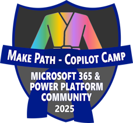
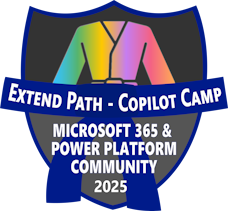
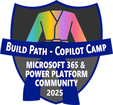
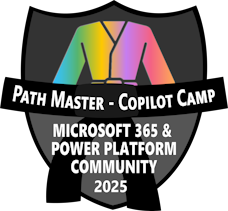
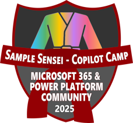

</img>

# Copilot Developer Camp Awards

We are excited to announce a thrilling initiative that will challenge you to showcase your knowledge and skills in Microsoft 365 Copilot extensibility. This is your chance to dive deep into the world of Copilot, explore its capabilities, and demonstrate your expertise.

## Why participate?

- **Learn and Grow**: This initiative is a fantastic opportunity to expand your understanding of Microsoft 365 Copilot extensibility.
- **Earn Badges**: Show off your achievements with exclusive badges awarded based on your performance.
- **Community Recognition**: Stand out in the community and get recognized for your contributions and knowledge.

## How to participate?

- **Register**: Sign up for the Microsoft 365 & Power Platform Community Recognition Program through [this form](https://aka.ms/community/recognition-register){target=_blank}.
- **Complete a Copilot Developer Camp pathway**: Complete all the labs of any of the learning pathways ([Make](https://microsoft.github.io/copilot-camp/pages/make/){target=_blank}, [Extend](https://microsoft.github.io/copilot-camp/pages/extend-m365-copilot/){target=_blank}, and [Build](https://microsoft.github.io/copilot-camp/pages/custom-engine/){target=_blank}) of Copilot Developer Camp to claim a blue-belt badge!

    </img>
    </img>
    </img>

- **Complete all the pathways**: Complete all the labs of all of the learning pathways of Copilot Developer Camp to get a black-belt badge and to become a **Path Master**!

    </img>

- **Submit a community sample**: Once you have earned the black-belt badge, submit one or more Microsoft 365 Copilot extensibility samples to the [Sample Solution Gallery](https://aka.ms/community/samples){target=_blank} and prove to yourself and to the whole community what you have learned! You will get a red-belt badge and become a **Sample Sensei**!

    </img>

## Timeline and Limits

- **Initiative Starts**: March 10, 2025
- **Initiative Ends**: May 20, 2025
- **Limits**: only the first 200 community members will earn badges

Every single week, during [Microsoft 365 & Power Platform Community calls](https://aka.ms/community/ms-speakers-call-invite){target=_blank}, we will announce community members awarded with one or more badges. Challenge yourself and be among the first 200 community members to earn badges and seize this unique opportunity!

Don't miss out on this exciting opportunity to earn recognition in the community. Whether you're a seasoned expert or just starting out, this initiative is designed for everyone. So, gear up, get ready, and let's see how much you know about Microsoft 365 Copilot extensibility!

Happy learning and good luck!
