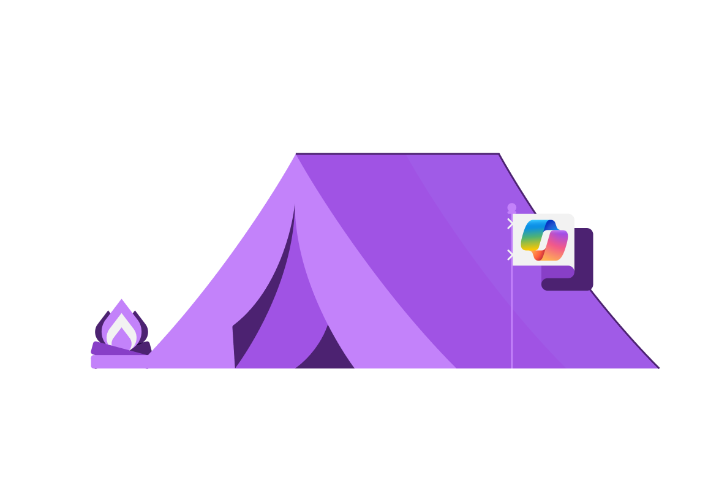
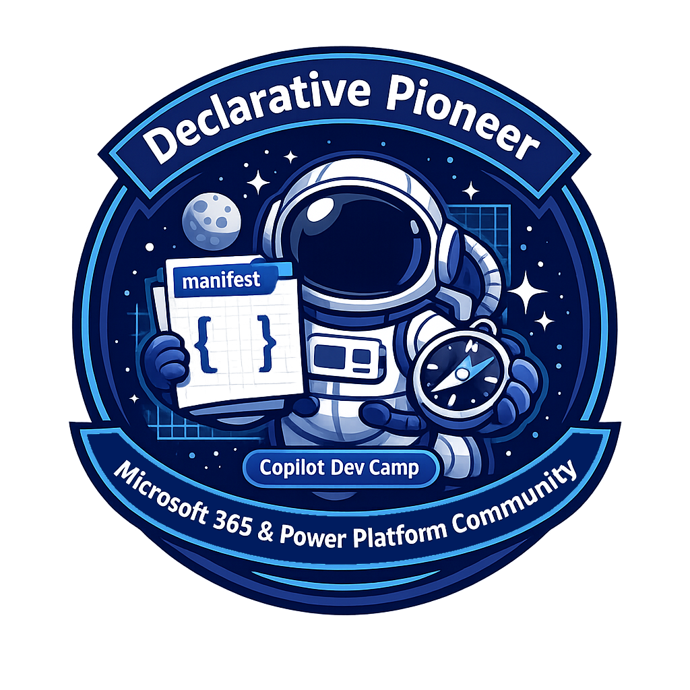
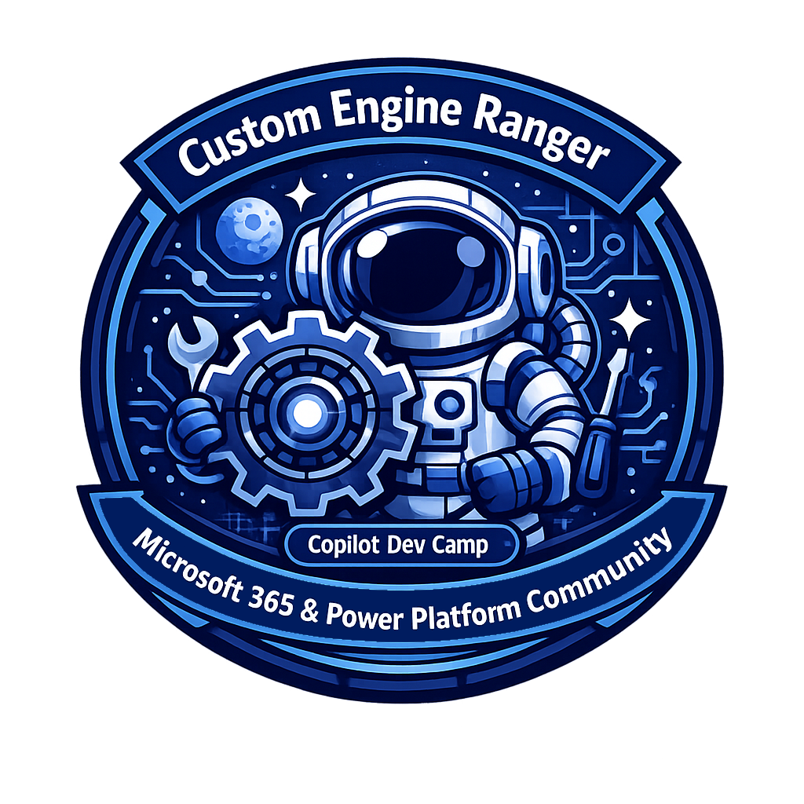
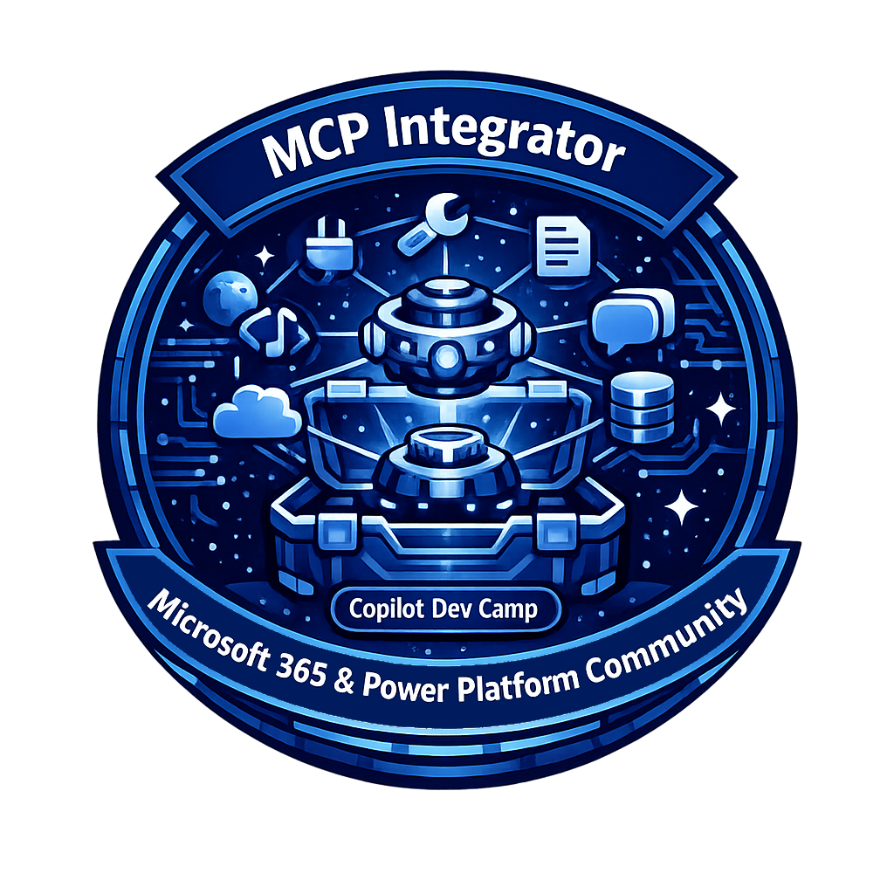
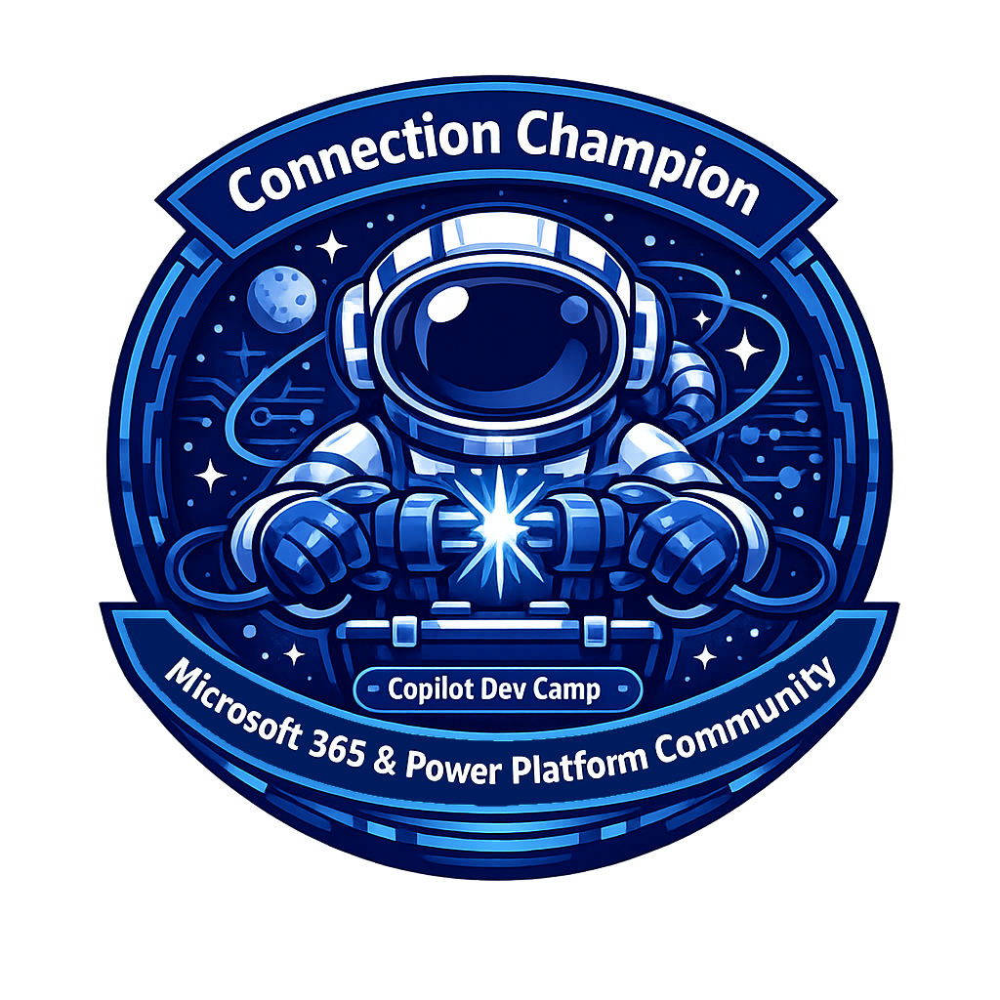
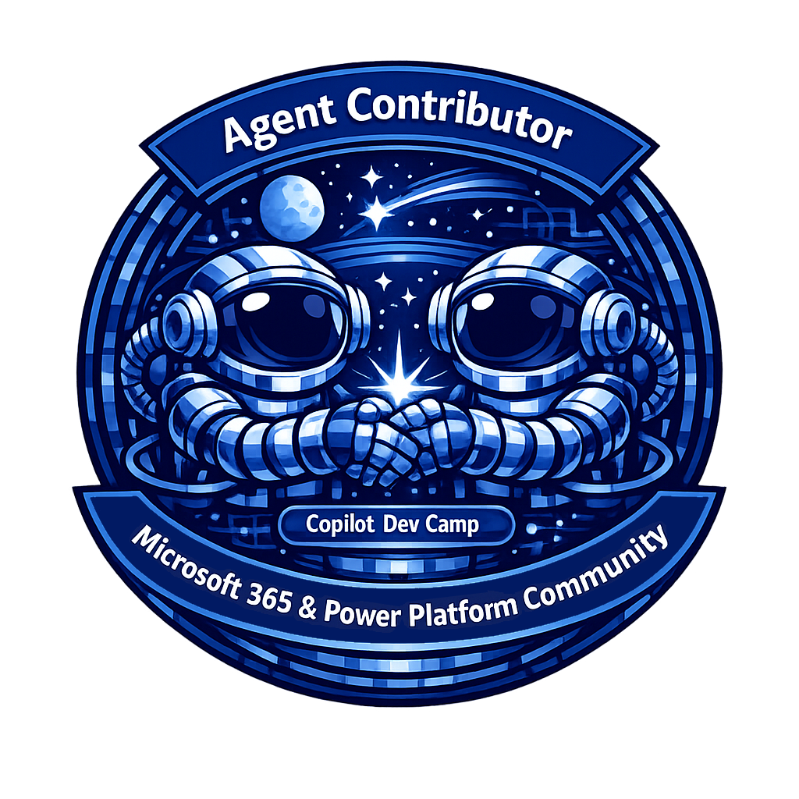

</img>

# Copilot Developer Camp Awards

We are excited to announce a thrilling initiative that will challenge you to showcase your knowledge and skills in Microsoft 365 Copilot extensibility. This is your chance to dive deep into the world of Copilot, explore its capabilities, and demonstrate your expertise.

## Why participate?

- **Learn and Grow**: This initiative is a fantastic opportunity to expand your understanding of Microsoft 365 Copilot extensibility.
- **Earn Badges**: Show off your achievements with exclusive badges awarded based on your performance.
- **Community Recognition**: Stand out in the community and get recognized for your contributions and knowledge.

## How to participate?

- **Register**: Sign up for the Microsoft 365 & Power Platform Community Recognition Program through [this form](https://aka.ms/community/recognition-register){target=_blank}. If you already claimed badges through the Microsoft 365 & Power Platform Community Recognition Program, you don't need to sign up again.
- **Complete any of the Copilot Developer Camp challenges**: There are multiple challenges available, but only some some of them are active at a time. Complete the required labs for the currently active challenges to claim a badge! Here are the current challenges:

    | Badge | Challenge | Requirements | Active Dates |
    |:-----:|-----------|--------------|:------------:|
    |  | **Declarative Pioneer** | Complete all the pre-requisites and steps of: <ul><li>[E8 - Connect Declarative Agent to MCP Server](https://microsoft.github.io/copilot-camp/pages/extend-m365-copilot/08-mcp-server/){target=_blank}</li><li>[E9 - Connected Agents using VS Code](https://microsoft.github.io/copilot-camp/pages/extend-m365-copilot/09-connected-agent/){target=_blank}</li></ul>Optionally, you can also complete the following labs:<ul><li>[E10 - Connect Declarative Agent to OAuth-Protected MCP Server](https://microsoft.github.io/copilot-camp/pages/extend-m365-copilot/10-mcp-auth/){target=_blank}</li></ul> | April 2026 |
    |  | **Custom Engine Ranger** | Complete all the pre-requisites and steps of: <ul><li>[BAF0 - Prerequisites](https://microsoft.github.io/copilot-camp/pages/custom-engine/agent-framework/00-prerequisites/){target=_blank}</li><li>[BAF1 - Build and Run Your First Agent](https://microsoft.github.io/copilot-camp/pages/custom-engine/agent-framework/01-build-and-run/){target=_blank}</li><li>[BAF2 - Add Document Search with Azure AI Search](https://microsoft.github.io/copilot-camp/pages/custom-engine/agent-framework/02-add-claim-search/){target=_blank}</li><li>[BAF3 - Add Vision Analysis with Mistral AI](https://microsoft.github.io/copilot-camp/pages/custom-engine/agent-framework/03-add-vision-analysis/){target=_blank}</li></ul>Optionally, you can also complete the following labs:<ul><li>[BAF4 - Add Policy Search](https://microsoft.github.io/copilot-camp/pages/custom-engine/agent-framework/04-add-policy-search/){target=_blank}</li><li>[BAF5 - Add Communication Capabilities](https://microsoft.github.io/copilot-camp/pages/custom-engine/agent-framework/05-add-communication/){target=_blank}</li><li>[BAF6 - Add Microsoft 365 Work IQ API Integration](https://microsoft.github.io/copilot-camp/pages/custom-engine/agent-framework/06-add-copilot-api/){target=_blank}</li><li>[BAF7 - Add MCP Tools Integration](https://microsoft.github.io/copilot-camp/pages/custom-engine/agent-framework/07-add-mcp-tools/){target=_blank}</li></ul> | April 2026 |
    |  | **MCP Integrator** | Complete all the pre-requisites and steps of the following labs: <ul><li>[MCS6 - Consuming an MCP Server](https://microsoft.github.io/copilot-camp/pages/make/copilot-studio/06-mcp/){target=_blank}</li><li>[MCS10 - Consuming an MCP Server with OAuth 2.0](https://microsoft.github.io/copilot-camp/pages/make/copilot-studio/10-mcp-oauth/){target=_blank}</li></ul>Or complete all the pre-requisites and steps of the following labs:<ul><li>[E8 - Connect Declarative Agent to MCP Server](https://microsoft.github.io/copilot-camp/pages/extend-m365-copilot/08-mcp-server/){target=_blank}</li><li>[E10 - Connect Declarative Agent to OAuth-Protected MCP Server](https://microsoft.github.io/copilot-camp/pages/extend-m365-copilot/10-mcp-auth/){target=_blank}</li></ul>Or complete all the pre-requisites and steps of the following labs:<ul><li>[BAF7 - Add MCP Tools Integration](https://microsoft.github.io/copilot-camp/pages/custom-engine/agent-framework/07-add-mcp-tools/){target=_blank}</li></ul> | May 2026 |
    |  | **Connection Champion** | Complete all the pre-requisites and steps of: <ul><li>[MCS9 - Connected Agents](https://microsoft.github.io/copilot-camp/pages/make/copilot-studio/09-connected-agents/){target=_blank}</li></ul>Or complete all the pre-requisites and steps of the following labs:<ul><li>[E9 - Connected Agents using VS Code](https://microsoft.github.io/copilot-camp/pages/extend-m365-copilot/09-connected-agent/){target=_blank}</li></ul> | June 2026 |

- **Submit a community sample**: Once you have earned any of the badges, submit one or more Microsoft 365 Copilot extensibility samples to the [Sample Solution Gallery](https://aka.ms/community/samples){target=_blank} and prove to yourself and to the whole community what you have learned! You will get a special recognition from the community!

    | Badge | Challenge | Requirements | Active Dates |
    |:-----:|-----------|--------------|:------------:|
    |  | **Agent Contributor** | Share with the community a sample of Microsoft 365 Copilot or Work IQ extensibility | Always |

## Timeline

- **Initiative Starts**: April 1, 2026
- **Initiative Ends**: June 30, 2026

Every single week, during [Microsoft 365 & Power Platform Community calls](https://aka.ms/community/ms-speakers-call-invite){target=_blank}, we will announce community members awarded with one or more badges. Challenge yourself and be among the first community members to earn badges and seize this unique opportunity!

Don't miss out on this exciting opportunity to earn recognition in the community. Whether you're a seasoned expert or just starting out, this initiative is designed for everyone. So, gear up, get ready, and let's see how much you know about Microsoft 365 Copilot extensibility!

Happy learning and good luck!

