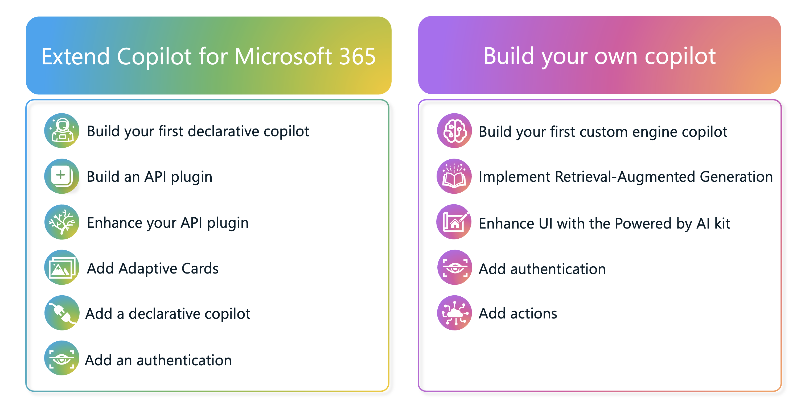

# Welcome to Copilot Camp

Welcome to Copilot Camp! This is a work in progress, but some of the labs are ready for testing.

Copilot Camp is a virtual workshop for professional developers who want to learn how to build Copilot for Microsoft 365 extensions including plugins, declarative copilots, and custom engine copilots. It all begins with hands-on labs, but over time we will add instructional material, videos, graphics, and more!

We really appreciate your feedback!! Please use the [issues list](https://github.com/microsoft/copilot-camp/issues) to share your comments and issues, or let us know in the "Copilot Camp Early Testers" chat in Microsoft Teams.

The labs are divided into two pathways, allowing you to choose based on what you want to create.

### Path A - Extend Copilot for Microsoft 365

_Note: These labs require the "Private Preview" for Copilot for M365 extensibility. There may be some changes for "Public Preview" when it's available._

---8<--- "a-path-links.md"

### Path B - Build your own Copilot

---8<--- "b-path-links.md"

### It's still early ... so what's next?

We're starting with the hands-on labs because those require the most testing. We expect them to require some updates as the products move to Public Preview.

We aspire to release this in mid-September 2024 to coincide with the [Microsoft AI Tour](https://envision.microsoft.com/home#festivalblade1){target=_blank}. Between now and then we want to add a lot of cool fetures remininscent of [App Camp](https://aka.ms/app-camp){target=_blank}, including:

 * Lots of videos to help people choose the right approach, understand the concepts, and provide a walk-through of each lab
 * Written details and explanations users can open up to view if they wish
 * Fun branding and graphics
 * "Train the trainer" decks so our field and MVPs can deliver the workshop in person
 * Possibly alternate instructions for in-person labs if we are able to provide pre-configured tenants for users

Labs are only useful if students understand what they did! And we aspire to make this a comprehensive experience where professional devs can learn everything they need to build world-class, production level Copilot solutions.

Do you have ideas? Please let us know in the Teams chat or in the Github issues!

### Code of Conduct

This project has adopted the [Microsoft Open Source Code of Conduct](https://opensource.microsoft.com/codeofconduct/).

Resources:

- [Microsoft Open Source Code of Conduct](https://opensource.microsoft.com/codeofconduct/)
- [Microsoft Code of Conduct FAQ](https://opensource.microsoft.com/codeofconduct/faq/)
- Contact [opencode@microsoft.com](mailto:opencode@microsoft.com) with questions or concerns
