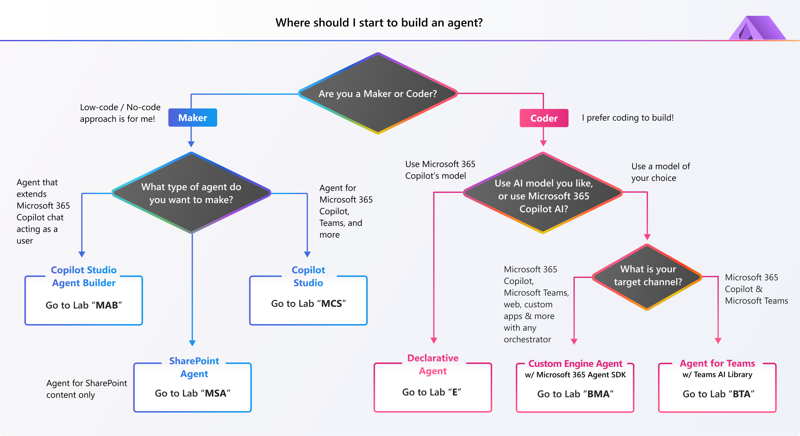
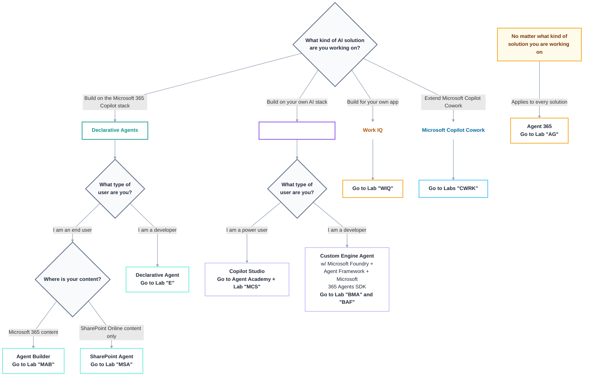

# Extend Microsoft 365 Copilot

**Copilot Developer Camp** is a self-paced learning resource, designed to help you extend Microsoft 365 Copilot. It provides practical guidance and real-world examples to support your development journey.

<!-- 

  <iframe src="//www.youtube.com/embed/uLYdP4ST7k0" frameborder="0" allowfullscreen></iframe>
  
Overview of Copilot Dev Camp

 -->

In this dev camp, you have multiple options to extend Microsoft 365 Copilot, depending on your needs.

Building an agent:

- **Declarative Agents**: You build your agents on the Microsoft 365 Copilot stack. You rely on the foundational model, orchestrator, and user experience of Copilot.
- **Custom Engine Agents**: You build your agents on any AI stack of your choice. You choose the foundational model, the orchestrator, and the user experience.

Extending Copilot Cowork:

- **Skills and plugins for Copilot Cowork**: You build skills and plugins to extend the capabilities of Copilot Cowork.

Adding work intelligence layer:

- **Work IQ**: Optionally, you build agents with Work IQ, which can provide access to the organizations' intelligence (email, meetings, files, people context, search, memory, reasoning signals) to every agent.

No matter what technology you use to create agents or to extend Microsoft 365 Copilot, you can always rely on **Microsoft Agent 365** to observe, govern, and secure every agent across your organization.

## Your learning options to extend Microsoft 365 Copilot

<a href="/copilot-camp/pages/extend-m365-copilot/" class="cta-button-fixed-width">🧩 Declarative Agents</a>Build on the Microsoft 365 Copilot Stack

<a href="/copilot-camp/pages/custom-engine/" class="cta-button-fixed-width">⚙️ Custom Engine Agents</a>Build on your own AI stack

<a href="/copilot-camp/pages/copilot-cowork/00-cowork-setup/" class="cta-button-fixed-width">🤖 Copilot Cowork</a>Move from intent to action while keeping the user in control

<a href="/copilot-camp/pages/work-iq/" class="cta-button-fixed-width">🧠 Work IQ</a>Unlock the organizations' intelligence to every agent

<a href="/copilot-camp/pages/agent-365/" class="cta-button-fixed-width">🛡️ Agent 365</a>The control plane for agents

<!--

-->

## 🧪 Where should I start to build agents?

There are plenty of options for you to start from. To create Declarative Agents, you can dig into technologies like Agent Builder, Custom SharePoint Agents, or pro-code Declarative Agents with the Microsoft 365 Agents Toolkit.

To create Custom Engine Agents, you can explore technologies like Microsoft Copilot Studio, Microsoft Foundry, or pro-code Custom Engine Agents with the Microsoft 365 Agents Toolkit.
To create your own apps built on top of Microsoft 365 and Microsoft 365 Copilot you should explore the Work IQ area.

No matter what kind of AI solution you are working on, you should always learn about Microsoft Agent 365 to manage agents via the agents registry, have access control and security, handle visualization and observability, and implement interoperability.

Use the following flowchart to find the learning path that best matches what you want to build.

<!--  -->

```mermaid
%%{init: {'flowchart': {'htmlLabels': true, 'curve': 'linear'}}}%%
flowchart TD
    Solution{"What kind of AI solution<br/>are you working on?"}

    Solution -->|Build on the Microsoft 365 Copilot stack| DA["Declarative Agents"]
    Solution -->|Build on your own AI stack| CEA["Custom Engine Agents"]
    Solution -->|Build for your own app| WIQLabel["Work IQ"]
    Solution -->|Extend Microsoft Copilot Cowork| CoworkLabel["Microsoft Copilot Cowork"]

    DA --> DAUser{"What type of<br/>user are you?"}
    DAUser -->|I am an end user| Content{"Where is your content?"}
    DAUser -->|I am a developer| DALab["<span style='color:#0f766e'><b>Declarative Agent</b></span><br/><b>Go to Lab &quot;E&quot;</b>"]

    Content -->|Microsoft 365 content| MAB["<span style='color:#0f766e'><b>Agent Builder</b></span><br/><b>Go to Lab &quot;MAB&quot;</b>"]
    Content -->|SharePoint Online content only| MSA["<span style='color:#0f766e'><b>SharePoint Agent</b></span><br/><b>Go to Lab &quot;MSA&quot;</b>"]

    CEA --> CEAUser{"What type of<br/>user are you?"}
    CEAUser -->|I am a power user| MCS["<span style='color:#6d28d9'><b>Copilot Studio</b></span><br/><b>Go to Agent Academy + Lab &quot;MCS&quot;</b>"]
    CEAUser -->|I am a developer| ProCode["<span style='color:#6d28d9'><b>Custom Engine Agent</b></span><br/>w/ Microsoft Foundry +<br/>Agent Framework + Microsoft<br/>365 Agents SDK<br/><b>Go to Lab &quot;BMA&quot; and &quot;BAF&quot;</b>"]

    WIQLabel --> WIQ["<b>Go to Lab &quot;WIQ&quot;</b>"]
    CoworkLabel --> Cowork["<b>Go to Labs &quot;CWRK&quot;</b>"]

    AllSol["No matter what kind of<br/>solution you are working on"] -->|Applies to every solution| A365["<span style='color:#b45309'><b>Agent 365</b></span><br/><b>Go to Lab &quot;AG&quot;</b>"]

    click DALab "pages/extend-m365-copilot/" "Open Declarative Agent labs"
    click MAB "pages/make/agent-builder/" "Open Agent Builder labs"
    click MSA "pages/sharepoint/sharepoint-agents/" "Open SharePoint Agent labs"
    click MCS "pages/make/copilot-studio/" "Open Copilot Studio labs"
    click ProCode "pages/custom-engine/" "Open Custom Engine Agent labs"
    click WIQ "pages/work-iq/" "Open Work IQ labs"
    click Cowork "pages/copilot-cowork/00-cowork-setup/" "Open Copilot Cowork labs"
    click A365 "pages/agent-365/" "Open Agent 365 labs"

    classDef decision fill:#f8fafc,stroke:#64748b,stroke-width:2.5px,color:#1e293b,font-weight:bold;
    classDef pillTeal fill:transparent,stroke:#0d9488,stroke-width:2px,color:#0d9488,font-weight:bold;
    classDef pillViolet fill:transparent,stroke:#7c3aed,stroke-width:2px,color:#ffffff,font-weight:bold;
    classDef labelAmber fill:transparent,stroke:none,color:#b45309,font-weight:bold;
    classDef labelBlue fill:transparent,stroke:none,color:#0369a1,font-weight:bold;
    classDef labBoxTeal fill:#ffffff,stroke:#5eead4,stroke-width:2px,color:#1e293b;
    classDef labBoxViolet fill:#ffffff,stroke:#c4b5fd,stroke-width:2px,color:#1e293b;
    classDef labBoxAmber fill:#ffffff,stroke:#f59e0b,stroke-width:2px,color:#1e293b;
    classDef labBoxBlue fill:#ffffff,stroke:#38bdf8,stroke-width:2px,color:#1e293b;
    classDef amberNote fill:#fffbeb,stroke:#f59e0b,stroke-width:2px,color:#78350f,font-weight:bold;

    class Solution,DAUser,Content,CEAUser decision;
    class DA pillTeal;
    class CEA pillViolet;
    class WIQLabel labelAmber;
    class CoworkLabel labelBlue;
    class DALab,MAB,MSA labBoxTeal;
    class MCS,ProCode labBoxViolet;
    class WIQ,A365 labBoxAmber;
    class Cowork labBoxBlue;
    class AllSol amberNote;

    linkStyle default stroke:#94a3b8,stroke-width:1.6px;
```

## 🆕 What's New?

!!! example "Updated in August 2026"

    We’ve added a new Copilot Cowork security lab and reorganized the Declarative Agent learning experience.

    - **Add Entra SSO authentication to a Cowork plugin**:
    Connect an Entra-secured MCP server to a Copilot Cowork plugin, configure single sign-on, and let users authenticate with their existing Microsoft 365 credentials without an extra sign-in prompt.
    [🔗 Start the Copilot Cowork SSO lab](https://microsoft.github.io/copilot-camp/pages/copilot-cowork/03-cowork-plugins-sso/)

    - **Choose a clearer Declarative Agent pathway**:
    Start with the E1A and E1B fundamentals, follow a guided bundle for an end-to-end scenario, or choose an independent standalone lab for a focused skill. Bundle-specific prerequisites now appear directly on each bundle page.
    [🔗 Explore the Declarative Agent pathways](https://microsoft.github.io/copilot-camp/pages/extend-m365-copilot/)

!!! example "Updated in July 2026"

    We’re excited to announce **a brand new set of hands-on labs** about extending Microsoft 365 Copilot with the new SharePoint Copilot Apps. 

    - **Build your first SharePoint Copilot App**:
    Scaffold an SPFx v1.24 Copilot Component with React, customize it, add custom tool parameters, test it locally in the Copilot Workbench, then package and deploy it so it renders as an interactive UX component inside Microsoft 365 Copilot.
    [🔗 Start this lab](https://microsoft.github.io/copilot-camp/pages/sharepoint/sharepoint-copilot-apps/01-first-copilot-app/)

## 🧑‍💻 More

---8<--- "more-links.md"

<!-- ## 🎖️ Copilot Developer Camp Awards

We are excited to announce a thrilling initiative that will challenge you to showcase your knowledge and skills in Microsoft 365 Copilot extensibility. This is your chance to dive deep into the world of Copilot, explore its capabilities, and demonstrate your expertise. [Find out more on awards.](https://microsoft.github.io/copilot-camp/awards)
 -->

<!-- ## 🎁 Copilot Camp in a Box 

Got the labs working? Ready to share your knowledge? Why not run your own Copilot Camp workshop using our [Copilot Camp in a Box resources](https://microsoft.github.io/copilot-camp/pages/in-a-box/)! We've got you covered with presentation materials that even include embedded demos. -->

## 🚑 Issues

We really appreciate your feedback! Please use the [issues list](https://github.com/microsoft/copilot-camp/issues) to share your comments and issues, or if you're in Microsoft let us know in the "Copilot Developer Camp Early Testers" chat in Microsoft Teams. Thanks!

## 📜 Code of Conduct

This project has adopted the [Microsoft Open Source Code of Conduct](https://opensource.microsoft.com/codeofconduct/).

Resources:

- [Microsoft Open Source Code of Conduct](https://opensource.microsoft.com/codeofconduct/)
- [Microsoft Code of Conduct FAQ](https://opensource.microsoft.com/codeofconduct/faq/)
- Contact [opencode@microsoft.com](mailto:opencode@microsoft.com) with questions or concerns

