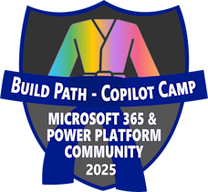

---
search:
  exclude: true
---
</img>

# Copilot Developer Camp アワード

私たちは、 Microsoft 365 Copilot の拡張性に関する知識とスキルを披露できるエキサイティングな取り組みを発表します。ぜひ Copilot の世界を深く探求し、その機能を体験しながら、ご自身の専門性を証明してください。

## 参加する理由

- **学びと成長**: この取り組みは、 Microsoft 365 Copilot の拡張性に関する理解を広げる絶好の機会です。  
- **バッジの獲得**: 成績に応じて授与される限定バッジで、成果をアピールしましょう。  
- **コミュニティでの認知**: コミュニティ内で際立ち、貢献と知識を評価してもらえます。  

## 参加方法

- **登録**: [このフォーム](https://aka.ms/community/recognition-register){target=_blank} から Microsoft 365 & Power Platform Community Recognition Program に登録してください。すでに同プログラムでバッジを受領している場合は、再度登録する必要はありません。  
- **Copilot Developer Camp のいずれかの学習パスを完了**: Copilot Developer Camp の学習パス（ [Maker 向けコース](https://microsoft.github.io/copilot-camp/pages/make/){target=_blank}、[Extend](https://microsoft.github.io/copilot-camp/pages/extend-m365-copilot/){target=_blank}、[Build](https://microsoft.github.io/copilot-camp/pages/custom-engine/){target=_blank}）のすべての ラボ を完了し、ブルーベルトバッジを獲得しましょう！

    </img>
    </img>
    </img>

- **すべてのパスを完了**: Copilot Developer Camp のすべての学習パスの ラボ を完了すると、ブラックベルトバッジを獲得し **Path Master** になれます！

    </img>

- **コミュニティ サンプルを提出**: ブラックベルトバッジを取得したら、[Sample Solution Gallery](https://aka.ms/community/samples){target=_blank} に Microsoft 365 Copilot の拡張性サンプルを 1 つ以上投稿し、学んだことを自分自身とコミュニティ全体に証明しましょう！レッドベルトバッジを獲得し、 **Sample Sensei** になります！

    </img>

## 期間および制限

- **開始日**: 2025 年 3 月 25 日  
- **終了日**: 2025 年 5 月 31 日  
- **制限**: 最初の 200 名のコミュニティ メンバーのみがバッジを獲得できます  

毎週開催される [Microsoft 365 & Power Platform Community calls](https://aka.ms/community/ms-speakers-call-invite){target=_blank} で、バッジを授与されたコミュニティ メンバーを発表します。ぜひ挑戦して、最初の 200 名に入り、このユニークなチャンスをつかみ取りましょう！

コミュニティでの認知を得られるこのエキサイティングな機会をお見逃しなく。経験豊富なエキスパートでも、これから始める方でも、どなたにもご参加いただけます。準備を整え、 Microsoft 365 Copilot の拡張性に関する知識を存分に発揮してください！

学びを楽しみ、幸運を祈ります！

