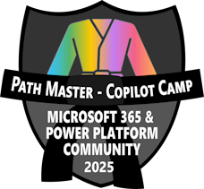
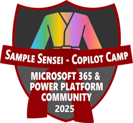

</img>

# Copilot Developer Camp アワード

Microsoft 365 Copilot の拡張性に関する知識とスキルを披露するためのエキサイティングな取り組みを発表できることを嬉しく思います。Copilot の世界に深く入り込み、その機能を探求し、あなたの専門知識を示す絶好の機会です。

## なぜ参加すべき？

- **学んで成長**: この取り組みは、Microsoft 365 Copilot の拡張性に関する理解を深める絶好の機会です。
- **バッジを獲得しよう**: あなたの成果を示すために、パフォーマンスに基づいて授与される限定バッジを獲得しましょう。
- **コミュニティでの認識**: コミュニティであなたの貢献と知識が認められます。

## 参加方法

- **登録**: https://aka.ms/community/recognition-register{target=_blank} を通じて Microsoft 365 & Power Platform Community Recognition Program に登録してください。すでに Microsoft 365 & Power Platform Community Recognition Program でバッジを獲得している場合は、再度登録する必要はありません。
- **Copilot Developer Camp のパスウェイを完了する**: Copilot Developer Camp のいずれかの学習パスウェイ (https://microsoft.github.io/copilot-camp/pages/make/{target=_blank}, https://microsoft.github.io/copilot-camp/pages/extend-m365-copilot/{target=_blank}, https://microsoft.github.io/copilot-camp/pages/custom-engine/{target=_blank}) のすべてのラボを完了して、ブルーベルトバッジを獲得しましょう。

    </img>
    </img>
    </img>

- **すべてのパスウェイを完了する**: Copilot Developer Camp のすべての学習パスウェイのすべてのラボを完了して、ブラックベルトバッジを獲得し、Path Master になりましょう！**

    </img>

- **コミュニティサンプルを提出する**: ブラックベルトバッジを獲得したら、Microsoft 365 Copilot 拡張性のサンプルを1つ以上 [Sample Solution Gallery](https://aka.ms/community/samples{target=_blank}) に提出し、あなたが学んだことを自分自身とコミュニティ全体に証明しましょう！レッドベルトバッジを獲得し、Sample Sensei になりましょう！

    </img>

## タイムラインと制限

- **取り組み開始**: 2025年3月25日
- **取り組み終了**: 2025年5月20日
- **制限**: 最初の200人のコミュニティメンバーのみがバッジを獲得できます

Every single week, during [Microsoft 365 & Power Platform Community calls](https://aka.ms/community/ms-speakers-call-invite){target=_blank}, we will announce community members awarded with one or more badges. Challenge yourself and be among the first 200 community members to earn badges and seize this unique opportunity!

毎週、[Microsoft 365 & Power Platform コミュニティ コール](https://aka.ms/community/ms-speakers-call-invite{target=_blank}) の中で、1つ以上のバッジを授与されたコミュニティメンバーを発表します。自分に挑戦し、最初の200人のコミュニティメンバーの中でバッジを獲得し、このユニークな機会をつかみましょう！
コミュニティで認識されるこのエキサイティングな機会を逃さないでください。経験豊富な専門家でも、初心者でも、この取り組みはすべての人に向けて設計されています。準備を整え、Microsoft 365 Copilot の拡張性についてどれだけ知っているかを見せてください！

学習を楽しんで、頑張ってください！