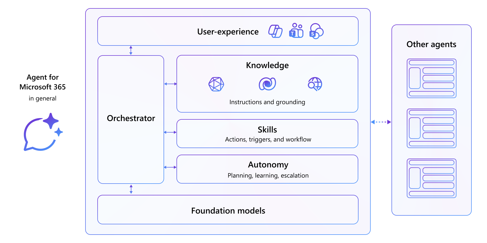
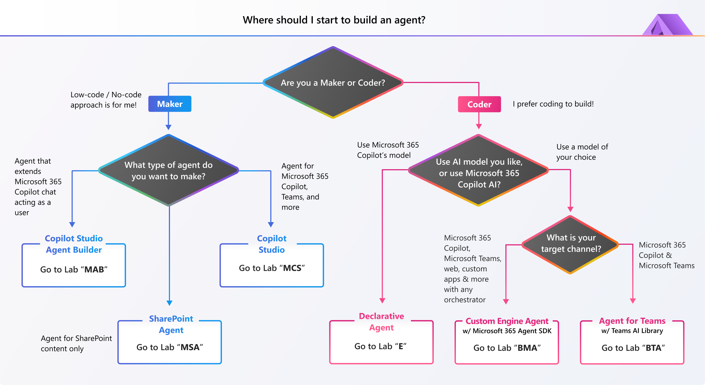

---
search:
  exclude: true
---
 **Copilot Developer Camp** は、Microsoft 365 Copilot 向けエージェントの構築を支援するセルフペース学習リソースです。実践的なガイダンスと実例を提供し、開発の旅をサポートします。  

# Microsoft 365 向けエージェントの構築

Microsoft 365 向けエージェントは、会話型 AI によってユーザーのタスク自動化、質問への回答、Microsoft 365 のアプリやサービス全体でのワークフロー効率化を支援するアシスタントです。カスタマー サポート、IT ヘルプデスク、人事サポートなど、さまざまなシナリオで利用できます。

Microsoft 365 向けエージェントは通常、基盤モデル、オーケストレーター、知識・スキル・自律プロセスを呼び出すランタイム、およびユーザー インターフェース（ある場合とない場合があります）で構成されます。  

Microsoft 365 Copilot と同じインフラストラクチャ、オーケストレーター、基盤モデル、セキュリティ制御を使用して Copilot を拡張することで、一貫性のある慣れ親しんだユーザー エクスペリエンスを実現できます。  

または、独自の基盤モデル、オーケストレーター、責任ある AI 制御を選択して構築することも可能です。  

## 🧪 エージェント構築を始めるには

ラボは大きく 3 つのパスに分かれています。ノーコード/ローコード アプローチを希望する場合は ** Maker ** パス（「MAB」「MSA」「MCS」ラボ）を選択してください。Microsoft 365 Copilot を拡張したい場合は ** Extend ** パス（「E」ラボ）を選択します。Microsoft Foundry など任意の AI を使用して完全なカスタム エージェントを構築したい場合は ** Build ** パス（「BMA」ラボ）を選びます。

---8<--- "ja/main-links.md"

  <iframe src="//www.youtube.com/embed/uLYdP4ST7k0" frameborder="0" allowfullscreen></iframe>
  
Copilot Developer Camp の概要

## 🆕 新機能

!!! example "2025 年 6 月に更新"

    **4 つの新しいハンズオン ラボ** をご紹介します。これらは強力な Copilot エクスペリエンスの構築に役立ちます。  

    - ** Build with Microsoft 365 Agents SDK**:  
      Microsoft 365 Agents SDK のフル機能を活用し、実ビジネス データと統合された本番レベルの Copilot エージェントを作成します。  
      [🔗 ラボを開始](https://microsoft.github.io/copilot-camp/pages/custom-engine/agents-sdk/)

    - ** Build Copilot Agents Using TypeSpec**:  
      TypeSpec を使ってエージェントとその機能を宣言的に定義します。API サービスへシームレスにオーケストレーションする Copilot エージェントを構築したい開発者に最適です。  
      [🔗 ラボを開始](https://microsoft.github.io/copilot-camp/pages/extend-m365-copilot/01-typespec-declarative-agent/)

    - ** Agent Instructions Guide for Beginners**:  
      Copilot が初めての方向けに、効果的な自然言語インストラクションの記述方法と、ガイド付き環境でのエージェント テスト方法を学べます。  
      [🔗 ラボを開始](https://microsoft.github.io/copilot-camp/pages/beyond-agents/beginner-agent/)

    - ** SharePoint agents**:  
      SharePoint エージェントの基本から設定の微調整、Microsoft Teams グループ チャットでの共有方法までを学習します。  
      [🔗 ラボを開始](https://microsoft.github.io/copilot-camp/pages/make/sharepoint-agents/)

## 🧑‍💻 詳細情報

---8<--- "ja/more-links.md"

<!-- ## 🎖️ Copilot Developer Camp Awards

We are excited to announce a thrilling initiative that will challenge you to showcase your knowledge and skills in Microsoft 365 Copilot extensibility. This is your chance to dive deep into the world of Copilot, explore its capabilities, and demonstrate your expertise. [Find out more on awards.](https://microsoft.github.io/copilot-camp/awards)
 -->

## 🎁 Copilot Camp in a Box 

ラボを体験できましたか？知識を共有したいですか？それなら、[Copilot Camp in a Box リソース](https://microsoft.github.io/copilot-camp/pages/in-a-box/) を使って独自の Copilot Camp ワークショップを開催してみませんか。プレゼンテーション資料と組み込みデモもご用意しています。  

## 🚑 Issues

フィードバックをお寄せいただきありがとうございます。コメントや不具合は [issues リスト](https://github.com/microsoft/copilot-camp/issues) へご記入ください。Microsoft 社内の方は Microsoft Teams の「Copilot Developer Camp Early Testers」チャットでもお知らせいただけます。感謝いたします。  

## 📜 Code of Conduct

このプロジェクトは [Microsoft Open Source Code of Conduct](https://opensource.microsoft.com/codeofconduct/) を採用しています。

リソース:

- [Microsoft Open Source Code of Conduct](https://opensource.microsoft.com/codeofconduct/)
- [Microsoft Code of Conduct FAQ](https://opensource.microsoft.com/codeofconduct/faq/)
- ご質問やご懸念は [opencode@microsoft.com](mailto:opencode@microsoft.com) までご連絡ください

---8<--- "ja/starrepo.md"