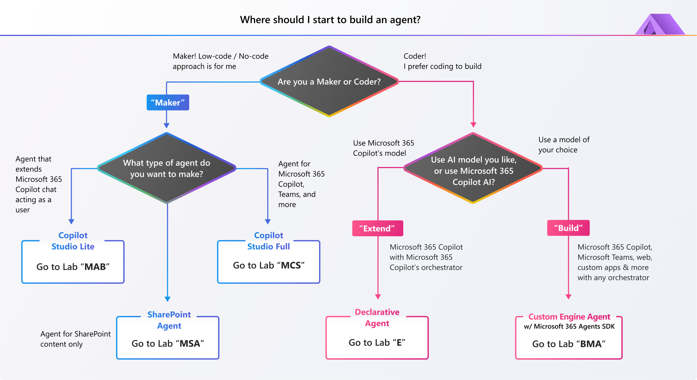

---
search:
  exclude: true
---
**Copilot Developer Camp** は、Microsoft 365 Copilot のための エージェント を構築する方法を学べる、セルフペース形式の学習リソースです。実践的なガイドとリアルな使用例を通じて、開発の旅をサポートします。

# Microsoft 365 向けエージェントの構築

Microsoft 365 向けエージェントは、会話型 AI を活用したアシスタントで、ユーザーのタスク自動化、質問への回答、Microsoft 365 アプリやサービス全体でのワークフロー効率化を支援します。カスタマーサポート、IT ヘルプデスク、HR サポートなど、さまざまなシナリオで利用できます。

Microsoft 365 向けエージェントは通常、ファウンデーションモデル、オーケストレーター（知識・スキル・自律プロセスを活用して実行）、そしてユーザーインターフェースの有無を含む複数のコンポーネントで構成されます。  

Microsoft 365 Copilot を拡張する場合は、同じインフラストラクチャ、オーケストレーター、ファウンデーションモデル、セキュリティ制御を利用できるため、一貫性のある使い慣れたユーザー エクスペリエンスを提供できます。  

あるいは、独自のファウンデーションモデル、オーケストレーター、責任ある AI 制御を選択することも可能です。

## 🧪 エージェント開発を始めるには

ラーニング パスは大きく 3 つあり、それぞれに複数の ラボ があります。コード不要／ローコードで進めたい場合は **Maker** パス（「MAB」「MSA」「MCS」 ラボ）を選びます。Microsoft 365 Copilot を拡張したい場合は **Extend** パス（「E」 ラボ）を選びます。Azure AI Foundry など任意の AI を使って完全にカスタム エージェントを構築したい場合は **Build** パス（「BMA」または「BTA」 ラボ）を選択してください。

---8<--- "ja/main-links.md"

  <iframe src="//www.youtube.com/embed/uLYdP4ST7k0" frameborder="0" allowfullscreen></iframe>
  
Copilot Dev Camp の概要

## 🆕 更新情報

!!! example "2025 年 6 月更新"

    **4 つの新しいハンズオン ラボ** を公開しました。強力な Copilot エクスペリエンスを構築する際にぜひご活用ください。  

    - **Build with Microsoft 365 Agents SDK**:  
      Microsoft 365 Agents SDK のフル機能を活用し、実ビジネス データと連携する本番レベルの Copilot エージェントを作成します。  
      [🔗 このラボを始める](https://microsoft.github.io/copilot-camp/pages/custom-engine/agents-sdk/)

    - **Build Copilot Agents Using TypeSpec**:  
      TypeSpec を使って エージェント とその機能を宣言的に定義します。API サービスとシームレスに連携する Copilot エージェントを構築したい開発者に最適です。  
      [🔗 このラボを始める](https://microsoft.github.io/copilot-camp/pages/extend-m365-copilot/01-typespec-declarative-agent/)

    - **Agent Instructions Guide for Beginners**:  
      Copilot が初めての方に向け、効果的な自然言語の instructions の書き方と Copilot エージェントのテスト方法をステップ バイ ステップで学べます。  
      [🔗 このラボを始める](https://microsoft.github.io/copilot-camp/pages/copilot-instructions/beginner-agent/)

    - **SharePoint agents**:  
      基本から始めて設定の微調整、共有方法（個人、Microsoft Teams グループ チャット）まで、SharePoint エージェント の作成方法を習得します。  
      [🔗 このラボを始める](https://microsoft.github.io/copilot-camp/pages/make/sharepoint-agents/)

## 🧑‍💻 さらに学ぶ

---8<--- "ja/more-links.md"

<!-- ## 🎖️ Copilot Developer Camp Awards

We are excited to announce a thrilling initiative that will challenge you to showcase your knowledge and skills in Microsoft 365 Copilot extensibility. This is your chance to dive deep into the world of Copilot, explore its capabilities, and demonstrate your expertise. [Find out more on awards.](https://microsoft.github.io/copilot-camp/awards)
 -->

## 🎁 Copilot Camp in a Box 

ラボを完了しましたか？知識を共有したいですか？それなら、[Copilot Camp in a Box リソース](https://microsoft.github.io/copilot-camp/pages/in-a-box/) を使って独自の Copilot Camp ワークショップを開催しましょう。プレゼンテーション資料にはデモも組み込まれていますので、すぐにご利用いただけます。

## 🚑 既知の問題とフィードバック

フィードバックを心よりお待ちしています！コメントや問題は [issues リスト](https://github.com/microsoft/copilot-camp/issues) にてご連絡ください。Microsoft 社内の方は Microsoft Teams の「Copilot Developer Camp Early Testers」チャットでもお知らせください。ありがとうございます！

## 📜 行動規範

本プロジェクトは [Microsoft Open Source Code of Conduct](https://opensource.microsoft.com/codeofconduct/) を採用しています。

リソース:

- [Microsoft Open Source Code of Conduct](https://opensource.microsoft.com/codeofconduct/)
- [Microsoft Code of Conduct FAQ](https://opensource.microsoft.com/codeofconduct/faq/)
- 質問や懸念点は [opencode@microsoft.com](mailto:opencode@microsoft.com) までご連絡ください

---8<--- "ja/starrepo.md"