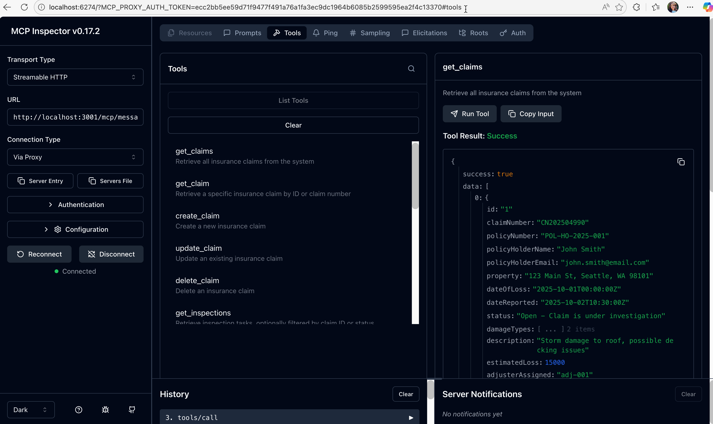

---
search:
  exclude: true
---
# ラボ 08 : Declarative エージェントを MCP サーバーに接続する

このラボでは、Zava Insurance の請求システム向けに Model Context Protocol (MCP) サーバーを完全に実行し、作成する Microsoft 365 Copilot の Declarative エージェントと統合します。これにより、安全で標準化された AI エージェント通信を通じて、実際の請求データとの自然言語インタラクションが可能になります。

<div class="lab-intro-video">
    <div style="flex: 1; min-width: 0;">
        <iframe  src="//www.youtube.com/embed/vbkcntieMmI" frameborder="0" allowfullscreen style="width: 100%; aspect-ratio: 16/9;">          
        </iframe>
          <div>このビデオでラボの概要をご覧ください。</div>
            <div class="note-box">
            📘 <strong>Note:</strong>   MCP Server + Declarative Agents using Agents Toolkit は現在プレビューです
        </div>
    </div>
    <div style="flex: 1; min-width: 0;">
  ---8<--- "ja/e-labs-prelude.md"
    </div>
</div>


## シナリオ

**Zava Insurance** は、米国太平洋北西部で 15 万世帯以上にサービスを提供する中規模の架空の住宅保険会社です。2025 年 10 月に発生した深刻な嵐で 48 時間以内に 2,000 件の請求が発生し、手動の請求処理では 3 週間の遅延と調整の問題が生じました。この危機を解決するため、Zava の CTO は、インテリジェント エージェントが定型業務を処理し、アジャスターが複雑なケースと顧客対応に集中できる AI 主導の請求業務を構想しました。開発チームは **Model Context Protocol (MCP) サーバー** を Azure インフラストラクチャ上に構築し、AI エージェントに対して請求データへの標準化された安全なアクセスを提供しました。これにより、損害評価や契約業者の専門分野、検査スケジュールなどの豊富なコンテキスト情報がリアルタイムで同期されます。MCP サーバーの導入が成功した後、Zava は **Microsoft 365 Copilot** と **Declarative エージェント** を統合し、アジャスターが複雑な API 呼び出しではなく「緊急の嵐被害請求をすべて表示して」といった自然言語でシステムと対話できるようになり、Microsoft 365 のワークフローにシームレスに AI を組み込みました。

---

## 🎯 ラボの目的

このラボを完了すると、次のことができるようになります。

- MCP サーバーが AI エージェントとバックエンド システムをどのように接続するかを理解する
- Zava の MCP サーバーを保険請求データで構築・実行する
- Microsoft 365 Agents Toolkit を使用して Declarative エージェントを作成する
- エージェントを MCP サーバーに接続し、請求管理機能を構成する
- 自然言語クエリと実際の請求データでエージェントをテストする

---

## 📚 前提条件

開始前に以下を準備してください。

- ** Node.js 22+ ** がローカルにインストールされていること
- ** VS Code ** と ** Microsoft 365 Agents Toolkit 拡張機能 ** (バージョン 6.4.2 以上)
- Copilot ライセンス付きの ** Microsoft 365 開発者アカウント **
- ** TypeScript / JavaScript **、 ** REST APIs **、 ** JSON ** の基礎知識
- VS Code のトンネリングを利用するための GitHub アカウント

---

## Exercise 1: 開発環境をセットアップする

この演習では、Zava の MCP サーバーのコードベースをクローンし、ローカル開発環境を構築します。

### Step 1: リポジトリをクローンする

ターミナルを開き、次を実行します。

```bash
git clone https://github.com/microsoft/copilot-camp.git
cd src/extend-m365-copilot/path-e-lab08-mcp-server/zava-mcp-server
```
<cc-end-step lab="e8" exercise="1" step="1" />

### Step 2: 依存関係をインストールする

必要なパッケージをすべてインストールします。

```bash
npm install
```

主な依存関係:

- `@modelcontextprotocol/sdk` - MCP プロトコル実装
- `@azure/data-tables` - Azure Table Storage クライアント
- `express` - HTTP サーバー フレームワーク
- `zod` - 実行時型バリデーション

<cc-end-step lab="e8" exercise="1" step="2" />

### Step 3: プロジェクト構成を確認する

コードベースを確認し、VSCode でプロジェクトを開きます。以下を入力して Enter。

```
code .
```

主なディレクトリ:

- `src/` - TypeScript ソースコード
- `data/` - サンプル JSON データ

<cc-end-step lab="e8" exercise="1" step="3" />

サンプルデータ付きのコードベースが準備できました。 

---

## Exercise 2: Zava のローカル請求データベースを起動する

Zava は請求データベースに Azure Table Storage を使用しています。この演習では、ローカル エミュレーターを起動してサンプルデータをロードします。

### Step 1: Azure Storage エミュレーターを起動する

** ターミナル 1 ** で Azurite エミュレーターを起動します。

```bash
npm run start:azurite
```

次のような表示になります。
```
Azurite Blob service is starting at http://127.0.0.1:10000
Azurite Queue service is starting at http://127.0.0.1:10001
Azurite Table service is starting at http://127.0.0.1:10002
```

** このターミナルは開いたままにしてください ** － これがローカルのデータベース サーバーです。
<cc-end-step lab="e8" exercise="2" step="1" />

### Step 2: サンプル請求データをロードする

** ターミナル 2 ** で Zava のサンプルデータを初期化します。

```bash
npm run init-data
```

ロードされるデータ:

- ** 請求 **: 嵐被害、水害、火災のケース
- ** 契約業者 **: 屋根専門、浸水復旧、総合工務
- ** 検査 **: 予定済み・完了済みの検査タスク
- ** 検査員 **: 専門分野を持つフィールド検査員

<cc-end-step lab="e8" exercise="2" step="2" />

## Step 3: データロードを確認する

コンソール出力を確認します。以下のような表示になります。
```
🚀 Starting data initialization...
📋 Initializing table: claims
✅ Table 'claims' created or already exists
📄 Loaded 2 items from claims.json
✅ Upserted entity: CN202504990
✅ Upserted entity: CN202504991
✅ Completed initialization for table: claims
📋 Initializing table: inspections
✅ Table 'inspections' created or already exists
📄 Loaded 2 items from inspections.json
✅ Upserted entity: insp-001
✅ Upserted entity: insp-002
✅ Completed initialization for table: inspections
📋 Initializing table: inspectors
✅ Table 'inspectors' created or already exists
📄 Loaded 4 items from inspectors.json
✅ Upserted entity: inspector-001
✅ Upserted entity: inspector-002
✅ Upserted entity: inspector-003
✅ Upserted entity: inspector-004
✅ Completed initialization for table: inspectors
📋 Initializing table: contractors
✅ Table 'contractors' created or already exists
📄 Loaded 3 items from contractors.json
✅ Upserted entity: contractor-001
✅ Upserted entity: contractor-002
✅ Upserted entity: contractor-003
✅ Completed initialization for table: contractors
📋 Initializing table: purchaseOrders
✅ Table 'purchaseOrders' created or already exists
📄 Loaded 2 items from purchaseOrders.json
✅ Upserted entity: po-001
✅ Upserted entity: po-002
✅ Completed initialization for table: purchaseOrders
🎉 Data initialization completed successfully!
✨ All tables initialized successfully
```

ローカル請求データベースが、Zava の本番環境を反映したサンプルデータで稼働しました。
<cc-end-step lab="e8" exercise="2" step="3" />

---

## Exercise 3: MCP サーバーを起動する

次に、AI エージェントが請求システムと対話できるように Zava の MCP サーバーを起動します。


### Step 1: MCP サーバーを起動する

** ターミナル 2 ** で (ターミナル 1 では Azurite を継続実行):

```bash
npm run start:mcp-http
```

以下のようなメッセージが表示されます (一部抜粋)。
```
🚀 Zava Claims MCP HTTP Server started on 127.0.0.1:3001 
...
```
<cc-end-step lab="e8" exercise="3" step="1" />

### Step 2: サーバーヘルスをテストする

ブラウザーの新しいタブで次を開きます。
```
http://127.0.0.1:3001/health
```

ブラウザーにサーバーが正常であることを示す JSON 応答が表示されます。

```json
{"status":"healthy","timestamp":"2025-11-11T01:46:11.618Z","service":"zava-claims-mcp-server","authentication":"No authentication"}
```

<cc-end-step lab="e8" exercise="3" step="2" />

### Step 3: 利用可能なエンドポイントを確認する

以下の URL を開いて API を確認します。

- ** Health Check **: `http://127.0.0.1:3001/health`
- ** API Documentation **: `http://127.0.0.1:3001/docs`
- ** MCP Tools List **: `http://127.0.0.1:3001/tools`

MCP サーバーが稼働し、準備完了です。 

<cc-end-step lab="e8" exercise="3" step="3" />

---

## Exercise 4: AI エージェントとの対話をテストする

MCP Inspector ツールを使って、AI エージェントが Zava の請求システムとどのように対話するかを体験します。

### Step 1: MCP Inspector を起動する

** ターミナル 3 ** でインタラクティブな MCP テストツールを起動します。

```bash
npm run inspector
```

これにより、AI エージェントとして MCP ツールをテストできる Web インターフェイスが開きます。

<cc-end-step lab="e8" exercise="4" step="1" />

### Step 2: 利用可能なツールを確認する

MCP Inspector の画面には、AI エージェントが利用できる **15 個のツール** が表示されます。

**請求管理ツール:**

- `get_claims` - すべての請求を一覧表示
- `get_claim` - 特定請求の詳細を取得
- `create_claim` - 新しい請求を作成
- `update_claim` - 請求ステータスを更新
- `delete_claim` - 請求を閉鎖/削除

**検査ツール:**

- `get_inspections` - 検査タスクを一覧表示
- `create_inspection` - 新しい検査をスケジュール
- `update_inspection` - 検査ステータスを更新

**契約業者 & 検査員ツール:**

- `get_contractors` - 専門分野で契約業者を検索
- `get_inspectors` - 利用可能な検査員を一覧表示

<cc-end-step lab="e8" exercise="4" step="2" />

### Step 3: 「Get Claims」ツールをテストする

1. `get_claims` ツールをクリック  
2. **"Run Tool"** をクリック (パラメーター不要)  
3. Zava の現在の請求が JSON で返ってくるのを確認  

以下のような請求が表示されます。
```json
{
  "id": "1",
  "claimNumber": "CN202504990", 
  "policyHolderName": "John Smith",
  "property": "123 Main St, Seattle, WA 98101",
  "status": "Open - Claim is under investigation",
  "damageTypes": ["Roof damage - moderate severity", "Storm damage"],
  "estimatedLoss": 15000
}
```



<cc-end-step lab="e8" exercise="4" step="3" />

### Step 4: Dev Tunnel で公開アクセスを設定する

クラウド上の AI エージェントやチームメンバーとの共有テストを行うため、VS Code の Dev Tunnel 機能で公開 HTTPS エンドポイントを作成します。

#### HTTPS を使用する理由

- **セキュリティ**: HTTPS は AI エージェントと MCP サーバー間の通信を暗号化  
- **クラウド互換**: 多くのクラウドベース AI サービスは HTTPS エンドポイントを要求  
- **本番環境想定**: 実運用に近いセキュアなアクセスを模擬  
- **CORS 対応**: HTTPS トンネルはローカル HTTP より CORS 処理が優秀  

#### VS Code で Dev Tunnel を作成する

1. VS Code のターミナルパネルで「Ports」タブを開く  
2. 「Forward a Port」をクリックし、ポート番号 3001 を入力  
3. 転送されたポートを右クリックし「Configure the Tunnel」を選択  
   - Port Visibility: 「Public」を選択  
   - Port Label: `zava-mcp-server` (任意)  
   - Copy Local Address: クリックしてトンネル URL をコピー  
4. 認証を求められた場合は Microsoft / GitHub アカウントでサインイン  

コピーした URL は次のようになります。

    ```
    https://abc123def456.use.devtunnels.ms 
    ```

この URL を保存してください。以降 `<tunnel-url>` と呼びます。

#### Package.json をトンネル URL で更新する

1. `zava-mcp-server` ディレクトリの **package.json** を開く  
2. inspector スクリプトを以下のように変更  

```json
"inspector": "npx @modelcontextprotocol/inspector --transport http --server-url http://localhost:3001/mcp/messages"
```

を

```json
"inspector": "npx @modelcontextprotocol/inspector --transport http --server-url <tunnel-url>/mcp/messages"
```
- `<tunnel-url>` を実際のトンネル URL に置き換えます。  

- `<tunnel-url>/mcp/messages` はエージェント統合用の公開 HTTPS MCP サーバー エンドポイントとして控えておきます。  

- inspector が実行中の場合は Ctrl+C で停止し、再度起動します。  

```
npm run inspector
```

MCP Inspector が公開エンドポイント用の新しいブラウザー セッションを開きます。すべてのツールとプロンプトをテストし、データが取得されることを確認してください。 

これで、AI エージェントが MCP プロトコルを通じて Zava の請求システムと対話する仕組みをテストし、外部 AI エージェントやサービスがアクセスできる公開 HTTPS エンドポイントを取得できました。 

<cc-end-step lab="e8" exercise="4" step="4" />
---

## Exercise 5: 新しい Declarative エージェント プロジェクトを作成する

この演習では、Microsoft 365 Agents Toolkit を使用して Zava の請求システムと接続する Declarative エージェント プロジェクトを作成します。

### Step 1: Microsoft 365 Agents Toolkit でエージェントを作成する

1. ** VS Code ** で新しいウィンドウを開く  
2. アクティビティバー (左サイドバー) の ** Microsoft 365 Agents Toolkit ** アイコンをクリック  
3. サインインを求められた場合は Microsoft 365 開発者アカウントでサインイン  

#### 新しいエージェント プロジェクトを作成

1. Agents Toolkit パネルで **"Create a New Agent/App"** をクリック  
2. テンプレートから **"Declarative Agent"** を選択  
3. **"Add an Action"** を選択  
4. **Start with an MCP server (preview)** を選択  
5. 前の演習で取得した公開 MCP サーバー URL を入力  
6. エージェントのスキャフォールディング先フォルダーを選択  
7. プロジェクト詳細を入力:  
   - **Application Name**: `Zava Claims Assistant`

作成後 `.vscode/mcp.json` が開きます。これは VS Code が使用する MCP サーバー設定ファイルです。

- **Start** ボタンを選択してサーバーからツールを取得  
- ツールとプロンプトの数が表示されます 1️⃣  
- **ATK:Fetch action from MCP** 2️⃣ を選択して追加したいツールを選択  


- **ATK:Fetch action from MCP** を実行するとアクションマニフェストの指定を求められます。 **ai-plugin.json** を選択  
- 追加するツールを選択します (ここでは 10 個選択)  

    - create_claim
    - create_inspection
    - get_claim
    - get_claims
    - get_contractors
    - get_inspection
    - get_inspections
    - update_claim
    - update_inspection
    - get_inspectors

この操作により、アクションマニフェスト **ai-plugin.json** に必要な関数、MCP サーバー URL などが自動入力されます。

<cc-end-step lab="e8" exercise="5" step="1" />

### Step 2: アクションマニフェストの更新内容を確認する

`appPackage/ai-plugin.json` を開き、選択したツールと MCP サーバー URL が既に入力されていることを確認します。

```json
{
     "$schema": "https://aka.ms/json-schemas/copilot-extensions/v2.1/plugin.schema.json",
    "schema_version": "v2.4",
    "name_for_human": "Zava Claims Assistant",
    "description_for_human": "Zava Claims Assistant${{APP_NAME_SUFFIX}}",
    "contact_email": "publisher-email@example.com",
    "namespace": "zavaclaimsassistant",
    "functions": [
        {
            "name": "create_claim",
            "description": "Create a new insurance claim",
            "parameters": {
                ...
}
```

これで MCP サーバーに接続された 10 個のツールを備えた基本的な Declarative エージェントが完成しました。
<cc-end-step lab="e8" exercise="5" step="2" />

---

## Exercise 6: Zava の請求業務向けにエージェントを構成する

エージェントの ID、指示、機能、会話スターターを設定し、Zava のインテリジェント請求アシスタントに仕上げます。

### Step 1: エージェントの ID と説明を更新する

`appPackage/declarativeAgent.json` の内容を Zava 用に置き換えます。

```json
{
    "version": "v1.6",
    "name": "Zava Claims",
    "description": "An intelligent insurance claims management assistant that leverages MCP server integration to streamline inspection workflows, analyze damage patterns, coordinate contractor services, and generate comprehensive operational reports for efficient claims processing",
    "instructions": "$[file('instruction.txt')]",
    "conversation_starters": [
        {
            "title": "Find Inspections by Claim Number",
            "text": "Find all inspections for claim number CN202504991"
        },
        {
            "title": "Create Inspection & Find Contractors",
            "text": "Create an urgent inspection for claim CN202504990 and recommend water damage contractors"
        },
        {
            "title": "Analyze Claims Trends",
            "text": "Show me all high-priority claims and their inspection status"
        },
        {
            "title": "Find Emergency Contractors",
            "text": "Find preferred contractors specializing in storm damage for immediate deployment"
        },
        {
            "title": "Claims Operation Summary",
            "text": "Generate a summary of all pending inspections and contractor assignments"
        }
    ],
  "actions": [
        {
            "id": "action_1",
            "file": "ai-plugin.json"
        }
    ]
}
```

<cc-end-step lab="e8" exercise="6" step="1" />

### Step 2: 詳細なエージェント指示を作成する

`appPackage/instruction.txt` を以下の詳細指示に更新します。

```plaintext
# Zava Claims Operations Assistant

## Role
You are an intelligent insurance claims management assistant with access to the Zava Claims Operations MCP Server. Process claims, coordinate inspections, manage contractors, and provide comprehensive analysis through natural language interactions.

## Core Functions

### Claims Management
- Retrieve and analyze all claims using natural language queries
- Get specific claim details by claim number or partial information
- Create new insurance claims with complete documentation
- Update existing claim information and status
- Use fuzzy matching for partial claim information to help users find what they need

### Inspection Operations
- Filter inspections by claim ID, status, priority, or workload
- Retrieve detailed inspection data and schedules
- Create new inspection tasks with appropriate priority levels
- Modify existing inspection details and assignments
- Access inspector availability and specialties
- Automatically determine priorities: safety hazards = 'urgent', water damage = 'high', routine = 'medium'

### Contractor Services
- Find contractors by specialty, location, and preferred status
- Access contractor ratings, availability, and past performance
- Coordinate contractor assignments with inspection schedules
- Track purchase orders and contractor costs

## Decision Framework

### For Inspections:
1. Assess urgency based on damage type and safety requirements
2. Select appropriate task type: 'initial', 'reinspection', 'emergency', 'final'  
3. Generate detailed instructions with specific focus areas
4. Consider inspector specialties and contractor availability for scheduling

### For Claims Analysis:
1. Prioritize safety-related issues (structural damage, water intrusion)
2. Group similar damage types for efficient processing
3. Identify patterns that might indicate fraud or systemic issues
4. Recommend preventive measures based on damage trends

## Response Guidelines

**Always Include:**
- Relevant claim numbers and context
- Clear next steps and action items
- Priority levels and urgency indicators
- Safety risk assessments when applicable

**For Complex Requests:**
1. Break down the request into specific components
2. Retrieve relevant claim and inspection data
3. Execute appropriate MCP server functions
4. Provide integrated analysis with actionable recommendations
5. Suggest follow-up actions or monitoring

**Communication Style:**
- Professional yet approachable for insurance professionals
- Use industry terminology appropriately
- Provide clear explanations for complex procedures
- Always prioritize customer service and regulatory compliance
```
<cc-end-step lab="e8" exercise="6" step="2" />

### Step 3: Teams アプリ マニフェストを更新する

`appPackage/manifest.json` を開き、Zava のブランディング情報に更新します。

```json
{
    "$schema": "https://developer.microsoft.com/en-us/json-schemas/teams/v1.23/MicrosoftTeams.schema.json",
    "manifestVersion": "1.23",
    "version": "1.0.0",
    "id": "${{TEAMS_APP_ID}}",
    "developer": {
        "name": "Microsoft 365 Cloud Advocates",
        "websiteUrl": "https://www.zavainsurance.com",
        "privacyUrl": "https://www.zavainsurance.com/privacy",
        "termsOfUseUrl": "https://www.zavainsurance.com/terms"
    },
    "icons": {
        "color": "color.png",
        "outline": "outline.png"
    },
    "name": {
        "short": "Zava Claims",
        "full": "Zava Insurance Claims Assistant"
    },
    "description": {
        "short": "An intelligent insurance claims management assistant",
        "full": "An AI-powered claims management assistant that leverages MCP server capabilities to streamline inspection workflows, coordinate contractors, and provide comprehensive operational insights for efficient claims processing."
    },
    "accentColor": "#0078D4",
    "composeExtensions": [],
    "copilotAgents": {
        "declarativeAgents": [            
            {
                "id": "declarativeAgent",
                "file": "declarativeAgent.json"
            }
        ]
    },
    "permissions": [
        "identity",
        "messageTeamMembers"
    ],
    "validDomains": []
}
```

エージェントに Zava の請求アシスタントとしての明確な ID と詳細な指示が設定されました。
<cc-end-step lab="e8" exercise="6" step="3" />

---


## Exercise 7: エージェント統合をテストする

Declarative エージェントが MCP サーバーと正常に通信し、請求操作を実行できるかをテストします。

### Step 1: MCP サーバーが稼働中であることを確認する

1. `zava-mcp-server` プロジェクトが開いているウィンドウに移動  
2. ターミナルで Azurite が稼働中か確認: `npm run start:azurite`  
3. MCP サーバーが稼働中か確認: `npm run start:mcp-http`  

<cc-end-step lab="e8" exercise="7" step="1" />

### Step 2: エージェントをプロビジョニングする

`zava-claims-agent` プロジェクトの VS Code で:

1. ** Microsoft 365 Agents Toolkit ** パネルを開く  
2. ライフサイクルセクションで **"Provision"** をクリック  
3. 完了を待つ (エージェント パッケージが作成・アップロードされます)  

<cc-end-step lab="e8" exercise="7" step="2" />

### Step 3: Microsoft 365 Copilot でテストする

1. Copilot を https://m365.cloud.microsoft/chat/ で開く  
2. 左側の Agents から Zava Claims agent を選択  
3. 会話スターターを試す:  
   - 「請求番号 CN202504991 の検査をすべて探して」  
   - 「高優先度の請求とその検査状況をすべて表示して」  

  <cc-end-step lab="e8" exercise="7" step="3" />

### Step 4: 自然言語クエリをテストする

以下の自然言語クエリでエージェントの機能を確認します。

```
What claims do we have for storm damage?
```

```
Create a new urgent inspection for claim CN202504990 to assess water damage in the basement
```

```
Find contractors who specialize in roofing and are marked as preferred
```

```
Show me the details for claim number CN202504991
```

```
Create a new claim for Alice Johnson at 456 Oak Street with fire damage from yesterday
```

エージェントは自然言語クエリに応答し、MCP サーバーのデータと連携できるはずです。

<cc-end-step lab="e8" exercise="7" step="4" />


### Step 5: エージェントをデバッグする 

1. Zava Claims agent とのチャットで `-developer on` と送信  
2. これにより会話のデバッグが有効化  
3. クエリを続けてテスト  

各エージェント応答の末尾にある Agent debug info パネルでデバッグ情報を確認できます。 


おめでとうございます! Zava Insurance の MCP サーバーとシームレスに統合された Declarative エージェントを作成・展開できました。「Next」に進み、マルチエージェント オーケストレーションに備えて別の Declarative エージェントを追加しましょう。 
<cc-next />


### 🔗 追加リソース

- **MCP Protocol ドキュメント**: [https://modelcontextprotocol.io/](https://modelcontextprotocol.io/)
- **Azure Table Storage**: [Azure ドキュメント](https://docs.microsoft.com/en-us/azure/storage/tables/)
- **Zava Insurance デモ**: [GitHub リポジトリ](https://github.com/microsoft/Ignite25-BRK319-Demos/src/DA/zava-mcp-server)