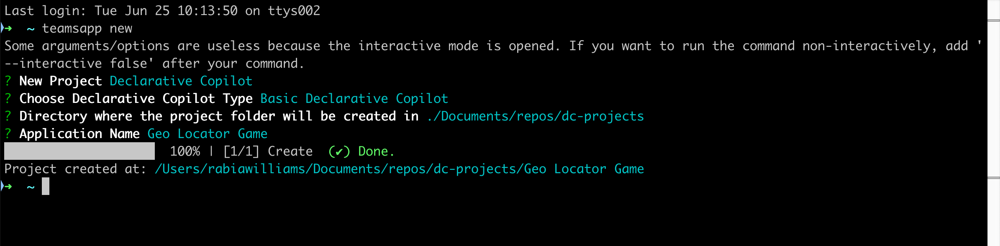

# Lab 01 - Customise Copilot by building a declarative copilot

In this lab you will build a declarative copilot using Teams Toolkit for Visual Studio Code. This tool is not mandatory for you to create a declarative copilot but it makes it so much easier to scaffold, package and deploy your app. 

In this lab you will learn:

- What is a declarative copilot for Microsoft 365
- Install [Teams toolkit CLI](https://learn.microsoft.com/en-us/microsoftteams/platform/toolkit/teams-toolkit-cli?pivots=version-three#get-started)
- Create a basic declarative copilot using Teams toolkit CLI
- Customise the basic app to create the geo locator game
- Learn how to run and test your app

## Introduction

Welcome on board to building your own declarative copilot! This is the easiest way to customise Copilot for Microsoft 365 by simply declaring instructions or by adding skills and knowledge to craft your own Copilot with the power of everything you like about Copilot for Microsoft 365. These copilots enhance collaboration, boost productivity, and streamline workflows and most importantly they tailor your Copilot to automate complex tasks and create consistent, personalised experiences. Let's dive in and make your Copilot work magic!

## Anatomy of the app package

You will see as we develop more and more extensions to Copilot,  that in the end what you will build is collection of few file in a zip file which we will refer to has an `app package` that you will  then install and use. So it's important you have a basic understanding of what the app package consists of. The app package of a declarative copilot is similar to a Teams app if you have built one before with additonal elements. See the table to see all the core elements. You will also see that the app deployment process is very similar to deploying a teams app. 

| Element                | Description                                                                                 |
|-----------------------------|---------------------------------------------------------------------------------------------|
| **App manifest**            | Describes app configuration, capabilities, required resources, and important attributes.    |
| **App icons**               | Requires a color and outline icon for your declarative copilot.                             |
| **Declarative copilot manifest** | Describes copilot configuration, required fields, capabilities, conversation starters, and actions. |
| **Plugin manifest (Optional)**   | Describes plugin configuration, required fields, and capabilities.                         |

> In this lab we will have not have the plugin manifest but you can find it in more advanced labs in copilot camp.

## Exercise 1: Scaffold a declarative copilot from template
You can use just an editor to create a declarative copilot if you know the structure of the files in the app package mentioned above. But things are easier if you use a tool like Teams Toolkit to not only create these files for you but also help you deploy and publish your app. 
So to keep things as simple as possible we will install `Teams Toolkit CLI` to create declarative copilot with a base template for the app.

### Step 1: Use Teams Toolkit CLI to create a new app

Go to your terminal of choice and type `teamsapp new` and select Enter. 

??? warning "Confused if you are really creating a teams app?"
    While it may appear that this command is used to create a new Teams application, it’s important to note that the process of packaging a declarative copilot shares similarities with that of a Teams app as mentioned in the introduction. So in the coming steps it will be a lot clear as you choose options to scaffold the base app. 

Next, you can select the type of project you want to create. Select `Declarative Copilot` as shown in the screen and select Enter. Note that `Declarative Copilot` is the default new project option auto selected, so you can just select Enter.

Next, you will be asked to choose the type of declarative copilot. Choose `Basic Declarative Copilot` and select Enter. 

Next, type in the directory where the project folder has to be created.

Next, give it an application name `Geo Locator Game` and select Enter. 

The project will be created in a few seconds in the folder you mentioned with indication in the terminal that it is done as shown below. 

Congratulations! You have successfully set up the base application! Now, proceed to examine the files contained within to be able to customise it to make the geo locator game app. 

### Step 2: Understanding the files in the app

## Exercise 2: Update with instructions for Geo Locator game

### Step 2: Update declarative manifest
### Step 3: Test the app

You have successfully created a Declarative Copilot!