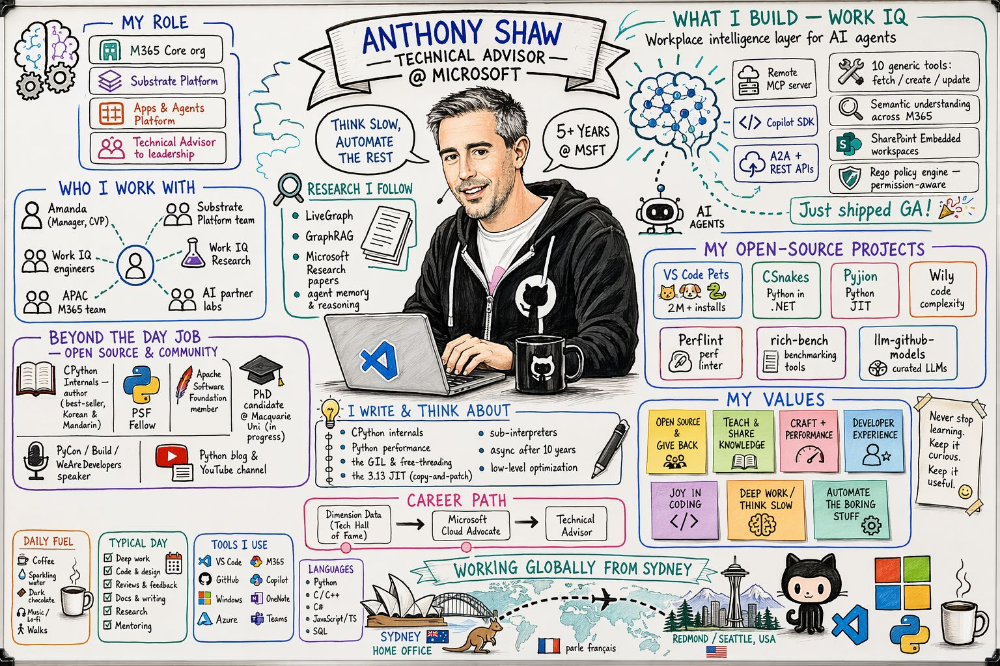
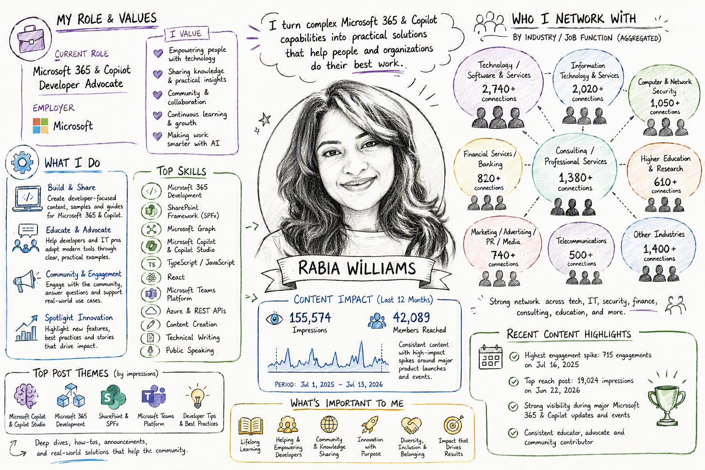

# Why Context Became the Real Differentiator in Agentic Work

<cc-blog-meta author="Rabia Williams" date="July 13, 2026" image="../../../../assets/authors/rabia-williams.jpeg"></cc-blog-meta>

In 2026, AI conversations shifted from "which model is best" to "which context can you trust."

That shift matters. Models keep improving, but outcomes still depend on grounded context: reliable sources, role intent, clear boundaries, and citations.

## Why context matters more than raw model power

Across customer workshops, three themes keep repeating: **cost, trust, and integration**.

The winning pattern is not "bigger model first." It is context-first:

1. Define boundaries.
2. Ground outputs in verifiable sources.
3. Keep human accountability.
4. Connect context across work systems.

## The viral prompt moment: a signal from the community

One prompt made this visible in public.


The Work IQ persona sketch sample became a viral artifact in the Microsoft 365 community:

Credit for the original Work IQ prompt: [**Anthony Shaw**](https://github.com/tonybaloney).

- Over **72,000 GitHub views**.
- An estimated **~100,000 people** tried creating a custom Work IQ and Copilot infographic.



Reference prompt:

- [M365 WorkIQ Persona Sketch (GitHub)](https://github.com/pnp/copilot-prompts/tree/main/samples/prompts/m365-workiq-persona-sketch)

What made this spread was not just clever prompting. It gave people a practical way to apply context quickly:

- A reusable scaffold for role-aware outputs.
- A concrete structure for grounding and personalization.
- A shareable format that translated well into LinkedIn demos, screenshots, and "how I built this" posts.

In short, it lowered the barrier between curiosity and useful outcomes.

## LinkedIn impact: from prompt sharing to capability building

The LinkedIn ripple effect was important because it changed the type of discussion:

- Less "look at this magic trick."
- More "how do we make this repeatable and trustworthy for teams?"

That is a meaningful maturity step for the M365 ecosystem. Viral posts drew attention, but the sustained value came from community members adapting the pattern to real work contexts, then sharing improvements back.

## The practical lesson for teams

If you are building with Copilot, Work IQ, or enterprise agents, treat context as a product decision, not an implementation detail.

- Design your context model first.
- Decide what sources are authoritative.
- Require citations for high-impact outputs.
- Add review checkpoints for regulated or sensitive scenarios.
- Measure outcomes tied to business process improvement, not only token usage.

**When context quality goes up, trust goes up. When trust goes up, adoption and impact follow.**

---

## Build your own context pack for LinkedIn

If the Work IQ prompt is the highlight, the next step is to make your own version truly yours by grounding it in your real profile and network data.

Many folks who did not have a WorkIQ reached out to me on LinkedIn, and I have genuinely tried to reply to everyone because they wanted to feel included too.

Your work is not limited to M365, and context lives wherever your professional footprint exists. To make this easier, I want to show you how to use your own LinkedIn data to create a sketch.

Think of this as the LinkedIn counterpart to Work IQ. Work IQ can provide rich context from your enterprise data inside your workplace, while LinkedIn export data can anchor your networking and professional activity outside work.

LinkedIn gives you a built-in export that can be used as a context dataset for analytics and visualization prompts.

### Steps to get your own LinkedIn analytics data

1. Open [LinkedIn Creator Analytics - Content](https://www.linkedin.com/analytics/creator/content/).
2. Sign in to LinkedIn if prompted.
3. Set the date range (number of days) you want to analyze.
4. Select the **Export** button on the analytics page.
5. Choose the export format if LinkedIn prompts for one (for example CSV).
6. Download the exported file and save it for your prompt workflow.

> If you want to use the richer prompt below (with fields like Positions, Skills, Connections, and Endorsements), also request your full LinkedIn data export from **Settings & Privacy > Data privacy > Get a copy of your data**.
In short:
- Use **Creator Analytics export** for post-performance and content trend signals.
- Use **full LinkedIn data export** for profile, skills, connections, and broader context.

Together, these exports turn your prompt from generic persona content into a grounded, analytics-backed snapshot of your professional context.

## LinkedIn context prompt template (whiteboard persona sketch)

Use this prompt with your headshot and LinkedIn export files attached:

```text
Create a photorealistic image in a clean cartoon whiteboard sketch style that visualises my work life.
Use the attached headshot to guide the sketch of me at the center.
Base all content on the attached LinkedIn data export (Excel/CSV), not general assumptions:

- My role & values: derive from the Positions and Skills sheets - use my current job title, employer, top listed skills, and any summary/about text present in the export.
- What I do: infer from my most recent Positions entry and top Skills, plus recurring themes in my Posts/Content sheet if included.
- Who I network with: do NOT use individual names or identify specific people. Instead, aggregate the Connections sheet by industry and job function (for example: "Tech / Product Managers", "Finance / Analysts", "Marketing / Consultants") and represent each group as a labeled cluster with a generic silhouette icon, sized roughly by how many connections fall into that group.
- What is important to me: infer from Endorsements, recurring post topics, and any groups or interests listed in the export.

Avatars: use only generic silhouette/icon avatars throughout - no real photos, no invented likenesses, and no named individuals anywhere in the image.

Make the graphic rich in information - include labeled icons, small text callouts, and visual groupings (for example: roles, values, industry clusters) radiating from my central sketch.
```



### Disclaimer before sharing

This prompt is designed to help you better understand and visualize your work. Depending on your data, generated outputs may include references to people you work with, projects, customers, teams, or other organizational details.

If you choose to share the output publicly, we strongly recommend reviewing it first and removing any information that could expose private, confidential, or security-sensitive details. Always follow your organization's privacy and information protection guidelines when publishing generated content.

### Why this works

This pattern keeps the image generation grounded in your own exported context while preserving privacy for others in your network.

It is also a repeatable pattern: export your data, structure the context, run the prompt, review for safety, and share. You can rerun the same flow as your profile, activity, and network evolve.


**The broader lesson is simple: better context creates better outcomes.**
