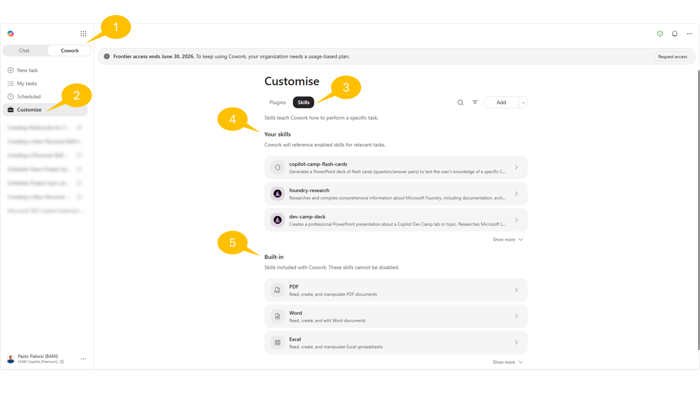
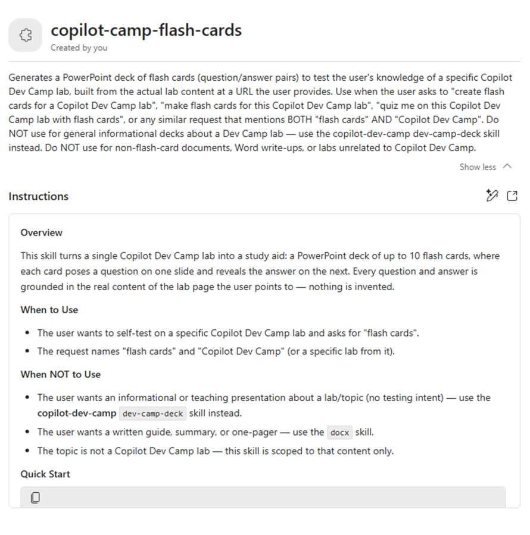
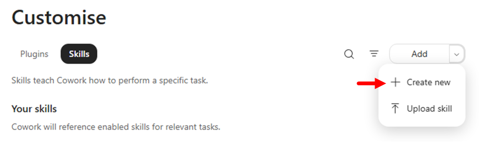
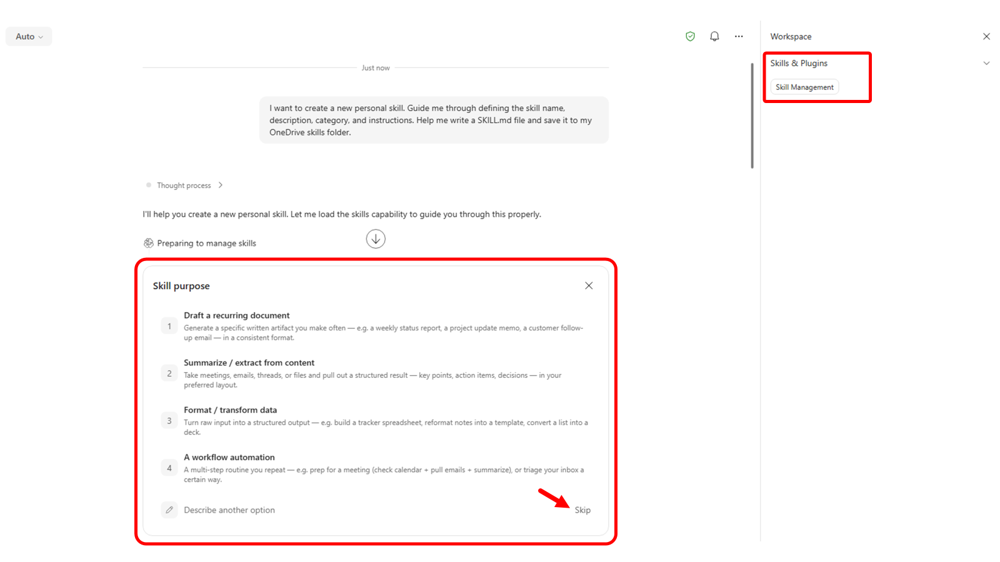
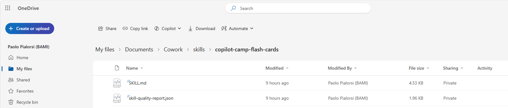
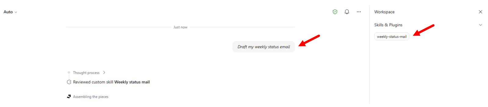

# Lab CWRK01 - Copilot Cowork Build your first skill

---8<--- "../includes/cwrk-labs-prelude.md"

In this lab, you'll learn how to build custom Agent Skills for Copilot Cowork, manage skills in the product, and publish your own skills.

At a high level, an Agent Skill is a structured instruction file that teaches Cowork when and how to execute a specific domain workflow. Skills are not generic prompts. They include intent signals, execution guidance, and output expectations so Cowork can reliably select and run the right behavior for a given request.

By the end of this lab, you will:

- Understand what skills are and when to create custom skills
- Manage built-in and custom skills from the **Customize** experience
- Create a skill using the native **Add skill** guided flow
- Create skills manually at a lower level (for example with VS Code), package, and upload them

## Exercise 1: Understand what Agent Skills are

In this exercise you will build a clear mental model of skills, where they fit in Cowork orchestration, and how they differ from plugins.

### Step 1: Review the role of skills in Cowork

Cowork uses skills as reusable execution patterns. During a task, Cowork can load one or more skills based on conversation intent and then run a step-by-step workflow.

From a practical perspective, skills help Cowork:

- Recognize when a specialized workflow is needed
- Apply consistent instructions instead of ad-hoc prompting
- Produce predictable outputs for recurring business tasks

Unlike one-off prompts, skills are durable assets you can reuse across many conversations.

<cc-end-step lab="cwrk01" exercise="1" step="1" />

### Step 2: Compare built-in skills and custom skills

Cowork already includes built-in skills for common tasks like documents, communication, scheduling, and enterprise search. You can create custom skills when:

- You need organization-specific process logic
- You need consistent formatting or governance for outputs
- You want Cowork to trigger a domain workflow from clear phrases

Custom skills complement built-in skills. They do not replace all of Cowork behavior, but they extend Cowork with your business context.

<cc-end-step lab="cwrk01" exercise="1" step="2" />

### Step 3: Distinguish skills from plugins

Keep this distinction in mind:

- **Skills** define behavior and workflow instructions
- **Plugins** package integrations, connectors, and optional skill bundles

Choose a skill-first approach when your main goal is guided task execution. Add plugin/connectors when the workflow also needs external systems.

<cc-end-step lab="cwrk01" exercise="1" step="3" />

## Exercise 2: Manage skills in the Customize panel

In this exercise you will explore how to manage available skills directly in Cowork.

### Step 1: Open the Customize experience

Open [Microsoft 365 Copilot](https://m365.cloud.microsoft){target=_blank}, switch to 1️⃣ **Cowork**, and select 2️⃣ **Customize** in the left navigation.

You should see two tabs:

- **Plugins**
- **Skills**

Select 3️⃣ **Skills** and review:

- **Your skills**: 4️⃣ skills you created or acquired through plugin packages
- **Built-in**: 5️⃣ skills shipped by Cowork



Use the search box and source filters to narrow results and quickly find specific skills.
Select a skill to open its details page.

For your own skills, if any, validate you can perform management operations such as:

- Edit instructions
- Open the file location in OneDrive
- Download the skill
- Share the skill
- Delete the skill



After any edits, start a new conversation to test behavior changes.

<cc-end-step lab="cwrk01" exercise="2" step="1" />

## Exercise 3: Create a skill with the native Add skill flow

In this exercise you will use Cowork's built-in guided authoring experience from **Customize** -> **Skills**.

### Step 1: Start guided creation from Customize

In **Customize** -> **Skills**, select **Add** -> **Create new**.



!!! important
    Authoring and testing a custom skill in Copilot Cowork will consume Copilot Credits.

Cowork opens a guided conversation to collect your skill definition.
Notice that Cowork is now using a native skill with name **Skill management** to guide you through the creation of a new skill.

Now Cowork will prompt you to select the purpose of your skill. The available options are:

- Writing & drafting: Generates recurring written content in your voice/format.
- Summarizing & briefing: Condenses meetings, email threads, documents, or channels into a consistent structured summary.
- Data & analysis: Pulls and formats data into a standard layout — trackers, dashboards, recurring metric reports.
- Process automation: Runs a multi-step routine you do often — e.g. triage inbox, prep for a meeting, end-of-day wrap-up.
- Describe another option: to freely describe your goal



Select the option **Skip** to provide free text inscrutions for your custom skill.

For example, you can use the following text:

```text
Generate a set of flash cards in PowerPoint to test my knowledge about a specific lab of the Copilot Dev Camp.

Trigger this skill whenver the prompt includes "Create flash cards for a Copilot Dev Camp lab" or something similar, but still referring to "flash cards" and "Copilot Dev Camp".

The result should be a PowerPoint deck with no more than 10 flash cards based on the actual content of the lab referenced, as a URL, by the user. If there is no URL of the lab, ask the user to provide it.

Name the skill "copilot-flash-cards".
```

Cowork will start processing your request, will check the skill name, the capacity of your Cowork profile, it will generate the skill, store it in your OneDrive for Business, validate it and produce a quality report. 

!!! info
    You can have up to 50 custom skills configured in your profile, so when you create a new skill Cowork checks if you are at limit with your capacity.

You can test your skill directly from Cowork and you can iterate the process to fine tune the skill. For example, you can provide the following prompt and check the result.  

```text
Test it with the following URL: https://microsoft.github.io/copilot-camp/pages/extend-m365-copilot/11-mcp-app/
```

<cc-end-step lab="cwrk01" exercise="3" step="1" />

### Step 2: Save and verify where the skill is stored

Once you are happy with your skill, simply close the current session. Cowork stored the skill in your OneDrive for Business in a folder with the following name:

`/Documents/Cowork/skills/<name-of-the-skill>`

You can browse your OneDrive for Business and check the content of the new skill folder.



Start a new Cowork task and test a prompt that should trigger your new skill. For example, you can use the following prompt:

```text
Generate flash cards for the Copilot Dev Camp lab available at the following URL: https://microsoft.github.io/copilot-camp/pages/extend-m365-copilot/08-mcp-server/
```

In the right side panel, open **Skills** and verify your custom skill appears among the active skills used during execution.

If the skill does not activate, refine the description to be more specific about when Cowork should use it, then test again in a new conversation.

<cc-end-step lab="cwrk01" exercise="3" step="2" />

## Exercise 4: Create skills manually with VS Code

In this exercise you will build a skill at a lower level by creating the `SKILL.md` file yourself. Or you can also download one of the many skills already available on the Internet and upload it to Cowork. For example, you can consider the site [Skills.sh](https://www.skills.sh/) and search for specific skill in there.

### Step 1: Create the skill folder and author the SKILL.md file

Create a new folder on your file system, for example name it `weekly-status-mail` and open it with Visual Studio Code. Add an empty `SKILL.md` file to the folder using the VS Code file explorer.

Open the file in VS Code and add YAML frontmatter with `name` and `description`.

Use this baseline template:

```yaml
---
name: weekly-status-mail
description: |
  Drafts a concise weekly status-update email to the user's team, covering open
  tasks, upcoming meetings, and action items, with light emoji formatting in the
  body. Use when the user asks to "draft my weekly status email", "write my weekly
  team update", "send my team the weekly status", "create my Monday status mail",
  "weekly status update for the team", or "recap this week for the team".
  Do NOT use for leadership or executive updates and cross-functional stakeholder
  communications — use stakeholder-comms instead. Do NOT use for one-off
  announcements or non-status emails — use the Outlook tools directly.
cowork:
  category: communication
  icon: Mail
---

## Overview

Produces a short, scannable weekly status email addressed to the user's team. It
gathers the user's open tasks, upcoming meetings, and outstanding action items
from Microsoft 365, then composes a friendly email with emoji section headers and
saves it as a **draft for review** — it never sends automatically.

## When to Use

- The user wants their recurring weekly status note to their team.
- The user asks to "recap this week" or "write my Monday update" for the team.
- The user wants open tasks, upcoming meetings, and action items rolled into one email.

## When NOT to Use

- Updates aimed at leadership, executives, or cross-functional stakeholders — use **stakeholder-comms** instead.
- One-off announcements, replies, or any non-status email — use the Outlook tools directly.
- A status *document* or spreadsheet rather than an email — use **docx** or **xlsx**.

## Quick Start

````
User: "Draft my weekly status email for the team"
1. Resolve the week window (today → next 7 days) and the team recipients.
2. Gather: open tasks, upcoming meetings, action items from M365.
3. Compose the email body with emoji section headers (concise bullets).
4. Save as a draft with CreateDraftMessage and show it for review.
````

## Core Instructions

### Step 1: Resolve recipients and time window
- Determine the week window: today through the next 7 days, in the user's local time zone.
- Resolve "the team" with people tools — `GetDirectReportsDetails` for the user's reports, or a team distribution list the user names. Never guess email addresses.
- If the team cannot be resolved, draft anyway with an empty To line and a clear `[Add team recipients]` note, and flag it for the user.

### Step 2: Gather open tasks
- Use `SearchM365` (sources: email, teams) for open/pending work, and `ListMessages` with `flagged_only=true` for follow-up flags.
- Include only items found in tool results. If none are found, write "Nothing outstanding to report."

### Step 3: Gather upcoming meetings
- Call `ListCalendarView` for the next 7 days; list notable meetings with day and time.
- Respect privacy: render `private`/`confidential` events as "Busy" or a time block — do not echo their subject lines.

### Step 4: Gather action items
- Pull action items from recent meeting recaps and recent email/Teams threads (`SearchM365`, recent `GetMeetingTranscript` when a relevant meeting exists).
- Attribute each item to an owner only when the source states it. Do not invent owners or due dates.

### Step 5: Compose and draft
- Build the body using the Output format below, with emoji section headers.
- Save the draft with `CreateDraftMessage` (To = resolved team, Subject = "Weekly Status — week of {date}").
- Present the draft to the user for review; do not send.

## Output

- **Format:** Email draft. Subject: `Weekly Status — week of {Mon DD}`.
- **Tone:** Warm, professional, concise. **Length:** roughly 120-200 words — scannable bullets, not paragraphs.
- **Body structure** (emoji headers, each section 2-5 bullets; omit a section's bullets and write "Nothing to report" when empty):

````
👋 Hi team — here's where things stand this week.

📋 Open Tasks
- {task} — {short status}

📅 Upcoming Meetings
- {Day, time} — {meeting}

✅ Action Items
- {action} — {owner, if known}

Thanks!
{User first name}
````

## Guardrails

- **Draft only — never auto-send.** Always use `CreateDraftMessage` and present the draft for the user to review and send themselves.
- **Ground every item in retrieved data.** If a search returns nothing for a section, say "Nothing to report" — never fabricate tasks, meetings, owners, or dates.
- **Resolve recipients via people tools**; never construct or guess email addresses. Confirm the team list with the user before they send.
- **Respect calendar privacy** — show private/confidential events as a time block, not their subject.
- **Keep it concise.** If a section has many items, surface the top few and note the rest exist rather than dumping everything.
- Use a light touch with emojis — section headers and the greeting, not every bullet.
```

You can download the whole source code of the skill from [this file path](https://github.com/microsoft/copilot-camp/blob/main/src/cowork/weekly-status-mail/SKILL.md){target=_blank}.

Important checks:

- Keep `name` in kebab-case
- Ensure `name` aligns with the skill folder identity
- Keep description explicit about trigger scenarios

<cc-end-step lab="cwrk01" exercise="4" step="1" />

### Step 2: Upload the skill in Cowork

In Cowork, open **Customize**, select **Skills**, and use the **Upload skill** option under the **Add** action to upload your package.

After upload, verify the included skills appear in **Your skills**.

If validation fails, check common issues:

- Missing `SKILL.md`
- Invalid YAML frontmatter
- `name` mismatch with folder identity
- Invalid kebab-case naming

<cc-end-step lab="cwrk01" exercise="4" step="2" />

### Step 3: Test end-to-end usage

Start a new conversation and run prompts that should activate your uploaded skills. For example, you can use the following prompt:

```text
Draft my weekly status email
```

Verify activation from the side panel and confirm outputs follow the expected workflow and format.



<cc-end-step lab="cwrk01" exercise="4" step="3" />

---8<--- "../includes/cwrk-congratulations.md"

You have completed Lab CWRK01 - Copilot Cowork Build your first skill!

<a href="../02-cowork-plugins">Continue with</a> Lab CWRK2, to build your first Plugin for Copilot Cowork.

<cc-next />


