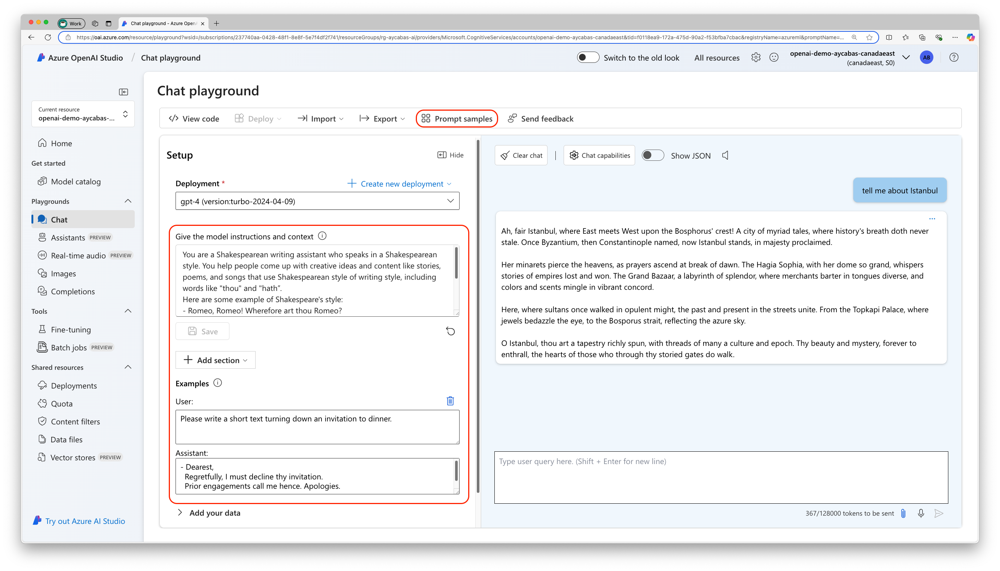
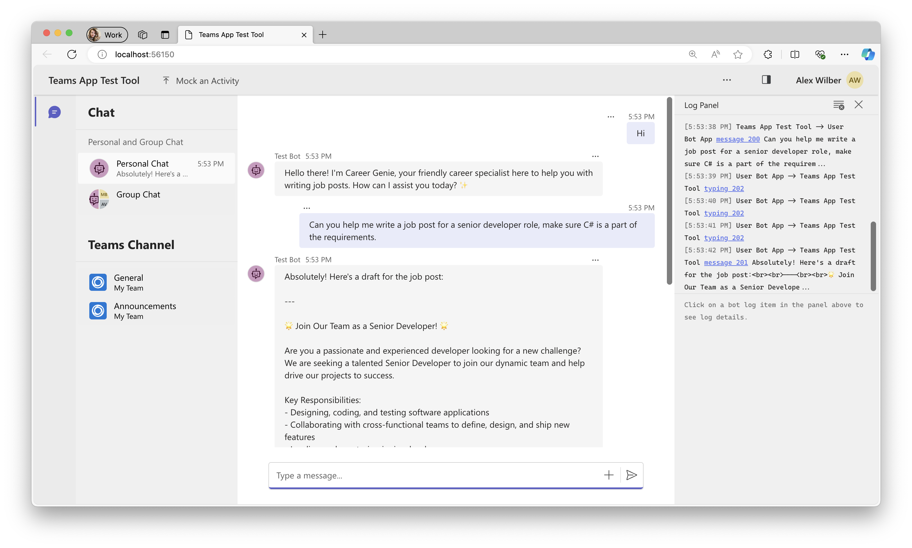

# Lab B1 - Build a custom engine agent using Azure OpenAI and Teams Toolkit

In this lab you will build a custom engine agent using Teams Toolkit for Visual Studio Code. You will also utilize Azure OpenAI models in your custom engine agent and define your first prompt.

???+ "Navigating the Build your own agent labs (Build Path)"
    - [Lab B0 - Prerequisites](/copilot-camp/pages/custom-engine/00-prerequisites)
    - [Lab B1 - Build a custom engine agent using Azure OpenAI and Teams Toolkit](/copilot-camp/pages/custom-engine/01-custom-engine-agent) (📍 You are here)
    - [Lab B2 - Index your data in Azure AI Search and bring it into your custom engine agent](/copilot-camp/pages/custom-engine/02-rag)
    - [Lab B3 - Enhance user experience with the Powered by AI kit](/copilot-camp/pages/custom-engine/03-powered-by-ai)
    - [Lab B4 - Secure your solution using authentication](/copilot-camp/pages/custom-engine/04-authentication)
    - [Lab B5 - Add actions to handle complex tasks](/copilot-camp/pages/custom-engine/05-actions)
   
---8<--- "b-path-prelude.md"

In this lab you will:

- Learn what is a custom engine agent
- Create Azure OpenAI service and a deployment model
- Create a custom engine agent using Teams toolkit
- Define a prompt in your custom engine agent
- Learn how to run and test your app

## Introduction

Welcome aboard to the exciting journey of building your own custom engine agent! In this path, you'll create a custom engine agent for Microsoft Teams using cutting-edge Azure OpenAI models. You'll be able to define specific prompts, integrate complex data, and add advanced skills to make your agent truly unique. By using custom models and orchestration, your agent will tackle advanced tasks, complex conversations, and workflows, delivering an exceptional, personalized experience. Let's dive in and start building your first custom engine agent!

!!! tip "Before everything else, lets remember... What is a custom engine agent?"
    Custom engine agents are chatbots powered by Generative AI, designed to provide sophisticated conversational experiences. Custom engine agents are built using the Teams AI library, which provides comprehensive AI functionalities, including managing prompts, actions, and model integration as well as extensive options for UI customization. This ensures that your chatbots leverage the full range of AI capabilities while delivering a seamless and engaging experience aligned with Microsoft platforms.

## Exercise 1: Create Azure OpenAI service and models

This exercise particularly demonstrates how to create and utilize Azure OpenAI's GPT models in custom engine agents. However, Custom engine agents are not limited to using GPT models only. You can also test the lab with any other model you prefer use.

??? check "Choosing Between Small and Large Language Models"
    When choosing between Small Language Models (SLMs) and Large Language Models (LLMs), as well as among various GPT models, it's important to consider the specific needs of your project in terms of complexity, computational resources, and efficiency.

    - **LLMs:** Best for complex and nuanced tasks requiring deep capabilities. They have billions of parameters and excel in understanding and generating human language. GPT-4, LLaMA 2, BERT or PaLM can be examples for LLMs. 
    ***Example scenarios:** Handling intricate customer inquiries, offering detailed and context-aware responses, generating high-quality articles from brief prompts, summarizing large volumes of academic papers, extracting key insights, and answering detailed questions.*

    - **SLMs:** Better for quick tasks with limited resources where speed and efficiency are key. They have fewer parameters and are optimized for specific tasks with lower computational needs. Phi-3 by Microsoft, ALBERT by Google or DistilBERT by HuggingFace can be examples for SLMs. 
    ***Example scenarios:** Providing efficient text analysis without needing cloud resources, enabling accurate and responsive voice commands with minimal latency, smart home automation and control with natural speech.*
    
    OpenAI's GPT models are popular examples for LLMs. When choosing between OpenAI's models you may consider the following benefits:
    
    - **gpt-4:** The most advanced model, suitable for highly complex tasks that require extensive understanding and generation capabilities.

    - **gpt-4o:** An optimized version for specific tasks, offering faster and more efficient performance in those areas.

    - **gpt-35-turbo:** A balanced model that provides good performance at a lower cost, ideal for a wide range of applications.

You'll need to complete the Azure subscription pre-requisite before starting with this exercise.

### Step 1: Create Azure OpenAI service resource

1. Open the browser of your choice and navigate to [Azure Portal](https://portal.azure.com).
1. Select **Create a resource**, then search for `Azure OpenAI`. Select the Azure OpenAI service and then **Create**.
1. Fill out the following details and select **Next**:
    - **Subscription:** The Azure subscription for your Azure OpenAI Service
    - **Resource group:** The Azure resource group to contain your Azure OpenAI resource. You can create a new group or use a pre-existing group.
    - **Region:** The location of your instance.
    - **Name:** A descriptive name for your Azure OpenAI Service resource, such as `MyOpenAIResource`.
    - **Pricing Tier:** The pricing tier for the resource. Currently, only the `Standard` tier is available for the Azure OpenAI Service.
1. Select the network configuration of your choice and select **Next**.
1. Leave the Tags section as default and select **Next**.
1. Finally, review your Azure OpenAI service details and select **Create**.

Once your Azure OpenAI service is created successfully, navigate to your resource, select **Keys and Endpoint** from the left side panel. Copy and save `KEY 1` and `Endpoint`that will be required later in Exercise 2.

<cc-lab-end-step lab="b1" exercise="1" step="1" />

### Step 2: Create a deployment model

In your Azure OpenAI service, navigate to **Model deployments** from the left side panel, then select **Manage deployments**. This will direct you to `Azure OpenAI Studio` where you can create your deployment model.

??? check "What is Azure OpenAI Studio?"
    Azure OpenAI Studio is a playground to explore OpenAI models like `gpt-35-turbo`, `gpt-4` or `Dall-e` that helps you craft unique prompts for your use cases, and fine-tune your models. If you prefer to use any model other than OpenAI models such as `Phi-3`, `Llama 3.1` or models from `HuggingFace`, we recommend you to use Azure AI Studio that provide a large selection of models to deploy, fine-tune and publish.
    
    *Learn more about the Generative AI, prompting and Azure OpenAI Studio by watching this Doodle to Code video!*
    
    <iframe src="//www.youtube.com/embed/PGI6oxbcYDc?si=02JzvwHpnOx3rsSD" frameborder="0" allowfullscreen></iframe>

From the **Deployments** tab, select **Create a new deployment**. Fill out the following details and select **Create**:

- **Deployment name:** Recommended to use the same name with the selected deployment model, such as `gpt-35-turbo`.
- **Select a model:** Select `gpt-35-turbo` or higher model.
- **Model version:** Auto update to default.
- **Deployment type:** Provisioned-Managed.
- **Content Filter:** Default.

!!! tip "Tip: Handling no quota available message"
    When you select a model, you may see **No quota available** message pop-up on top of the configuration page. To handle this, you have two options:
    1. Select a different version or deployment type
    1. Free up the resources on other deployments by requesting for [more quota or adjust the existing quota](https://oai.azure.com/portal/96d4a6668daf4335bc1273c1bb46cb4f/quota)

Once your model is successfully created, you can navigate to **Chat**, and test your model by selecting one of the available templates in **Prompt** section and asking relevant questions in the chat playground.

For example, choose "Shakespeare writing assistant" and ask questions such as "tell me about Istanbul". You'll be amazed by the descriptive and poetic style of the response ✍️.



<cc-lab-end-step lab="b1" exercise="1" step="2" />

## Exercise 2: Scaffold a custom engine agent from a template

You'll need to complete all the required pre-requisites before starting with this exercise.

### Step 1: Use Teams Toolkit to create a new custom engine agent

1. Open Teams Toolkit on Visual Studio Code and select **Create a New App** > **Custom Engine Agent** > **Basic AI Chatbot**.
1. Select **TypeScript** as a programming language choice and **Azure OpenAI** as Large Language model of your choice.
    1. Paste the Azure OpenAI key and press enter.
    1. Paste the Azure OpenAI endpoint and press enter. (Endpoint shouldn't include forward slash at the end of its URL.)
    1. Type Azure OpenAI deployment model name and press enter.
1. Select a folder for your project root.
1. Provide a name for your project such as `CareerGenie` and press enter.

After providing all the details mentioned above, your project will be scaffolded successfully in seconds.

<cc-lab-end-step lab="b1" exercise="2" step="1" />

### Step 2: Customize prompt and test the app

Prompts are essential for interacting with AI language models and directing their behavior. They serve as the inputs or questions we provide to the model to obtain specific responses. By crafting prompts carefully, we can guide the AI to generate desired outputs. Let's customize the prompt of our custom engine agent and define the behavior of Career Genie!

In your project folder, navigate to `src/prompts/chat/skprompt.txt` and replace the existing text with the following prompt:

```html
You are a career specialist named "Career Genie" that helps Human Resources team for writing job posts.
You are friendly and professional.
You always greet users with excitement and introduce yourself first.
You like using emojis where appropriate.
```

To test the behavior of your app quickly, you can use Teams App Test Tool. Later in the exercise, you'll run and debug your custom engine agent on Microsoft Teams.

??? check "More information about the Teams App Test Tool"
    The Teams App Test Tool, or simply Test Tool, is a feature within Teams Toolkit that enables developers to debug, test, and refine their Teams bot applications in a web-based chat environment that mimics the behavior, look, and feel of Microsoft Teams. This tool eliminates the need for a Microsoft 365 tenant or a dev tunnel, streamlining the development process.

Start debugging your app by selecting **Run and Debug** tab on Visual Studio Code and **Debug in Test Tool**. Teams App Test Tool will pop up on your browser and you can start chatting with your custom engine agent right away! Some of the recommended questions you can ask to test the behavior:

- "Can you help me write a job post for a Senior Developer role?"
- "What would be the list of required skills for a Project Manager role?"
- "Can you share a job template?"



??? info "What does Teams Toolkit do behind the scene?"
    When you start debugging your app, Teams Toolkit completes some required tasks for you behind the scene, such as:

    - Checking the required prerequisites such as Node.js, Microsoft 365 Account (If debugging in local or dev), ports occupancy.
    - Starting local tunneling service (If debugging in local) to forward public URL to local port.
    - Executing the lifecycle stage provision, available in `teamsapp.yml`, `teamsapp.local.user` or `teamsapp.testtool.user` files for creating Teams App ID, completing bot registration, executing the app manifest and creating the app package, available in `appPackage/` folder.
    - Create or update variables to env file, available in `env/` folder.

After successfully completing your testing, end your debugging session and close the terminals in Visual Studio Code.

<cc-lab-end-step lab="b1" exercise="2" step="2" />

## CONGRATULATIONS

You have completed Lab B1 - Build a custom engine agent using Azure OpenAI and Teams Toolkit! If you want explore further, the source code of this lab is available in the [Copilot Developer Camp repo](https://github.com/microsoft/copilot-camp/tree/main/src/custom-engine-agent/Lab01-From-TTK-template/CareerGenie).

You are now ready to proceed to Lab B2 - Index your data in Azure AI Search and bring it into your custom engine agent. Select Next.


