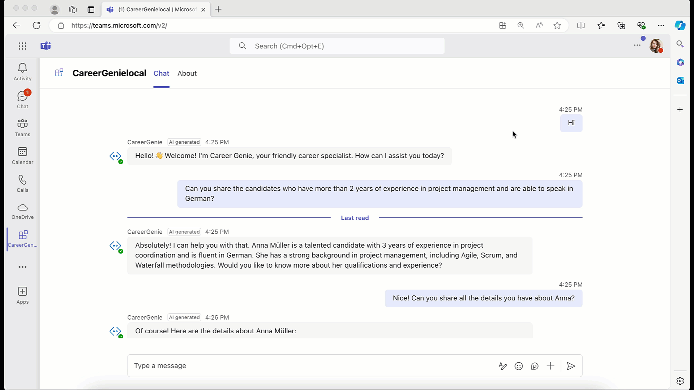

# Lab B2 - Index your data in Azure AI Search and bring it into your custom engine copilot

In this lab you will enable Retrieval-Augmented Generation for your custom engine copilot and integrate with Azure AI Search to chat with your data.

???+ info "Navigating the Building your own copilot labs (B Path)"
    - [Lab B0 - Prerequisites](/copilot-camp/pages/custom-engine/00-prerequisites)
    - [Lab B1 - Build a custom engine copilot using Azure OpenAI and Teams Toolkit](/copilot-camp/pages/custom-engine/01-custom-engine-copilot)
    - [Lab B2 - Index your data in Azure AI Search and bring it into your custom engine copilot](/copilot-camp/pages/custom-engine/02-rag) (📍 You are here)
    - [Lab B3 - Enhance user experience with the Powered by AI kit](/copilot-camp/pages/custom-engine/03-powered-by-ai)
    - [Lab B4 - Add actions to handle complex tasks](/copilot-camp/pages/custom-engine/04-actions)
    - [Lab B5 - Secure your solution using authentication](/copilot-camp/pages/custom-engine/05-authentication)

In this lab you will learn:

- What is Retrieval-Augmented Generation (RAG)
- Setup Azure resources
- Upload your documents to Azure AI Search
- Prepare your custom engine copilot for Vector Search
- Learn how to run and test your app

## Introduction

??? info "What is Retrieval-Augmented Generation (RAG)?"
    Retrieval-Augmented Generation (RAG) is a technique used in artificial intelligence to improve the quality of responses generated by language models. Here's a simple example to understand it better:

    Imagine you have a smart assistant that can write answers to your questions. Sometimes, this assistant might not know everything it needs to give a great answer. To help with this, RAG lets the assistant look up information from a large collection of documents, videos, images similar to how you might search the internet for answers. After finding the relevant information, the assistant then uses this data to write a better, more accurate response.

    So, RAG combines two steps:

    - **Retrieval:** Finding relevant information from a big pool of data.
    - **Generation:** Using that information to create a detailed and accurate response.
    
    This way, RAG helps in providing more informed and useful answers, making it very effective for tasks like answering questions, writing articles, and assisting with research.

In the previous exercise, you learned how to create a custom engine copilot and customize the prompt for defining the behavior of the AI chatbot, Career Genie. In this exercise, you'll apply vector search to a collection of resumes to find the best candidate for the job requirements. To enable vector search in Career Genie, you'll use the "Azure OpenAI Studio on your data" feature to:

- Create an index on Azure AI Search.
- Generate vector embeddings for the resumes (PDF documents).
- Upload the data in chunks to Azure AI Search.

Finally, you'll integrate your custom engine copilot with Azure AI Search to chat with your data and obtain the best results.

!!! tip "Benefits of using Vector Search"
    Vector search is an advanced technique used to find information quickly and accurately based on its meaning rather than just matching exact words. Unlike traditional text-based search, which relies on exact keyword matches, vector search uses numeric vectors to find content that is similar to your query. This enables Vector search to handle:

    - **Semantic or conceptual similarity:** Matching concepts that are similar in meaning even if they use different words (e.g., "pastry" and "croissant").
    - **Multilingual content:** Finding equivalent content across different languages (e.g., "pastry" in English and "gebäck" in German).
    - **Multiple content types:** Searching across different formats (e.g., "pastry" in text and an image of a pastry).
    
    Here is how vector search works:
    
    1. **Converting text to vectors:** Imagine turning words or sentences into a series of numbers (a vector) that captures the essence or meaning of that text. This is done using techniques like word embeddings or deep learning models.
    2. **Storing vectors:** These vectors are stored in a special database designed to handle them efficiently.
    3. **Searching with vectors:** When you search for something, your query is also converted into a vector. The search system then looks for vectors in the database that are close to your query vector in terms of meaning, not just exact word matches.

    For example, if you search for "how to bake a cake" the system can find documents about "cake recipes" or "baking tips" even if they don't have the exact words "how to bake a cake" or even if the recipes are written in another language. This makes vector search powerful for finding relevant information based on context and meaning, especially in large datasets.

    In summary, vector search improves the search process by focusing on the meaning behind the words, enabling more accurate and relevant results.

## Exercise 1: Setup Azure Resources

You'll need to complete the Azure subscription pre-requisite before starting with this exercise.

### Step 1: Create Azure AI Search service resource

??? info "What is Azure AI Search?"
    Azure AI Search (formerly known as "Azure Cognitive Search") provides secure information retrieval at scale over user-owned content in traditional and generative AI search applications.When you create a search service, you work with the following capabilities:

    - A search engine for vector search, full text and hybrid search over a search index
    - Rich indexing with integrated data chunking and vectorization
    - Rich query syntax for vector queries, text search, hybrid queries
    - Integration with Azure AI services and Azure OpenAI

1. Open the browser of your choice and navigate to [Azure Portal](https://portal.azure.com).
1. Select **Create a resource**, then search for `Azure AI Search`. Select the Azure AI Search service and then **Create**.
1. Fill out the following details and select **Review + Create**:
    - **Subscription:** The Azure subscription for your Azure OpenAI Service
    - **Resource group:** Select the pre-existing resource group you created earlier for Azure OpenAI service.
    - **Name:** A descriptive name for your Azure OpenAI Service resource, such as `copilotcamp-ai-search`.
    - **Location:** The location of your instance.
    - **Pricing Tier:** Basic

Once your Azure AI Search service resource is created successfully, navigate to your resource, In **Overview**, copy and save `Url`. Then, navigate to **Keys** tab under the **Settings**, copy and save `Primary admin key`. Both of them will be required later in the following exercises.

### Step 2: Create a storage account service resource

1. Open the browser of your choice and navigate to [Azure Portal](https://portal.azure.com).
1. Select **Create a resource**, then search for `Storage Account`. Select the Storage Account service and then **Create**.
1. Fill out the following details and select **Review**, then **Create**:
    - **Subscription:** The Azure subscription for your Azure OpenAI Service
    - **Resource group:** Select the pre-existing resource group you created earlier for Azure OpenAI service.
    - **Name:** A descriptive name for your Azure OpenAI Service resource, such as `copilotcampstorage`.
    - **Region:** The location of your instance.
    - **Performance:** Standard
    - **Redundancy:** Geo-redundant storage (GRS)

### Step 3: Create a `text-embedding-ada-002` model

??? info "What does `text-embedding-ada-002` do?"
    The `text-embedding-ada-002` model on Azure OpenAI converts text into numeric vectors that represent the meaning of the text. This allows for vector search, where instead of matching exact words, the search finds text with similar meanings. It works with multiple languages and different content types, making it useful for comparing text across languages and formats. When used with Azure AI Search, it improves search results by finding the most relevant and contextually accurate information. This model is perfect for creating advanced search solutions and applications that need to understand natural language.

Open [Azure OpenAI Studio](https://oai.azure.com/portal) in your browser, then select **Deployments**. Select **Create a new deployment**. Fill out the following details and select **Create**:

- **Select a model:** `text-embedding-ada-002`.
- **Model version:** Default.
- **Deployment type:** Standard.
- **Deployment name:** Choose a memorable name, such as `text-embeddings`, and make note of it
- **Content Filter:** Default.

Make note of the deployment name; later you will use this as the EMBEDDING_DEPLOYMENT_NAME environment variable.

!!! tip "Tip: Handling no quota available message"
    When you select a model, you may see **No quota available** message pop-up on top of the configuration page. To handle this, you have two options:
    1. Select a different version or deployment type
    1. Free up the resources on other deployments by requesting for [more quota or adjust the existing quota](https://oai.azure.com/portal/96d4a6668daf4335bc1273c1bb46cb4f/quota)

## Exercise 2: Upload your documents to Azure AI Search using Azure OpenAI Studio

For this exercise, download [fictitious_resumes.zip](https://github.com/microsoft/copilot-camp/raw/main/src/custom-engine-copilot/Lab02-RAG/CareerGenie/fictitious_resumes.zip) and unzip the folder.

### Step 1: Upload your documents to Azure AI Search

1. Open [Azure OpenAI Studio](https://oai.azure.com/portal) in your browser, then select **Chat** playground. In the **Setup** section, select **Add your data** tab and then **Add a data source**.

    

1. Select **Upload files (preview)**, then fill the details as the following and select **Next**:

    - **Subscription:** Select the subscription you created your Azure resources.
    - **Select Azure Blob storage resource:** Select your storage resource, `copilotcampstorage`. (You'll see a message *Azure OpenAI needs your permission to access this resource*, select **Turn on CORS**.)
    - **Select Azure AI Search resource:** Select your Azure AI Search resournce, `copilotcamp-ai-search`.
    - **Enter the index name:** Index name, such as `resumes`; make note of this
    - Select the box for **Add vector search to this search resource**.
    - **Select an embedding model:** Select your text-embedding-ada-002 model, `text-embeddings`.

Take note of the index name as you will use this in the INDEX_NAME environment variable.


1. Select **Browse for a file** and select the pdf documents from the `resumes` folder. Then, select **Upload files** and **Next**.
1. Select Search type as `Vector` and chunk size as `1024(Default)`, then **Next**.
1. Select `API Key` as Azure resource authentication type, then **Next**.

It takes couple of minutes to complete the data ingestion. Once the data is ready, you can proceed with testing.

### Step 2: Test your data on Azure OpenAI Studio

Once your data  ingestion is completed, use Chat playground to ask questions about your data.

!!! tip "Tip: Making the most out of your data"
    Review your dataset before asking questions testing the vector search. Go through the `resumes` folder and recognize the resumes provided in different languages with diverse professions, years of experience, skills and more. Start chatting with your data by asking questions to find out the right candidate for a skill, language, profession, years of experience and other categories. Try to test out the combination of requirements to challenge the search experience!


### Step 3: Sneak peek to your index on Azure AI Search

To understand more about your dataset and explore more, select **resumes** from the Add your data section of the Chat playground. This will redirect you to your resumes index on Azure AI Search.


First, let's include the vector content in our data. Select **Fields** tab in your Resumes index page, then check the box for **contentVector**, finally select **Save**.


Go back to **Search explorer** tab, select **Query options** in your Resumes index page and then change the **API version** as `2023-11-01`, then select **Close**. To view your data, press **Search**.

!!! tip "Tip: Numeric vectors for each pdf document"
    When scrolling through your data, recognize that each document has `contentVector` parameter that contains the numeric vectors of the pdf document. These numeric vectors will be used for Vector Search to identify the best matching results.


## Exercise 3: Integrate your app with Azure AI Search

For this exercise, ensure that you obtain Azure OpenAI text embedding deployment name and Azure AI Search key and endpoint.

### Step 1: Configure environment variables

In your Career Genie project, navigate to `env/.env.local.user` and paste the following environment variables:

```json
AZURE_OPENAI_EMBEDDING_DEPLOYMENT_NAME='<Your-Text-Embedding-Model-Name>'
SECRET_AZURE_SEARCH_KEY='<Your-Azure-AI-Search-Key>'
AZURE_SEARCH_ENDPOINT='<Your-Azure-AI-Search-Endpoint>'
INDEX_NAME='<Your-index-name>'
EMBEDDING_DEPLOYMENT_NAME='<Your-embeddiing-deployment-name>'
```

Open `teamsapp.local.yml` and add the following snippet at the bottom of the file, under `uses: file/createOrUpdateEnvironmentFile`:

```yml
AZURE_OPENAI_EMBEDDING_DEPLOYMENT_NAME: ${{AZURE_OPENAI_EMBEDDING_DEPLOYMENT_NAME}}
AZURE_SEARCH_KEY: ${{SECRET_AZURE_SEARCH_KEY}}
AZURE_SEARCH_ENDPOINT: ${{AZURE_SEARCH_ENDPOINT}}
INDEX_NAME: ${{INDEX_NAME}}
EMBEDDING_DEPLOYMENT_NAME: ${{EMBEDDING_DEPLOYMENT_NAME}}
```

Navigate to `src/config.ts` and add the following snippet inside `config`:

```typescript
azureOpenAIEmbeddingDeploymentName: process.env.AZURE_OPENAI_EMBEDDING_DEPLOYMENT_NAME,
azureSearchKey: process.env.AZURE_SEARCH_KEY,
azureSearchEndpoint: process.env.AZURE_SEARCH_ENDPOINT,
indexName: process.env.INDEX_NAME,
embeddingDeploymentName: process.env.EMBEDDING_DEPLOYMENT_NAME
```

### Step 2: Configure Azure AI Search in your source code

Open `src/prompts/chat/config.json` in your project, then add `data_sources` inside the `completion` brackets:

```json
"data_sources": [
{
    "type": "azure_search",
    "parameters": {
        "endpoint": "$searchEndpoint",
        "index_name": "$indexName",
        "authentication": {
            "type": "api_key",
            "key": "$searchApiKey"
        },
        "query_type":"vector",
        "in_scope": true,
        "strictness": 3,
        "top_n_documents": 5,
        "embedding_dependency": {
        "type": "deployment_name",
        "deployment_name": "$embeddingDeploymentName"
        }
    }
}
]
```

Open `src/prompts/chat/skprompt.txt` and add the following line in your prompt:

```
Use the context provided in the `<context></context>` tags as the source for your answers.
```

Open the terminal in Visual Studio Code, and run the following script from the project root:

```powershell
npm install fs
```

Go to `src/app/app.ts` and add the following parameter in your  `OpenAIModel`:

```typescript
azureApiVersion: '2024-02-15-preview'
```

Add the following import on top of the `src/app/app.ts` file:

```typescript
import fs from 'fs';
```
    
In `src/app/app.ts`, replace the `defaultPrompt` inside the `ActionPlanner` with the following code snippet:

```typescript
defaultPrompt: async () => {
    const template = await prompts.getPrompt('chat');
    const skprompt = fs.readFileSync(path.join(__dirname, '..', 'prompts', 'chat', 'skprompt.txt'));

    const dataSources = (template.config.completion as any)['data_sources'];

    dataSources.forEach((dataSource: any) => {
        if (dataSource.type === 'azure_search') {
        dataSource.parameters.authentication.key = config.azureSearchKey;
        dataSource.parameters.endpoint = config.azureSearchEndpoint;
        dataSource.parameters.indexName = config.indexName;
        dataSource.parameters.embedding_dependency.deployment_name = config.embeddingDeploymentName;
        dataSource.parameters.role_information = `${skprompt.toString('utf-8')}`;
        }
    });

    return template;
}
```

### Step 3: Debug your app and chat with your data

Let's test Career Genie on Teams this time. Start debugging your app by selecting **Run and Debug** tab on Visual Studio Code and **Debug in Teams (Edge)** or **Debug in Teams (Chrome)**. Microsoft Teams will pop up on your browser. Once your app details show up on Teams, select **Add** and start chatting with your app.

!!! tip "Tip: Asking questions about your data"
    Ensure your questions are related to your dataset. Go through pdf documents in the `resumes` folder to understand more about your data. Challenge your custom engine copilot by combining requirements and asking complex questions! Some suggestions would be:

    - *Can you suggest a candidate who is suitable for spanish speaking role that requires at least 2 years of .NET experience?*
    - *Who are the other good candidates?*
    - *Who would be suitable for a position that requires 5+ python development experience?*
    - *Can you suggest any candidates for a senior developer position with 7+ year experience that requires Japanese speaking?*


