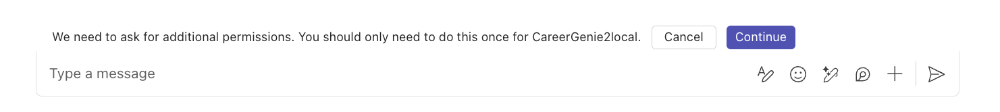

# B5 - Add actions to handle complex tasks

???+ info "Navigating the Build your own copilot labs (Build Path)"
    - [Lab B0 - Prerequisites](/copilot-camp/pages/custom-engine/00-prerequisites) 
    - [Lab B1 - Build a custom engine copilot using Azure OpenAI and Teams Toolkit](/copilot-camp/pages/custom-engine/01-custom-engine-copilot)
    - [Lab B2 - Index your data in Azure AI Search and bring it into your custom engine copilot](/copilot-camp/pages/custom-engine/02-rag)
    - [Lab B3 - Enhance user experience with the Powered by AI kit](/copilot-camp/pages/custom-engine/03-powered-by-ai)
    - [Lab B4 - Secure your solution using authentication](/copilot-camp/pages/custom-engine/04-authentication)
    - [Lab B5 - Add actions to handle complex tasks](/copilot-camp/pages/custom-engine/05-actions)(📍 You are here)

In this lab you will:

- Learn what actions are and how to handle complex tasks with them
- Integrate multi-prompt in your custom engine copilot to handle actions
- Implement actions in your custom engine copilot
- Utilize Microsoft Graph and actions together to automate workflows

## Introduction

It's time to add some actions for Career Genie to handle complex tasks and workflows! In this lab, you'll integrate a new prompt in Career Genie's logic that can handle lists of candidates. That basically means that when you are searching for candidates with Career Genie, you can also create lists for candidates and add their names in. Once you are done, you can also send these lists to HR for scheduling interviews. All these will be handled by actions you'll implement in Career Genie! Let's get started.

???+ info "What are actions in Custom engine copilots?"
    An action in an AI system is like a basic function or method in your code—it's a specific task that the system can perform. Actions are the building blocks that the AI uses to accomplish various tasks based on the user’s input. The AI system decides which action to execute depending on what the user asks for.

    For example, actions could include:

    * Creating a new list.

    * Remove a list.
    
    * Adding items to an existing list.
    
    * Remove items from an existing list.

    When a user interacts with the AI system, the system interprets the prompt and selects the appropriate actions to carry out. It’s like having a toolbox of functions, and the AI picks the right tool for the job based on the user’s needs.

## Exercise 1: Create a new prompt with actions

In this exercise, you'll create a new prompt in "prompts" folder to handle actions.

### Step 1: Create a "monologue" prompt

In your project go to `src/prompts/` and add a new folder with a name **monologue**. In `src/prompts/monologue/` folder, create a new file with a name **config.json** and copy the following code snippet in the file:

```json
{
  "schema": 1.1,
  "description": "A bot that can chat with users",
  "type": "completion",
  "completion": {
    "completion_type": "chat",
    "include_history": true,
    "include_input": true,
    "max_input_tokens": 2800,
    "max_tokens": 1000,
    "temperature": 0.9,
    "top_p": 0.0,
    "presence_penalty": 0.6,
    "frequency_penalty": 0.0
  },
  "augmentation": {
      "augmentation_type": "monologue"
  }
}
```

!!! tip "Brief intro about `augmentation` in config.json"
    Augmentations help simplify prompt engineering by automatically adding specific instructions to your prompts. With augmentations, you can configure whether you want the AI to handle multi-step tasks (sequence) or think through its actions step by step (monologue).

In `src/prompts/monologue/` folder, create a new file with a name **skprompt.txt** and copy the following text in the file:

```
You are a career specialist named "Career Genie" that helps Human Resources team who can manage lists of Candidates. 
You are friendly and professional. You like using emojis where appropriate.
Always share the lists in bullet points.

rules:
- only create lists the user has explicitly asked to create.
- only add Candidates to a list that the user has asked to have added.
- if multiple lists are being manipulated, call a separate action for each list.
- if Candidates are being added and removed from a list, call a separate action for each operation.
- if user asks for a summary, share all the lists and candidates. 
- only send an email to HR if user has explicitly asked to send.

Current lists:
{{$conversation.lists}}
```

In `src/prompts/monologue/` folder, create a new file with a name **actions.json** and copy the following code snippet in the file:

```json
[
    {
        "name": "createList",
        "description": "Creates a new list with an optional set of initial Candidates",
        "parameters": {
            "type": "object",
            "properties": {
                "list": {
                    "type": "string",
                    "description": "The name of the list to create"
                },
                "Candidates": {
                    "type": "array",
                    "description": "The Candidates to add to the list",
                    "Candidates": {
                        "type": "string"
                    }
                }
            },
            "required": [
                "list"
            ]
        }
    },
    {
        "name": "deleteList",
        "description": "Deletes a list",
        "parameters": {
            "type": "object",
            "properties": {
                "list": {
                    "type": "string",
                    "description": "The name of the list to delete"
                }
            },
            "required": [
                "list"
            ]
        }
    },
    {
        "name": "addCandidates",
        "description": "Adds one or more Candidates to a list",
        "parameters": {
            "type": "object",
            "properties": {
                "list": {
                    "type": "string",
                    "description": "The name of the list to add the item to"
                },
                "Candidates": {
                    "type": "array",
                    "description": "The Candidates to add to the list",
                    "Candidates": {
                        "type": "string"
                    }
                }
            },
            "required": [
                "list",
                "Candidates"
            ]
        }
    },
    {
        "name": "removeCandidates",
        "description": "Removes one or more Candidates from a list",
        "parameters": {
            "type": "object",
            "properties": {
                "list": {
                    "type": "string",
                    "description": "The name of the list to remove the item from"
                },
                "Candidates": {
                    "type": "array",
                    "description": "The Candidates to remove from the list",
                    "Candidates": {
                        "type": "string"
                    }
                }
            },
            "required": [
                "list",
                "Candidates"
            ]
        }
    }
]
```

## Exercise 2: Implement a logic in the planner to choose between prompts

In this exercise, you'll write a function that checks the user prompt and decides between "chat" or "monologue" prompts.

### Step 1: Create a function for `defaultPrompt` in the planner

In your project, go to `src/app/app.ts` file, and add the following function in your project:

```javascript
async function choosePrompt(context){
  if (context.activity.text.includes('list')){
    const template = await prompts.getPrompt('monologue');
    return template;
  }
  else {
    const template = await prompts.getPrompt('chat');
    const skprompt = fs.readFileSync(path.join(__dirname, '..', 'prompts', 'chat', 'skprompt.txt'));

    const dataSources = (template.config.completion as any)['data_sources'];

    dataSources.forEach((dataSource: any) => {
      if (dataSource.type === 'azure_search') {
        dataSource.parameters.authentication.key = config.azureSearchKey;
        dataSource.parameters.endpoint = config.azureSearchEndpoint;
        dataSource.parameters.indexName = config.indexName;
        dataSource.parameters.embedding_dependency.deployment_name =
          config.azureOpenAIEmbeddingDeploymentName;
        dataSource.parameters.role_information = `${skprompt.toString('utf-8')}`;
      }
    });

    return template;
  }
}
```

!!! tip "Review `choosePrompt` function"
    Recognize that the choosePrompt function checks if user prompt includes "list". If yes, then it returns **monologue** prompt, if no, then it returns the **chat** that is currently our default prompt.

In `src/app/app.ts` file, find the `planner` and remove the code assigned to the **defaultPrompt**. Then, define `choosePrompt` function as the **defaultPrompt**. The final version of the planner will look like below:

```javascript
const planner = new ActionPlanner({
  model,
  prompts,
  defaultPrompt: choosePrompt,
});
```

## Exercise 3: Implement actions in the app

In this exercise, you'll create functions for your actions and register the action handlers in the app.

### Step 1: Add `ConversationState` and define functions for each action

In your project, go to `src/app/` and create a new file with a name **state.ts** and add the following source code for the "ConversationState":

```javascript
import { TurnState, DefaultConversationState } from "@microsoft/teams-ai";

// Strongly type the applications turn state
interface ConversationState extends DefaultConversationState {
  lists: Record<string, string[]>;
}
export type ApplicationTurnState = TurnState<ConversationState>;
```

In `src/app/`, create another file with a name **actions.ts** and add the following source code to define functions for the actions:

```javascript
import { ApplicationTurnState } from "./state";

function getCandidates(state: ApplicationTurnState, list: string): string[] {
    ensureListExists(state, list);
    return state.conversation.lists[list];
}
  
function setCandidates(state: ApplicationTurnState, list: string, Candidates: string[]): void {
ensureListExists(state, list);
state.conversation.lists[list] = Candidates ?? [];
}

function ensureListExists(state: ApplicationTurnState, listName: string): void {
if (typeof state.conversation.lists != 'object') {
    state.conversation.lists = {};
}

if (!Object.prototype.hasOwnProperty.call(state.conversation.lists, listName)) {
    state.conversation.lists[listName] = [];
}
}
  
function deleteList(state: ApplicationTurnState, listName: string): void {
if (
    typeof state.conversation.lists == 'object' &&
    Object.prototype.hasOwnProperty.call(state.conversation.lists, listName)
) {
    delete state.conversation.lists[listName];
}
}

export { getCandidates, setCandidates, ensureListExists, deleteList };
```

### Step 2: Register action handlers in the app

In`src/app/app.ts`, add the following code on top of the file to import the action functions:

```javascript
import { ensureListExists, getCandidates, setCandidates, deleteList } from "./actions";
```

Then add the following code snippet in the `src/app/app.ts` to register action handlers in the AI System:

```javascript
// Register action handlers
interface ListOnly {
  list: string;
}

interface ListAndCandidates extends ListOnly {
  Candidates?: string[];
}

app.ai.action('createList', async (context: TurnContext, state: ApplicationTurnState, parameters: ListAndCandidates) => {
  ensureListExists(state, parameters.list);
  if (Array.isArray(parameters.Candidates) && parameters.Candidates.length > 0) {
      await app.ai.doAction(context, state, 'addCandidates', parameters);
      return `List created and Candidates added. Summarize your action.`;
  } else {
      return `List created. Summarize your action.`;
  }
});

app.ai.action('deleteList', async (context: TurnContext, state: ApplicationTurnState, parameters: ListOnly) => {
  deleteList(state, parameters.list);
  return `list deleted. Summarize your action.`;
});

app.ai.action('addCandidates', async (context: TurnContext, state: ApplicationTurnState, parameters: ListAndCandidates) => {
  const Candidates = getCandidates(state, parameters.list);
  Candidates.push(...(parameters.Candidates ?? []));
  setCandidates(state, parameters.list, Candidates);
  return `Candidates added. Summarize your action.`;
});

app.ai.action('removeCandidates', async (context: TurnContext, state: ApplicationTurnState, parameters: ListAndCandidates) => {
  const Candidates = getCandidates(state, parameters.list);
  (parameters.Candidates ?? []).forEach((candidate: string) => {
      const index = Candidates.indexOf(candidate);
      if (index >= 0) {
          Candidates.splice(index, 1);
      }
  });
  setCandidates(state, parameters.list, Candidates);
  return `Candidates removed. Summarize your action.`;
});

```

### Step 3: Test your app with the new actions

Let's test Career Genie with the new actions. Start debugging your app by selecting **Run and Debug** tab on Visual Studio Code and **Debug in Teams (Edge)** or **Debug in Teams (Chrome)**. Microsoft Teams will pop up on your browser. Once your app details show up on Teams, select **Add** and start chatting with your app.

To understand how to flow works, you may ask the following questions in order:

- Hello
- Can you suggest candidates who have experience in .NET?
- Great, add Isaac Talbot in the .NET Developer Candidates list
- Add Anthony Ivanov in the same list with Isaac
- Can you summarize my lists
- Suggest candidates who have experience in Python and are able to speak Spanish
- Nice! Add Sara Folgueroles in the Python Developer Candidates (Spanish speaking) list
- Can you suggest candidates who have 10+ years of experience
- Ok, remove Anthony from the .NET Developer Candidates list
- Add Anthony Ivanov in the Talent list
- Summarize my lists


## Exercise 4: Utilize actions together with the Microsoft Graph to automate workflows

In this exercise, you'll implement a new action that utilizes Microsoft Graph to send the candidates lists to the HR for scheduling interviews.

### Step 1: Define a new action in your prompt for sending emails

In your project, go to `src/prompts/monologue/actions.json` and add the following action:

```json
,
{
    "name": "sendLists",
    "description": "Send list of Candidates to Human Resources, aka HR for scheduling interviews",
    "parameters": {
        "type": "object",
        "properties": {
            "list": {
                "type": "string",
                "description": "The name of the list to send Human Resources, aka HR for scheduling interviews"
            },
            "Candidates": {
                "type": "array",
                "description": "The Candidates in the list to send Human Resources, aka HR for scheduling interviews",
                "Candidates": {
                    "type": "string"
                }
            }
        },
        "required": [
            "list",
            "Candidates"
        ]
    }
}
```

### Step 2: Create a new function for the new `sendLists` action

In your project, go to `src/app/app.ts`, locate the `getUserDisplayName` and add **export** in front of the function. The final version of the function will look like below:

```javascript
export const getUserDisplayName = async (token) => {
...
...
...
}
```

Locate `app` in the `src/app/app.ts` and update the scope with **'Mail.Send'**. The final version of the app will look like below:

```javascript
const app = new Application({
  storage,
  authentication: {settings: {
    graph: {
      scopes: ['User.Read', 'Mail.Send'],
        ...
        ...
    }
  }}});
```

Go to `src/app/actions.ts` and add the following import on top of the code:

```javascript
import {getUserDisplayName} from './app';
```

Then, add the following functions in the `actions.ts`:

```javascript
async function sendLists(state: ApplicationTurnState, token): Promise<string> {

    const email = await createEmailContent(state.conversation.lists, token);

    const sendEmail = await fetch(`https://graph.microsoft.com/v1.0/me/sendMail`,
        {
        "method": "POST",
        "headers": {
            "Accept": "application/json",
            "Content-Type": "application/json",
            "Authorization": `Bearer ${token}`
        },
        "body": JSON.stringify(email)
        });

        if(sendEmail.ok){
            return email.message.body.content;
        }
        else {
            console.log(`Error ${sendEmail.status} calling Graph in sendToHR: ${sendEmail.statusText}`);
            return 'Error sending email';
        }
}
   
async function createEmailContent(lists, token) {
let emailContent = '';
for (const listName in lists) {
    if (lists.hasOwnProperty(listName)) {
    emailContent += `${listName}:\n`;
    lists[listName].forEach(candidate => {
        emailContent += `  • ${candidate}\n`;
    });
    emailContent += '\n'; // Add an extra line between different lists
    }
}

const profileName = await getUserDisplayName(token);

const email ={
    "message": {
    "subject": "Request to Schedule Interviews with Shortlisted Candidates",
    "body": {
        "contentType": "Text",
        "content": `Hello HR Team, \nI hope this email finds you well. \n\nCould you please assist in scheduling 1:1 interviews with the following shortlisted candidates? \n\n${emailContent} Please arrange suitable times and send out the calendar invites accordingly. \n\n Best Regards, \n ${profileName}`
    },
    "toRecipients": [
        {
        "emailAddress": {
            "address": "<YOUR-EMAIL-ADDRESS>"
        }
        }
    ]
    },
    "saveToSentCandidates": "true"
};
return await email;
}
```

Make sure to replace `<YOUR-EMAIL-ADDRESS>` with your email address in the email's **toRecipients** section.

Update the export of `actions.ts` and add **sendLists** in the list. The final version of the export will look like below:

```javascript
export { getCandidates, setCandidates, ensureListExists, deleteList, sendLists };
```

### Step 3: Register `sendLists` action handler

Go to `src/app/app.ts` and update the `./actions` import with the **sendLists** function. The final version of the import will look as below:

```javascript
import { ensureListExists, getCandidates, setCandidates, deleteList, sendLists } from "./actions";
```

Then, add the following code snippet to register `sendLists` action in the AI System:

```javascript
app.ai.action('sendLists', async (context: TurnContext, state: ApplicationTurnState, parameters: ListAndCandidates) => {
  await sendLists(state, state.temp.authTokens['graph']);
  return `Email sent to HR. Summarize your action.`;
});
```

### Step 4: Test your app and the new `sendLists` action

Let's test Career Genie with the new **sendLists** actions. Start debugging your app by selecting **Run and Debug** tab on Visual Studio Code and **Debug in Teams (Edge)** or **Debug in Teams (Chrome)**. Microsoft Teams will pop up on your browser. Once your app details show up on Teams, select **Add** and start chatting with your app.

To start a conversation with Career Genie, simply type a message. For example, you can begin with 'Hi'.

!!! tip " Make sure `Pop up` is not blocked by browser for a smoother experience for below instructions."

You will see a small dialog box for the additional permissions with ‘Cancel’ and ‘Continue’ buttons. This dialog is for logging in and giving your consent to the required permissions. Select **Continue**. 



Since you're running locally with Developer Tunnels, you'll see a warning screen, select **Continue**. Users won't see this when your app is deployed. You'll be redirected to login and consent to the app's permissions.

!!! tip "If you're a Microsoft 365 administrator, you will also be given the option to "Consent on behalf of your organization" which will consent for every user in your tenant."

Select **Accept** to consent to the permissions.

You will now get this message from the Career Genie with your logged in name showing successful authentication. Now, you can start testing the new action in Career Genie!

To understand how to flow works, you may ask the following questions in order:

- Hello
- Can you suggest candidates who have experience in .NET?
- Great, add Isaac Talbot in the .NET Developer Candidates list
- Add Anthony Ivanov in the same list with Isaac
- Can you summarize my lists
- Suggest candidates who have experience in Python and are able to speak Spanish
- Nice! Add Sara Folgueroles in the Python Developer Candidates (Spanish speaking) list
- Can you suggest candidates who have 10+ years of experience
- Ok, remove Anthony from the .NET Developer Candidates list
- Add Anthony Ivanov in the Talent list
- Summarize my lists
- Add Pedro Armijo in the same list with Sara
- Summarize my lists
- Send my lists to HR

!!! tip "Check your mailbox"
    After the last step, check your mailbox to see if you receive any email for the lists of candidates. In an ideal scenario, this email will be received by the Career Genie HR Team. Only for testing purposes, you are using your email address.


## CONGRATULATIONS

You have completed B5 - Add actions to handle complex tasks!  If you want explore further, the source code of this lab is available in the [Copilot Camp repo](https://github.com/microsoft/copilot-camp/tree/main/src/custom-engine-copilot/Lab05-Actions/CareerGenie).

This is the end of the **Build your own copilot** path! Did you enjoy building Career Genie? Let us know about your experience and feedback. 💜