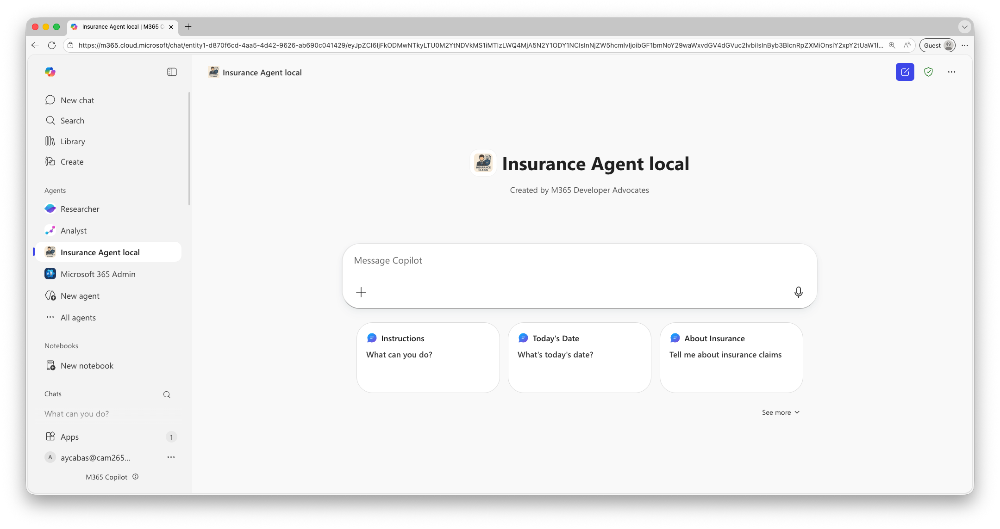
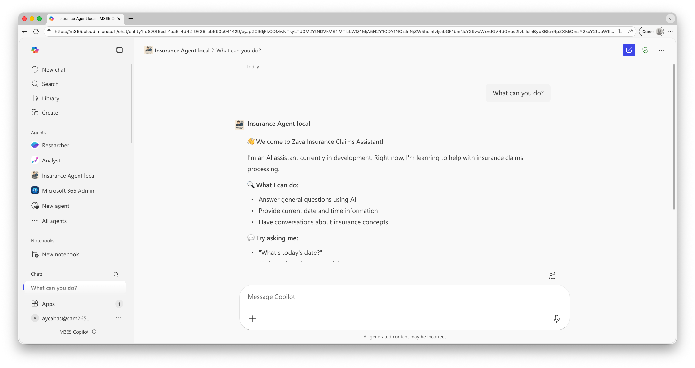

# Lab BAF1 - Build and Run Your First Agent

In this lab, you'll build and run a custom engine agent using the **Microsoft 365 Agents SDK** with the **Agent Framework**. You'll explore the starter project, understand the core components, and see your agent come to life in Microsoft 365 Copilot.

The Zava Insurance Agent is designed to help insurance adjusters streamline claims processing. In this initial lab, you'll start with a basic conversational agent that can greet users and provide information using AI-powered responses.

???+ info "What are the Microsoft 365 Agents SDK and Agent Framework?"
    **Microsoft 365 Agents SDK** provides the container and scaffolding to deploy agents across Microsoft 365 channels (Teams, Copilot, etc.), handling activities, events, and communication. It's AI-agnostic, allowing you to use any AI services you choose.
    
    **Agent Framework** is an open-source development kit for building AI agents with LLMs, tool calling, and multi-agent workflows. It's the successor to Semantic Kernel and AutoGen, providing the AI capabilities and agent logic.
    
    Together, they allow you to build intelligent agents with the Agent Framework and deploy them to Microsoft 365 using the Agents SDK.

## Exercise 1: Clone and Explore the Project

In this exercise, you'll clone the Copilot Camp repository and explore the starter project structure to understand how the agent is organized.

### Step 1: Clone the Repository

Let's start by cloning the Copilot Camp repository and navigating to the Agent Framework starter project.

1️⃣ Open a terminal or command prompt.

2️⃣ Clone the repository:

```bash
git clone https://github.com/microsoft/copilot-camp.git
cd copilot-camp/src/agent-framework/begin
```

3️⃣ Open the project in Visual Studio Code:

```bash
code .
```

<cc-end-step lab="baf1" exercise="1" step="1" />

### Step 2: Explore the Project Structure

Let's understand the organization of the agent project.

1️⃣ In Visual Studio Code, expand the folders in the Explorer view. You should see this structure:

```
begin/
├── src/
│   ├── Agent/
│   │   └── ZavaInsuranceAgent.cs       # Main agent implementation
│   ├── Plugins/                        # Custom plugins (tools) for the agent
│   │   ├── StartConversationPlugin.cs  # Welcome message plugin
│   │   └── DateTimeFunctionTool.cs     # Date/time utility
├── appPackage/                         # Teams app manifest and icons
├── env/                                # Environment configuration files (API keys, endpoints)
├── infra/                              # All required scripts, data and templates for the agent's infrastructure
├── Program.cs                          # Application entry point - configures services and starts web app
├── InsuranceAgent.csproj               # Project file
└── m365agents.local.yml                # M365 Agents provisioning config
```

<cc-end-step lab="baf1" exercise="1" step="2" />

### Step 3: Understand the Agent Implementation

Let's examine the main agent file to understand how it works.

1️⃣ Open `src/Agent/ZavaInsuranceAgent.cs` in Visual Studio Code.

2️⃣ Find the `AgentInstructions` property near the top of the class. Notice how these instructions act as the **system prompt** for the AI model:

- It defines the agent's role: "You are a professional insurance claims assistant for Zava Insurance..."
- It lists available tools using the `{{PluginName.FunctionName}}` syntax
- It includes `{{StartConversationPlugin.StartConversation}}` and `{{DateTimeFunctionTool.getDate}}`

These instructions tell the AI how to behave and what tools it can use.

3️⃣ Scroll down and find the **constructor** method `ZavaInsuranceAgent(...)`. Notice it sets up event handlers:

- `OnConversationUpdate(ConversationUpdateEvents.MembersAdded, WelcomeMessageAsync)` - sends a welcome message when a user joins
- `OnActivity(ActivityTypes.Message, OnMessageAsync)` - handles incoming messages

4️⃣ Find the `GetClientAgent` method. Look for where it creates `toolOptions` and registers plugins:

- It creates a `ChatOptions` object with a `Tools` list
- It adds `startConversationPlugin.StartConversation` using `AIFunctionFactory.Create`
- It adds `DateTimeFunctionTool.getDate` the same way

This is where we register **plugins** (tools) that the AI can call during conversations.

<cc-end-step lab="baf1" exercise="1" step="3" />

### Step 4: Explore the Plugins

Now let's look at how plugins work.

1️⃣ Open `src/Plugins/StartConversationPlugin.cs`.

2️⃣ Notice the plugin structure:

```csharp
public class StartConversationPlugin
{
    [Description("Starts a new conversation suggesting a conversation flow.")]
    public async Task<string> StartConversation()
    {
        var welcomeMessage = "👋 Welcome to Zava Insurance Claims Assistant!...";
        return welcomeMessage;
    }
}
```

Key points:

- The `[Description]` attribute tells the AI **when to use this tool**
- The method returns a formatted welcome message
- It's a simple plugin with no parameters

3️⃣ Open `src/Plugins/DateTimeFunctionTool.cs`.

4️⃣ Notice how it provides current date/time:

- It has a `[Description]` that says "Gets the current date and time"
- The `getDate()` method is static and returns `DateTime.Now` as a formatted string

This plugin demonstrates how the agent can access system information to answer user queries.

<cc-end-step lab="baf1" exercise="1" step="4" />

### Step 5: View the App Manifest and Conversation Starters

Let's check the app manifest to see how your agent appears in Microsoft 365 Copilot.

1️⃣ Open `appPackage/manifest.json`.

2️⃣ Find the `name` section to see your agent's display name:

```json
"name": {
    "short": "Zava Insurance Agent",
    "full": "Zava Insurance Claims Assistant"
}
```

3️⃣ Scroll down to the `conversationStarters` array. These are the suggested prompts users see when they first interact with your agent:

```json
"conversationStarters": [
    {
        "title": "Instructions",
        "description": "What can you do?"
    },
    {
        "title": "Today's Date",
        "description": "What's today's date?"
    },
    {
        "title": "About Insurance",
        "description": "Tell me about insurance claims"
    },
    {
        "title": "Claims Process",
        "description": "Explain how claims processing works"
    }
]
```

These conversation starters help guide users on how to interact with your agent. You can customize these to match your agent's capabilities.

4️⃣ Notice the `copilotAgents.declarativeAgent` section that defines your agent as a custom engine agent with specific capabilities.

<cc-end-step lab="baf1" exercise="1" step="5" />

### Step 6: Review the Application Entry Point

Let's see how everything comes together in Program.cs.

1️⃣ Open `Program.cs`.

2️⃣ Key sections to understand:

**Configuration Loading**: Find the section where `builder.Configuration` loads settings. Notice it loads from multiple sources:

- `.env` files for environment-specific settings using `AddEnvFile`
- User secrets for sensitive data (API keys) using `AddUserSecrets`
- Environment variables using `AddEnvironmentVariables`

**Service Registration**: Find where services are registered with `builder.Services`. Notice:

- `AddSingleton<IStorage, MemoryStorage>()` - registers memory storage for conversation state
- `AddAgentApplicationOptions()` - registers agent configuration
- `AddAgent<ZavaInsuranceAgent>()` - registers the agent itself as a service

**Chat Client Configuration**: Find where `IChatClient` is registered as a singleton. Observe how it:

- Retrieves the endpoint, API key, and deployment name from configuration
- Creates an `AzureOpenAIClient` with the endpoint and credentials
- Returns a chat client for the specified deployment (gpt-4.1)

This creates the connection to Azure OpenAI, which powers the agent's AI capabilities.

<cc-end-step lab="baf1" exercise="1" step="6" />

## Exercise 2: Configure the Agent

Before running the agent, you need to configure it with your Azure AI credentials.

### Step 1: Configure Environment Files

The agent uses environment files to store configuration. Let's set them up.

1️⃣ In Visual Studio Code, navigate to the `env/` folder.

2️⃣ You should see two sample files:

- `.env.local.sample`
- `.env.local.user.sample`

3️⃣ Copy `.env.local.sample` to `.env.local`:

**Windows PowerShell:**
```powershell
Copy-Item env/.env.local.sample env/.env.local
```

**macOS/Linux:**
```bash
cp env/.env.local.sample env/.env.local
```

4️⃣ Copy `.env.local.user.sample` to `.env.local.user`:

**Windows PowerShell:**
```powershell
Copy-Item env/.env.local.user.sample env/.env.local.user
```

**macOS/Linux:**
```bash
cp env/.env.local.user.sample env/.env.local.user
```

<cc-end-step lab="baf1" exercise="2" step="1" />

### Step 2: Add Your Azure AI Credentials

Now let's configure the agent to use your Microsoft Foundry deployment.

1️⃣ Open `env/.env.local` in Visual Studio Code.

2️⃣ Find the `MODELS_ENDPOINT` variable and update it with your Azure AI endpoint from Lab BAF0:

```bash
MODELS_ENDPOINT=https://your-resource.services.ai.azure.com/
```

!!! tip "Finding Your Endpoint"
    If you don't remember your endpoint:

    1. Go to [Microsoft Foundry](https://ai.azure.com)
    2. Select your project
    3. Go to **Settings** → **Properties**
    4. Copy the **Endpoint** URL

3️⃣ Open `env/.env.local.user` in Visual Studio Code.

4️⃣ Find the `SECRET_MODELS_API_KEY` variable and update it with your API key:

```bash
SECRET_MODELS_API_KEY=your-api-key-here
```

!!! warning "Keep Your API Key Secret"
    The `.env.local.user` file contains sensitive information and is already included in `.gitignore`. Never commit this file to source control!

<cc-end-step lab="baf1" exercise="2" step="2" />

### Step 3: Sign in to Microsoft 365 and Azure

The Microsoft 365 Agents Toolkit needs to authenticate with both Microsoft 365 and Azure.

1️⃣ In Visual Studio Code, click on the **Microsoft 365 Agents Toolkit** icon in the Activity Bar (left side).

2️⃣ In the toolkit panel, find the **ACCOUNTS** section.

3️⃣ Click **Sign in to Microsoft 365** and complete the sign-in flow.

4️⃣ Click **Sign in to Azure** and complete the sign-in flow.

!!! note "First Time Sign-In"
    The first time you sign in, you may need to grant permissions to the Microsoft 365 Agents Toolkit extension.

<cc-end-step lab="baf1" exercise="2" step="3" />

## Exercise 3: Run and Test the Agent

Now it's time to run the agent and see it in action!

### Step 1: Start the Agent

Let's run the agent using the F5 debug experience.

1️⃣ In Visual Studio Code, press **F5** or select **Run → Start Debugging** from the menu.

2️⃣ When prompted to select a debug target, choose **(Preview) Debug in Copilot (Edge)**.

!!! tip "Debug Target Options"
    You may see multiple options like "Debug in Teams (Edge)", "Debug in Teams (Chrome)", etc. Make sure to select **(Preview) Debug in Copilot (Edge)** to test your agent in Microsoft 365 Copilot.

3️⃣ The first time you run the agent, the Microsoft 365 Agents Toolkit will:

- Prompt you to select an **Azure subscription**
- Ask you to create a new **resource group** or select existing one
- Select a **region** for your resources (choose one close to your Microsoft Foundry project)
- Provision Azure resources (Azure Bot Service, App Registration)

This provisioning process usually takes 2-3 minutes.

!!! tip "Provisioning Azure Resources"
    During first run, the toolkit creates:

    - **Azure Bot Service** - Handles message routing
    - **App Registration** - Manages authentication
    - **Dev Tunnel** - Creates a secure tunnel to your local machine

4️⃣ Watch the **Terminal** output in Visual Studio Code. You should see:

```
🌍 Environment: local
🏢 Starting Zava Insurance Agent...
🤖 Main agent using model: gpt-4.1
✅ Agent initialized successfully!
```

5️⃣ A browser window will open with Microsoft 365 Copilot.

6️⃣ You'll see an **install dialog** for the Zava Insurance Agent. Click **Add**.

7️⃣ After installation, click **Open in Copilot** or **Chat**.

<cc-end-step lab="baf1" exercise="3" step="1" />

### Step 2: Test Basic Conversations

Now let's interact with your agent!

1️⃣ In Microsoft 365 Copilot, you should see your agent with conversation starters in your chat window.



2️⃣ Select "What can you do?" to see the welcome message:



3️⃣ Try asking: **"What's today's date?"**

The agent should call the `DateTimeFunctionTool` and return the current date and time.

4️⃣ Try asking: **"What can you do?"** or **"Start over"**

The agent should call the `StartConversationPlugin` and show the welcome message again.

5️⃣ Try a general question: **"Tell me about insurance claims"**

The agent should use its AI knowledge to provide a helpful explanation about insurance claims.

6️⃣ Try something outside its scope: **"What's the weather today?"**

The agent should politely indicate that this is outside its scope as an insurance assistant.

<cc-end-step lab="baf1" exercise="3" step="2" />

### Step 3: Check the Debug Output

1️⃣ Return to Visual Studio Code and check the **Debug Console**.

2️⃣ Notice logs showing plugin calls, AI responses, and message processing in real-time.

<cc-end-step lab="baf1" exercise="3" step="3" />

## Exercise 4: Customize Your Agent

Let's make a simple modification to personalize the agent.

### Step 1: Update the Welcome Message

1️⃣ Stop the debugger (press Shift+F5).

2️⃣ Open `src/Plugins/StartConversationPlugin.cs` and find the `welcomeMessage` variable.

3️⃣ Add your name to the first line: `"👋 Welcome! I'm [Your Name]'s Agent!\n\n"`

4️⃣ Save, press **F5** to restart, and type **"start over"** in Copilot to see your change.

<cc-end-step lab="baf1" exercise="4" step="1" />

---8<--- "b-congratulations.md"

You have completed Lab BAF1 - Build and Run Your First Agent!

You've learned how to:

- ✅ Clone and explore an Agent Framework project
- ✅ Configure the agent with Azure AI credentials
- ✅ Run and debug the agent locally
- ✅ Test the agent in Microsoft 365 Copilot
- ✅ Understand the core components (Agent, Plugins, Instructions)
- ✅ Make simple modifications to customize behavior

In the next lab, you'll add more powerful capabilities by integrating document search with Azure AI Search and gpt-4.1!

<cc-next url="../02-add-claim-search" />


