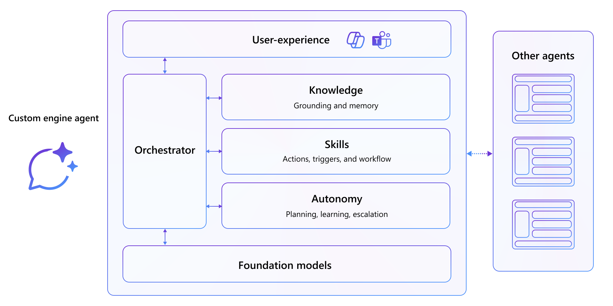

# Build Custom Engine Agents

**Custom engine agents** are a type of agent for Microsoft 365 Copilot that give you full control. Unlike declarative agents, which rely on Microsoft 365 Copilot's model and orchestration, custom engine agents let you bring your own foundation model, orchestrator, and security stack. This approach is ideal when you need to tailor the agent's behavior, data access, or reasoning logic to fit specific requirements or infrastructure.

## What you're going to do

In the Build Path of the Copilot Developer Camp, you will dive deeper into building custom engine agents that integrate with Microsoft 365 Copilot and/or Microsoft Teams.

You’ll choose between two hands-on exercises based on your preferred development experience:

* Create a cross-channel custom engine agent using C#, the **Microsoft 365 Agents SDK**, and Semantic Kernel. This option supports Microsoft Teams, Microsoft 365 Copilot, and external channels, offering full control over the orchestration layer.
* Create a custom engine agent using TypeScript and the **Teams AI Library**. This option is optimized for Microsoft Teams and provides a streamlined orchestration experience handled by the library behind the scenes.

---

---8<--- "b-labs-branches.md"

