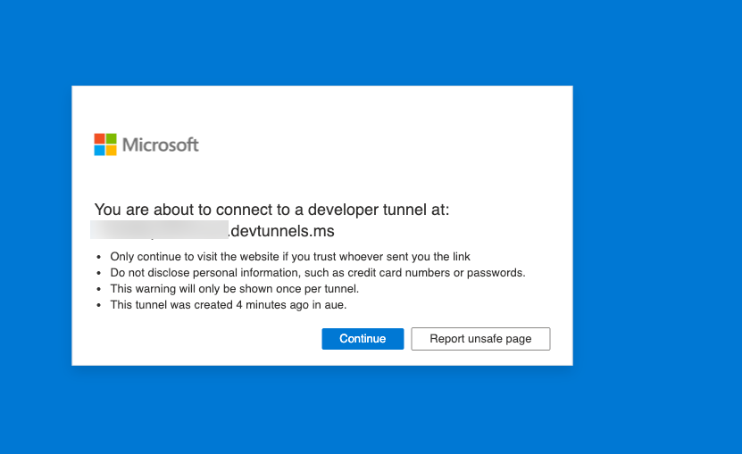

# BTA4 - Add single sign on authentication

In this lab, you'll learn how to authenticate users with Entra Single Sign-On in Career Genie, and to call the Microsoft Graph API using the token to get logged in user information.

In this lab you will learn to:

- Add Entra ID single sign-on (SSO) in your app, so users can seamlessly log into your app with the same account they use in Microsoft Teams
- Use Teams AI library and Bot Framework to implement the single sign on.
- Acquire and use tokens for app users to enhance security and user experience.


<div class="lab-intro-video">
    <div style="flex: 1; min-width: 0;">
        <iframe  src="//www.youtube.com/embed/5oyftU9PRpM" frameborder="0" allowfullscreen style="width: 100%; aspect-ratio: 16/9;">          
        </iframe>
          <div>Get a quick overview of the lab in this video.</div>
    </div>
    <div style="flex: 1; min-width: 0;">
        ---8<--- "b-labs-prelude.md"
    </div>
</div>

## Introduction

Get ready to enhance your CareerGenie by integrating Entra ID (formerly Azure AD) single sign-on (SSO). This will allow your app to seamlessly acquire tokens for accessing Microsoft 365 data via Microsoft Graph, ensuring smooth authentication and authorization. You'll be incorporating this SSO capability using the Teams AI library and the Bot Framework, specifically focusing on a multi-tenant configuration.

## Exercise 1: Set up your project for Entra ID Single Sign-on

Applications secured with Entra ID must be registered and granted permission. M365 Agents Toolkit will do this work for you, but you have to update your project to make that happen. In this exercise, you'll modify the M365 Agents Toolkit project files to provision your app registration in Entra ID.

In this exercise, use the [source code for Lab B3](https://github.com/microsoft/copilot-camp/tree/main/src/custom-engine-agent/Lab03-Powered-by-AI/CareerGenie){target=_blank} as the base project and proceed to next steps.

### Step 1: Add an Entra ID App manifest file to define the Entra ID Application

In this step, you'll add a file that defines the application that M365 Agents Toolkit will register for your application in Entra ID. This manifest file allows you to customize various aspects of your application registration. For example, this one sets up `User.Read` permission on the Microsoft Graph API so your app can read the user's profile.

Create a file **aad.manifest.json** in the root of your project folder, and paste in this JSON:

```JSON
{
    "id": "${{AAD_APP_OBJECT_ID}}",
    "appId": "${{AAD_APP_CLIENT_ID}}",
    "name": "CareerGenieBot-aad",
    "accessTokenAcceptedVersion": 2,
    "signInAudience": "AzureADMultipleOrgs",
    "optionalClaims": {
        "idToken": [],
        "accessToken": [
            {
                "name": "idtyp",
                "source": null,
                "essential": false,
                "additionalProperties": []
            }
        ],
        "saml2Token": []
    },
    "requiredResourceAccess": [
        {
            "resourceAppId": "Microsoft Graph",
            "resourceAccess": [
                {
                    "id": "User.Read",
                    "type": "Scope"
                }
            ]
        }
    ],
    "oauth2Permissions": [
        {
            "adminConsentDescription": "Allows Teams to call the app's web APIs as the current user.",
            "adminConsentDisplayName": "Teams can access app's web APIs",
            "id": "${{AAD_APP_ACCESS_AS_USER_PERMISSION_ID}}",
            "isEnabled": true,
            "type": "User",
            "userConsentDescription": "Enable Teams to call this app's web APIs with the same rights that you have",
            "userConsentDisplayName": "Teams can access app's web APIs and make requests on your behalf",
            "value": "access_as_user"
        }
    ],
    "preAuthorizedApplications": [
        {
            "appId": "1fec8e78-bce4-4aaf-ab1b-5451cc387264",
            "permissionIds": [
                "${{AAD_APP_ACCESS_AS_USER_PERMISSION_ID}}"
            ]
        },
        {
            "appId": "5e3ce6c0-2b1f-4285-8d4b-75ee78787346",
            "permissionIds": [
                "${{AAD_APP_ACCESS_AS_USER_PERMISSION_ID}}"
            ]
        },
        {
            "appId": "d3590ed6-52b3-4102-aeff-aad2292ab01c",
            "permissionIds": [
                "${{AAD_APP_ACCESS_AS_USER_PERMISSION_ID}}"
            ]
        },
        {
            "appId": "00000002-0000-0ff1-ce00-000000000000",
            "permissionIds": [
                "${{AAD_APP_ACCESS_AS_USER_PERMISSION_ID}}"
            ]
        },
        {
            "appId": "bc59ab01-8403-45c6-8796-ac3ef710b3e3",
            "permissionIds": [
                "${{AAD_APP_ACCESS_AS_USER_PERMISSION_ID}}"
            ]
        },
        {
            "appId": "0ec893e0-5785-4de6-99da-4ed124e5296c",
            "permissionIds": [
                "${{AAD_APP_ACCESS_AS_USER_PERMISSION_ID}}"
            ]
        },
        {
            "appId": "4765445b-32c6-49b0-83e6-1d93765276ca",
            "permissionIds": [
                "${{AAD_APP_ACCESS_AS_USER_PERMISSION_ID}}"
            ]
        },
        {
            "appId": "4345a7b9-9a63-4910-a426-35363201d503",
            "permissionIds": [
                "${{AAD_APP_ACCESS_AS_USER_PERMISSION_ID}}"
            ]
        }
    ],
    "identifierUris":[
        "api://botid-${{BOT_ID}}"
    ],
    "replyUrlsWithType":[
        {
          "url": "https://${{BOT_DOMAIN}}/auth-end.html",
          "type": "Web"
        }
    ]
}
```

<cc-end-step lab="bta4" exercise="1" step="1" />

### Step 2: Update M365 Agents Toolkit configuration file to create the Entra ID App

Open the `teamsapp.local.yml` file. This is a YAML file that defines the steps M365 Agents Toolkit takes to run your project. There are 3 steps in the "LIFECYCLE" section of the M365 Agents Toolkit user interface.

- Provision - In this phase, any infrastructure needed by your app is created. This includes things like the bot registration, the Teams app package, and, in this case, the Entra ID app registration

- Deploy - In this phase, the code is built and run locally, or uploaded to Azure for environments other than "local"

- Publish - In this phase, the app package is published to Microsoft Teams

To provision your Entra ID app, add these lines to **teamsapp.local.yml**. You can put them directly below the `provision`:

```yml
  - uses: aadApp/create # Creates a new Entra ID (AAD) app to authenticate users if the environment variable that stores clientId is empty
    with:
      name: CareerGenieBot-aad # Note: when you run aadApp/update, the AAD app name will be updated based on the definition in manifest. If you don't want to change the name, make sure the name in AAD manifest is the same with the name defined here.
      generateClientSecret: true # If the value is false, the action will not generate client secret for you
      signInAudience: "AzureADMultipleOrgs" # Authenticate users with a Microsoft work or school account in your organization's Entra ID tenant (for example, single tenant).
    writeToEnvironmentFile: # Write the information of created resources into environment file for the specified environment variable(s).
      clientId: AAD_APP_CLIENT_ID
      clientSecret: SECRET_AAD_APP_CLIENT_SECRET # Environment variable that starts with `SECRET_` will be stored to the .env.{envName}.user environment file
      objectId: AAD_APP_OBJECT_ID
      tenantId: AAD_APP_TENANT_ID
      authority: AAD_APP_OAUTH_AUTHORITY
      authorityHost: AAD_APP_OAUTH_AUTHORITY_HOST

```

And after `botFramework/create` add below to update the existing AAD app.

```yml
  - uses: aadApp/update # Apply the AAD manifest to an existing AAD app. Will use the object id in manifest file to determine which AAD app to update.
    with:
      manifestPath: ./aad.manifest.json # Relative path to teamsfx folder. Environment variables in manifest will be replaced before apply to AAD app
      outputFilePath: ./build/aad.manifest.${{TEAMSFX_ENV}}.json
```

!!! tip "Tip: YAML requires proper indentation"
    YAML requires proper indentation; each level in the object hierarchy must be indented to indicate the structure. 2 spaces (not tabs) is a good choice. Visual Studio Code will help you here, and will underline any syntax errors in red. You'll know you got it right when the red lines disappear!

Now scroll down and find the `file/createOrUpdateEnvironmentFile` directive in the deploy phase. Add these variables to the envs: collection, right below the ones you added in the previous lab:

```yml
 BOT_DOMAIN: ${{BOT_DOMAIN}}
 AAD_APP_CLIENT_ID: ${{AAD_APP_CLIENT_ID}}
 AAD_APP_CLIENT_SECRET: ${{SECRET_AAD_APP_CLIENT_SECRET}}
 AAD_APP_TENANT_ID: ${{AAD_APP_TENANT_ID}}
 AAD_APP_OAUTH_AUTHORITY_HOST: ${{AAD_APP_OAUTH_AUTHORITY_HOST}}
 AAD_APP_OAUTH_AUTHORITY: ${{AAD_APP_OAUTH_AUTHORITY}}
```

<cc-end-step lab="bta4" exercise="1" step="2" />

## Exercise 2: Add SSO in Teams app manifest

In this exercise, you'll update the Teams app manifest to add single sign on.

### Step 1: Update your Teams app manifest for SSO

In the single sign-on process, Teams will hand your code an Entra ID access token for your application. Teams can't provide this access token, however, unless it knows about your application; specifically, it needs to know the application (client) ID and the ID of the bot that's connected to Teams. So you need to add this information to your Teams app manifest.

Find the Teams app manifest template in **./appPackage/manifest.json** and add the following:

```json
 "webApplicationInfo": {
        "id": "${{BOT_ID}}",
        "resource": "api://botid-${{BOT_ID}}"
    }
```

Add it below the `validDomains` node, with a comma in between.

While we're here, we need to tell Teams to display web pages from your bot's domain, which allows access to the `auth-start.html` and `auth-end.html` pages used for user consent to call the Microsoft Graph. This only happens the first time a user accesses the custom engine agent.

So you need to add your bot's domain, **${{BOT_DOMAIN}}** to the `validDomains` array. After making these changes, the end of your `manifest.json` file should look like this:

```JSON
  "validDomains": [
        "${{BOT_DOMAIN}}",
        "*.botframework.com"
    ],
```

<cc-end-step lab="bta4" exercise="2" step="1" />

## Exercise 3: Update the application code for SSO

In this exercise, you'll modify the code to accommodate the SSO process.

### Step 1: Provide HTML pages for the consent dialog

The first time users access your application, they may need to consent to giving the app permission to read their profile information. This is performed by the Teams AI library. It will display a pop-up window; these HTML pages are to be displayed in that pop-up, and will redirect to Entra ID to do the actual consent.

> The code snippets for pop up for permission grant are from official [teams-ai library sample for Teams SSO](https://github.com/microsoft/teams-ai/tree/main/js/samples/05.authentication/d.teamsSSO-bot/src/public){target=_blank}.

Create a new folder called **public** inside the **src** folder of the project.

Create a file **auth-start.html** and paste in the contents below:

```html
<!--This file is used during the Teams Bot authentication flow to assist with retrieval of the access token.-->
<!--If you're not familiar with this, do not alter or remove this file from your project.-->
<html lang="en">

<head>
    <title>Login Start Page</title>
    <meta charset="utf-8" />
    <meta name="viewport" content="width=device-width, initial-scale=1" />
</head>

<body>
    <script type="text/javascript">
        popUpSignInWindow();

        async function popUpSignInWindow() {
            // Generate random state string and store it, so we can verify it in the callback
            let state = _guid();
            localStorage.setItem('state', state);
            localStorage.removeItem('codeVerifier');
            var currentURL = new URL(window.location);
            var clientId = currentURL.searchParams.get('clientId');
            var tenantId = currentURL.searchParams.get('tenantId');
            var loginHint = currentURL.searchParams.get('loginHint');
            var scope = currentURL.searchParams.get('scope');
            if (!loginHint) {
                loginHint = '';
            }
            var originalCode = _guid();
            var codeChallenge = await pkceChallengeFromVerifier(originalCode);
            localStorage.setItem('codeVerifier', originalCode);
            let queryParams = {
                client_id: clientId,
                response_type: 'code',
                response_mode: 'fragment',
                scope: scope,
                redirect_uri: window.location.origin + '/auth-end.html',
                nonce: _guid(),
                login_hint: loginHint,
                state: state,
                code_challenge: codeChallenge,
                code_challenge_method: 'S256'
            };
            let authorizeEndpoint = `https://login.microsoftonline.com/common/oauth2/v2.0/authorize?${toQueryString(queryParams)}`;     
            window.location.assign(authorizeEndpoint);
        }

        // Build query string from map of query parameter
        function toQueryString(queryParams) {
            let encodedQueryParams = [];
            for (let key in queryParams) {
                encodedQueryParams.push(key + '=' + encodeURIComponent(queryParams[key]));
            }
            return encodedQueryParams.join('&');
        }

        // Converts decimal to hex equivalent      
        function _decimalToHex(number) {
            var hex = number.toString(16);
            while (hex.length < 2) {
                hex = '0' + hex;
            }
            return hex;
        }

        // Generates RFC4122 version 4 guid (128 bits)
        function _guid() {
            // RFC4122: The version 4 UUID is meant for generating UUIDs from truly-random or
            // pseudo-random numbers.
            // The algorithm is as follows:
            //     Set the two most significant bits (bits 6 and 7) of the
            //        clock_seq_hi_and_reserved to zero and one, respectively.
            //     Set the four most significant bits (bits 12 through 15) of the
            //        time_hi_and_version field to the 4-bit version number from
            //        Section 4.1.3. Version4
            //     Set all the other bits to randomly (or pseudo-randomly) chosen
            //     values.
            // UUID                   = time-low "-" time-mid "-"time-high-and-version "-"clock-seq-reserved and low(2hexOctet)"-" node
            // time-low               = 4hexOctet
            // time-mid               = 2hexOctet
            // time-high-and-version  = 2hexOctet
            // clock-seq-and-reserved = hexOctet:
            // clock-seq-low          = hexOctet
            // node                   = 6hexOctet
            // Format: xxxxxxxx-xxxx-4xxx-yxxx-xxxxxxxxxxxx
            // y could be 1000, 1001, 1010, 1011 since most significant two bits needs to be 10
            // y values are 8, 9, A, B
            var cryptoObj = window.crypto || window.msCrypto; // for IE 11
            if (cryptoObj && cryptoObj.getRandomValues) {
                var buffer = new Uint8Array(16);
                cryptoObj.getRandomValues(buffer);
                //buffer[6] and buffer[7] represents the time_hi_and_version field. We will set the four most significant bits (4 through 7) of buffer[6] to represent decimal number 4 (UUID version number).
                buffer[6] |= 0x40; //buffer[6] | 01000000 will set the 6 bit to 1.
                buffer[6] &= 0x4f; //buffer[6] & 01001111 will set the 4, 5, and 7 bit to 0 such that bits 4-7 == 0100 = "4".
                //buffer[8] represents the clock_seq_hi_and_reserved field. We will set the two most significant bits (6 and 7) of the clock_seq_hi_and_reserved to zero and one, respectively.
                buffer[8] |= 0x80; //buffer[8] | 10000000 will set the 7 bit to 1.
                buffer[8] &= 0xbf; //buffer[8] & 10111111 will set the 6 bit to 0.
                return (
                    _decimalToHex(buffer[0]) +
                    _decimalToHex(buffer[1]) +
                    _decimalToHex(buffer[2]) +
                    _decimalToHex(buffer[3]) +
                    '-' +
                    _decimalToHex(buffer[4]) +
                    _decimalToHex(buffer[5]) +
                    '-' +
                    _decimalToHex(buffer[6]) +
                    _decimalToHex(buffer[7]) +
                    '-' +
                    _decimalToHex(buffer[8]) +
                    _decimalToHex(buffer[9]) +
                    '-' +
                    _decimalToHex(buffer[10]) +
                    _decimalToHex(buffer[11]) +
                    _decimalToHex(buffer[12]) +
                    _decimalToHex(buffer[13]) +
                    _decimalToHex(buffer[14]) +
                    _decimalToHex(buffer[15])
                );
            } else {
                var guidHolder = 'xxxxxxxx-xxxx-4xxx-yxxx-xxxxxxxxxxxx';
                var hex = '0123456789abcdef';
                var r = 0;
                var guidResponse = '';
                for (var i = 0; i < 36; i++) {
                    if (guidHolder[i] !== '-' && guidHolder[i] !== '4') {
                        // each x and y needs to be random
                        r = (Math.random() * 16) | 0;
                    }
                    if (guidHolder[i] === 'x') {
                        guidResponse += hex[r];
                    } else if (guidHolder[i] === 'y') {
                        // clock-seq-and-reserved first hex is filtered and remaining hex values are random
                        r &= 0x3; // bit and with 0011 to set pos 2 to zero ?0??
                        r |= 0x8; // set pos 3 to 1 as 1???
                        guidResponse += hex[r];
                    } else {
                        guidResponse += guidHolder[i];
                    }
                }
                return guidResponse;
            }
        }

        // Calculate the SHA256 hash of the input text.
        // Returns a promise that resolves to an ArrayBuffer
        function sha256(plain) {
            const encoder = new TextEncoder();
            const data = encoder.encode(plain);
            return window.crypto.subtle.digest('SHA-256', data);
        }

        // Base64-urlencodes the input string
        function base64urlencode(str) {
            // Convert the ArrayBuffer to string using Uint8 array to convert to what btoa accepts.
            // btoa accepts chars only within ascii 0-255 and base64 encodes them.
            // Then convert the base64 encoded to base64url encoded
            //   (replace + with -, replace / with _, trim trailing =)
            return btoa(String.fromCharCode.apply(null, new Uint8Array(str)))
                .replace(/\+/g, '-')
                .replace(/\//g, '_')
                .replace(/=+$/, '');
        }

        // Return the base64-urlencoded sha256 hash for the PKCE challenge
        async function pkceChallengeFromVerifier(v) {
            hashed = await sha256(v);
            return base64urlencode(hashed);
        }
    </script>
</body>

</html>
```

Create a file **auth-end.html** and paste in the contents below:

```html
<html lang="en">
    <head>
        <title>Login End Page</title>
        <meta charset="utf-8" />
        <meta name="viewport" content="width=device-width, initial-scale=1" />
    </head>

    <body>
        <script
            src="https://statics.teams.cdn.office.net/sdk/v1.6.0/js/MicrosoftTeams.min.js"
            integrity="sha384-mhp2E+BLMiZLe7rDIzj19WjgXJeI32NkPvrvvZBrMi5IvWup/1NUfS5xuYN5S3VT"
            crossorigin="anonymous"
        ></script>
        <div id="divError"></div>
        <script type="text/javascript">
            microsoftTeams.initialize();
            let hashParams = getHashParameters();

            if (hashParams['error']) {
                // Authentication failed
                handleAuthError(hashParams['error'], hashParams);
            } else if (hashParams['code']) {
                // Get the stored state parameter and compare with incoming state
                let expectedState = localStorage.getItem('state');
                if (expectedState !== hashParams['state']) {
                    // State does not match, report error
                    handleAuthError('StateDoesNotMatch', hashParams);
                } else {
                    microsoftTeams.authentication.notifySuccess();
                }
            } else {
                // Unexpected condition: hash does not contain error or access_token parameter
                handleAuthError('UnexpectedFailure', hashParams);
            }

            // Parse hash parameters into key-value pairs
            function getHashParameters() {
                let hashParams = {};
                location.hash
                    .substr(1)
                    .split('&')
                    .forEach(function (item) {
                        let s = item.split('='),
                            k = s[0],
                            v = s[1] && decodeURIComponent(s[1]);
                        hashParams[k] = v;
                    });
                return hashParams;
            }

            // Show error information
            function handleAuthError(errorType, errorMessage) {
                const err = JSON.stringify({
                    error: errorType,
                    message: JSON.stringify(errorMessage)
                });
                let para = document.createElement('p');
                let node = document.createTextNode(err);
                para.appendChild(node);

                let element = document.getElementById('divError');
                element.appendChild(para);
            }
        </script>
    </body>
</html>

```

<cc-end-step lab="bta4" exercise="3" step="1" />

### Step 2: Update code to handle SSO

- Changes to **index.ts** file is as follows:

To serve static files from the public folder, include the following import for `path`:

```TypeScript
import * as path from 'path';
```
And then add below code after the line that initializes the `server` object with the result of the `expressApp.listen` method.

```TypeScript
const authFilePattern = /^\/auth-(start|end)\.html$/;
expressApp.get(
  authFilePattern, (req, res) => {
    const fileName = req.path;
    const filePath = path.join(__dirname, 'public', fileName);
    res.sendFile(filePath);
});
```

Change the **adapter.ts** file is as follows:

- Import the `TeamsAdapter` from teams-ai library.

```TypeScript
import { TeamsAdapter } from '@microsoft/teams-ai';
```

- Replace the adapter definition with `TeamsAdapter` instead of `CloudAdapter` for Teams SSO.

```JavaScript
const adapter = new TeamsAdapter(
  {},
  new ConfigurationServiceClientCredentialFactory({
    MicrosoftAppId: config.MicrosoftAppId,
    MicrosoftAppPassword: config.MicrosoftAppPassword,
    MicrosoftAppType: 'MultiTenant',
  })
);

```

- Comment out the definition for `botFrameworkAuthentication` which is not needed anymore.

Change the **config.ts** file is as follows:

- Add below properties to the constant `config`. Add a comma and after `process.env.INDEX_NAME` and append below snippet:

```TypeScript
aadAppClientId: process.env.AAD_APP_CLIENT_ID,
aadAppClientSecret: process.env.AAD_APP_CLIENT_SECRET,
aadAppOauthAuthorityHost: process.env.AAD_APP_OAUTH_AUTHORITY_HOST,
aadAppTenantId: process.env.AAD_APP_TENANT_ID,
botDomain: process.env.BOT_DOMAIN,
aadAppOauthAuthority: process.env.AAD_APP_OAUTH_AUTHORITY,
```

Change the **app.ts** file is as follows:

- We will be using the `TurnState` and `AuthError` modules so include them in your import statement from the `@microsoft/teams-ai` library as shown below:

```TypeScript
import { Application, ActionPlanner, OpenAIModel, PromptManager, AI, PredictedSayCommand, AuthError, TurnState } from "@microsoft/teams-ai";
```

- Now to pass authentication setting to the Application definition, replace `const app` definition with below code snippet:

```TypeScript
const app = new Application({
  storage,
  authentication: {settings: {
    graph: {
      scopes: ['User.Read'],
      msalConfig: {
        auth: {
          clientId: config.aadAppClientId!,
          clientSecret: config.aadAppClientSecret!,
          authority: `${config.aadAppOauthAuthorityHost}/common`
        }
      },
      signInLink: `https://${config.botDomain}/auth-start.html`,
      endOnInvalidMessage: true
    }
  }},
  ai: {
    planner,
    //feedback loop is enabled
    enable_feedback_loop: true
  },
});
```

Teams AI library handles exchange of token between your custom engine agent and Microsoft Teams, so you can just call Microsoft Graph immediately upon receiving the token.
Now let's add code to define and handle various authentication and messaging events using the Teams AI library.
Paste below code after the app definition method:

```TypeScript
interface ConversationState {
  count: number;
}
type ApplicationTurnState = TurnState<ConversationState>;
app.authentication.get('graph').onUserSignInSuccess(async (context: TurnContext, state: ApplicationTurnState) => {
  const token = state.temp.authTokens['graph'];
  await context.sendActivity(`Hello ${await getUserDisplayName(token)}. You have successfully logged in to CareerGenie!`);     
});
app.authentication
    .get('graph')
    .onUserSignInFailure(async (context: TurnContext, _state: ApplicationTurnState, error: AuthError) => {
        await context.sendActivity('Failed to login');
        await context.sendActivity(`Error message: ${error.message}`);
    });

    // Listen for user to say '/reset' and then delete conversation state
app.message('/reset', async (context: TurnContext, state: ApplicationTurnState) => {
  state.deleteConversationState();
  await context.sendActivity(`Ok I've deleted the current conversation state.`);
});

app.message('/signout', async (context: TurnContext, state: ApplicationTurnState) => {
  await app.authentication.signOutUser(context, state);

  // Echo back users request
  await context.sendActivity(`You have signed out`);
});

```

The above code called a function `getUserDisplayName()` after token is successfully received with which we can now call Microsoft Graph to get user information. So let's add the function definition. You will install the [Graph SDK](https://github.com/microsoftgraph/msgraph-sdk-javascript){target=_blank} first. 

Run below script in the terminal to install the npm package:

```PowerShell
npm install @microsoft/microsoft-graph-client @microsoft/microsoft-graph-types
```
Now, import module needed from the package in **app.ts** file.

```TypeScript
import { Client } from "@microsoft/microsoft-graph-client";
```

Paste below code snippet after `app.message` method:

```TypeScript
async function getUserDisplayName(token: string): Promise<string | undefined> {
  let displayName: string | undefined;

  const client = Client.init({
    authProvider: (done) => {
      done(null, token);
    }
  });

  try {
    const user = await client.api('/me').get();
    displayName = user.displayName;
  } catch (error) {
    console.log(`Error calling Graph SDK in getUserDisplayName: ${error}`);
  }

  return displayName;
}
```

???+ "To make this app only work in single tenant, make below changes"         
    - Go to `aad.manifest.json` and update signInAudience node as `  "signInAudience": "AzureADMyOrg"`
    - Got to `teamsapp.local.yml` and update signInAudience node for the aadApp\create as ` "signInAudience: "AzureADMyOrg" `
    - Got to `src\app\app.ts` and update application definition's auth setting's authority as ` authority: config.aadAppOauthAuthority`
    - Got to `src\public\auth-start.html` and set variable `authorizeEndpoint` to `https://login.microsoftonline.com/${tenantId}/oauth2/v2.0/authorize?${toQueryString(queryParams)}`        
    - Go to `src\adapter.ts` and update the adapter definition ` MicrosoftAppType: 'SingleTenant'`   

<cc-end-step lab="bta4" exercise="3" step="2" />

## Exercise 4: Run the application

Now we are code complete for Teams SSO in Career Genie. Let's take it for a ride.

### Step 1: App installation in Teams

Start debugging your app by selecting **Run and Debug** tab on Visual Studio Code and **Debug in Teams (Edge)** or **Debug in Teams (Chrome)**. This will open Microsoft Teams in your browser. When your app details appear in Teams, select **Add** to start chatting with your app.

!!! tip "Tip: Testing this exercise locally"
    Make sure to test and debug this exercise on Teams locally, as some of the Teams AI library capabilities you've implemented in your app so far won't smoothly work in the Teams App Test Tool.

<cc-end-step lab="bta4" exercise="4" step="1" />

### Step 2: Giving consent

To start a conversation with the Career Genie, simply type a message. For example, you can begin by typing and sending 'Hi'.

!!! tip "Tip: Check pop up settings in your browser"
    Make sure `Pop up` is not blocked by browser for a smoother experience for below instructions.

You will see a small dialog box for the additional permissions with ‘Cancel’ and ‘Continue’ buttons. This dialog is for logging in and giving your consent to the required permissions. Select **Continue**.


!!! warning "Known issues"
    - There is a delay for the consent dialog to show up in Teams chat. This has been identified as a platform issue and we are monitoring it. Keep pinging 2-3 times.

Since you're running locally with Developer Tunnels, you'll see a warning screen, select **Continue**. Users won't see this when your app is deployed.



You'll be redirected to Entra ID, where you'll be asked to consent to the app's permissions. (You were directed there by public/auth-start.html which gets displayed when it found you hadn't consented).


!!! tip "Tip: Consent on behalf of your organization"
    If you're a Microsoft 365 administrator, you will also be given the option to "Consent on behalf of your organization" which will consent for every user in your tenant.

Select **Accept** to consent to the permissions and run Career Genie.

You will now get this message from the custom engine agent with your logged in name showing successful authentication.


You can start chatting with your custom engine agent.

<cc-end-step lab="bta4" exercise="4" step="2" />

---8<--- "b-congratulations.md"

You have completed Lab BTA4 - Add single sign on authentication to secure your custom engine agent!  If you want explore further, the source code of this lab is available in the [Copilot Developer Camp repo](https://github.com/microsoft/copilot-camp/tree/main/src/custom-engine-agent/Lab04-Authentication-SSO/CareerGenie){target=_blank}.

You can now proceed to Lab BTA5 - Add actions to handle complex tasks. Select Next.

<cc-next url="../05-actions" />


