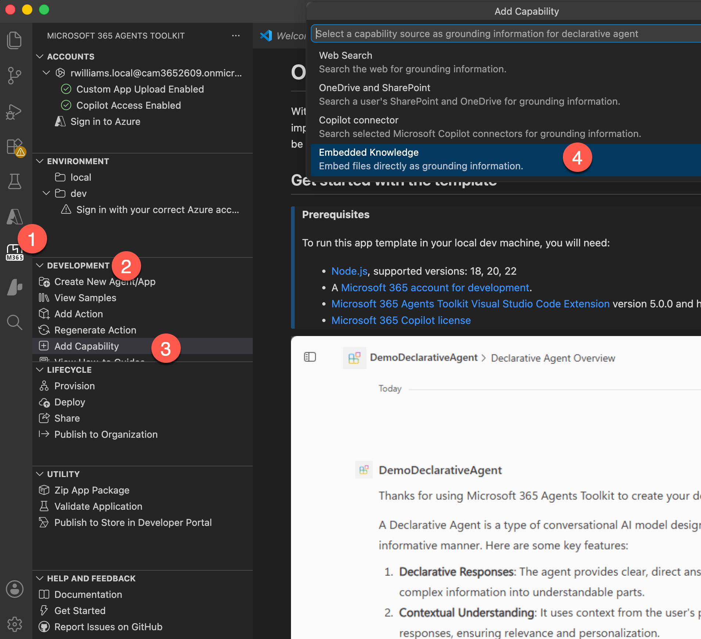

# Lab E1B : Declarative Agent Foundation with Agents Toolkit

<div data-widget="hero"
  data-badge="On-ramp · Lab E1B"
  data-badge-color="blue"
  data-icon="🛠️"
  data-title="Declarative Agent Foundation with Agents Toolkit"
  data-subtitle="Build your first declarative agent in VS Code with source files, provisioning, grounding, and capability checks."
  data-time="45-60 min"
  data-requires="VS Code + Agents Toolkit"
  data-toolkit="Microsoft 365 Agents Toolkit | Microsoft 365 Copilot Chat"></div>

## Prerequisites

- VS Code with **Microsoft 365 Agents Toolkit**
- Microsoft 365 developer account with Copilot access
- Global Admin access in your M365 tenant, required to configure tenant-wide app and policy settings

---

## Exercise 1: Enable custom app uploads in Teams

1. Go to [admin.microsoft.com](https://admin.microsoft.com/) and sign in with your M365 admin account.
2. In the left nav: **Show all** -> **Teams** -> **Teams apps** -> **Setup policies**.
3. Select **Global (Org-wide default)**.
4. Toggle **Upload custom apps** to **On** and click **Save**.

<div data-widget="callout"
  data-type="warn"
  data-title="Propagation delay"
  data-body="This setting can take up to 24 hours in some tenants. If Provision fails with an upload error later, wait an hour and retry."></div>

---

## Exercise 2: Scaffold the project

1. Open VS Code and select **Microsoft 365 Agents Toolkit**.
2. Select **Create a New Agent/App**.
3. Choose **Declarative Agent** -> **No Action**.
4. Name it **Zava Onboarding Agent**.

You should have:

```text
appPackage/
  declarativeAgent.json
  instruction.txt
  manifest.json
env/.env.dev
m365agents.yml
```

---

## Exercise 3: Configure core files

1. Update `appPackage/declarativeAgent.json` with:
   - Name/description
   - `instructions` pointing to `instruction.txt`
   - Conversation starters
2. Update `appPackage/instruction.txt` with persona, scope, guardrails, and tone.
3. Update `appPackage/manifest.json` short/full name and descriptions.

Use these minimum values:

- `declarativeAgent.json`: name, description, instructions file reference, and conversation starters
- `instruction.txt`: role, scope, guardrails, and tone
- `manifest.json`: branded app name and short/full descriptions

---

## Exercise 4: Add grounding via Embedded Knowledge capability

1. Download [Zava New Hire Logistics.docx](../../assets/docs/extend-m365-copilot-09/Zava%20New%20Hire%20Logistics.docx).
2. In **Microsoft 365 Agents Toolkit** -> **Development** -> **Add Capability**.
3. Choose **Embedded Knowledge**.
4. Keep default `appPackage/manifest.json`.
5. Import `Zava New Hire Logistics.docx`.
6. Confirm `appPackage/EmbeddedKnowledge` is created.



### Validate grounded retrieval

1. Provision from **Lifecycle -> Provision**.
2. Open your agent in Copilot Chat.
3. Ask:
  - "Where is the badge pickup desk and what time does it open?"
  - "If a new hire is locked out, what fallback should they use?"

Expected result:

- Response includes **Floor 1, Reception B** and **8:15 AM** opening time.
- Response includes **+1-800-ZAVA-ITS** and **Badge Assist** fallback.

---

## Exercise 5: Enable Code Interpreter in code and validate charts

Microsoft Learn guidance for Agents Toolkit is to enable Code Interpreter in the declarative agent manifest code (not via **Add Capability**).

1. Open `appPackage/declarativeAgent.json`.
2. Ensure manifest schema is **1.2+**.
3. Add the following `capabilities` entry (or merge into your existing capabilities array):

```json
"capabilities": [
  {
    "name": "CodeInterpreter"
  }
]
```

4. Save the file.
5. Provision from **Lifecycle -> Provision**.

Run these prompts in Copilot Chat for your provisioned agent:

- "Given 20 annual leave days and 260 working days per year, calculate leave percentage and show the result in a 2-row table."
- "Create a 2-week onboarding checklist with columns: Day, Task, Owner, Priority."
- "Using that 2-week checklist, create a bar chart of tasks by owner and add a one-paragraph summary of workload balance."

Expected result:

- Agent returns table output for the calculation.
- Agent returns checklist table with requested schema.
- Agent returns a readable chart and short summary.

---

## Exercise 6: Validate and prepare pilot rollout

1. Run a test matrix:
   - Grounding check
   - Policy check
   - Boundary check
   - Capability check
2. Confirm no fabrication and clear scope behavior.
3. Document pilot audience, owner, and weekly review cadence.

---

## Exercise 7: Iterate with one controlled source change

1. Add this line to `appPackage/instruction.txt` under onboarding logistics:

```text
- The staff canteen (Seattle HQ, floor 2) is open Mon-Fri 7:30am-3pm.
```

2. Bump app version in `appPackage/manifest.json` (for example `1.0.1`).
3. Re-provision from **Lifecycle -> Provision**.
4. Ask: "Is there a canteen at HQ?"
5. Confirm the new fact appears and prior grounding/capability behaviors still pass.

---

## Complete

You can now continue to **Prerequisites for Pro-code bundles** before selecting a bundle.

---8<--- "e-congratulations.md"

<div data-widget="labnav"
  data-prev="../01-first-agent-new/"
  data-prev-label="Back to E1 Path Choice"
  data-next="../00-prerequisites/"
  data-next-label="Continue to Prerequisites for Pro-code bundles"></div>


