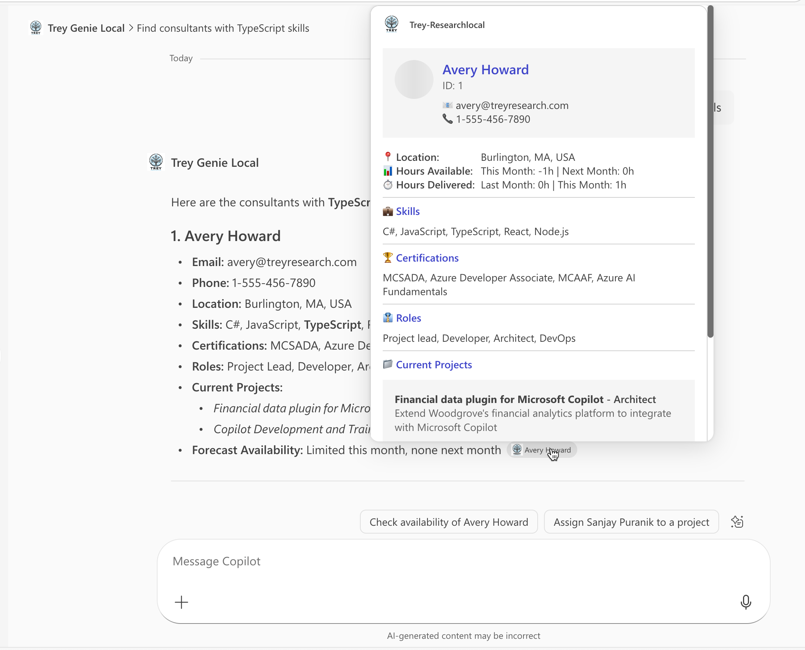

# Lab E5 - Add adaptive cards

In this lab you will further enhance the response from Microsoft 365 Copilot from text to rich cards using Adaptive Cards. 

In this lab you will learn:

- What are Adaptive Cards
- How to create and test an Adaptive Card
- How to update Microsoft 365 Copilot responses to use Adaptive Cards for rich content

<div class="lab-intro-video">
    <div style="flex: 1; min-width: 0;">
        <iframe  src="//www.youtube.com/embed/9kb9whCKey4" frameborder="0" allowfullscreen style="width: 100%; aspect-ratio: 16/9;">          
        </iframe>
          <div>Get a quick overview of the lab in this video.</div>
            <div class="note-box">
            📘 <strong>Note:</strong> This lab builds on the previous one, Lab E4. You should be able to continue working in the same folder for labs E2-E6, but solution folders have been provided for your reference.
    The finished solution for this lab is in the <a  src="https://github.com/microsoft/copilot-camp/tree/main/src/extend-m365-copilot/path-e-lab05-add-adaptive-cards/trey-research-lab05-END" target="_blank">/src/extend-m365-copilot/path-e-lab05-add-adaptive-cards/trey-research-lab05-END</a>
        </div>
    </div>
    <div style="flex: 1; min-width: 0;">
  ---8<--- "e-labs-prelude.md"
    </div>
</div>


## Introduction
<details>
<summary>What are Adaptive Cards?</summary>

Adaptive Cards are platform-independent UI snippets authored in JSON that can be exchanged between apps and services. Once delivered to an app, the JSON transforms into native UI that automatically adapts to its environment. This enables the design and integration of lightweight UI across major platforms and frameworks.
    <div class="video">
      <iframe src="//www.youtube.com/embed/pYe2NqKhJoM" frameborder="0" allowfullscreen></iframe>
      <div>Adaptive cards are everywhere</div>
    </div>
</details>

## Exercise 1: Create and test a simple Adaptive Card

Let's dive in and discover how fun it is to create adaptive cards.

### Step 1: Define Your Adaptive Card in JSON

Here is an adaptive card in JSON. Begin by copying it to your clipboard.

```json
{
  "type": "AdaptiveCard",
  "body": [
    {
      "type": "TextBlock",
      "text": "Hello, Adaptive Cards!",
      "size": "large",
      "weight": "bolder"
    }
  ],
  "actions": [
    {
      "type": "Action.OpenUrl",
      "title": "Click me",
      "url":"https://www.contoso.com"
    }
  ],
  "$schema": "http://adaptivecards.io/schemas/adaptive-card.json",
  "version": "1.3"
}
```

This JSON defines a simple Adaptive Card with a text block and a button.

<cc-end-step lab="e5" exercise="1" step="1" />

### Step 2: Test Your Adaptive Card

To test your Adaptive Card, you can use the [Adaptive Cards Designer](https://adaptivecards.microsoft.com/designer){target="_blank"}.

1. Open the [Adaptive Cards Designer](https://adaptivecards.microsoft.com/designer){target="_blank"}.
2. Paste the JSON content into the "Card Payload Editor" section on the lower part of the designer.
3. You will see a live preview of your Adaptive Card on the upper part of the designer.

Congrats! You are now fully skilled to develop Adaptive cards for your plugin!

<cc-end-step lab="e5" exercise="1" step="2" />

## Exercise 2: Update agent response to be richer

### Step 1: Add adaptive card files
We are going to add some visibly appealing cards for functions `getConsultants`, `getUserInformation` and `postBillhours`.

Create three files `getConsultants.json`, `postBillhours.json` and `getUserInformation.json` in the **appPackage/adaptiveCards** folder. 

Copy contents from these raw files and paste them into appropriate files:

- getConsultants.json
- getUserInformation.json
- postBillhours.json

If you open this JSON file, you'll see the card's structure and how it uses data binding to connect with the API response. Template expressions in the card automatically populate with real data from your API, allowing your agent to present information in a polished, visually appealing format instead of plain text.

<cc-end-step lab="e5" exercise="2" step="1" />

### Step 2: Update plugin manifest to inlcude adaptive cards

1. Open **appPackage/trey-plugin.json**
2. Find the `getConsultants` function
3. Inside `response_semantics`, add the following after the `properties` field (include the comma also from the snippet):

```json
,
  "static_template": {
            "file": "adaptiveCards/getConsultants.json"
          }
```

After modification the function **getConsultants** looks as below:

```json
    {
      "name": "getConsultants",
      "description": "Returns detailed information about consultants identified from filters like name of the consultant, name of project, certifications, skills, roles and hours available. Multiple filters can be used in combination to refine the list of consultants returned",
      "capabilities": {
        "response_semantics": {
          "data_path": "$.results",
          "properties": {
            "title": "$.name",
            "subtitle": "$.id",
            "url": "$.consultantPhotoUrl"
          },
           "static_template": {
            "file": "adaptiveCards/getConsultants.json"
          }
        }
      }
    }
```

Repeat for **getUserInformation** function with below:

```json
  ,
  "static_template": {
            "file": "adaptiveCards/getUserInformation.json"
          }
```
And finally for **postBillhours** function with below:

```json
  ,
  "static_template": {
            "file": "adaptiveCards/postBillhours.json"
          }
```

<cc-end-step lab="e5" exercise="2" step="2" />

## Exercise 3: Test the plugin in Copilot

Before you test the application, update the manifest version of your app package in the `appPackage\manifest.json` file, follow these steps:

1. Open the `manifest.json` file located in the `appPackage` folder of your project.

2. Locate the `version` field in the JSON file. It should look something like this:  
   ```json
   "version": "1.0.1"
   ```

3. Increment the version number to a small increment. For example, change it to:  
   ```json
   "version": "1.0.2"
   ```

4. Save the file after making the change.

### Step 1: Install the plugin

Stop and restart your project to force it to re-deploy the application package.
You will be in a window with direct chat with your agent in Copilot.


<cc-end-step lab="e5" exercise="3" step="1" />

### Step 2: Display an adaptive card

Now try a prompt such below:

 *Find consultants with TypeScript skills*

Instead of just the text response you will also get a rich card with information of the project.


Now try a POST operation prompt such below

 *please charge 1 hour to woodgrove bank in trey research*

Since the request requires Copilot to send some data via POST to the API plugin, you need to confirm that you want to allow Copilot to do so selecting the *Confirm* button.


Once confirmed, instead of just the text response you will also get a rich card with information of the project.


You can now test other prompts as well to see the improved responses from Microsoft 365 Copilot.

<cc-end-step lab="e5" exercise="3" step="2" />

---8<--- "e-congratulations.md"

You've completed adding adaptive card responses to your first API plugin. You are now ready to proceed to the next lab to add authentication to your API.

<cc-next url="../06a-add-authentication-ttk" label="Next" />

  

