# Lab E6 - Add Entra ID authentication

---8<--- "e-labs-prelude.md"

In this lab you will add authentication to your API plugin using OAuth 2.0 with Entra ID as the identity provider.

!!! note
    There are many detailed setup steps for Entra ID in this lab.
    A preview version of Teams Toolkit is available which will automate many of these steps for you; we hope to provide a more streamlined version of the lab when it's released. However this could still be useful for those wishing to understand exactly what needs to be provisioned to get OAuth working.

In this lab you will register Entra ID applications that are used to secure your plugin and API. Before you begin, choose a safe place for your app information. You will be saving:

| Configuration field | Value |
| --- | --- |
| API Base URL | |
| API service Application (client) ID | |
| API service Directory (tenant) ID | |
| Authorization endpoint | |
| Token endpoint | |
| API service client secret | |
| API scope | |
| Plugin service application (client) ID | |
| Plugin service client secret | |

## Exercise 1: Set up a persistent developer tunnel (optional)

By default, Teams Toolkit creates a new developer tunnel - and thus a new URL for accesing your locally running API - every time you start the project. Normally this is fine because Teams Toolkit automatically updates the URL where needed, but since this lab will be a manual setup, you'll have to manually update the URL in Entra ID and in Teams Developer Portal each time you start the debugger. For that reason, you may wish to set up a persistent developer tunnel with a URL that does not change.

??? Note "If you don't want to set up a persistent tunnel, open this note ▶▶▶"
    You are free to skip this exercise and use the developer tunnel provided by Teams Toolkit. Once your project is running, you can copy this URL from the terminal tab 1️⃣ by choosing the "Start local tunnel" terminal 2️⃣; copy the Forwarding URL 3️⃣. Note this URL will change every time you start the project, and you will need to manually update the app registration reply URL (exercise 2 step 1) and the Teams Developer Portal URL (exercise ? step ?).
    

### Step 1: Install the developer tunnel CLI

Here are the command lines for installing the developer tunnel. [Full instructions and download links for the Developer Tunnel are here.](https://learn.microsoft.com/azure/developer/dev-tunnels/get-started){target=_blank}. 

| OS | Command |
| --- | --- |
| Windows | `winget install Microsoft.devtunnel` |
| Mac OS | `brew install --cask devtunnel` |
| Linux | `curl -sL https://aka.ms/DevTunnelCliInstall | bash` |

!!! tip
    You may have to restart your command line to update the file path before devtunnel commands will work

Once you have it installed, you'll need to log in. You can use your Microsoft 365 account to log in.

~~~sh
devtunnel user login
~~~

<cc-end-step lab="e6" exercise="1" step="1" />

### Step 2: Create and host the tunnel

Then you'll need to set up a persistent tunnel to the Azure Functions local port (7071).
You can use these commands and substitute your own name instead of "mytunnel" if you wish.

~~~sh
devtunnel create mytunnel -a --host-header unchanged
devtunnel port create mytunnel -p 7071
devtunnel host mytunnel
~~~

The command line will display the connection information, such as:

Copy the "Connect via browser" URL and save it as the "API Base URL".

<cc-end-step lab="e6" exercise="1" step="2" />

### Step 3: Disable the dynamically created tunnel in your project

If your project is running locally, stop it. Then edit [\.vscode\tasks.json]() and locate the "Start Teams App task. Comment out the "Start local tunnel" depdendency and add its dependency, "Start Azurite emulator" instead. The resulting task should look like this:

~~~json
{
    "label": "Start Teams App Locally",
    "dependsOn": [
        "Validate prerequisites",
        //"Start local tunnel",
        "Start Azurite emulator",
        "Create resources",
        "Build project",
        "Start application"
    ],
    "dependsOrder": "sequence"
},
~~~

Then open **env\.env.local** and change the value of OPENAPI_SERVER_URL to the persistent tunnel URL.

<cc-end-step lab="e6" exercise="1" step="3" />

## Exercise 2: Register an Entra ID application for your API

### Step 1: Add a new Entra ID app registration

Browse to the Entra ID admin center either via the [Microsoft 365 Admin center](https://portal.office.com/AdminPortal/){target=_blank} or directly at [https://entra.microsoft.com/](https://entra.microsoft.com/){target=_blank}. Make sure you are logged into your development tenant and not some other.

Once you're there, click "Identity" 1️⃣, then "Applications" 2️⃣, and then "App registrations" 3️⃣. Then click the "+" 4️⃣ to add a new app registration.

Give your application a unique and descriptive name such as "My API Service" 1️⃣. Under "Supported account types", select "Accounts in this organizational directory only (Microsoft only - single tenant) 2️⃣. Under "Redirect URI (optional)" select "Web" and enter the URL of your developer tunnel 3️⃣. 

!!! Note "If you didn't make a persistent developer tunnel URL..."
    ...you will have to update the "Redirect URI" field with the new tunnel URL after each time you start your application in Teams Toolkit

Then click "Register" 4️⃣ to register your application.

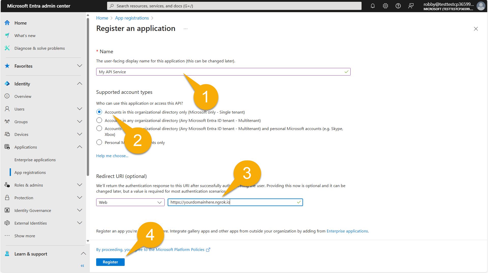

!!! Note "Only single tenant apps work at the moment"
    Software vendors and others will want their app to work across multiple Microsoft 365 tenants, however at the time of this writing that doesn't work, so for now stick with the "Accounts in this organizational directory" option.

<cc-end-step lab="e6" exercise="2" step="1" />

### Step 2: Copy application info to a safe place
Copy the Application ID (also called the Client ID) 1️⃣ and the tenant ID (also called the directory ID) 2️⃣ to a safe place; you'll need them later. Then click on the Endpoints button 3️⃣ to open the Endpoints flyout.

Now copy the first two endpoint URL's, the "OAuth 2.0 authorization endpoint (v2)" 1️⃣ and "OAuth 2.0 token endpoint (v2)" 2️⃣ and save them in the same safe place.

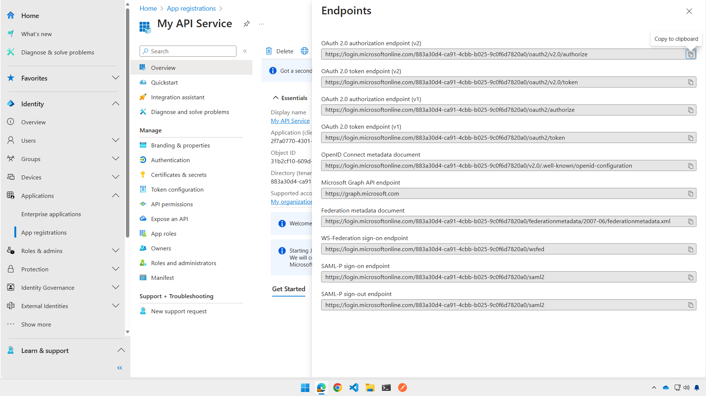

<cc-end-step lab="e6" exercise="2" step="2" />

### Step 3: Create client secret

Next, navigate to "Certificates & secrets" 1️⃣ and click "+ New client secret" 2️⃣. Give your secret a name and choose a duration. The secret will be displayed; this is your one and only chance to view it as secrets are only displayed in the portal when they're first created. Copy the secret 3️⃣ to your safe storage place.

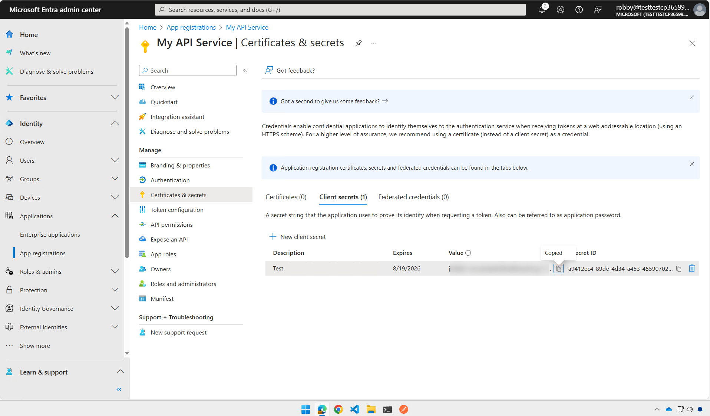

<cc-end-step lab="e6" exercise="2" step="3" />

### Step 4: Expose an API Scope

In order to validate calls to your API, you need to expose an API Scope, which represents the permission to call the API. Though these could be very specific - allowing permission to do specific operations via the API - in this case we'll set up a simple scope called "access_as_user".

First, browse to "Expose an API" 1️⃣ and, next to "Application ID URI" click "Add" 2️⃣. A flyout will open on the right; you can stay with the default value which is api://&lt;your application (client) ID&gt;. Go ahead and click "Save and continue" 3️⃣ to proceed.

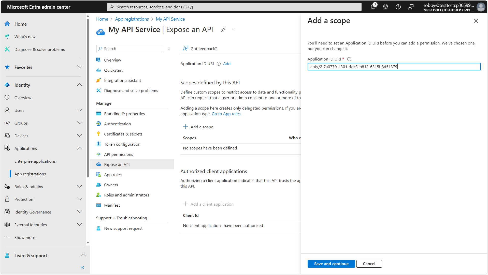

Under "Add a scope" enter "access_as_user" as the scope name 1️⃣. Fill in the remaining fields as follows:

| Field | Value |
| --- | --- |
| Who can consent? | Admins and users |
| Admin consent display name | Access My API as the user |
| Admin consent description | Allows an API to access My API as a user |
| User consent display name | Access My API as you |
| User consent description | Allows an app to access My API as you |
| State | Enabled |

When you're done, click "Add Scope" 2️⃣.

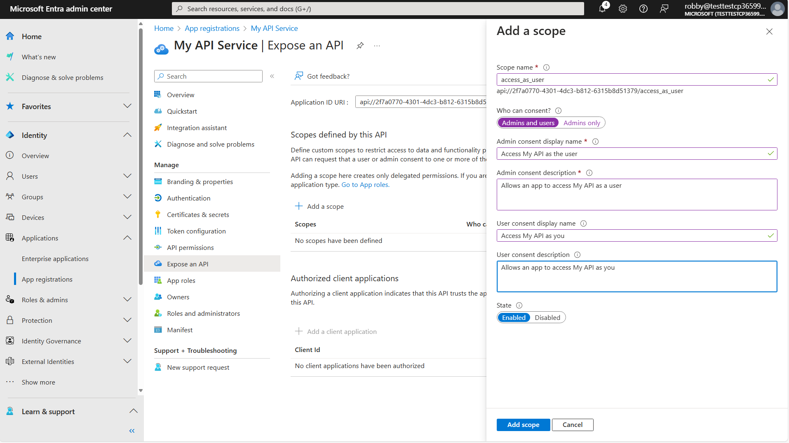

<cc-end-step lab="e6" exercise="2" step="4" />

### Step 5: Save the API Scope
Copy the scope to your safe place as the "API Scope".

<cc-end-step lab="e6" exercise="2" step="5" />

## Exercise 3: Register an Entra ID application for your plugin

Now that you've registered an API for the application, it's time to register the plugin itself.

### Step 1: Register the plugin

Return to the "App registrations" section and register a second application. This time call it "My API Plugin" 1️⃣, and once again set "Supported account types" to "Accounts in this organizational directory only" 2️⃣.

!!! Note "Only single tenant apps work at the moment"
    Software vendors and others will want their app to work across multiple Microsoft 365 tenants, however at the time of this writing that doesn't work, so for now stick with the "Accounts in this organizational directory" option.

Under "Redirect URL" select "Web", and this time set it to `https://teams.microsoft.com/api/platform/v1.0/oAuthRedirect` 3️⃣. This is the Teams location that will handle completed logins to the API Plugin application.

Click the "Register" button 4️⃣ to complete the registration.

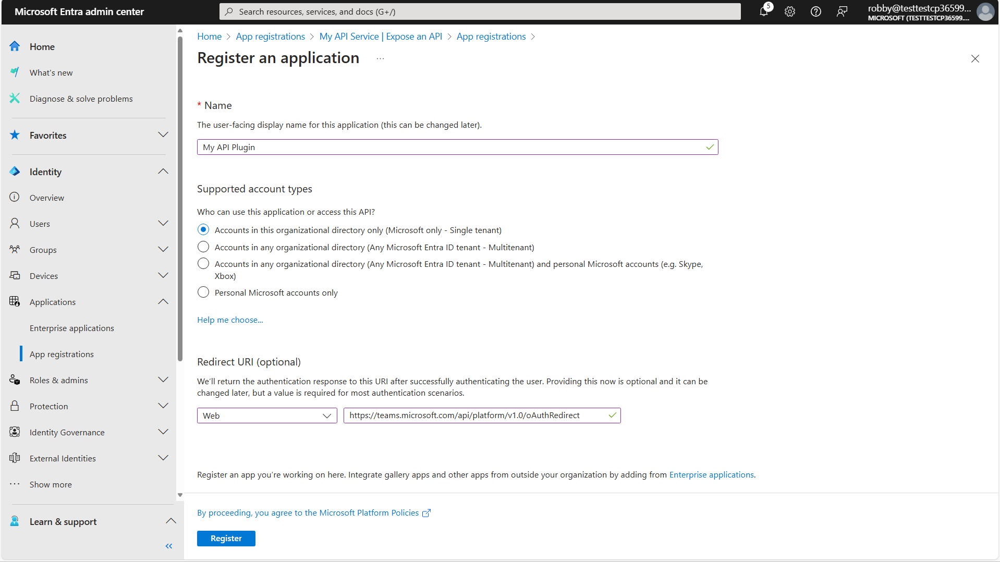

As before, view the app's "Overview" page and save the Application (client) ID for the API Plugin app.

<cc-end-step lab="e6" exercise="3" step="1" />

### Step 2: Create a client secret

As before, create a client secret and save it under "Plugin service client secret" in your safe location.

<cc-end-step lab="e6" exercise="3" step="2" />

### Step 3: Grant permission

Your plugin needs to call your API service, so naturally it needs permission to do that. Begin by navigating to "API permissions". Then click the "APIs my organization uses" tab 1️⃣ and search for your API service 2️⃣. Select your API service from the results 3️⃣.

Now you should see your API service application. Select the "access_as_user" permission and click "Add permission".

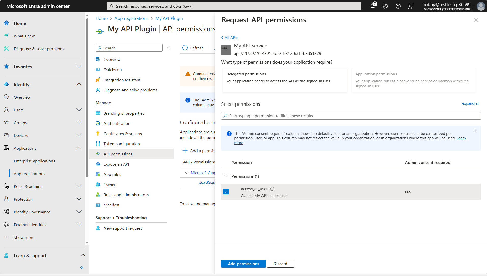

<cc-end-step lab="e6" exercise="3" step="3" />

## Exercise 4: Update the API app registration with the plugin application ID

### Step 1: Add the Plugin app's ID to the API service app

Now the API Service application needs to allow the API Plugin application to issue tokens for it. To enable this, return to the App Registration for your API Service application. Select "Manifest" and find the entry for `knownClientApplications` 1️⃣. Add your My Plugin App's client ID to this entry as follows:

~~~json
"knownClientApplications": [
    "<your-plugin-client-id>"
]
~~~

Remember to click "Save" 2️⃣ when you're done.

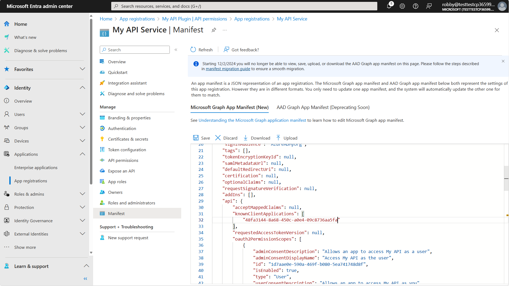

<cc-end-step lab="e6" exercise="4" step="1" />

## Exercise 5: Register the OAuth information in the Teams Developer Portal

Now you're apps are all set up, but Microsoft 365 doesn't know anything about it. It wouldn't be safe to store secrets in the app manifest, so Teams has set up a place in the Teams Developer Portal to safely store this information. In this exercise you'll se the Teams Developer Portal to register your OAuth client application so Copilot can authenticate users for it.

### Step 1: Create a new OAuth client registration

Browse to the Teams Developer Portal at [https://dev.teams.microsoft.com](https://dev.teams.microsoft.com){target=_blank}. Select "Tools" 1️⃣ and then "OAuth client registration" 2️⃣.

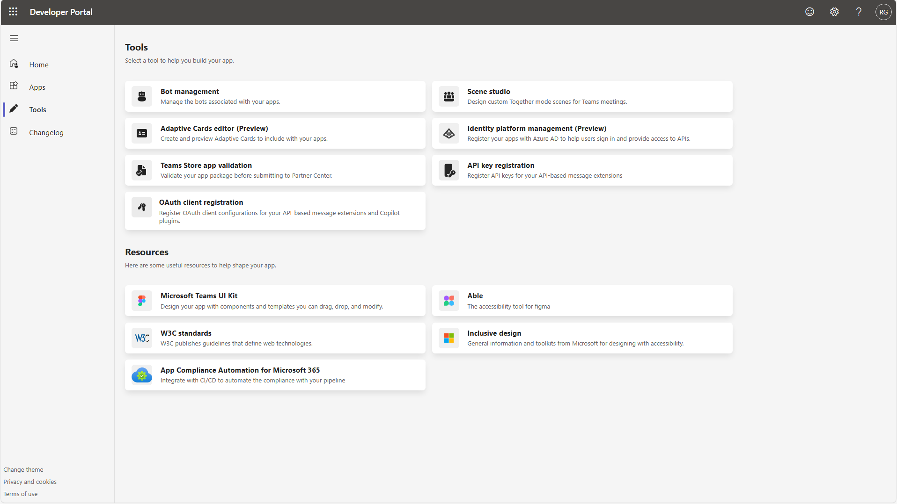

Click "+ New OAuth client registration" and fill in the form. Several of the fields are from your safely stored information you've been building up over the last few exercises.

| Field | Value |
| --- | --- |
| Name | Choose a name you'll remember |
| Base URL | your API service Base URL |
| Restrict usage by org | select "My organization only" |
| Restrict usage by app | select "Any Teams app" |
| Client ID | Your **Plugin Application** (client) ID |
| Client secret | Your **Plugin Application ** client secret |
| Authorization endpoint | Your authorization endpoint (same for both API Service and API Plugin apps) |
| Token endpoint | Your token endpoint (same for both API Service and API Plugin apps) |
| Refresh endpoint |  Your token endpoint (same for both API Service and API Plugin apps) |
| API scope | Your API Service application's scope |

!!! Note "If you didn't make a persistent developer tunnel URL..."
    ...you will have to update the "Base URL" field with your new tunnel URL each time you start your application in Teams Toolkit

<cc-end-step lab="e6" exercise="5" step="1" />

### Step 2: Save your OAuth registration ID

The portal will display your OAuth client registration ID. Save this for the next step.

<cc-end-step lab="e6" exercise="5" step="2" />

## Exercise 6: Update your application package

### Step 1: Update the Plugin file

Open your working folder in Visual Studio Code. In the **appPackage** folder, open the **trey-plugin.json** file. This is where information is stored that Copilot needs, but is not already in the Open API Specification (OAS) file.

Under `Runtimes` you will find an `auth` property with `type` of `"None"`, indicating the API is currently not authenticated. Change it as follows to tell Copilot to authenticate using the OAuth settings you saved in the vault.

~~~json
"auth": {
  "type": "OAuthPluginVault",
  "reference_id":  "${{OAUTH_CLIENT_REGISTRATION_ID}}"
},
~~~

Then add this line to your **env\.env.local** file:

~~~text
OAUTH_CLIENT_REGISTRATION_ID=<registration id you saved in the previous exercise>
~~~

The next time you start and prompt your API plugin, it should prompt you to sign in.
However we've done nothing to secure the application; anyone on the Internet can call it!
In the next step you'll update the application code to check for a valid login and access the API as the actual Microsoft 365 user instead of "Avery Howard" (which is a name from Microsoft's fictitious name generator).

<cc-end-step lab="e6" exercise="6" step="1" />

## Exercise 7: Update the application code

### Step 1: Install the JWT validation library

From a command line in your working directory, type:

~~~sh
npm i jwt-validate
~~~

This will install a library for validating the incoming Entra ID authorization token.

!!! warning
    Microsoft does not provide a supported library for validating Entra ID tokens in NodeJS, but instead provides [this detailed documentation](https://learn.microsoft.com/entra/identity-platform/access-tokens#validate-tokens){target=_blank} on how to write your own. [Another useful article](https://www.voitanos.io/blog/validating-entra-id-generated-oauth-tokens/){target=_blank} is also available from [Microsoft MVP Andrew Connell](https://www.voitanos.io/pages/about/#whos-behind-voitanos){target=_blank}. This lab uses a [community provided library](https://www.npmjs.com/package/jwt-validate){target=_blank} written by [Waldek Mastykarz](https://github.com/waldekmastykarz){target=_blank}, which is intended to follow this guidance. Note that this library is not supported by Microsoft and is under an MIT License, so use it at your own risk.

<cc-end-step lab="e6" exercise="7" step="1" />

### Step 2: Add environment variables for your API

In the **env** folder in your working directory, open **env.local** and add these lines for your API Service app's client ID and tenant ID.

~~~text
API_APPLICATION_ID=<your-api-service-client-id>
API_TENANT_ID=<your-tenant-id>
~~~

To make these values available inside your code running in Teams Toolkit, you also need to update the **teamsapp.local.yml** file in the root of your working folder. Look for the comment "Generate runtime environment variables" and add the new values under the STORAGE_ACCOUNT_CONNECTION_STRING:

~~~yaml
  - uses: file/createOrUpdateEnvironmentFile
    with:
      target: ./.localConfigs
      envs:
        STORAGE_ACCOUNT_CONNECTION_STRING: ${{SECRET_STORAGE_ACCOUNT_CONNECTION_STRING}},
        API_APPLICATION_ID: ${{API_APPLICATION_ID}}
        API_TENANT_ID: ${{API_TENANT_ID}}
~~~

<cc-end-step lab="e6" exercise="7" step="2" />

### Step 3: Update the identity service

In the **src/services** folder, open **IdentityService.ts**. 
At the top of the file along with the other `import` statements, add this one:

~~~typescript
import { TokenValidator, ValidateTokenOptions, getEntraJwksUri } from 'jwt-validate';
~~~

Then, right under the `class Identity` statement, add this line:

~~~typescript
    private validator: TokenValidator;
~~~

Now look for the comment

~~~typescript
// ** INSERT REQUEST VALIDATION HERE (see Lab E6) **
~~~

Replace the comment with this code:

~~~typescript
// Try to validate the token and get user's basic information
try {
    const { API_APPLICATION_ID, API_TENANT_ID } = process.env;
    const token = req.headers.get("Authorization")?.split(" ")[1];
    if (!token) {
        throw new HttpError(401, "Authorization token not found");
    }

    // create a new token validator for the Microsoft Entra common tenant
    if (!this.validator) {
        // We need a new validator object which we will continue to use on subsequent
        // requests so it can cache the Entra ID signing keys
        // For multitenant, use:
        // const entraJwksUri = await getEntraJwksUri();
        const entraJwksUri = await getEntraJwksUri(API_TENANT_ID);
        this.validator = new TokenValidator({
            jwksUri: entraJwksUri
        });
        console.log ("Token validator created");
    }

    // Use these options for single-tenant applications
    const options: ValidateTokenOptions = {
        audience: `api://${API_APPLICATION_ID}`,
        issuer: `https://sts.windows.net/${API_TENANT_ID}/`,
        // NOTE: If this is a multi-tenant app, look for 
        // issuer: "https://sts.windows.net/common/",
        // Also you may wish to manage a list of allowed tenants
        // and test them as well
        //   allowedTenants: [process.env["AAD_APP_TENANT_ID"]],
        scp: ["access_as_user"]
    };

    // validate the token
    const validToken = await this.validator.validateToken(token, options);

    userId = validToken.oid;
    userName = validToken.name;
    userEmail = validToken.upn;
    console.log(`Request ${this.requestNumber++}: Token is valid for user ${userName} (${userId})`);
}
catch (ex) {
    // Token is missing or invalid - return a 401 error
    console.error(ex);
    throw new HttpError(401, "Unauthorized");
}
~~~

!!! Note "Learn from the code"
    Have a look at the new source code. First, it obtains the token from the `Authorization` header in the HTTPs request. This header contains the word "Bearer", a space, and then the token, so a JavaScript `split(" ")` is used to obtain only the token.

    Also note that the code will throw an exception if authentication should fail for any reason; the Azure function will then return
    the appropriate error.

    The code then creates a validator for use with the `jwks-validate` library. This call reads the latest private keys from Entra ID, so it is an async call that may take some time to run.

    Next, the code sets up a `ValidateTokenOptions` object. Based on this object, in addition to validating that the token was signed with Entra ID's private key, the library will validate that:

    * the _audience_ must be the same as the API service app URI; this ensures that the token is intended for our web service and no other

    * the _issuer_ must be from the security token service for our tenant

    * the _scope_ must match the scope defined in our app registration, which is `"access_as_user"`.

    If the token is valid, the library returns an object with all the "claims" that were inside, including the user's unique ID, name, and email. We will use these values instead of relying on the fictitious "Avery Howard".

!!! Note "If your app will be multi-tenant"
    Check the comments for notes about validating tokens for a multi-tenant app

Once the code has a `userId` it will look for a Consultant record for the user. This was hard-coded to Avery Howard's ID in the original code. Now it will use the user ID for the logged in user, and create a new Consultant record if it doesn't find one in the database.

As a result, when you run the app for the first time, it should create a new Consultant for your logged-in user with a default set of skills, roles, etc. If you want to change them to make your own demo, you can do that using the [Azure Storage Explorer](https://azure.microsoft.com/en-us/products/storage/storage-explorer/){target=_blank}

Note that project assignments are stored in the `Assignment` table and reference the project ID and the assigned consultant's consultant ID.

<cc-end-step lab="e6" exercise="7" step="3" />

## Exercise 7: Test the application

### Step 1: (Re)start the application

If your app is still running from an earlier lab, stop it to force it to re-create the application package.

Then press F5 to run the application again, and install it as before.

Prompt the plugin, "What Trey projects am I assigned to?". You may see a confirmation card asking if it's OK to call your API. No authentication is happening here; click "Allow Once" to proceed.

The confirmation card will be replaced with a login card.
Click "Sign in to Trey" to sign in. At first you should see a pop-up window asking you to log in and to consent to permissions. On subsequent vists this may be hidden as your credentials have been cached by Entra ID in your local browser.

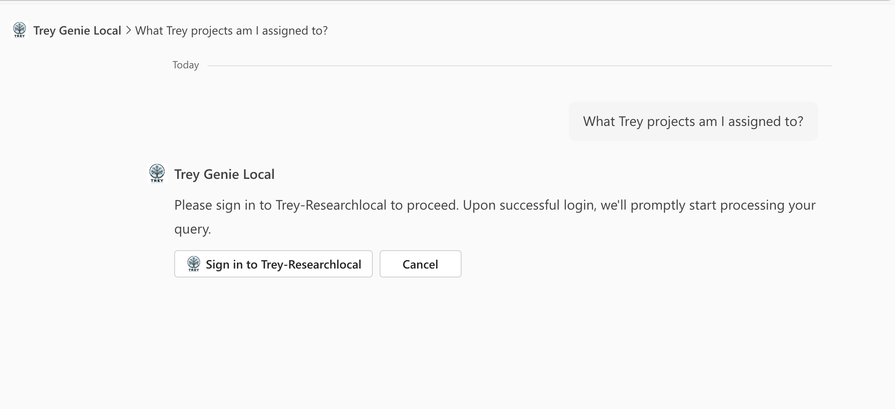

The login card should be replaced by Copilot's response to your prompt. Since you were just added to the database, you aren't assigned to any projects.

Since you were just added to the database, you're not assigned to any projects.

Ask Copilot to add you to the Woodgrove project. Copilot will press you for details if you forgot to include any required values.

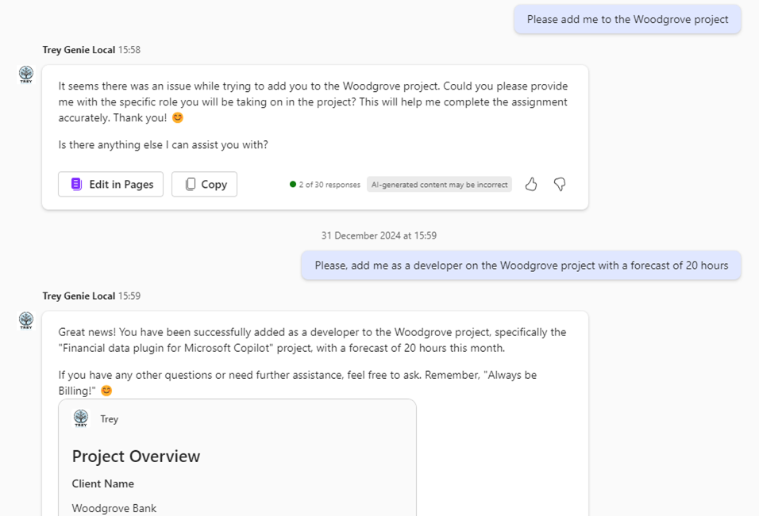

Now check out your default skills and confirm the project assignment by asking, "What are my skills and what projects am I assigned to?"

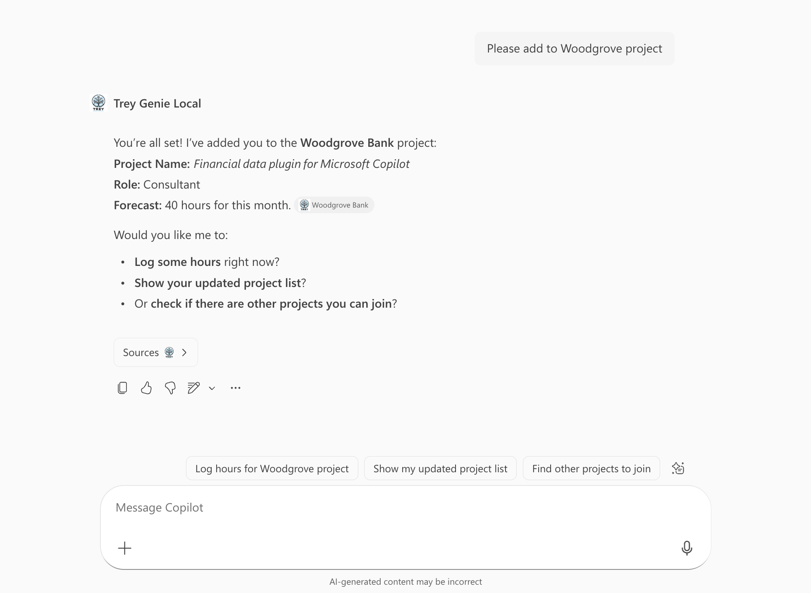

<cc-end-step lab="e6" exercise="8" step="1" />

---8<--- "e-congratulations.md"

You have completed lab E6, Add Authentication!

