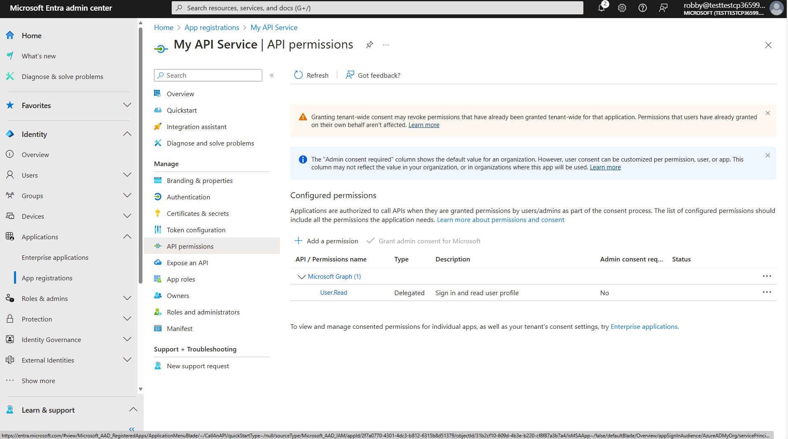

# Lab E6 - Add authentication to the API plugin

In this lab you will add authentication to your API plugin using OAuth 2.0 with Entra ID as the identity provider.

???+ "Navigating the Extend Copilot labs (Extend Path)"
    - [Lab E0 - Prerequisites](/copilot-camp/pages/extend-m365-copilot/00-prerequisites)
    - [Lab E1 - Declarative Copilot](/copilot-camp/pages/extend-m365-copilot/01-declarative-copilot)
    - [Lab E2 - First API Plugin](/copilot-camp/pages/extend-m365-copilot/02-api-plugin)
    - [Lab E3 - Enhance the API Plugin](/copilot-camp/pages/extend-m365-copilot/03-enhance-api-plugin) 
    - [Lab E4 - Add Adaptive Cards](/copilot-camp/pages/extend-m365-copilot/04-add-adaptive-card)
    - [Lab E5 - Add a Declarative Copilot](/copilot-camp/pages/extend-m365-copilot/05-add-declarative-copilot)
    - [Lab E6 - Add authentication](/copilot-camp/pages/extend-m365-copilot/06-add-authentication) (📍You are here)

!!! note
    There are many detailed setup steps for Entra ID in this lab.
    A preview version of Teams Toolkit is available which will automate many of these steps for you; we hope to provide a more streamlined version of the lab when it's released. However this could still be useful for those wishing to understand exactly what needs to be provisioned to get OAuth working.

## Exercise 1: Set up a persistent developer tunnel (optional)

By default, Teams Toolkit creates a new developer tunnel - and thus a new URL for accesing your locally running API - every time you start the project. Normally this is fine because Teams Toolkit automatically updates the URL where needed, but since this lab will be a manual setup, you'll have to manually update the URL in Entra ID and in Teams Developer Portal each time you start the debugger. For that reason, you may wish to set up a persistent developer tunnel with a URL that does not change.

!!! note
    You are free to skip this exercise and use the developer tunnel provided by Teams Toolkit. The instructions will note the places where you'll have to go back and update the URL when it changes.

<cc-lab-step lab="e6" exercise="1" step="1" />
### Step 1: Install the developer tunnel CLI

Here are the command lines for installing the developer tunnel. [Full instructions and download links for the Developer Tunnel are here.](https://learn.microsoft.com/azure/developer/dev-tunnels/get-started){target=_blank}. 

| OS | Command |
| --- | --- |
| Windows | `winget install Microsoft.devtunnel` |
| Mac OS | `brew install --cask devtunnel` |
| Linux | `curl -sL https://aka.ms/DevTunnelCliInstall | bash` |

!!! tip
    You may have to restart your command line to update the file path before devtunnel commands will work

Once you have it installed, you'll need to log in. You can use your Microsoft 365 account to log in.

~~~sh
devtunnel user login
~~~

<cc-lab-step lab="e6" exercise="1" step="2" />
### Step 2: Create and host the tunnel

Then you'll need to set up a persistent tunnel to the Azure Functions local port (7071).
You can use these commands and substitute your own name instead of "mytunnel" if you wish.

~~~sh
devtunnel create mytunnel -a --host-header unchanged
devtunnel port create mytunnel -p 7071
devtunnel host mytunnel
~~~

The command line will display the connection information, such as:

Copy the "Connect via browser" URL and save it safely; you'll need it in the steps that follow.

## Exercise 2: Register an Entra ID application for your API

## Exercise 3: Register an Entra ID application for your plugin

## Exercise 4: Update the API app registration with the plugin application ID

## Exercise 5: Register the OAuth information in the Teams Developer Portal

## Exercise 6: Update your plugin manifest

## Exercise 7: Update the application code

~~~sh
npm i jwt-validate
~~~

## Exercise 7: Test the application

## Exercise

