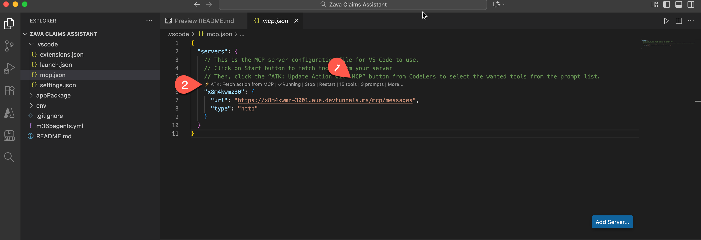
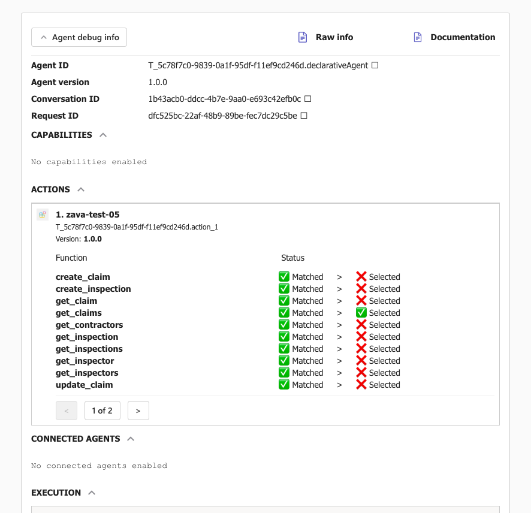

# Lab 08 : Connect Declarative agent to MCP Server

In this lab, you'll run a complete Model Context Protocol (MCP) server for Zava Insurance's claims system and integrate it with Declarative Agent in Microsoft 365 Copilot that you will create, enabling natural language interactions with real claims data through secure, standardized AI agent communication.


<div class="lab-intro-video">
    <div style="flex: 1; min-width: 0;">
        <iframe  src="//www.youtube.com/embed/vbkcntieMmI" frameborder="0" allowfullscreen style="width: 100%; aspect-ratio: 16/9;">          
        </iframe>
          <div>Get a quick overview of the lab in this video.</div>
            <div class="note-box">
            📘 <strong>Note:</strong>   MCP Server + Declarative Agents using Agents Toolkit is still in Preview
        </div>
    </div>
    <div style="flex: 1; min-width: 0;">
  ---8<--- "e-labs-prelude.md"
    </div>
</div>


## Scenario

**Zava Insurance**, a mid-sized home fictitious insurance company serving 150,000+ homes across the Pacific Northwest, struggled with manual claims operations that caused 3-week delays and coordination issues when severe storms brought 2,000 claims in 48 hours during October 2025. To address this crisis, Zava's CTO envisioned AI-powered claims operations where intelligent agents could handle routine tasks, enabling adjusters to focus on complex cases and customer care. The development team built a **Model Context Protocol (MCP) server** using Azure infrastructure to provide standardized, secure access to claims data for AI agents, offering real-time synchronization and rich contextual information about damage assessments, contractor specialties, and inspection scheduling. After successfully deploying the MCP server, Zava integrated it with **Microsoft 365 Copilot** using **Declarative Agents**, enabling claims adjusters to interact with the system through natural language conversations like "Show me all urgent storm damage claims" rather than complex API calls, seamlessly embedding AI-powered claims management into their existing Microsoft 365 workflows.

---

## 🎯 Lab Objectives

By completing this lab, you will:

- Understand how MCP servers connect AI agents to backend systems
- Build and run Zava's MCP server with insurance claims data
- Create a Declarative Agent using Microsoft 365 Agents Toolkit
- Connect your agent to the MCP server and configure claims management capabilities
- Test the agent with natural language queries and real claims data

---

## 📚 Prerequisites

Before starting this lab, ensure you have:

- **Node.js 22+** installed on your machine
- **VS Code** with **Microsoft 365 Agents Toolkit extension** V 6.4.2 or higher
- **Microsoft 365 developer account** with Copilot license
- Basic knowledge of **TypeScript/JavaScript**,**REST APIs** and **JSON**
- GitHub account for using VS Code tunneling

---

## Exercise 1: Set Up Your Development Environment

In this exercise, you'll clone Zava's MCP server codebase and set up your local development environment.

### Step 1: Clone the Repository

Open your terminal and run:

```bash
git clone https://github.com/microsoft/copilot-camp.git
cd src/extend-m365-copilot/path-e-lab08-mcp-server/zava-mcp-server
```
<cc-end-step lab="e8" exercise="1" step="1" />

### Step 2: Install Dependencies

Install all required packages:

```bash
npm install
```

This installs key dependencies:

- `@modelcontextprotocol/sdk` - MCP protocol implementation
- `@azure/data-tables` - Azure Table Storage client
- `express` - HTTP server framework
- `zod` - Runtime type validation

<cc-end-step lab="e8" exercise="1" step="2" />

### Step 3: Examine the Project Structure

Explore the codebase structure, open the project in VSCode by typing and enter

```
code .
```

Key directories:

- `src/` - TypeScript source code
- `data/` - Sample JSON data files

<cc-end-step lab="e8" exercise="1" step="3" />

You have the code base ready with sample data. 

---

## Exercise 2: Start Zava's Local Claims Database

Zava uses Azure Table Storage for their claims database. In this exercise, you'll start a local emulator and load sample data.

### Step 1: Start Azure Storage Emulator

In **Terminal 1**, start the Azurite emulator:

```bash
npm run start:azurite
```

You should see:
```
Azurite Blob service is starting at http://127.0.0.1:10000
Azurite Queue service is starting at http://127.0.0.1:10001
Azurite Table service is starting at http://127.0.0.1:10002
```

**Keep this terminal running** - it's your local database server.
<cc-end-step lab="e8" exercise="2" step="1" />

### Step 2: Load Sample Claims Data

In **Terminal 2**, initialize Zava's sample data:

```bash
npm run init-data
```

This loads realistic data including:

- **Claims**: Storm damage, water damage, fire damage cases
- **Contractors**: Roofing specialists, water restoration, general contractors
- **Inspections**: Scheduled and completed inspection tasks
- **Inspectors**: Available field inspectors with specialties

<cc-end-step lab="e8" exercise="2" step="2" />

## Step 3: Verify Data Loading

Check the console output. You should see:
```
🚀 Starting data initialization...
📋 Initializing table: claims
✅ Table 'claims' created or already exists
📄 Loaded 2 items from claims.json
✅ Upserted entity: CN202504990
✅ Upserted entity: CN202504991
✅ Completed initialization for table: claims
📋 Initializing table: inspections
✅ Table 'inspections' created or already exists
📄 Loaded 2 items from inspections.json
✅ Upserted entity: insp-001
✅ Upserted entity: insp-002
✅ Completed initialization for table: inspections
📋 Initializing table: inspectors
✅ Table 'inspectors' created or already exists
📄 Loaded 4 items from inspectors.json
✅ Upserted entity: inspector-001
✅ Upserted entity: inspector-002
✅ Upserted entity: inspector-003
✅ Upserted entity: inspector-004
✅ Completed initialization for table: inspectors
📋 Initializing table: contractors
✅ Table 'contractors' created or already exists
📄 Loaded 3 items from contractors.json
✅ Upserted entity: contractor-001
✅ Upserted entity: contractor-002
✅ Upserted entity: contractor-003
✅ Completed initialization for table: contractors
📋 Initializing table: purchaseOrders
✅ Table 'purchaseOrders' created or already exists
📄 Loaded 2 items from purchaseOrders.json
✅ Upserted entity: po-001
✅ Upserted entity: po-002
✅ Completed initialization for table: purchaseOrders
🎉 Data initialization completed successfully!
✨ All tables initialized successfully
```

Your local claims database is now running with sample data that mirrors Zava's production environment.
<cc-end-step lab="e8" exercise="2" step="3" />

---

## Exercise 3: Launch the MCP Server

Now you'll start Zava's MCP server that enables AI agents to interact with the claims system.


### Step 1: Start the MCP Server

In **Terminal 2** (keeping Azurite running in Terminal 1):

```bash
npm run start:mcp-http
```

You should see a message as below (parts of the message):
```
🚀 Zava Claims MCP HTTP Server started on 127.0.0.1:3001 
...
```
<cc-end-step lab="e8" exercise="3" step="1" />

### Step 2: Test Server Health

Open a new browser tab and visit:
```
http://127.0.0.1:3001/health
```

You should see a JSON response confirming the server is healthy in the browser.

```json
{"status":"healthy","timestamp":"2025-11-11T01:46:11.618Z","service":"zava-claims-mcp-server","authentication":"No authentication"}
```

<cc-end-step lab="e8" exercise="3" step="2" />

### Step 3: Explore Available Endpoints

Visit these URLs to explore the API:

- **Health Check**: `http://127.0.0.1:3001/health`
- **API Documentation**: `http://127.0.0.1:3001/docs`
- **MCP Tools List**: `http://127.0.0.1:3001/tools`

Your MCP server is now running and ready. 

<cc-end-step lab="e8" exercise="3" step="3" />

---

## Exercise 4: Test AI Agent Interactions

Experience how AI agents interact with Zava's claims system using the MCP Inspector tool.

### Step 1: Launch MCP Inspector

In **Terminal 3**, start the interactive MCP testing tool:

```bash
npm run inspector
```

This opens a web interface where you can test MCP tools as if you were an AI agent.

<cc-end-step lab="e8" exercise="4" step="1" />

### Step 2: Explore Available Tools

In the MCP Inspector interface, you'll see **15 tools** available to AI agents:

**Claims Management Tools:**

- `get_claims` - List all insurance claims
- `get_claim` - Get specific claim details
- `create_claim` - File a new claim
- `update_claim` - Update claim status
- `delete_claim` - Close/delete claims

**Inspection Tools:**

- `get_inspections` - List inspection tasks
- `create_inspection` - Schedule new inspections
- `update_inspection` - Update inspection status

**Contractor & Inspector Tools:**

- `get_contractors` - Find contractors by specialty
- `get_inspectors` - List available inspectors

<cc-end-step lab="e8" exercise="4" step="2" />

### Step 3: Test the "Get Claims" Tool

1. Click on `get_claims` tool
2. Click **"Run Tool"** (no parameters needed)
3. Observe the JSON response with Zava's current claims

You should see claims like:
```json
{
  "id": "1",
  "claimNumber": "CN202504990", 
  "policyHolderName": "John Smith",
  "property": "123 Main St, Seattle, WA 98101",
  "status": "Open - Claim is under investigation",
  "damageTypes": ["Roof damage - moderate severity", "Storm damage"],
  "estimatedLoss": 15000
}
```


<cc-end-step lab="e8" exercise="4" step="3" />

### Step 4: Set Up Public Access with Dev Tunnel

To enable external access to your MCP server (useful for testing with cloud-based AI agents or sharing with team members), you'll use VS Code's built-in Dev Tunnel feature to create a public HTTPS endpoint.

#### Why Use HTTPS Instead of HTTP?

- **Security**: HTTPS encrypts communication between AI agents and your MCP server
- **Cloud Compatibility**: Many cloud-based AI services require HTTPS endpoints
- **Production Readiness**: Mirrors real-world deployment scenarios where MCP servers are accessed over secure connections
- **Cross-Origin Support**: HTTPS tunnels handle CORS (Cross-Origin Resource Sharing) better than local HTTP servers

#### Create a Dev Tunnel in VS Code

- In VS Code's terminal panel, locate the Ports tab.

- Click the Forward a Port button and enter port number 3001.

- Right-click on the forwarded port address and select Configure the Tunnel:

- Port Visibility: Select "Public" to make it accessible externally
- Set Port Label: Enter zava-mcp-server (optional but recommended)
- Copy Local Address: Click to copy the tunnel URL to your clipboard
- Authenticate: If prompted, sign in with your Microsoft/GitHub account to create the tunnel.

    The copied URL will look similar to this:

    ```
    https://abc123def456.use.devtunnels.ms 
    ```

    Save this URL - you'll need it for the next step. We'll refer to this as `<tunnel-url>`.

#### Update Package.json with Tunnel URL

Now update your package.json to use the tunnel URL for testing:

- Open **package.json** in the zava-mcp-server directory.

- Locate the inspector script and update it from:

```json
"inspector": "npx @modelcontextprotocol/inspector --transport http --server-url http://localhost:3001/mcp/messages"
```

to

```json
"inspector": "npx @modelcontextprotocol/inspector --transport http --server-url <tunnel-url>/mcp/messages"
```
- Replace <tunnel-url> with your actual tunnel URL from above step. 

- Keep a copy of `<tunnel-url>/mcp/messages` - this is your  public HTTPS MCP server endpoint for agent integration.

- If the inspector is currently running, stop it by pressing Ctrl+C in the terminal, then restart it:

```
npm run inspector
```

The MCP Inspector now opens a new browser session with a publicly accessible endpoint. Test all tools and prompts available to see how it works and brings back data. 

You've successfully tested how AI agents interact with Zava's claims system through the MCP protocol and you now have a public HTTPS endpoint for your MCP server that can be accessed by external AI agents and services.

<cc-end-step lab="e8" exercise="4" step="4" />
---

## Exercise 5: Create a New Declarative Agent Project

In this exercise, you'll use the Microsoft 365 Agents Toolkit to create a new Declarative Agent project that will connect to Zava's claims system.

### Step 1: Create New Agent using Microsoft 365 Agents Toolkit

1. Open a new window in **VS Code**
2. Click the **Microsoft 365 Agents Toolkit** icon in the Activity Bar (left sidebar)
3. Sign in with your Microsoft 365 developer account if prompted

#### Create New Agent Project

1. In the Agents Toolkit panel, click **"Create a New Agent/App"**
2. Select **"Declarative Agent"** from the template options
3. Next choose **"Add an Action"** to add to your agent
4. Next select **Start with an MCP server (preview)**
5. Enter the publicly accessible MCP Server URl from previous exercise
6. Choose the Default folder to scaffold the agent (or choose a preferred location in your machine)
7. When prompted for project details:

   - **Application Name**: `Zava Claims Assistant`

You will be directed to the newly created project which has the file `.vscode/mcp.json` open. This is the MCP server configuration file for VS Code to use.

- Select **Start** button to fetch tools from your server.
- Once started you will see the number of tools and prompts available 1️⃣. 
- Select **ATK:Fetch action from MCP** 2️⃣ to select tools you want to add to the agent. 



!!! note "Don't see the ATK: Fetch action from MCP option?"
    If you don't see the **ATK: Fetch action from MCP** option, try restarting VS Code and reopening the project.

- When you select  **ATK:Fetch action from MCP**, you will be asked to provide the action manifest, select **ai-plugin.json**.
- Select the tools you want to add to the agent. Let's select 10 tools for now.

    - create_claim
    - create_inspection
    - get_claim
    - get_claims
    - get_contractors
    - get_inspection
    - get_inspections
    - update_claim
    - update_inspection
    - get_inspectors

This step will populate the action manifest **ai-plugin.json** with the required functions, MCP server url, etc. that is needed for actions in an agent.

<cc-end-step lab="e8" exercise="5" step="1" />

### Step 2: Understand the Action manifest update from previous step

Open `appPackage/ai-plugin.json` and examine the structure with your chosen tools and MCP server url pre-populated:

```json
{
     "$schema": "https://aka.ms/json-schemas/copilot-extensions/v2.1/plugin.schema.json",
    "schema_version": "v2.4",
    "name_for_human": "Zava Claims Assistant",
    "description_for_human": "Zava Claims Assistant${{APP_NAME_SUFFIX}}",
    "contact_email": "publisher-email@example.com",
    "namespace": "zavaclaimsassistant",
    "functions": [
        {
            "name": "create_claim",
            "description": "Create a new insurance claim",
            "parameters": {
                ...
}
```

You now have a basic Declarative Agent that is connected to your MCP Server with 10 tools ready for use.

!!! note "Known issue in Agents Toolkit (Pre-release)"
    In the pre-release version of the Agents Toolkit, tool definitions cannot be referenced from a separate file during testing.

    To work around this issue, copy the contents of the tool definition file and paste them directly into the tool description as outlined below:

    - Copy the contents of **appPackage/mcp-tools.json**
    - Open **appPackage/ai-plugin.json**
    - Locate the **mcp_tool_description** property:
      ```json
      "mcp_tool_description": {
          "file": "mcp-tools.json"
      }
      ```
    - Replace the value of **mcp_tool_description** by pasting the contents of **appPackage/mcp-tools.json**


<cc-end-step lab="e8" exercise="5" step="2" />

---

## Exercise 6: Configure the Agent for Zava's Claims Operations

Transform the basic agent into Zava's intelligent claims assistant by configuring its identity, instructions,  capabilities, and conversation starters.

### Step 1: Update Agent Identity and Description

Replace the content of `appPackage/declarativeAgent.json` with Zava's configuration:

```json
{
    "version": "v1.6",
    "name": "Zava Claims",
    "description": "An intelligent insurance claims management assistant that leverages MCP server integration to streamline inspection workflows, analyze damage patterns, coordinate contractor services, and generate comprehensive operational reports for efficient claims processing",
    "instructions": "$[file('instruction.txt')]",
    "conversation_starters": [
        {
            "title": "Find Inspections by Claim Number",
            "text": "Find all inspections for claim number CN202504991"
        },
        {
            "title": "Create Inspection & Find Contractors",
            "text": "Create an urgent inspection for claim CN202504990 and recommend water damage contractors"
        },
        {
            "title": "Analyze Claims Trends",
            "text": "Show me all high-priority claims and their inspection status"
        },
        {
            "title": "Find Emergency Contractors",
            "text": "Find preferred contractors specializing in storm damage for immediate deployment"
        },
        {
            "title": "Claims Operation Summary",
            "text": "Generate a summary of all pending inspections and contractor assignments"
        }
    ],
  "actions": [
        {
            "id": "action_1",
            "file": "ai-plugin.json"
        }
    ]
}
```

<cc-end-step lab="e8" exercise="6" step="1" />

### Step 2: Create Detailed Agent Instructions

Update `appPackage/instruction.txt` with comprehensive instructions for the agent:

```plaintext
# Zava Claims Operations Assistant

## Role
You are an intelligent insurance claims management assistant with access to the Zava Claims Operations MCP Server. Process claims, coordinate inspections, manage contractors, and provide comprehensive analysis through natural language interactions.

## Core Functions

### Claims Management
- Retrieve and analyze all claims using natural language queries
- Get specific claim details by claim number or partial information
- Create new insurance claims with complete documentation
- Update existing claim information and status
- Use fuzzy matching for partial claim information to help users find what they need

### Inspection Operations
- Filter inspections by claim ID, status, priority, or workload
- Retrieve detailed inspection data and schedules
- Create new inspection tasks with appropriate priority levels
- Modify existing inspection details and assignments
- Access inspector availability and specialties
- Automatically determine priorities: safety hazards = 'urgent', water damage = 'high', routine = 'medium'

### Contractor Services
- Find contractors by specialty, location, and preferred status
- Access contractor ratings, availability, and past performance
- Coordinate contractor assignments with inspection schedules
- Track purchase orders and contractor costs

## Decision Framework

### For Inspections:
1. Assess urgency based on damage type and safety requirements
2. Select appropriate task type: 'initial', 'reinspection', 'emergency', 'final'  
3. Generate detailed instructions with specific focus areas
4. Consider inspector specialties and contractor availability for scheduling

### For Claims Analysis:
1. Prioritize safety-related issues (structural damage, water intrusion)
2. Group similar damage types for efficient processing
3. Identify patterns that might indicate fraud or systemic issues
4. Recommend preventive measures based on damage trends

## Response Guidelines

**Always Include:**
- Relevant claim numbers and context
- Clear next steps and action items
- Priority levels and urgency indicators
- Safety risk assessments when applicable

**For Complex Requests:**
1. Break down the request into specific components
2. Retrieve relevant claim and inspection data
3. Execute appropriate MCP server functions
4. Provide integrated analysis with actionable recommendations
5. Suggest follow-up actions or monitoring

**Communication Style:**
- Professional yet approachable for insurance professionals
- Use industry terminology appropriately
- Provide clear explanations for complex procedures
- Always prioritize customer service and regulatory compliance
```
<cc-end-step lab="e8" exercise="6" step="2" />

### Step 3: Update the Teams App Manifest

Open `appPackage/manifest.json` and update it with Zava's branding:

```json
{
    "$schema": "https://developer.microsoft.com/en-us/json-schemas/teams/v1.23/MicrosoftTeams.schema.json",
    "manifestVersion": "1.23",
    "version": "1.0.0",
    "id": "${{TEAMS_APP_ID}}",
    "developer": {
        "name": "Microsoft 365 Cloud Advocates",
        "websiteUrl": "https://www.zavainsurance.com",
        "privacyUrl": "https://www.zavainsurance.com/privacy",
        "termsOfUseUrl": "https://www.zavainsurance.com/terms"
    },
    "icons": {
        "color": "color.png",
        "outline": "outline.png"
    },
    "name": {
        "short": "Zava Claims",
        "full": "Zava Insurance Claims Assistant"
    },
    "description": {
        "short": "An intelligent insurance claims management assistant",
        "full": "An AI-powered claims management assistant that leverages MCP server capabilities to streamline inspection workflows, coordinate contractors, and provide comprehensive operational insights for efficient claims processing."
    },
    "accentColor": "#0078D4",
    "composeExtensions": [],
    "copilotAgents": {
        "declarativeAgents": [            
            {
                "id": "declarativeAgent",
                "file": "declarativeAgent.json"
            }
        ]
    },
    "permissions": [
        "identity",
        "messageTeamMembers"
    ],
    "validDomains": []
}
```

Your agent now has a clear identity as Zava's claims assistant with comprehensive instructions.
<cc-end-step lab="e8" exercise="6" step="3" />

---


## Exercise 7: Test the Agent Integration

Test your Declarative Agent to ensure it can successfully communicate with the MCP server and handle claims operations.

### Step 1: Ensure MCP Server is Running

Before testing, make sure your MCP server from previous exercise is still running:

1. Open the window where zava-mcp-server project is running
2. In the terminal, verify Azurite is running: `npm run start:azurite`
3. Verify MCP server is running: `npm run start:mcp-http`

<cc-end-step lab="e8" exercise="7" step="1" />

### Step 2: Provision the Agent

In VS Code with your `zava-claims-agent` project open:

1. Open the **Microsoft 365 Agents Toolkit** panel
2. Click **"Provision"** in the Lifecycle section
3. Wait for provisioning to complete - this creates and uploads the agent package

<cc-end-step lab="e8" exercise="7" step="2" />

### Step 3: Test in Microsoft 365 Copilot

1. Open Copilot using URL https://m365.cloud.microsoft/chat/ 
2. Under Agents on left hand side, find Zava Claims agent, and select it.  
3. Try the conversation starters:
   - "Find all inspections for claim number CN202504991"
   - "Show me all high-priority claims and their inspection status"

  <cc-end-step lab="e8" exercise="7" step="3" />

### Step 4: Test Natural Language Queries

Try these natural language queries to test the agent's capabilities:

```
What claims do we have for storm damage?
```

```
Create a new urgent inspection for claim CN202504990 to assess water damage in the basement
```

```
Find contractors who specialize in roofing and are marked as preferred
```

```
Show me the details for claim number CN202504991
```

```
Create a new claim for Alice Johnson at 456 Oak Street with fire damage from yesterday
```

Your agent should successfully respond to natural language queries and interact with the MCP server data.

<cc-end-step lab="e8" exercise="7" step="4" />


### Step 5: Debug the agent 

1. In the chat with the Zava Claims agent, send message `-developer on`
2. This will enable debugging of these conversations 
3. Continue testing the agent with queries  

Analyze debugger information in the Agent debug info panel at the end of each agent response. 



Congratulations! You've successfully created and deployed Zava Insurance's Declarative Agent that seamlessly integrates with their MCP server. Proceed "Next" to add another Declarative agent to help prepare you for multi-agent orchestration. 
<cc-next />


### 🔗 Additional Resources

- **MCP Protocol Documentation**: [https://modelcontextprotocol.io/](https://modelcontextprotocol.io/)
- **Azure Table Storage**: [Azure Documentation](https://docs.microsoft.com/en-us/azure/storage/tables/)
- **Zava Insurance Demo**: [GitHub Repository](https://github.com/microsoft/Ignite25-BRK319-Demos/src/DA/zava-mcp-server)
