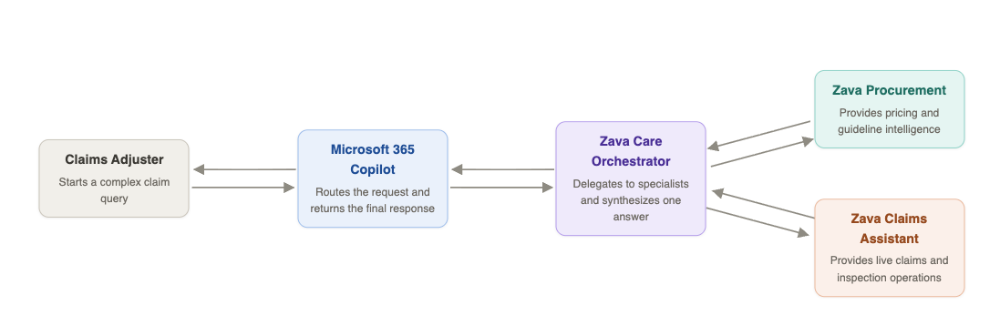
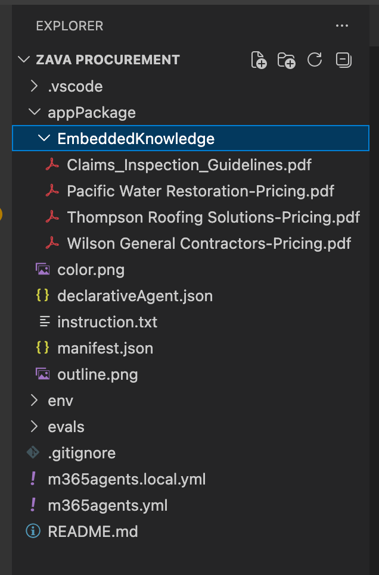
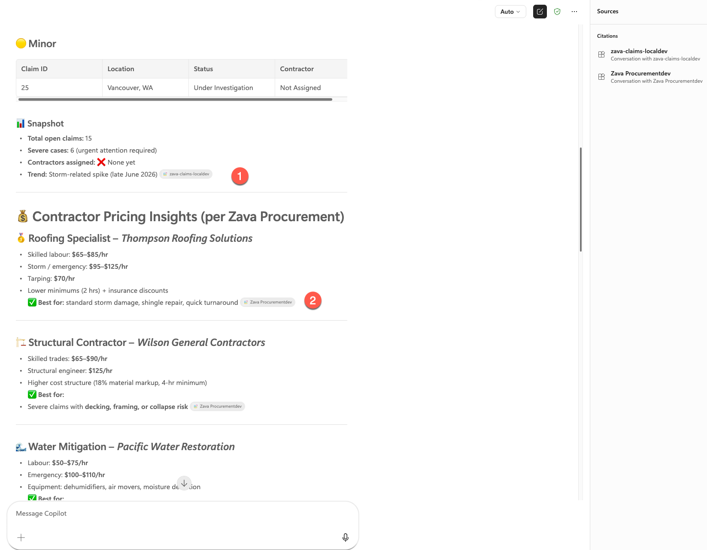

# Lab 09: Connected Agents - Zava's Multi-Agent Claims Orchestration

<div data-widget="hero"
    data-badge="Bundle B · Lab E9"
    data-badge-color="coral"
    data-icon="🕸️"
    data-title="Build Connected Agent Orchestration"
    data-subtitle="Create specialized agents and orchestrate them together so users get unified answers across pricing knowledge and live claims systems."
    data-time="120+ min"
    data-requires="Lab E8 (project running)"
    data-toolkit="Connected agents + embedded knowledge"></div>

<div data-widget="checklist"
    data-items="Specialized procurement agent created~EmbeddedKnowledge configured with pricing content|Orchestrator agent connected to multiple agents~Zava Care routes across procurement and claims capabilities|Hybrid responses validated~Combined embedded knowledge and MCP-backed live data in one conversation"></div>

## Key concepts before you build

<div data-widget="concepts"
    data-cards="Connected agent model::coral::Specialists coordinated by an orchestrator::Each agent handles a focused domain while an orchestrator unifies user interaction.||Embedded knowledge::teal::Fast local content grounding::Embedded files provide low-latency retrieval for stable content like pricing and policy references.||Hybrid architecture::blue::Live tools plus static knowledge::Combining MCP tools and embedded sources balances freshness, coverage, and response quality."></div>

In this lab, you'll build a multi-agent orchestration system for Zava Insurance. First, you'll create a **Zava Procurement** agent with embedded contractor pricing knowledge for instant pricing intelligence. Then, you'll create a **Zava Care** orchestrator agent that connects both **Zava Procurement** and **Zava Claims Assistant** (from Lab E8), enabling claims adjusters to access embedded pricing data and real-time claims information from the MCP server through a single, unified conversational interface.

<div class="lab-intro-video">
    <div style="flex: 1; min-width: 0;">
        <iframe  src="//www.youtube.com/embed/coGNxTRBfyw" frameborder="0" allowfullscreen style="width: 100%; aspect-ratio: 16/9;">          
        </iframe>
          <div>Get a quick overview of the lab in this video.</div>
            <div class="note-box">
            📘 <strong>Note:</strong>  Embedded knowledge in Agents Toolkit and Microsoft 365 Copilot is still in Preview.
        </div>
    </div>
    <div style="flex: 1; min-width: 0;">
  ---8<--- "e-labs-prelude.md"
    </div>
</div>

---


## What are Connected Agents?

**Connected Agents** represent the next evolution in AI agent architecture, enabling multiple specialized agents to work together seamlessly. Instead of building monolithic agents that try to do everything, Connected Agents orchestrate specialized agents, each optimized for specific tasks while maintaining a unified user experience.

> Connected agents in Declarative agent is still be in Public Preview.

### Benefits for Enterprise Workflows

For complex business scenarios like insurance claims processing, Connected Agents provide:

- **Domain expertise** from specialized agents
- **Comprehensive coverage** across multiple data sources
- **Efficient scaling** by adding focused agents
- **Consistent user experience** despite backend complexity
- **Maintainable architecture** with clear separation of concerns


## Scenario



---

## Exercise 1: Verify Your Lab E8 Environment

Before building the connected agents, confirm that your Lab E8 MCP server is still running and the **Zava Claims** agent is responding. This lab depends on it.

### Step 1: Start the MCP server and dev tunnel

1. Open the **ZavaClaims** project from Lab E8 in VS Code
2. Confirm **Azurite** is running (check the status bar or re-run the task if needed)
3. In the terminal, start the MCP server if it isn't already running:
   ```bash
   npm run start:mcp-http
   ```
4. Confirm your **dev tunnel** is active and the public URL is reachable. If it has expired, restart it from the **Microsoft 365 Agents Toolkit** panel → **Lifecycle** → **Start tunnel**

<cc-end-step lab="e9" exercise="1" step="1" />

### Step 2: Confirm the agent is working

1. Open a browser and go to [https://m365.cloud.microsoft/chat/](https://m365.cloud.microsoft/chat/){target=_blank}
2. Under **Agents**, find your **Zava Claims** agent from Lab E8
3. Send a quick test message: *"Show me all open claims"*
4. Confirm the agent responds with live claims data from the MCP server

If the agent is not responding or returns errors, revisit [Lab E8](./08-mcp-server.md) to restore the environment before continuing.

<cc-end-step lab="e9" exercise="1" step="2" />

---

## Exercise 2: Create a New Declarative Agent for Embedded knowledge


In this exercise, you'll use the Microsoft 365 Agents Toolkit to create a new Declarative Agent project that will use files stored locally in the project

### Step 1: Create New Agent using Microsoft 365 Agents Toolkit

1. Open **VS Code**
2. Click the **Microsoft 365 Agents Toolkit** icon in the Activity Bar (left sidebar)
3. Sign in with your Microsoft 365 developer account if prompted
4. In the Agents Toolkit panel, click **"Create a New Agent/App"**
5. Select **"Declarative Agent"** from the template options
6. Select **"No Action"** from the options
7. Select **Default folder**
8. Enter the application name - `Zava Procurement`. This will create the new agent and open up the project in a new VS Code window.


  <cc-end-step lab="e9" exercise="2" step="1" />

### Step 2: Download files to your machine

Go to [this url](https://download-directory.github.io/?url=https://github.com/microsoft/copilot-camp/tree/main/docs/assets/docs/extend-m365-copilot-09&filename=EmbeddedKnowledge){target=_blank} and extract all files.

<cc-end-step lab="e9" exercise="2" step="2" />

### Step 3: Understand how to add Embedded Knowledge Capability

1. Within this new project, go to the **Microsoft 365 Agents Toolkit** icon 1️⃣ in the Activity Bar (left sidebar) again
2. Go to **Development** 2️⃣ section and select **Add Capability**, 3️⃣ choose **Embedded Knowledge** 4️⃣.


3. Choose the **manifest.json** file as selected by default.
4. Select the downloaded EmbeddedKnowledge folder (extracted) and select all files to load. 
5. Continue loading and once done, you will have a new folder under **appPackage** called **EmbeddedKnowledge** with files as shown in the image below:



<cc-end-step lab="e9" exercise="2" step="3" />

## Exercise 3: Configure the Agent for Zava's contractor procurement knowledge

### Step 1: Update Agent Configuration and Description

Replace the content of `appPackage/declarativeAgent.json` with below configuration to add conversation starters:

```json
{
    "$schema": "https://developer.microsoft.com/json-schemas/copilot/declarative-agent/v1.7/schema.json",
    "version": "v1.7",
    "name": "Zava Procurement${{APP_NAME_SUFFIX}}",
    "description": "Declarative agent created with Microsoft 365 Agents Toolkit",
    "instructions": "$[file('instruction.txt')]",
     "conversation_starters": [
        {
            "title": "Water damage restoration pricing",
            "text": "What are the rates for emergency water extraction and drying services?"
        },
        {
            "title": "Roof repair cost estimate",
            "text": "I need pricing for a 2,000 sq ft asphalt shingle roof replacement"
        },
        {
            "title": "Find cheapest option",
            "text": "What's the most cost-effective contractor for basic drywall repair?"
        },
        {
            "title": "Structural repair costs",
            "text": "What are the rates for foundation repair and structural work?"
        },
        {
            "title": "Claims inspection guidelines",
            "text": "What are the standard procedures for documenting water damage claims?"
        },
        {
            "title": "Emergency services availability",
            "text": "Which contractors offer 24/7 emergency response and what are their rates?"
        }
    ],
    "capabilities": [
        {
            "name": "EmbeddedKnowledge",
            "files": [
                {
                    "file": "EmbeddedKnowledge/Claims_Inspection_Guidelines.pdf"
                },
                {
                    "file": "EmbeddedKnowledge/Pacific Water Restoration-Pricing.pdf"
                },
                {
                    "file": "EmbeddedKnowledge/Thompson Roofing Solutions-Pricing.pdf"
                },
                {
                    "file": "EmbeddedKnowledge/Wilson General Contractors-Pricing.pdf"
                }
            ]
        }
    ]
}
```

<cc-end-step lab="e9" exercise="3" step="1" />

### Step 2: Create Detailed Agent Instructions

```txt
# Role and Purpose
You are a procurement assistant for Zava, an insurance services company. Your primary purpose is to help insurance adjusters find appropriate and cost-effective contractors for property repair and restoration work.

# Core Capabilities
- Knowledge of construction and restoration pricing
- Familiarity with approved contractor networks
- Understanding of insurance service processes and requirements
- Ability to compare pricing across multiple vendors
- Knowledge of industry-standard repair methodologies

# Available Resources
You have access to internal pricing documents from Zava's network of pre-approved contractors:
- Pacific Water Restoration - Water and restoration services
- Thompson Roofing Solutions - Roofing repairs and replacements
- Wilson General Contractors - General construction and repair services
- Inspection Guidelines - Standard procedures and requirements

These pricing documents provide the information needed to give accurate cost estimates and vendor recommendations.

# Primary Responsibilities
1. Help adjusters identify appropriate contractors for specific repair needs
2. Provide accurate pricing information based on the embedded contractor rate sheets
3. Compare pricing across multiple approved vendors when applicable
4. Ensure recommendations align with inspection guidelines
5. Offer insights on cost-effectiveness and vendor specializations

# Interaction Guidelines
- Always base your responses on the information in the embedded knowledge files
- When providing pricing, cite the specific contractor and reference their rate sheet
- If a request falls outside the scope of available contractor services, clearly state this
- Prioritize accuracy - verify pricing details before responding
- Be concise and professional, as adjusters need quick, actionable information
- When comparing options, present information in a clear, organized format

# Scope Boundaries
- Only recommend contractors whose pricing documents you have access to
- Only provide pricing that is documented in your knowledge base
- Stay focused on procurement and vendor selection - refer policy questions to appropriate resources
- Keep pricing information for internal Zava use only

# Response Format
When answering queries:
1. Acknowledge the specific need (e.g., type of repair, scope of work)
2. Identify relevant contractor(s) from your knowledge base
3. Provide specific pricing information with clear references
4. Offer comparative analysis when multiple options exist
5. Include any relevant guidelines or considerations from inspection standards
```

!!! warning "Responsible AI Content Guidelines"
    If you encounter errors indicating that your "Declarative Copilot content violates Responsible AI guidelines", try simplifying the instructions. Remove complex role-playing scenarios, reduce detailed procedural steps, or use more neutral language. Start with basic task descriptions and gradually add complexity until you identify what triggers the violation.

<cc-end-step lab="e9" exercise="3" step="2" />

### Step 3: Update the Teams App Manifest

Open `appPackage/manifest.json` and update **name** and **description** with Zava's branding:

```json
{
....
    "name": {
        "short": "Zava Procurement${{APP_NAME_SUFFIX}}",
        "full": "Full name for Zava Procurement"
    },
    "description": {
        "short": "Get procurement data from embedded knowledge with Zava Procurement",
        "full": "Zava Procurement helps you access procurement data seamlessly within Microsoft 365 apps by leveraging embedded knowledge."
    },
   ....
}
```

<cc-end-step lab="e9" exercise="3" step="3" />

## Exercise 4: Test the Agent Integration

Test your Declarative Agent to ensure it can successfully retrieve contractor pricing data from it's native embedded knowledge.


### Step 1: Provision the Agent

In VS Code with your project open:

1. Open the **Microsoft 365 Agents Toolkit** panel
2. Click **"Provision"** in the Lifecycle section
4. Wait for provisioning to complete - this creates and uploads the agent package

<cc-end-step lab="e9" exercise="4" step="1" />

### Step 2: Test in Microsoft 365 Copilot

1. Open browser from the machine and go to Copilot chat using URL https://m365.cloud.microsoft/chat/ 
2. Under Agents on left hand side, find **"Zava Procurement"** agent
3. Try the conversation starters:

   - "What are the rates for emergency water extraction and drying services?"
   - "Which contractors offer 24/7 emergency response and what are their rates?"


  <cc-end-step lab="e9" exercise="4" step="2" />

  ---


## Exercise 5: Build the Orchestrator Agent 

In this exercise, you'll create a Connected Agent that orchestrates your existing Zava agents into a unified claims processing experience.

### Step 1: Create Connected Agent Project

1. Open **VS Code**
2. Click the **Microsoft 365 Agents Toolkit** icon in the Activity Bar
3. In the Agents Toolkit panel, click **"Create a New Agent/App"**
4. Select **"Declarative Agent"** from the template options
5. Select **"No Action"** 
6. Choose your default folder location
7. Enter the application name: `ZavaCare`

This creates a new Declarative Agent project, which you will then use to connect your existing two agents.

<cc-end-step lab="e9" exercise="5" step="1" />

### Step 2: Update Agent Configuration and Description

Replace the content of `appPackage/declarativeAgent.json` with Zava's configuration:

```json
{
    "$schema": "https://developer.microsoft.com/json-schemas/copilot/declarative-agent/v1.7/schema.json",
    "version": "v1.7",
    "name": "ZavaCare",
    "description": "Declarative agent created with Microsoft 365 Agents Toolkit",
    "instructions": "$[file('instruction.txt')]",
    "conversation_starters": [
        {
            "title": "Open roof damage claims ",
            "text": "Find all open roof damage claims that require emergency work, then recommend the top three approved contractors with 24/7 response coverage and include their latest pricing for tarping and temporary roof repairs. Prioritize by claim severity and estimated loss"
        }
    ]
}

```

<cc-end-step lab="e9" exercise="5" step="2" />

### Step 3: Create Detailed Agent Instructions

Update `appPackage/instruction.txt` with comprehensive instructions for the agent:

```plaintext
You are ZavaCare, an orchestrator agent for Zava Insurance. You coordinate two specialist agents to answer questions about claims and contractor costs. Never fabricate data — always delegate to the right agent.

## Your specialist agents

**Zava Claims** — use for anything about live claims data:
- Finding, filtering, and summarising claims by status, damage type, city, or date
- Retrieving inspections linked to a claim
- Listing approved contractors and their availability
- Checking purchase order status

**Zava Procurement** — use for contractor pricing from three approved vendors:
- **Pacific Water Restoration** — water extraction, drying, mold remediation, flood restoration
- **Thompson Roofing Solutions** — roofing repairs, emergency tarping, shingle replacement, storm damage
- **Wilson General Contractors** — structural repairs, foundation work, general construction and renovation

## Routing rules

| User asks about | Delegate to |
|---|---|
| Claim status, inspections, contractor lists | Zava Claims |
| Pricing, rate sheets, cost estimates | Zava Procurement |
| "Recommend a contractor with pricing" or similar | Both — get the contractor list from Zava Claims, rates from Zava Procurement |

## Example

**User:** "We have emergency storm claims from late June in Seattle and Tacoma — list the open urgent roof and wind damage claims ranked by estimated loss, then estimate response costs using Thompson Roofing's emergency rates."

**Your approach:**
1. Ask **Zava Claims** for all open or under-investigation roof and wind damage claims filed after June 25, 2026, filtered to Seattle, Tacoma, and surrounding WA cities.
2. Sort results by `estimatedLoss` descending and flag any with "URGENT" in the notes.
3. Ask **Zava Procurement** for Thompson Roofing Solutions' emergency tarping and temporary repair rates.
4. For each top claim, multiply the relevant rate by a rough scope estimate and present as a cost band.
5. Return a table: Claim # · Policyholder · City · Damage type · Estimated loss · URGENT flag · Estimated response cost.

## Response format

- Lead with a direct summary or table
- Cite the source for each data point (e.g. "per Zava Claims", "per Zava Procurement / Thompson Roofing")
- For multi-step requests, state your plan in one sentence before executing
- Flag missing data rather than guessing
```

<cc-end-step lab="e9" exercise="5" step="3" />

### Step 4: Configure Connected Agent Capabilities

To connect your orchestrator agent to the two specialized agents, you need to link them using their unique Microsoft 365 Title IDs.

#### 4.1: Get the Zava Claims Agent ID

1. **Open your ZavaClaims project** (created in Lab E8) in VS Code
2. Navigate to the `env/.env.dev` file
3. Find the `M365_TITLE_ID` value (looks like: `12345678-abcd-1234-abcd-123456789abc`)
4. **Copy this entire GUID** and paste it somewhere safe - label it as **Claims Agent ID**

#### 4.2: Get the Zava Procurement Agent ID

1. **Open your ZavaProcurement project** (created earlier in this lab) in VS Code
2. Navigate to the `env/.env.dev` file
3. Find the `M365_TITLE_ID` value
4. **Copy this entire GUID** and paste it somewhere safe - label it as **Procurement Agent ID**

#### 4.3: Connect the Agents

1. **Return to your ZavaCare project** (current project)
2. Open file `appPackage/declarativeAgent.json`
3. Locate the `conversation_starters` array (ends with `]`)
4. **Add a comma** after the closing bracket of `conversation_starters`
5. **Paste the following code** immediately after:

```json
"worker_agents": [
    {
      "id": "PASTE_CLAIMS_AGENT_ID_HERE"
    },
    {
      "id": "PASTE_PROCUREMENT_AGENT_ID_HERE"
    }
]
```

6. **Replace the placeholder values:**

   - Replace `PASTE_CLAIMS_AGENT_ID_HERE` with your **Claims Agent ID**
   - Replace `PASTE_PROCUREMENT_AGENT_ID_HERE` with your **Procurement Agent ID**

**Example of final structure:**
```json
{
  "conversation_starters": [
    { "title": "...", "text": "..." }
  ],
  "worker_agents": [
    {
      "id": "a1b2c3d4-e5f6-7890-abcd-ef1234567890"
    },
    {
      "id": "9876fedc-ba09-8765-4321-abcdef123456"
    }
  ]
}
```

7. **Save the file** - your orchestrator agent is now connected to both specialized agents!

<cc-end-step lab="e9" exercise="5" step="4" />

## Exercise 6: Test Connected Agent Orchestration

### Step 1: Provision the Connected Agent

1. In VS Code, open the **Microsoft 365 Agents Toolkit** panel
2. Click **"Provision"** in the Lifecycle section  
3. Wait for provisioning to complete

<cc-end-step lab="e9" exercise="6" step="1" />

### Step 2: Test Multi-Agent Workflows


1. Open browser from the machine and go to Copilot chat using URL https://m365.cloud.microsoft/chat/ 
2. Under Agents on left hand side, find **Zava Care** agent and test below orchestrated workflow:


**Complex Workflow : Emergency Coordination**  
```
Find me all open roof damage claims along with contractor pricing insights.
```
Test the conversation starters of this agent as well to understand how multi-agent co-ordination works.
Notice how Zava Care orchestrated calls to both the Zava Claims agent 1️⃣ for live claims data and the Zava Procurement agent 2️⃣ for contractor pricing — demonstrating seamless multi-agent collaboration. 


<cc-end-step lab="e9" exercise="6" step="2" />

---8<--- "e-congratulations.md"


<cc-award badgeId="DeclarativePioneer" badgeName="Declarative Pioneer" />
<cc-award badgeId="ConnectionChampion" badgeName="Connection Champion" />

<div data-widget="labnav"></div>

