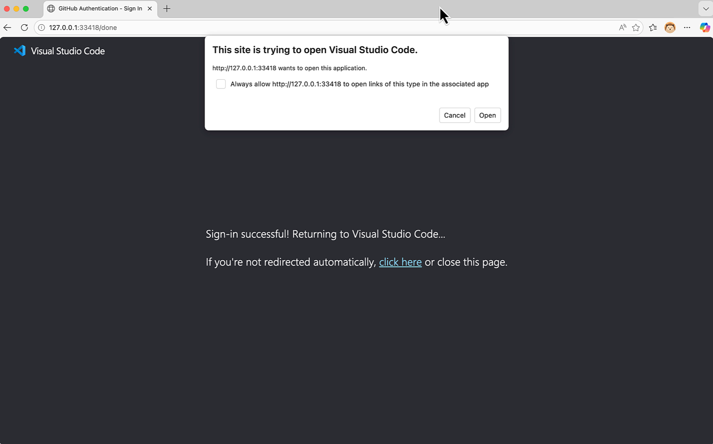
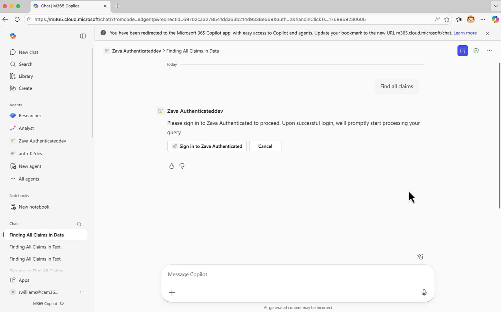
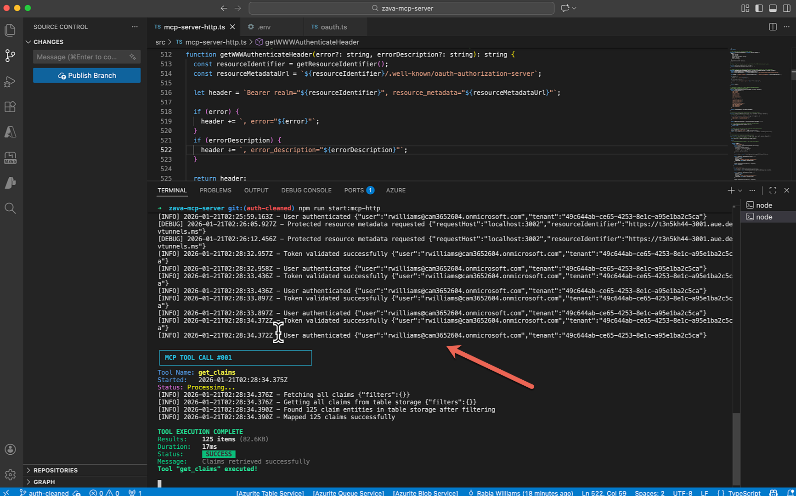

# Lab 10: Connect Declarative Agent to OAuth-Protected MCP Server

In this lab, you'll run an **OAuth 2.0 protected** Model Context Protocol (MCP) server for Zava Insurance's claims system and integrate it with a Declarative Agent in Microsoft 365 Copilot. While Lab 08 demonstrates an anonymous MCP server, this lab adds **Microsoft Entra ID authentication** for secure, enterprise-grade access to claims data.

  ---8<--- "e-labs-prelude.md"

## Scenario

Building on the MCP server Lab 08, **Zava Insurance** now needs to secure their claims operations system for production use. While the anonymous MCP server was excellent for development and testing, the security team requires OAuth 2.0 authentication before deploying to production. The development team must now integrate **Microsoft Entra ID** authentication to ensure only authorized users can access sensitive claims data. This authenticated MCP server will validate JWT tokens, implement scope-based permissions, and comply with **RFC 9728** for protected resource metadata discovery, enabling secure integration with **Microsoft 365 Copilot** Declarative Agents.

---

## 🎯 Lab Objectives

By completing this lab, you will:

- Set up Microsoft Entra ID app registration for OAuth 2.0 authentication
- Configure environment variables for secure MCP server operation
- Build and run Zava's OAuth-protected MCP server
- Understand how JWT token validation works with Microsoft Entra ID
- Create a Declarative Agent that authenticates with the protected MCP server
- Test the agent with authenticated natural language queries

---

## 📚 Prerequisites

Before starting this lab, ensure you have:

- **Node.js 22+** installed on your machine
- **VS Code** with **Microsoft 365 Agents Toolkit extension** v6.4.2 or higher
- **Microsoft 365 developer account** with Copilot license
- **Azure subscription** with access to Microsoft Entra ID (for app registration)
- Basic knowledge of TypeScript/JavaScript, REST APIs, JSON, and OAuth 2.0
- GitHub account for VS Code Dev Tunnels
- Completion of **Lab 08** (recommended but not required)

---

## Exercise 1: Set Up Your Development Environment

In this exercise, you'll clone Zava's authenticated MCP server codebase and set up your local development environment.

### Step 1: Clone the Repository

Open your terminal and run:

```bash
git clone https://github.com/microsoft/copilot-camp.git
cd copilot-camp/src/extend-m365-copilot/path-e-lab10-mcp-auth/zava-mcp-serve
```
<cc-end-step lab="e10" exercise="1" step="1" />

### Step 2: Install Dependencies

Install all required packages:

```bash
npm install
```

This installs key dependencies.

<cc-end-step lab="e10" exercise="1" step="2" />

### Step 3: Examine the Project Structure

Open the project in VS Code:

```bash
code .
```

Key directories:

- `src/` - TypeScript source code
- `src/auth/` - OAuth authentication module (new in this lab)
- `data/` - Sample JSON data files

The `src/auth/oauth.ts` file contains the OAuth 2.0 implementation for token validation and protected resource metadata.

<cc-end-step lab="e10" exercise="1" step="3" />

Your codebase is now ready with sample data and authentication support.

---

## Exercise 2: Create Microsoft Entra ID App Registration

Before running the authenticated MCP server, you need to register an application in Microsoft Entra ID to handle OAuth 2.0 authentication.

### Step 1: Create App Registration

1. Go to [Azure Portal](https://portal.azure.com) → **Microsoft Entra ID** → **App registrations**
2. Click **New registration**
3. Configure:
   - **Name**: `Zava Claims MCP Server`
   - **Supported account types**: `Accounts in any organizational directory (Any Microsoft Entra ID tenant - Multitenant) and personal Microsoft accounts (e.g. Skype, Xbox)`
   - **Redirect URI**: Leave blank for now (we'll configure this in the next step)
4. Click **Register**
5. **Copy the Application (client) ID** - you'll need this later

<cc-end-step lab="e10" exercise="2" step="1" />

### Step 2: Configure Platform Redirect URIs

After registration, configure redirect URIs for different platforms. **Redirect URIs** are critical in OAuth 2.0 authentication—they specify where Microsoft Entra ID sends the user (along with authorization tokens) after successful authentication. Each redirect URI must exactly match a URL your application uses to receive these tokens, ensuring that authorization codes and tokens are only sent to legitimate, registered endpoints.

1. Go to **Authentication** in the left navigation

2. **Add the first Web redirect URI**:
   - Click **Add a platform** (or if using the new preview UI, click **Add redirect URI**)
   - Select **Web**
   - Add the first redirect URI: `https://teams.microsoft.com/api/platform/v1.0/oAuthRedirect`
   - Click **Configure**

3. **Add additional redirect URIs**:
   - After the initial configuration, click **Add URI** (or **Edit** in the preview UI) to add more redirect URIs
   - Add: `https://vscode.dev/redirect`
   - Click **Save**

4. **Add the localhost redirect URI via Manifest**:
   
    !!! warning "Important: Non-HTTPS URIs require manual configuration"
        The Azure Portal UI only supports adding redirect URIs that use HTTPS or `localhost`. Since MCP Inspector uses `http://127.0.0.1:33418` (not `localhost`), you must add this URI manually through the app manifest.

   - Go to **Manifest** in the left navigation
   - Find the `"web"` section and locate `"redirectUriSettings"` (or `"redirectUris"` in some manifest versions)
   - Add `http://127.0.0.1:33418` to the redirect URIs array. The section should look similar to:
     ```json
     "web": {
         "redirectUris": [
             "https://teams.microsoft.com/api/platform/v1.0/oAuthRedirect",
             "https://vscode.dev/redirect",
             "http://127.0.0.1:33418"
         ],
         ...
     }
     ```
   - Click **Save** at the top of the page

5. **Verify your configuration**:
   - Go back to **Authentication** 
   - Under **Platform configurations** → **Web**, confirm all three redirect URIs are listed:
     - `https://teams.microsoft.com/api/platform/v1.0/oAuthRedirect`
     - `https://vscode.dev/redirect`
     - `http://127.0.0.1:33418`
   - Under **Implicit grant and hybrid flows**, ensure both options remain **unchecked** (disabled)

<cc-end-step lab="e10" exercise="2" step="2" />

### Step 3: Create Client Secret

1. Go to **Certificates & secrets** → **Client secrets**
2. Click **New client secret**
3. Add description (e.g., `zava-mcp-secret`) and select expiration (recommended: 24 months)
4. Click **Add**
5. **Copy the secret value immediately** - it won't be shown again!

<cc-end-step lab="e10" exercise="2" step="3" />

### Step 4: Expose an API

1. Go to **Expose an API**
2. Click **Add** next to **Application ID URI** and accept the default format: `api://your-client-id`
3. Click **Add a scope** and configure:
   - **Scope name**: `access_as_user`
   - **Who can consent**: Admins and users
   - **Admin consent display name**: `Access Zava Claims System`
   - **Admin consent description**: `Allows the app to access Zava Claims data on behalf of the signed-in user`
   - **User consent display name**: `Access Zava Claims System`
   - **User consent description**: `Allows this app to access your Zava Claims data on your behalf`
   - **State**: Enabled
4. Click **Add scope**

Your Microsoft Entra ID app registration is now complete!

<cc-end-step lab="e10" exercise="2" step="4" />

---

## Exercise 3: Configure Environment and Start Local Database

In this exercise, you'll configure the OAuth environment variables and start the local database.

### Step 1: Set Up Public Access with Dev Tunnel

You need a public HTTPS URL for your MCP server before configuring environment variables.

1. In VS Code's terminal panel, select the **Ports** tab
2. Click **Forward a Port** and enter port `3001`

    !!! note "GitHub authentication may be required"
        If this is your first time using Dev Tunnels in VS Code, you may be prompted to sign in with your GitHub account. Complete the authentication to continue.

3. Right-click the forwarded port address and select **Port Visibility** → **Public**
4. Copy the tunnel URL (e.g., `https://abc123def456.use.devtunnels.ms`)

**Save this URL** - you'll need it for the environment configuration.

<cc-end-step lab="e10" exercise="3" step="1" />

### Step 2: Configure Environment Variables

Create a new `.env` file in the **root** of the `zava-mcp-server` directory (at the same level as `package.json`, not inside the `src` folder):

!!! warning "Important: File location matters"
    The `.env` file must be created in the project root directory. If you create it inside the `src` folder or elsewhere, the environment variables will not be loaded correctly.

```bash
# OAuth Configuration (Required for authentication)
OAUTH_CLIENT_ID=<your-application-client-id>
OAUTH_CLIENT_SECRET=<your-client-secret-value>
OAUTH_AUTHORITY=https://login.microsoftonline.com/common
OAUTH_REDIRECT_URI=http://localhost:6274/oauth/callback/debug
OAUTH_SCOPES=api://<your-application-client-id>/access_as_user

# Resource Identifier (for MCP Inspector and RFC 9728 metadata)
RESOURCE_IDENTIFIER=<your-tunnel-url>

# CORS Configuration
ADDITIONAL_ALLOWED_ORIGINS=<your-tunnel-url>,http://localhost:6274
SERVER_BASE_URL=<your-tunnel-url>

# Server Configuration
PORT=3001
HOST=127.0.0.1
NODE_ENV=development

# Storage Configuration
AZURE_STORAGE_CONNECTION_STRING="DefaultEndpointsProtocol=http;AccountName=devstoreaccount1;AccountKey=Eby8vdM02xNOcqFlqUwJPLlmEtlCDXJ1OUzFT50uSRZ6IFsuFq2UVErCz4I6tq/K1SZFPTOtr/KBHBeksoGMGw==;TableEndpoint=http://127.0.0.1:10002/devstoreaccount1;"
```

Replace the placeholders:

- `<your-application-client-id>` - Application (client) ID from Entra ID app registration
- `<your-client-secret-value>` - Client secret value you copied
- `<your-tunnel-url>` - Dev tunnel URL from Step 1 (e.g., `https://abc123def456.use.devtunnels.ms`)

<cc-end-step lab="e10" exercise="3" step="2" />

### Step 3: Start Azure Storage Emulator

In **Terminal 1**, start the Azurite emulator:

```bash
npm run start:azurite
```

You should see:
```
Azurite Blob service is starting at http://127.0.0.1:10000
Azurite Queue service is starting at http://127.0.0.1:10001
Azurite Table service is starting at http://127.0.0.1:10002
```

**Keep this terminal running** - it's your local database server.

<cc-end-step lab="e10" exercise="3" step="3" />

### Step 4: Load Sample Claims Data

In **Terminal 2**, initialize Zava's sample data:

```bash
npm run init-data
```

This loads realistic data including:

- **Claims** - Storm damage, water damage, fire damage cases
- **Contractors** - Roofing specialists, water restoration, general contractors
- **Inspections** - Scheduled and completed inspection tasks
- **Inspectors** - Available field inspectors with specialties

You should see confirmation messages for all tables being initialized.

<cc-end-step lab="e10" exercise="3" step="4" />

---

## Exercise 4: Launch the OAuth-Protected MCP Server

Now you'll start Zava's authenticated MCP server that validates OAuth tokens before allowing access.

### Step 1: Build and Start the MCP Server

In **Terminal 2** (keeping Azurite running in Terminal 1):

```bash
npm run build
npm run start:mcp-http
```

You should see a message indicating OAuth is enabled:
```
🚀 Zava Claims MCP HTTP Server started on 127.0.0.1:3001
Security: OAuth 2.0 authentication enabled
...
🔍 Protected Resource Metadata Endpoints (RFC 9728):
    GET  /.well-known/oauth-authorization-server - Standard OAuth metadata
...
```

<cc-end-step lab="e10" exercise="4" step="1" />

### Step 2: Verify OAuth is Enabled

Open a browser and visit:
```
http://127.0.0.1:3001/health
```

You should see a JSON response confirming OAuth is enabled:

```json
{
  "status": "healthy",
  "timestamp": "2025-01-21T10:00:00.000Z",
  "service": "zava-claims-mcp-server",
  "authentication": "OAuth enabled"
}
```

Notice the `"authentication": "OAuth enabled"` - this confirms the server is running in authenticated mode.

<cc-end-step lab="e10" exercise="4" step="2" />

### Step 3: Test OAuth Discovery Endpoint

Visit the OAuth discovery endpoint:
```
http://127.0.0.1:3001/.well-known/oauth-authorization-server
```

You should see OAuth metadata including:

- `issuer` - Your server's base URL
- `authorization_endpoint` - Microsoft login URL
- `token_endpoint` - Token exchange URL
- `scopes_supported` - Available OAuth scopes

This RFC 9728 compliant endpoint allows MCP clients to discover authentication requirements.

<cc-end-step lab="e10" exercise="4" step="3" />

### Step 4: Verify Authentication is Required

Try accessing the MCP tools without authentication:

```bash
curl -X POST "http://127.0.0.1:3001/mcp/tools/call" \
  -H "Content-Type: application/json" \
  -d '{"name":"get_claims","arguments":{}}'
```

You should receive a 401 Unauthorized response with a `WWW-Authenticate` header:

```json
{
  "error": "Missing Authorization header",
  "description": "Please include Bearer token in Authorization header",
  "auth_url": "https://your-tunnel-url/oauth/authorize",
  "resource_metadata_url": "https://your-tunnel-url/.well-known/oauth-authorization-server"
}
```

This confirms that authentication is working correctly.

<cc-end-step lab="e10" exercise="4" step="4" />

---


## Exercise 5: Create a New Declarative Agent Project

In this exercise, you'll use the Microsoft 365 Agents Toolkit to create a new Declarative Agent project that connects to Zava's authenticated claims system.

### Step 1: Create New Agent using Microsoft 365 Agents Toolkit

1. Open a new window in **VS Code**
2. Click the **Microsoft 365 Agents Toolkit** icon in the Activity Bar (left sidebar)
3. Sign in with your Microsoft 365 developer account if prompted
4. In the Agents Toolkit panel, click **Create a New Agent/App**
5. Select **Declarative Agent** from the template options
6. Choose **Add an Action** to add to your agent
7. Select **Start with an MCP server (preview)**
8. Enter the publicly accessible MCP Server URL from Exercise 3 (your tunnel URL + `/mcp/messages`)
9. Choose the default folder to scaffold the agent (or choose a preferred location)
10. When prompted for project details, enter:
    - **Application Name**: `Zava Claims Assistant (Auth)`

<cc-end-step lab="e10" exercise="5" step="1" />

### Step 2: Configure MCP Server Authentication

You'll be directed to the newly created project with the `.vscode/mcp.json` file open. This is the MCP server configuration file.

1. Select the **Start** button to fetch tools from your server
2. A dialog appears indicating that your MCP Server requires authentication and doesn't support Dynamic Client Registration. You'll need to register manually
3. Since you already configured your Entra ID with the redirect URIs (`https://vscode.dev/redirect` and `http://127.0.0.1:33418`), select **Copy URIs & Proceed**
4. The Agents Toolkit wizard prompts for OAuth credentials. Enter the client ID and secret from your Entra ID app registration
5. The toolkit asks you to authenticate with your MCP Server
6. A browser opens to the Microsoft Entra ID authorization endpoint (`https://login.microsoftonline.com/...`). Sign in with your Microsoft 365 account. After successful authentication, you'll be redirected to `http://127.0.0.1:33418` where you'll see the sign-in success screen. Close the browser and return to your project



<cc-end-step lab="e10" exercise="5" step="2" />

### Step 3: Add Tools and Provision the Agent

1. The server is now started. You'll see the number of tools and prompts available
2. Select **ATK: Fetch action from MCP** to choose which tools to add to the agent

    !!! note "Don't see the ATK: Fetch action from MCP option?"
        If you don't see the **ATK: Fetch action from MCP** option, try restarting VS Code and reopening the project.

3. When prompted, select the plugin manifest file you want to update (typically `appPackage/ai-plugin.json`)
4. Select the `get_claims` tool for testing
5. When prompted to configure the agent in Teams Developer Portal, follow the directions
6. Select Authentication Type: **OAuth (with static registration)**. The toolkit creates your plugin manifest
7. Select **Provision** to provision the agent to your tenant
8. The wizard prompts for the client ID and secret again. Enter them as before. This is for OAuth registration with the Developer Portal - the toolkit doesn't store these credentials
9. Add scope: `api://<your-client-id>/access_as_user`
10. Select **Confirm** to start provisioning

Once provisioned, notice how the Developer Portal token is automatically created for the agent and appears in the `.env.dev` file as a variable like `MCP_DA_AUTH_ID_XXXX`.

!!! note "OAuth registration in Developer Portal"
    Read more about configuring [OAuth registration in Developer Portal](https://learn.microsoft.com/en-us/microsoftteams/platform/messaging-extensions/api-based-oauth#configure-oauth-in-developer-portal). Here Agents Toolkit automatically configures it for your agent.

You now have a Declarative Agent connected to your OAuth-protected MCP Server.

<cc-end-step lab="e10" exercise="5" step="3" />

---

## Exercise 6: Test the Authenticated Agent Integration

Test your Declarative Agent to ensure it can successfully authenticate and communicate with the OAuth-protected MCP server.

### Step 1: Ensure MCP Server is Running

Before testing, verify your MCP server from previous exercises is still running:

1. Open the window where the zava-mcp-server project is running
2. Verify Azurite is running: `npm run start:azurite`
3. Verify MCP server is running: `npm run start:mcp-http`
4. Verify the Dev Tunnel port forwarding is active

<cc-end-step lab="e10" exercise="6" step="1" />

### Step 2: Test in Microsoft 365 Copilot

1. Open Copilot at [https://m365.cloud.microsoft/chat/](https://m365.cloud.microsoft/chat/)
2. In the left sidebar under **Agents**, find and select **Zava Claims Assistant (Auth)**
3. Type a prompt like: "Find all claims"
4. Copilot may first ask you to confirm sending data to the plugin. Select **Confirm** or **Allow** to proceed
5. The agent then prompts you to sign in before fetching data. Select **Sign in**



6. After signing in, the agent responds with the claims information
7. Check the MCP Server project's terminal - you'll see the successful authentication and tool call



<cc-end-step lab="e10" exercise="6" step="2" />


---

## 🎉 Congratulations!

You've successfully created and deployed Zava Insurance's **OAuth-protected** Declarative Agent that securely integrates with their authenticated MCP server.

### What You Accomplished

- ✅ Created a Microsoft Entra ID app registration for OAuth 2.0
- ✅ Configured environment variables for secure authentication
- ✅ Ran an OAuth-protected MCP server with JWT token validation
- ✅ Tested RFC 9728-compliant OAuth discovery endpoints
- ✅ Created a Declarative Agent with authenticated MCP integration
- ✅ Tested secure natural language queries with claims data

### Key Differences from Lab 08

| Aspect | Lab 08 (Anonymous) | Lab 10 (Authenticated) |
|--------|-------------------|----------------------|
| Authentication | None - all endpoints public | OAuth 2.0 with Microsoft Entra ID |
| Token Validation | None | JWT validation against JWKS |
| Security Headers | None | WWW-Authenticate with metadata URLs |
| Discovery | None | RFC 9728 protected resource metadata |
| Enterprise Ready | Development only | Production-ready security |

<cc-next />


### 🔗 Additional Resources
- **Build declarative agents for Microsoft 365 Copilot with MCP**:[https://devblogs.microsoft.com/microsoft365dev/build-declarative-agents-for-microsoft-365-copilot-with-mcp/](https://devblogs.microsoft.com/microsoft365dev/build-declarative-agents-for-microsoft-365-copilot-with-mcp/)

- **MCP Protocol Documentation**: [https://modelcontextprotocol.io/](https://modelcontextprotocol.io/)
- **Microsoft Entra ID Documentation**: [https://docs.microsoft.com/en-us/azure/active-directory/](https://docs.microsoft.com/en-us/azure/active-directory/)
- **RFC 9728 - OAuth 2.0 Protected Resource Metadata**: [https://datatracker.ietf.org/doc/html/rfc9728](https://datatracker.ietf.org/doc/html/rfc9728)
- **Azure Table Storage**: [Azure Documentation](https://docs.microsoft.com/en-us/azure/storage/tables/)
