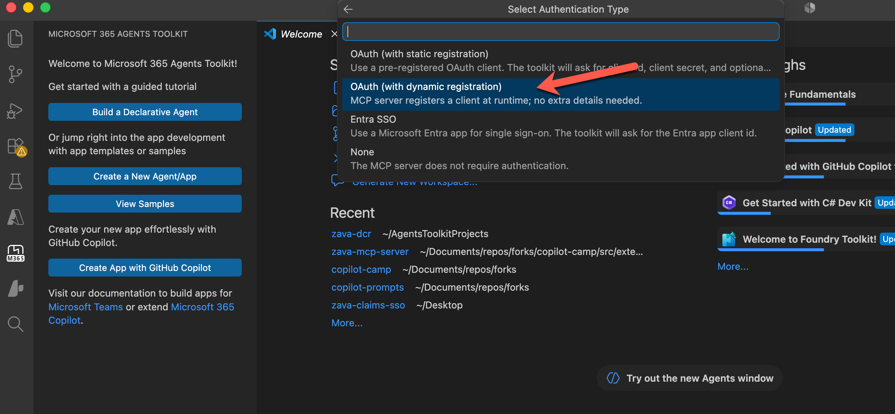
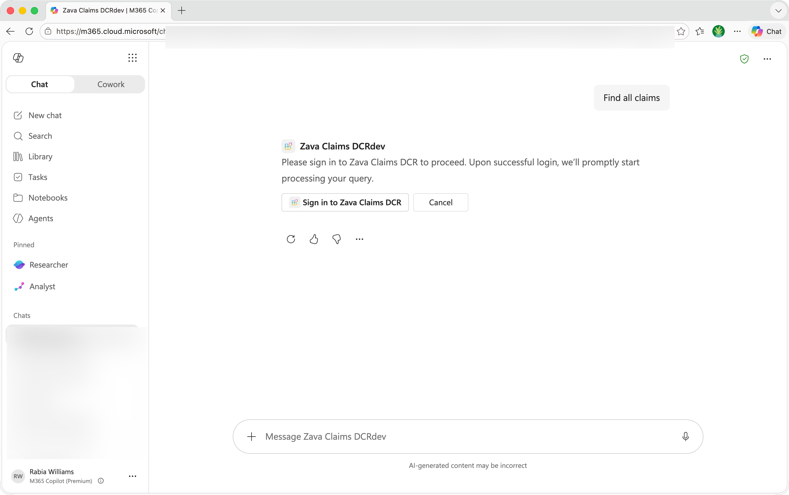
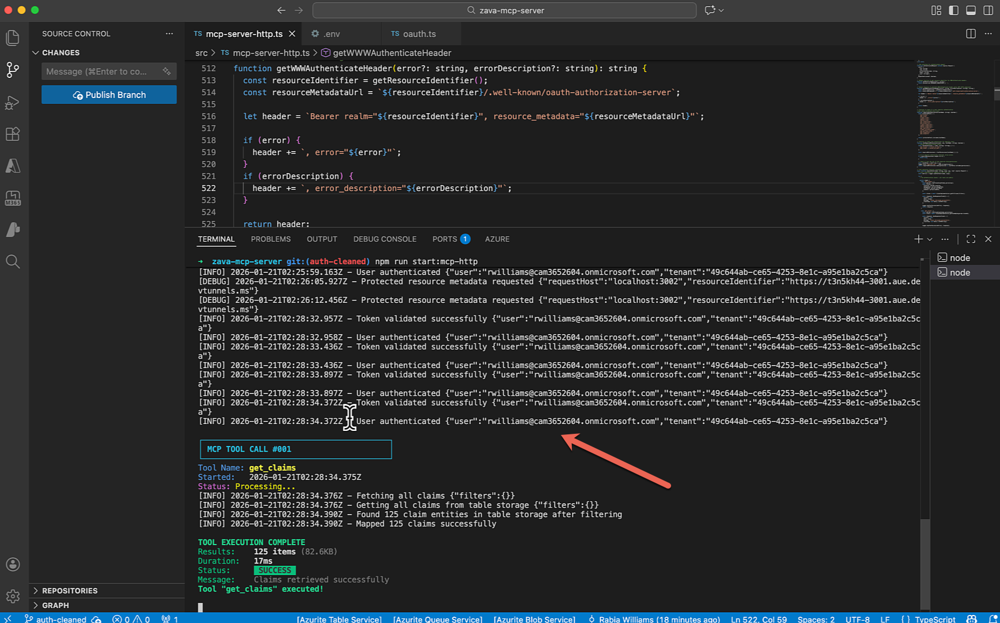

# Lab 10: Connect Declarative Agent to OAuth-Protected MCP Server

<div data-widget="hero"
  data-badge="Bundle A · Lab E10"
  data-badge-color="purple"
  data-icon="🛡️"
  data-subtitle="Upgrade the MCP integration from anonymous development mode to authenticated, enterprise-ready access control."
  data-time="40-60 min"
  data-requires="Foundation on Lab E8 recommended"
  data-toolkit="Azure Portal access to create Entra ID app"></div>

<div data-widget="checklist"
  data-items="Entra app registration configured~Client ID, scope, and redirect settings established|OAuth-enabled MCP server running~JWT validation, DCR, and protected metadata endpoints active|Authenticated Declarative Agent validated~Copilot prompts succeed with dynamic client registration and authorized token flow"></div>

## Key concepts before you build

<div data-widget="concepts"
  data-cards="Protected MCP resources::purple::Authentication required for tool execution::Unlike E8, protected endpoints require valid tokens before tool handlers run.||Dynamic Client Registration (DCR)::teal::RFC 7591 automatic client registration::ATK reads the server's .well-known endpoint and registers the client automatically—no manual client ID or secret entry required.||Dynamic tools::green::Runtime tool discovery::ATK auto-generates a DT-ready manifest that resolves the server's tools at runtime, with no manual tool declaration needed.||JWT validation::blue::Trust and claims verification::The server validates issuer, audience, and claims to ensure only authorized access reaches claims data.||Production hardening path::amber::From demo to enterprise controls::E10 demonstrates the minimum identity/security upgrades needed before broader deployment."></div>

In this lab, you'll run an **OAuth 2.0 protected** Model Context Protocol (MCP) server for Zava Insurance's claims system and integrate it with a Declarative Agent in Microsoft 365 Copilot. While Lab 08 demonstrates an anonymous MCP server, this lab adds **Microsoft Entra ID authentication** with **Dynamic Client Registration (DCR)** for secure, enterprise-grade access to claims data. With **Agents Toolkit (ATK) 6.12.0+**, the toolkit handles client registration automatically via RFC 7591, and **dynamic tools** resolve at runtime—so you never need to manually declare tools in your manifest.

  ---8<--- "e-labs-prelude.md"


## Scenario

<div data-widget="arch"
  data-rows="row::Claims Adjuster::tunnel::Asks Copilot for claims help|Microsoft 365 Copilot::copilot::Routes requests to Declarative Agent||label::Declarative Agent requests MCP tools with OAuth token (DCR + PKCE)||row::Declarative Agent::agent::Dynamic tools resolved at runtime via DT-ready manifest|Microsoft Entra ID::purple::Issues access tokens · supports DCR (RFC 7591)||label::OAuth-protected MCP validates JWT + scope before tool execution||row::MCP Server (Node.js)::mcp::Protected tools + RFC 9728 metadata + DCR endpoint|Claims Data::data::Sensitive records only returned to authorized requests"></div>

---

<div data-widget="callout"
  data-type="warn"
  data-title="Before you begin this lab"
  data-body="If Lab E8 is still running, stop all related terminal processes first (for example Azurite, MCP server, and Inspector). Then close the previous MCP server project window. This lab uses a different OAuth-protected MCP server, so start with a clean terminal/session state to avoid port and configuration conflicts."></div>

## Exercise 1: Set Up Your Development Environment

In this exercise, you'll clone Zava's authenticated MCP server codebase and set up your local development environment.

<div data-widget="callout"
  data-type="info"
  data-title="Exercise outcome"
  data-body="By the end of this exercise, your authenticated MCP server project is cloned, dependencies are installed, and the auth module structure is ready to use."></div>

### Step 1: Clone the Repository

Open your terminal and run:

```bash
git clone https://github.com/microsoft/copilot-camp.git
cd copilot-camp/src/extend-m365-copilot/path-e-lab10-mcp-auth/zava-mcp-server
```

<cc-end-step lab="e10" exercise="1" step="1" />

### Step 2: Install Dependencies

Install all required packages:

```bash
npm install
```

This installs key dependencies.

<cc-end-step lab="e10" exercise="1" step="2" />

### Step 3: Examine the Project Structure

Open the project in VS Code:

```bash
code .
```

Key directories:

- `src/` - TypeScript source code
- `src/auth/` - OAuth authentication module (new in this lab)
- `data/` - Sample JSON data files

The `src/auth/oauth.ts` file contains the OAuth 2.0 implementation for token validation and protected resource metadata.

<cc-end-step lab="e10" exercise="1" step="3" />

Your codebase is now ready with sample data and authentication support.

---

## Exercise 2: Create Microsoft Entra ID App Registration

Before running the authenticated MCP server, you need to register an application in Microsoft Entra ID to handle OAuth 2.0 authentication.

<div data-widget="callout"
  data-type="concept"
  data-title="Exercise outcome"
  data-body="By the end of this exercise, your Entra app registration has redirect URIs, client secret, and an API scope ready for OAuth token flows."></div>

### Step 1: Create App Registration

1. Go to [Azure Portal](https://portal.azure.com) → **Microsoft Entra ID** → **App registrations**
2. Click **New registration**
3. Configure:
   - **Name**: `Zava Claims MCP Server`
   - **Supported account types**: `Accounts in any organizational directory (Any Microsoft Entra ID tenant - Multitenant) and personal Microsoft accounts (e.g. Skype, Xbox)`
   - **Redirect URI**: Leave blank for now (we'll configure this in the next step)
4. Click **Register**
5. **Copy the Application (client) ID** and **Directory (tenant) ID** - you'll need this later

<cc-end-step lab="e10" exercise="2" step="1" />

### Step 2: Configure Platform Redirect URIs

After registration, configure redirect URIs for different platforms. **Redirect URIs** are critical in OAuth 2.0 authentication—they specify where Microsoft Entra ID sends the user (along with authorization tokens) after successful authentication. Each redirect URI must exactly match a URL your application uses to receive these tokens, ensuring that authorization codes and tokens are only sent to legitimate, registered endpoints.

<div data-widget="callout"
  data-type="tip"
  data-title="DCR simplifies redirect URI management"
  data-body="With Dynamic Client Registration (RFC 7591), ATK automatically registers redirect URIs for VS Code and MCP Inspector. You only need to manually add the Teams redirect URI for the Copilot integration."></div>

1. Go to **Authentication** in the left navigation

2. **Add the Web redirect URI**:
   - Click **Add a platform** (or if using the new preview UI, click **Add redirect URI**)
   - Select **Web**
   - Add the redirect URI: `https://teams.microsoft.com/api/platform/v1.0/oAuthRedirect`
   - Click **Configure**

3. **Verify your configuration**:
   - Go back to **Authentication** 
   - Under **Platform configurations** → **Web**, confirm the redirect URI is listed:
     - `https://teams.microsoft.com/api/platform/v1.0/oAuthRedirect`
   - Under **Implicit grant and hybrid flows**, ensure both options remain **unchecked** (disabled)

<cc-end-step lab="e10" exercise="2" step="2" />

### Step 3: Create Client Secret

1. Go to **Certificates & secrets** → **Client secrets**
2. Click **New client secret**
3. Add description (e.g., `zava-mcp-secret`) and select expiration (recommended: 24 months)
4. Click **Add**
5. **Copy the secret value immediately** - it won't be shown again!

<cc-end-step lab="e10" exercise="2" step="3" />

### Step 4: Expose an API

1. Go to **Expose an API**
2. Click **Add** next to **Application ID URI** and accept the default format: `api://your-client-id`
3. Click **Add a scope** and configure:
   - **Scope name**: `access_as_user`
   - **Who can consent**: Admins and users
   - **Admin consent display name**: `Access Zava Claims System`
   - **Admin consent description**: `Allows the app to access Zava Claims data on behalf of the signed-in user`
   - **User consent display name**: `Access Zava Claims System`
   - **User consent description**: `Allows this app to access your Zava Claims data on your behalf`
   - **State**: Enabled
4. Click **Add scope**

Your Microsoft Entra ID app registration is now complete!

<cc-end-step lab="e10" exercise="2" step="4" />

---

## Exercise 3: Configure Environment and Start Local Database

In this exercise, you'll configure the OAuth environment variables and start the local database.

<div data-widget="callout"
  data-type="info"
  data-title="Exercise outcome"
  data-body="By the end of this exercise, your tunnel URL and .env configuration are in place, and local claims data is running in Azurite."></div>

### Step 1: Set Up Public Access with Dev Tunnel

Copilot and OAuth clients need a public HTTPS address to reach your local MCP server. Create that endpoint first using VS Code Dev Tunnel.

<div data-widget="callout"
  data-type="concept"
  data-title="Why this step comes first"
  data-body="You will use this tunnel URL in your &lt;code&gt;.env&lt;/code&gt; settings (for resource identifier, CORS, and server base URL). Without it, OAuth and MCP metadata wiring will fail."></div>

#### 1: Forward port 3001

1. In VS Code's terminal panel, select the **Ports** tab.
2. Click **Forward a Port** and enter port `3001`.

#### 2: Make it public

1. Right-click the forwarded port address and select **Port Visibility** → **Public**.
2. Copy the tunnel URL (for example: `https://abc123def456.use.devtunnels.ms`).

<div data-widget="callout"
  data-type="warn"
  data-title="GitHub sign-in may be required"
  data-body="If this is your first time using Dev Tunnels in VS Code, sign in with your GitHub account when prompted before continuing."></div>

Save this URL. You'll use it in the next step for environment configuration.

<cc-end-step lab="e10" exercise="3" step="1" />

### Step 2: Configure Environment Variables

Create a new folder `env` and inside it create a `.env.dev` file in the **root** of the `zava-mcp-server` directory (at the same level as `package.json`, not inside the `src` folder):

!!! warning "Important: File location matters"
    The `.env.dev` file must be created in the project root directory. If you create it inside the `src` folder or elsewhere, the environment variables will not be loaded correctly.

```bash
# OAuth 2.0 Resource Server
# Single-tenant: use your tenant ID in the issuer URL and set OAUTH_VALIDATE_ISSUER=true
# Multitenant: use /common in the issuer URL, set OAUTH_VALIDATE_ISSUER=false, and provide OAUTH_ACCEPTED_TENANT_IDS
OAUTH_ACCEPTED_ISSUERS=https://login.microsoftonline.com/<YOUR_TENANT_ID_OR_common>/v2.0
OAUTH_ACCEPTED_AUDIENCES=api://<YOUR_CLIENT_ID>
OAUTH_REQUIRED_SCOPES=api://<YOUR_CLIENT_ID>/access_as_user
OAUTH_VALIDATE_ISSUER=false
OAUTH_ACCEPTED_TENANT_IDS=<YOUR_TENANT_ID>
OAUTH_JWKS_URIS=https://login.microsoftonline.com/<YOUR_TENANT_ID_OR_common>/discovery/v2.0/keys

# Client credentials for DCR token exchange
OAUTH_CLIENT_ID=<YOUR_CLIENT_ID>
OAUTH_CLIENT_SECRET=<YOUR_CLIENT_SECRET>

# Authorization endpoints for MCP client discovery
OAUTH_AUTHORIZATION_ENDPOINT=https://login.microsoftonline.com/<YOUR_TENANT_ID_OR_common>/oauth2/v2.0/authorize
OAUTH_TOKEN_ENDPOINT=https://login.microsoftonline.com/<YOUR_TENANT_ID_OR_common>/oauth2/v2.0/token

# Server
RESOURCE_IDENTIFIER=https://<YOUR_DEVTUNNEL_OR_DOMAIN>
SERVER_BASE_URL=https://<YOUR_DEVTUNNEL_OR_DOMAIN>
PORT=3001
HOST=127.0.0.1
NODE_ENV=development

# CORS (comma-separated origins)
ADDITIONAL_ALLOWED_ORIGINS=http://localhost:6274,https://<YOUR_DEVTUNNEL_OR_DOMAIN>

# Azure Table Storage (Azurite for local dev)
AZURE_STORAGE_CONNECTION_STRING="UseDevelopmentStorage=true"

```

Replace the placeholders:

- `<YOUR_CLIENT_ID>` - Application (client) ID from Entra ID app registration
- `<YOUR_CLIENT_SECRET>` - Client secret value from Exercise 2, Step 3
- `<YOUR_DEVTUNNEL_OR_DOMAIN>` - Dev tunnel URL from Step 1 (e.g., `https://abc123def456.use.devtunnels.ms`)
- `<YOUR_TENANT_ID>` - Directory (tenant) ID from Entra ID app registration

<cc-end-step lab="e10" exercise="3" step="2" />

### Step 3: Start Azure Storage Emulator

In **Terminal 1**, start the Azurite emulator:

```bash
npm run start:azurite
```

You should see:
```
Azurite Blob service is starting at http://127.0.0.1:10000
Azurite Queue service is starting at http://127.0.0.1:10001
Azurite Table service is starting at http://127.0.0.1:10002
```

**Keep this terminal running** - it's your local database server.

<cc-end-step lab="e10" exercise="3" step="3" />

### Step 4: Load Sample Claims Data

In **Terminal 2**, initialize Zava's sample data:

```bash
npm run init-data
```

This loads realistic data including:

- **Claims** - Storm damage, water damage, fire damage cases
- **Contractors** - Roofing specialists, water restoration, general contractors
- **Inspections** - Scheduled and completed inspection tasks
- **Inspectors** - Available field inspectors with specialties

You should see confirmation messages for all tables being initialized.

<cc-end-step lab="e10" exercise="3" step="4" />

---

## Exercise 4: Launch the OAuth-Protected MCP Server

Now you'll start Zava's authenticated MCP server that validates OAuth tokens before allowing access.

<div data-widget="callout"
  data-type="tip"
  data-title="Exercise outcome"
  data-body="By the end of this exercise, the MCP server is running with OAuth enabled, metadata discovery works, and unauthenticated tool calls are correctly rejected."></div>

### Step 1: Build and Start the MCP Server

Before building, confirm that your `env/.env.dev` file includes the `OAUTH_CLIENT_ID` and `OAUTH_CLIENT_SECRET` values from Exercise 2. The MCP server needs these credentials to complete the DCR token exchange with Microsoft Entra ID.

In **Terminal 2** (keeping Azurite running in Terminal 1):

```bash
npm run build
npm run start:mcp-http
```

You should see a message indicating OAuth is enabled:
```
🚀 Zava Claims MCP HTTP Server started on 127.0.0.1:3001
Security: OAuth 2.0 authentication enabled
...
🔍 Protected Resource Metadata Endpoints (RFC 9728):
    GET  /.well-known/oauth-authorization-server - Standard OAuth metadata
...
```

<cc-end-step lab="e10" exercise="4" step="1" />

### Step 2: Verify OAuth is Enabled

Open a browser and visit your Dev Tunnel health endpoint:
```
https://<YOUR_DEVTUNNEL_HOST>/health
```

You should see a JSON response confirming OAuth is enabled:

```json
{
  "status": "healthy",
  "timestamp": "2025-01-21T10:00:00.000Z",
  "service": "zava-claims-mcp-server",
  "authentication": "OAuth enabled"
}
```

Notice the `"authentication": "OAuth enabled"` - this confirms the server is running in authenticated mode and reachable via your public tunnel URL.

<cc-end-step lab="e10" exercise="4" step="2" />

### Step 3: Copy the Well-Known Authorization Server URL

Visit the OAuth discovery endpoint using your Dev Tunnel host:
```
https://<YOUR_DEVTUNNEL_HOST>/.well-known/oauth-authorization-server
```

You should see OAuth metadata including:

- `issuer` - Your server's base URL
- `authorization_endpoint` - Microsoft login URL
- `token_endpoint` - Token exchange URL
- `registration_endpoint` - DCR endpoint for dynamic client registration (RFC 7591)
- `scopes_supported` - Available OAuth scopes

**Copy this full URL** (`https://<YOUR_DEVTUNNEL_HOST>/.well-known/oauth-authorization-server`). You'll need it in Exercise 5 when updating the `wellKnownAuthorizationServer` value in `m365agents.yml` for DCR.

This RFC 9728 compliant endpoint allows MCP clients (and ATK) to discover authentication requirements and perform Dynamic Client Registration.

<cc-end-step lab="e10" exercise="4" step="3" />

### Step 4: Verify Authentication is Required

Try accessing the MCP tools without authentication:

```bash
curl -X POST "http://127.0.0.1:3001/mcp/tools/call" \
  -H "Content-Type: application/json" \
  -d '{"name":"get_claims","arguments":{}}'
```

You should receive a 401 Unauthorized response with a `WWW-Authenticate` header:

```json
{
  "error": "Missing Authorization header",
  "description": "Please include Bearer token in Authorization header",
  "auth_url": "https://your-tunnel-url/oauth/authorize",
  "resource_metadata_url": "https://your-tunnel-url/.well-known/oauth-authorization-server"
}
```

This confirms that authentication is working correctly.

<cc-end-step lab="e10" exercise="4" step="4" />

---


## Exercise 5: Create a New Declarative Agent Project

In this exercise, you'll use the Microsoft 365 Agents Toolkit to create a new Declarative Agent project that connects to Zava's authenticated claims system. With **ATK 6.12.0+**, the toolkit supports **Dynamic Client Registration (DCR)** per RFC 7591 and **dynamic tools** by default—so the agent scaffolding handles OAuth registration and tool discovery automatically.

<div data-widget="callout"
  data-type="info"
  data-title="Exercise outcome"
  data-body="By the end of this exercise, you have a provisioned Declarative Agent wired to the OAuth-protected MCP server. DCR handles client registration automatically, and dynamic tools resolve at runtime with no manual tool declaration."></div>

### Step 1: Create New Agent using Microsoft 365 Agents Toolkit

1. Open a new window in **VS Code**
2. Click the **Microsoft 365 Agents Toolkit** icon in the Activity Bar (left sidebar)
3. Sign in with your Microsoft 365 developer account if prompted
4. In the Agents Toolkit panel, click **Create a New Agent/App**
5. Select **Declarative Agent** from the template options
6. Choose **Add an Action** to add to your agent
7. Select **Start with an MCP server**
8. Enter the publicly accessible MCP Server URL from Exercise 3 (your tunnel URL + `/mcp/messages`)
9. Choose Authentication Type **OAuth(with dynamic registration)**

10. Choose the default folder to scaffold the agent (or choose a preferred location)
11. When prompted for project details, enter:
    - **Application Name**: `Zava Claims Assistant (Auth)`

ATK auto-generates a **DT-ready manifest** that resolves the server's tools (including any MCP-app UI widgets) at runtime. You don't need to manually declare individual tools—**dynamic tools are on by default**.

After the project is scaffolded, open `m365agents.yml` in the project root. Find the `dcr/register` action and replace the `wellKnownAuthorizationServer` placeholder with the URL you copied in Exercise 4, Step 3:

```yaml
- uses: dcr/register
  with:
    wellKnownAuthorizationServer: https://<YOUR_DEVTUNNEL_HOST>/.well-known/oauth-authorization-server
```

<div data-widget="callout"
  data-type="tip"
  data-title="Pinning a fixed toolset"
  data-body="If you prefer a fixed set of tools instead of dynamic resolution, you can pin specific tools with a single <strong>ATK: Fetch action from MCP</strong> step later. This is optional and not required for most scenarios."></div>

<cc-end-step lab="e10" exercise="5" step="1" />

### Step 2: Provision the Agent

1. Open the Microsoft 365 Agents Toolkit panel
2. Click **Provision** in the **Lifecycle** section

ATK reads the server's `.well-known` endpoint, registers the client, creates the auth config in the **Enterprise token store**, and updates the manifest—all automatically.

Once provisioned, the Developer Portal token is automatically created for the agent and appears in the `.env.dev` file as a variable like `MCP_DA_AUTH_ID_XXXX`.

<div data-widget="callout"
  data-type="tip"
  data-title="Pinning specific tools (optional)"
  data-body="By default, all MCP tools are resolved dynamically at runtime. If you want to pin a specific subset of tools instead, select<strong>ATK: Fetch action from MCP</strong>choose the plugin manifest file (<code>appPackage/ai-plugin.json</code>), and select the tools you want to include (e.g., <code>get_claims</code>). This converts the agent from dynamic to static tool resolution."></div>

!!! note "OAuth registration in Developer Portal"
    Read more about configuring [OAuth registration in Developer Portal](https://learn.microsoft.com/en-us/microsoftteams/platform/messaging-extensions/api-based-oauth#configure-oauth-in-developer-portal). With DCR, Agents Toolkit handles this configuration automatically.

You now have a Declarative Agent connected to your OAuth-protected MCP Server with Dynamic Client Registration.

<cc-end-step lab="e10" exercise="5" step="2" />

---

## Exercise 6: Test the Authenticated Agent Integration

Test your Declarative Agent to ensure it can successfully authenticate and communicate with the OAuth-protected MCP server.

<div data-widget="callout"
  data-type="tip"
  data-title="Exercise outcome"
  data-body="By the end of this exercise, you verify sign-in, token-based tool calls, and successful authenticated responses in Copilot."></div>

### Step 1: Ensure MCP Server is Running

Before testing, verify your MCP server from previous exercises is still running:

1. Open the window where the zava-mcp-server project is running
2. Verify Azurite is running: `npm run start:azurite`
3. Verify MCP server is running: `npm run start:mcp-http`
4. Verify the Dev Tunnel port forwarding is active

<cc-end-step lab="e10" exercise="6" step="1" />

### Step 2: Test in Microsoft 365 Copilot

1. Open Copilot at [https://m365.cloud.microsoft/chat/](https://m365.cloud.microsoft/chat/)
2. In the left sidebar under **Agents**, find and select **Zava Claims Assistant (Auth)**
3. Type a prompt like: "Find all claims"
4. Copilot may first ask you to confirm sending data to the plugin. Select **Confirm** or **Allow** to proceed
5. The agent then prompts you to sign in before fetching data. Select **Sign in**



6. After signing in, the agent responds with the claims information
7. Check the MCP Server project's terminal - you'll see the successful authentication and tool call



<cc-end-step lab="e10" exercise="6" step="2" />


---

---8<--- "e-congratulations.md"


<cc-award badgeId="DeclarativePioneer" badgeName="Declarative Pioneer" />
<cc-award badgeId="MCPIntegrator" badgeName="MCP Integrator" />

<div data-widget="labnav"></div>


