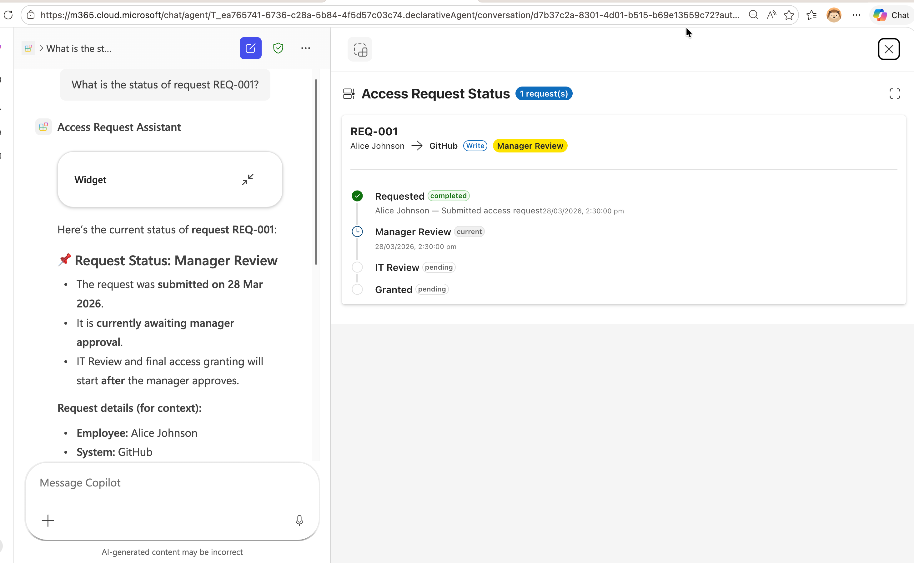
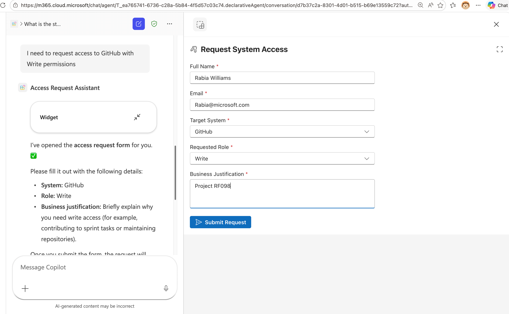
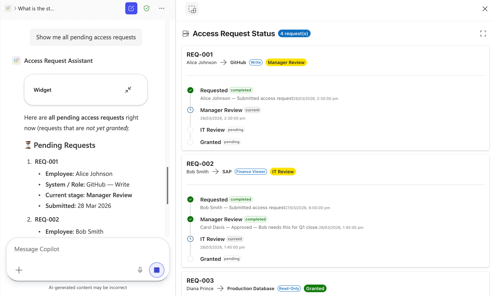

# Lab 11: Build an MCP App with Interactive Widgets

In this lab, you'll run a Model Context Protocol (MCP) app that powers an **Access Request & Approval Workflow** with interactive widgets rendered directly in the AI agent's response. You'll explore the existing tools, add a new **Status Timeline** widget, and integrate the MCP server into a Declarative Agent using Microsoft 365 Agents Toolkit.


## Scenario

**Contoso Corp** manages access requests across multiple systems like GitHub, SAP, Production Database, and more. Today, employees email their managers, who forward requests to IT, leading to delays and lost context. The IT team wants a streamlined, AI-powered approval workflow where employees can submit access requests, managers can approve or reject them, and everyone can track the status, all through natural language conversations with an AI agent.

The development team has built an **MCP app** with interactive widgets that render rich UI directly inside the agent's response:

- **Request Form Widget** — lets employees fill out and submit access requests
- **Approval Panel Widget** — lets managers review, approve, or reject pending requests

In this lab, you'll run the base app, explore its tools with MCP Inspector, **add a Status Timeline widget** so anyone can track the progress of a request, and then connect the MCP server to a Declarative Agent in Microsoft 365 Copilot.

---

## 🎯 Lab Objectives

By completing this lab, you will:

- Understand how MCP apps serve interactive widgets alongside tool results
- Run and test an existing MCP app with request and approval widgets
- Use MCP Inspector to explore tools
- Add a new **Status Timeline** widget and its corresponding server tool
- Integrate the MCP server into a Declarative Agent using Microsoft 365 Agents Toolkit
- Test the full workflow in Microsoft 365 Copilot

---

## � What Are MCP Apps with Interactive Widgets?

Standard MCP tools return plain text or JSON, useful for data retrieval, but limited when users need to fill out forms, review dashboards, or interact with visual components. **MCP apps** extend the Model Context Protocol to deliver **interactive UI widgets** directly inside the AI agent's response, turning a chat conversation into a full application experience.

### Why Interactive Widgets?

Traditional AI agent responses are text-based. When an agent retrieves data, it can summarize it in a message but users often need to **do** something with that data: submit a form, approve a request, explore a chart, or drill into details. Interactive widgets solve this by rendering rich, functional UI components alongside the agent's response:

- **Forms and inputs** — employees can fill out structured data without leaving the conversation
- **Dashboards and visualizations** — display KPIs, timelines, and status indicators with color-coded visual cues
- **Action panels** — managers can approve, reject, or take action directly from the widget
- **Fullscreen mode** — widgets can expand to fullscreen for complex interactions

### How It Works

An MCP app pairs each tool with a **UI resource** — a self-contained HTML file (built with React, Fluent UI, or any web framework) that renders the tool's structured data as an interactive widget. When the AI host calls a tool:

1. The **tool handler** runs on the server and returns `structuredContent` (the data)
2. The **UI resource** (HTML widget) is loaded by the host and receives the data via the [MCP Apps SDK](https://modelcontextprotocol.github.io/ext-apps/api/documents/Overview.html)
3. The widget renders the data as interactive UI and can **call back to the server** using `app.callServerTool()` for actions like submitting forms or recording decisions

### Cross-Platform Support

One of the key benefits of building MCP apps is **portability across AI platforms**. The same MCP server with interactive widgets works as a connector in:

| Platform | SDK | Status |
|----------|-----|--------|
| **ChatGPT** | [OpenAI Apps SDK](https://developers.openai.com/apps-sdk) | Supported |
| **Claude** | MCP Apps SDK | Supported |
| **Microsoft 365 Copilot** | MCP Apps SDK (via Declarative Agents) | Supported |

Microsoft 365 Copilot supports UI widgets created using both the **MCP Apps** standard and the **OpenAI Apps SDK**, meaning widgets you build for ChatGPT can also run in Copilot and vice versa. The platform provides a [component bridge](https://learn.microsoft.com/en-us/microsoft-365-copilot/extensibility/declarative-agent-ui-widgets#supported-capabilities) that maps capabilities between the two SDKs.

This means you can **build once and deploy across multiple AI hosts**, reaching users wherever they work.


---

## �📚 Prerequisites

Before starting this lab, ensure you have:

- **Node.js 22+** installed on your machine
- **VS Code** with **Microsoft 365 Agents Toolkit extension** pre-release version (6.7.2026032008 when this lab was written)
- **Microsoft 365 developer account** 
- Basic knowledge of **TypeScript**, **React**, and **JSON**
- GitHub account for using VS Code tunneling

---

## Exercise 1: Set Up and Run the Base MCP App

In this exercise, you'll clone the project, install dependencies, seed sample data, and start the MCP server.

### Step 1: Clone the Repository

Download the MCP app source code directly:

[Download approval-mcpapp](https://download-directory.github.io/?url=https://github.com/microsoft/copilot-camp/tree/main/src/extend-m365-copilot/path-e-lab11-mcp-app-start/approval-mcpapp&filename=approval-mcpapp){target=_blank}

Once downloaded, extract the zip file, then open the extracted `approval-mcpapp` folder in VS Code:

1. Open **VS Code**
2. Go to **File → Open Folder** and select the extracted `approval-mcpapp` folder
3. Open a new **Terminal** in VS Code (**Terminal → New Terminal**)

All terminal commands in this lab should be run inside this VS Code terminal.

<cc-end-step lab="e11" exercise="1" step="1" />

### Step 2: Install Dependencies

Install all required packages:

```bash
npm install
```

This installs key dependencies:

- `@modelcontextprotocol/sdk` — MCP protocol implementation
- `@modelcontextprotocol/ext-apps` — MCP Apps SDK for interactive widgets
- `@fluentui/react-components` — Fluent UI React component library
- `@azure/data-tables` — Azure Table Storage client (used with Azurite emulator)
- `express` — HTTP server framework
- `zod` — Runtime type validation
- `vite` / `vite-plugin-singlefile` — Builds each widget into a single self-contained HTML file

<cc-end-step lab="e11" exercise="1" step="2" />

### Step 3: Start Azure Storage Emulator

The app uses Azurite (a local Azure Table Storage emulator) to store access request data. In **Terminal 1**, start the emulator:

```bash
npm run start:azurite
```

You should see:
```
Azurite Table service is starting at http://127.0.0.1:10002
```

**Keep this terminal running** as it's your local database.

<cc-end-step lab="e11" exercise="1" step="3" />

### Step 4: Seed Sample Data

In **Terminal 2**, load the sample access requests:

```bash
npm run seed
```

You should see:
```
  ✓ upserted request REQ-001 (Alice Johnson)
  ✓ upserted request REQ-002 (Bob Smith)
  ✓ upserted request REQ-003 (Diana Prince)
  ✓ upserted counter requestId = 4

✓ Seed complete.
```

The sample data includes three access requests at different stages:

| Request | Employee | System | Status |
|---------|----------|--------|--------|
| REQ-001 | Alice Johnson | GitHub | Manager Review |
| REQ-002 | Bob Smith | SAP | IT Review |
| REQ-003 | Diana Prince | Production Database | Granted |

<cc-end-step lab="e11" exercise="1" step="4" />

### Step 5: Build and Start the MCP Server

Still in **Terminal 2**, build the UI widgets and start the server:

```bash
npm start
```

You should see output indicating that the UI entry points were built and the server is running:
```
Found 2 UI entry point(s): approval-panel.html, request-form.html

Building ui/approval-panel.html...
Building ui/request-form.html...

✓ Built 2 UI entry point(s) successfully.

🚀 Access Request & Approval MCP Server listening on http://localhost:3001/mcp
```

Your MCP app is now running with two interactive widget tools.

<cc-end-step lab="e11" exercise="1" step="5" />

### Step 6: Examine the Project Structure

Key files and directories:

| Path | Purpose |
|------|---------|
| `server.ts` | Registers all MCP tools and their UI widget resources |
| `main.ts` | Express server entry point, handles HTTP transport |
| `mock-data/requests.ts` | Data access layer for Azurite table storage |
| `src/request-form/App.tsx` | React widget — access request form |
| `src/approval-panel/App.tsx` | React widget — manager approval panel |
| `ui/` | HTML entry points for each widget |
| `fixtures/` | Sample JSON data for seeding |
| `build-ui.mjs` | Builds each widget into a single self-contained HTML file |

Take a moment to review `server.ts`. Notice how each widget tool is registered using `registerToolWithUI()`, which pairs:

1. A **tool** (callable by the AI agent) that returns structured data
2. A **UI resource** (an HTML file) that renders the data as an interactive widget

```typescript
registerToolWithUI(
  server,
  "request-access",       // tool name
  "Request Access",       // title
  "Shows an access request form...",  // description
  "request-form.html",   // UI resource file
  { /* input schema */ },
  (args) => { /* handler returning structured data */ },
);
```

<cc-end-step lab="e11" exercise="1" step="6" />

---

## Exercise 2: Explore Existing Tools with MCP Inspector

In this exercise, you'll use the MCP Inspector to understand the tools currently available in the MCP app.

### Step 1: Launch MCP Inspector

In **Terminal 3** (keeping Azurite and the MCP server running), install and launch MCP Inspector:

```bash
npx @modelcontextprotocol/inspector --transport http --server-url http://localhost:3001/mcp
```

This opens a web interface where you can test MCP tools as if you were an AI agent.

<cc-end-step lab="e11" exercise="2" step="1" />

### Step 2: Review Available Apps and Tools

In the MCP Inspector interface, select the **Connect** command and you'll see the following:

**Apps** (render interactive UI):

- `request-access` — Shows the access request form widget
- `approve-access` — Shows the approval panel widget for managers

**Tools** (called by widgets via `app.callServerTool()`):

- `Submit Access Request (submit-request)` — Creates a new access request (called from the request form)
- `Submit Approval Decision (submit-decision)` — Records approve/reject decisions (called from the approval panel)
- `Get Access Request (get-request)` — Fetches a single request by ID (used by widgets to refresh data)

<cc-end-step lab="e11" exercise="2" step="2" />

### Step 3: Test the Request Access Tool

1. Activate the **Tools** section and click on the `request-access` tool
2. Optionally fill in `employeeName` with `"Test User"` and `employeeEmail` with `test@contoso.com`
3. Click **"Run Tool"**
4. Observe the response, it returns structured data with available systems and roles that the widget uses to populate its dropdowns
5. Now activate the **Apps** section and click on the `request-access` app
6. Optionally fill in `employeeName` with `"Test User"` and `employeeEmail` with `test@contoso.com`
7. Click on **Open App**
8. Observe the UI of the widget rendering the request access form with the data of the user and the data retrieved from the `request-access` tool response you inspected before
9. Fill in the form and select **Submit Request**
10. You will be able to see the custom UI for the response

<cc-end-step lab="e11" exercise="2" step="3" />

### Step 4: Test the Approve Access Tool

1. Activate the **Tools** section and click on the `approve-access` tool
2. Enter `requestId`: `REQ-001`
3. Click **"Run Tool"**
4. Observe the response, it returns Alice Johnson's request details including her full timeline
5. Now activate the **Apps** section and click on the `approve-access` app
6. Enter `requestId`: `REQ-001`
7. Click on **Open App**
8. Observe the UI of the widget rendering the request access and allowing you to approve or reject the request
9. Select the **Approve** command
10. You will be able to see the UI updated with your response

You can also run `approve-access` without a `requestId` to see all pending requests.

While the MCP Inspector shows the raw JSON responses in the **Tools** panel and renders the widgets HTML in the **Apps** panel, when these tools are called through an MCP-compatible host (like Microsoft 365 Copilot), the corresponding widget HTML is rendered as an interactive UI component.

<cc-end-step lab="e11" exercise="2" step="4" />

---

## Exercise 3: Add the Status Timeline Widget

Now you'll add a new tool,  `access-status` that shows a visual timeline of an access request's progress through the approval stages: Requested → Manager Review → IT Review → Granted/Rejected.

### Step 1: Create the Status Timeline Widget Component

Create a new directory and file for the Status Timeline widget:

```bash
mkdir -p src/status-timeline
```

Create the file `src/status-timeline/App.tsx` with the following content:

```tsx
// src/status-timeline/App.tsx — Status Timeline Widget
import { App } from "@modelcontextprotocol/ext-apps";
import {
  FluentProvider,
  webLightTheme,
  webDarkTheme,
  Card,
  CardHeader,
  Text,
  Badge,
  Button,
  Spinner,
  Divider,
  makeStyles,
  tokens,
} from "@fluentui/react-components";
import {
  CheckmarkCircle20Filled,
  Circle20Regular,
  Clock20Regular,
  DismissCircle20Filled,
  ArrowRight20Regular,
  Timeline20Regular,
  FullScreenMaximize24Regular,
  FullScreenMinimize24Regular,
} from "@fluentui/react-icons";
import { createRoot } from "react-dom/client";
import { useState, useEffect, useCallback } from "react";

// ─── Types ───────────────────────────────────────────────────────────
interface TimelineEntry {
  stage: string;
  status: "completed" | "current" | "pending" | "rejected";
  actor?: string;
  comment?: string;
  timestamp: string;
}

interface AccessRequest {
  id: string;
  employeeName: string;
  employeeEmail: string;
  system: string;
  role: string;
  status: string;
  createdAt: string;
  updatedAt: string;
  timeline: TimelineEntry[];
}

interface StatusData {
  requests: AccessRequest[];
  error?: string;
}

// ─── Styles ──────────────────────────────────────────────────────────
const useStyles = makeStyles({
  root: {
    padding: tokens.spacingVerticalL,
    backgroundColor: tokens.colorNeutralBackground1,
    minHeight: "100%",
    overflowY: "auto",
  },
  header: {
    display: "flex",
    alignItems: "center",
    gap: tokens.spacingHorizontalS,
    marginBottom: tokens.spacingVerticalL,
  },
  card: {
    marginBottom: tokens.spacingVerticalM,
    padding: tokens.spacingVerticalM,
  },
  requestSummary: {
    display: "flex",
    flexWrap: "wrap",
    gap: tokens.spacingHorizontalS,
    alignItems: "center",
    marginBottom: tokens.spacingVerticalS,
  },
  timeline: {
    position: "relative",
    paddingLeft: "28px",
    marginTop: tokens.spacingVerticalM,
  },
  timelineTrack: {
    position: "absolute",
    left: "9px",
    top: "0",
    bottom: "0",
    width: "2px",
    backgroundColor: tokens.colorNeutralStroke2,
  },
  timelineItem: {
    position: "relative",
    paddingBottom: tokens.spacingVerticalM,
    "&:last-child": {
      paddingBottom: "0",
    },
  },
  timelineIcon: {
    position: "absolute",
    left: "-28px",
    top: "0",
    width: "20px",
    height: "20px",
    display: "flex",
    alignItems: "center",
    justifyContent: "center",
    backgroundColor: tokens.colorNeutralBackground1,
    zIndex: 1,
  },
  timelineContent: {
    paddingLeft: tokens.spacingHorizontalS,
  },
  timelineRow: {
    display: "flex",
    alignItems: "center",
    gap: tokens.spacingHorizontalXS,
  },
  actorComment: {
    marginTop: tokens.spacingVerticalXXS,
    color: tokens.colorNeutralForeground3,
  },
  empty: {
    display: "flex",
    flexDirection: "column",
    alignItems: "center",
    gap: tokens.spacingVerticalM,
    padding: tokens.spacingVerticalXXL,
    color: tokens.colorNeutralForeground3,
  },
  loading: {
    display: "flex",
    justifyContent: "center",
    alignItems: "center",
    height: "200px",
  },
});

// ─── Timeline Step Icon ──────────────────────────────────────────────
function StepIcon({ status }: { status: TimelineEntry["status"] }) {
  switch (status) {
    case "completed":
      return (
        <CheckmarkCircle20Filled
          style={{ color: tokens.colorPaletteGreenForeground1 }}
        />
      );
    case "current":
      return (
        <Clock20Regular
          style={{ color: tokens.colorPaletteBlueForeground2 }}
        />
      );
    case "rejected":
      return (
        <DismissCircle20Filled
          style={{ color: tokens.colorPaletteRedForeground1 }}
        />
      );
    case "pending":
    default:
      return (
        <Circle20Regular style={{ color: tokens.colorNeutralStroke2 }} />
      );
  }
}

// ─── Single Request Timeline Card ────────────────────────────────────
function RequestTimelineCard({ request }: { request: AccessRequest }) {
  const styles = useStyles();

  const overallStatusColor = (status: string) => {
    switch (status) {
      case "Granted":
        return "success" as const;
      case "Rejected":
        return "danger" as const;
      case "Manager Review":
      case "IT Review":
        return "warning" as const;
      default:
        return "brand" as const;
    }
  };

  const stepBadgeColor = (status: TimelineEntry["status"]) => {
    switch (status) {
      case "completed":
        return "success" as const;
      case "current":
        return "informative" as const;
      case "rejected":
        return "danger" as const;
      default:
        return "subtle" as const;
    }
  };

  return (
    <Card className={styles.card}>
      <CardHeader
        header={
          <Text weight="bold" size={400}>
            {request.id}
          </Text>
        }
        description={
          <div className={styles.requestSummary}>
            <Text size={200}>{request.employeeName}</Text>
            <ArrowRight20Regular style={{ fontSize: "12px" }} />
            <Text size={200} weight="semibold">
              {request.system}
            </Text>
            <Badge appearance="outline" size="small">
              {request.role}
            </Badge>
            <Badge
              appearance="filled"
              color={overallStatusColor(request.status)}
            >
              {request.status}
            </Badge>
          </div>
        }
      />

      <Divider style={{ margin: `${tokens.spacingVerticalXS} 0` }} />

      <div className={styles.timeline}>
        <div className={styles.timelineTrack} />
        {request.timeline.map((entry, idx) => (
          <div key={idx} className={styles.timelineItem}>
            <div className={styles.timelineIcon}>
              <StepIcon status={entry.status} />
            </div>
            <div className={styles.timelineContent}>
              <div className={styles.timelineRow}>
                <Text weight="semibold" size={300}>
                  {entry.stage}
                </Text>
                <Badge
                  appearance="tint"
                  size="small"
                  color={stepBadgeColor(entry.status)}
                >
                  {entry.status}
                </Badge>
              </div>
              {entry.actor && (
                <Text className={styles.actorComment} size={200}>
                  {entry.actor}
                  {entry.comment ? ` — ${entry.comment}` : ""}
                </Text>
              )}
              {entry.timestamp && (
                <Text
                  size={100}
                  style={{ color: tokens.colorNeutralForeground4 }}
                >
                  {new Date(entry.timestamp).toLocaleString()}
                </Text>
              )}
            </div>
          </div>
        ))}
      </div>
    </Card>
  );
}

// ─── Main Widget ─────────────────────────────────────────────────────
function StatusTimelineWidget() {
  const styles = useStyles();
  const [appInstance] = useState(
    () => new App({ name: "Access Status Timeline", version: "1.0.0" }),
  );
  const [data, setData] = useState<StatusData | null>(null);
  const [isFullscreen, setIsFullscreen] = useState(false);

  // Track browser fullscreen changes (fallback path)
  useEffect(() => {
    const handler = () => setIsFullscreen(!!document.fullscreenElement);
    document.addEventListener("fullscreenchange", handler);
    return () => document.removeEventListener("fullscreenchange", handler);
  }, []);

  const toggleFullscreen = useCallback(async () => {
    try {
      if (appInstance) {
        await appInstance.requestDisplayMode({
          mode: isFullscreen ? "inline" : "fullscreen",
        });
        setIsFullscreen(!isFullscreen);
        return;
      }
    } catch {
      /* not available */
    }
    try {
      if (!document.fullscreenElement) {
        await document.documentElement.requestFullscreen();
        return;
      } else {
        await document.exitFullscreen();
        return;
      }
    } catch {
      /* blocked by sandbox or not supported */
    }
    setIsFullscreen((prev) => !prev);
  }, [appInstance, isFullscreen]);

  useEffect(() => {
    appInstance.ontoolresult = (result) => {
      if (result.structuredContent) {
        setData(result.structuredContent as unknown as StatusData);
      }
    };
    appInstance.connect();
  }, [appInstance]);

  if (!data) {
    return (
      <div className={styles.loading}>
        <Spinner label="Loading status..." />
      </div>
    );
  }

  if (data.error === "not_found") {
    return (
      <div className={styles.empty}>
        <Text size={400}>Request not found</Text>
      </div>
    );
  }

  if (!data.requests || data.requests.length === 0) {
    return (
      <div className={styles.empty}>
        <Timeline20Regular style={{ fontSize: "32px" }} />
        <Text size={400} weight="semibold">
          No requests found
        </Text>
      </div>
    );
  }

  return (
    <div
      className={styles.root}
      style={
        isFullscreen
          ? {
              position: "fixed",
              top: 0,
              left: 0,
              right: 0,
              bottom: 0,
              zIndex: 9999,
              overflowY: "auto",
            }
          : undefined
      }
    >
      <div className={styles.header}>
        <Timeline20Regular />
        <Text size={500} weight="bold">
          Access Request Status
        </Text>
        <Badge appearance="filled" color="brand">
          {data.requests.length} request(s)
        </Badge>
        <Button
          appearance="subtle"
          icon={
            isFullscreen ? (
              <FullScreenMinimize24Regular />
            ) : (
              <FullScreenMaximize24Regular />
            )
          }
          onClick={toggleFullscreen}
          title={isFullscreen ? "Exit fullscreen" : "Fullscreen"}
          style={{ marginLeft: "auto" }}
        />
      </div>

      {data.requests.map((req) => (
        <RequestTimelineCard key={req.id} request={req} />
      ))}
    </div>
  );
}

// ─── Theme Detection & Render ────────────────────────────────────────
function Root() {
  const [isDark, setIsDark] = useState(
    window.matchMedia?.("(prefers-color-scheme: dark)").matches ?? false,
  );

  useEffect(() => {
    const mq = window.matchMedia("(prefers-color-scheme: dark)");
    const handler = (e: MediaQueryListEvent) => setIsDark(e.matches);
    mq.addEventListener("change", handler);
    return () => mq.removeEventListener("change", handler);
  }, []);

  return (
    <FluentProvider theme={isDark ? webDarkTheme : webLightTheme}>
      <StatusTimelineWidget />
    </FluentProvider>
  );
}

createRoot(document.getElementById("root")!).render(<Root />);
```

<cc-end-step lab="e11" exercise="3" step="1" />

### Step 2: Create the HTML Entry Point

Create the HTML entry point for the widget. Create a new file `ui/status-timeline.html`:

```html
<!doctype html>
<html lang="en">
  <head>
    <meta charset="UTF-8" />
    <meta name="viewport" content="width=device-width, initial-scale=1.0" />
    <title>Status Timeline</title>
    <link rel="stylesheet" href="../global.css" />
  </head>
  <body>
    <div id="root"></div>
    <script type="module" src="../src/status-timeline/App.tsx"></script>
  </body>
</html>
```

<cc-end-step lab="e11" exercise="3" step="2" />

### Step 3: Register the access-status Tool in the Server

Open `server.ts` and add the new `access-status` tool registration. Find the comment `// ─── Backend Tool: Submit Request` and add the following **above** it:

```typescript
  // ─── Tool 3: Status Timeline ─────────────────────────────────────
  registerToolWithUI(
    server,
    "access-status",
    "Access Request Status",
    "Shows the status timeline for an access request, tracking progress through Requested → Manager Review → IT Review → Granted/Rejected stages. Pass a request ID, or leave blank to see all requests.",
    "status-timeline.html",
    {
      requestId: z.string().optional().describe("Request ID — accepts any format: REQ-001, 001, or 1"),
    },
    async (args): Promise<CallToolResult> => {
      if (args.requestId) {
        const request = await getRequest(args.requestId);
        if (!request) {
          return {
            content: [{ type: "text", text: `Request ${args.requestId} not found.` }],
            structuredContent: { error: "not_found", requestId: args.requestId } as unknown as Record<string, unknown>,
          };
        }
        return {
          content: [{ type: "text", text: `Status for ${request.id}: ${request.status}` }],
          structuredContent: { requests: [request] } as unknown as Record<string, unknown>,
        };
      }

      const all = await getAllRequests();
      return {
        content: [{ type: "text", text: `Showing status for ${all.length} request(s).` }],
        structuredContent: { requests: all } as unknown as Record<string, unknown>,
      };
    },
  );
```

You also need to add `getAllRequests` to the imports at the top of `server.ts`. Find the import line:

```typescript
import {
  getRequest,
  getPendingApprovals,
  createRequest,
  recordDecision,
} from "./mock-data/requests.js";
```

And update it to include `getAllRequests`:

```typescript
import {
  getAllRequests,
  getRequest,
  getPendingApprovals,
  createRequest,
  recordDecision,
} from "./mock-data/requests.js";
```

<cc-end-step lab="e11" exercise="3" step="3" />

### Step 4: Rebuild and Restart the Server

Stop the running MCP server (press `Ctrl+C` in Terminal 2), then rebuild and restart:

```bash
npm start
```

You should now see **3 UI entry points** being built:
```
Found 3 UI entry point(s): approval-panel.html, request-form.html, status-timeline.html

Building ui/approval-panel.html...
Building ui/request-form.html...
Building ui/status-timeline.html...

✓ Built 3 UI entry point(s) successfully.

🚀 Access Request & Approval MCP Server listening on http://localhost:3001/mcp
```

<cc-end-step lab="e11" exercise="3" step="4" />

### Step 5: Test the Status Timeline in MCP Inspector

In the MCP Inspector:

1. Navigate to the **Tools** section 
2. Select **Clear** and then **List Tools** to refresh the list of tools
3. You should now see `access-status` listed
4. Click on `access-status`
5. **Test with a specific request**: Enter `requestId`: `"REQ-003"` and click **Run Tool**
6. Observe the response — it shows Diana Prince's fully granted request with timeline data
7. **Test without a request ID**: Clear the field and click **Run Tool** again
8. Observe the response — it returns all 3 requests with their timelines

Now test the UI widget of the new tool:

1. Navigate to the **Apps** section 
2. Select **Refresh Apps** to refresh the list of apps
3. You should now see `access-status` listed
4. Click on `access-status`
5. **Test with a specific request**: Enter `requestId`: `"REQ-003"` and click **Open App**
6. Observe the response — it shows Diana Prince's fully granted request with timeline data
7. **Test without a request ID**: select **Back to Input** and clear the `requestId` field, then click **Open App** again
8. Observe the response — it returns all 3 requests with their timelines

In the UI widget you should be able to see the following content:

- The request ID, employee name, target system, and role
- A vertical timeline showing each stage (Requested → Manager Review → IT Review → Granted)
- Color-coded icons: green checkmarks for completed stages, blue clock for the current stage, grey circles for pending stages

<cc-end-step lab="e11" exercise="3" step="5" />

---

## Exercise 4: Integrate with a Declarative Agent

Now you'll connect this MCP server to a Declarative Agent in Microsoft 365 Copilot using the Microsoft 365 Agents Toolkit, following the same pattern as [Lab 08](08-mcp-server.md).

### Step 1: Set Up Public Access with Dev Tunnel

To enable Microsoft 365 Copilot to reach your local MCP server, you'll create a public HTTPS endpoint using VS Code Dev Tunnels.

1. In VS Code's terminal panel, locate the **Ports** tab
2. Click the **Forward a Port** button and enter port number `3001`
3. Right-click on the forwarded port address and configure:
   - **Port Visibility**: Select **Public**
   - **Set Port Label**: Enter `approval-mcpapp` (optional but recommended)
4. Copy the tunnel URL, it will look similar to:
    ```
    https://abc123def456.use.devtunnels.ms
    ```

Save this URL as you'll need it in the next step. We'll refer to this as `<tunnel-url>`.

<cc-end-step lab="e11" exercise="4" step="1" />

### Step 2: Create a New Declarative Agent Project

1. Open a **new VS Code window**
2. Click the **Microsoft 365 Agents Toolkit** icon in the Activity Bar
3. Sign in with your Microsoft 365 developer account if prompted
4. Click **"Create a New Agent/App"**
5. Select **"Declarative Agent"**
6. Choose **"Add an Action"**
7. Select **Start with an MCP server (preview)**
8. Enter the publicly accessible MCP Server URL: `<tunnel-url>/mcp`
9. Choose a folder to scaffold the project
10. Set the **Application Name** to `Access Request Assistant`

You will be directed to the newly created project which has the file `.vscode/mcp.json` open.

- Select **Start** to fetch tools from your server
- Once started, you will see the number of tools available
- Select **ATK: Fetch action from MCP** to choose which tools to add

<cc-end-step lab="e11" exercise="4" step="2" />

### Step 3: Select Tools for the Agent

When prompted, select the **ai-plugin.json** action manifest, then choose these tools:

- `request-access`
- `approve-access`
- `access-status`
- `submit-request`
- `submit-decision`
- `get-request`

This populates the action manifest `appPackage/ai-plugin.json` with the selected tools and the MCP server URL.

<cc-end-step lab="e11" exercise="4" step="3" />

### Step 4: Configure the Agent Identity

Replace the content of `appPackage/declarativeAgent.json` with:

```json
{
    "version": "v1.6",
    "name": "Access Request Assistant",
    "description": "An intelligent access request and approval assistant that helps employees request system access, managers review and approve requests, and everyone track request status through interactive widgets.",
    "instructions": "$[file('instruction.txt')]",
    "conversation_starters": [
        {
            "title": "Request Access",
            "text": "I need to request access to a system"
        },
        {
            "title": "Review Pending Approvals",
            "text": "Show me all pending access requests for approval"
        },
        {
            "title": "Check Request Status",
            "text": "What is the status of request REQ-001?"
        },
        {
            "title": "View All Requests",
            "text": "Show me the status of all access requests"
        }
    ],
    "actions": [
        {
            "id": "action_1",
            "file": "ai-plugin.json"
        }
    ]
}
```

<cc-end-step lab="e11" exercise="4" step="4" />

### Step 5: Create Agent Instructions

Update `appPackage/instruction.txt` with:

```plaintext
# Access Request Assistant

## Role
You are an intelligent access request and approval assistant. You help employees request access to systems, help managers review and approve or reject requests, and help anyone track the status of their requests.

## Core Functions

### For Employees
- Help them submit access requests using the request-access tool
- Track the status of their existing requests using the access-status tool

### For Managers
- Show pending approvals using the approve-access tool
- Help them review, approve, or reject requests

### For Everyone
- Look up any request by ID using the access-status tool
- Show all requests and their current stage in the approval timeline

## Response Guidelines
- Use the appropriate widget tool to show interactive UI when possible
- When a user asks about status, use the access-status tool to show the visual timeline
- When a user wants to submit a request, use the request-access tool to show the form
- When a user wants to review approvals, use the approve-access tool to show the approval panel
- Be concise and helpful in your responses
```

<cc-end-step lab="e11" exercise="4" step="5" />

### Step 6: Provision and Test the Agent

1. Ensure your MCP server is still running in the other VS Code window
2. In the Agents Toolkit panel, click **"Provision"** in the Lifecycle section
3. Wait for provisioning to complete
4. Open Microsoft 365 Copilot at [https://m365.cloud.microsoft/chat/](https://m365.cloud.microsoft/chat/)
5. Find the **Access Request Assistant** agent under **Agents** on the left-hand side
6. Select it and try these queries:

```
What is the status of request REQ-001?
```



```
Show me all pending access requests
```



```
I need to request access to GitHub with Write permissions
```


The agent should respond with interactive widgets, the Status Timeline for status queries, the Approval Panel for reviewing requests, and the Request Form for new access requests.

<cc-end-step lab="e11" exercise="4" step="6" />

### Step 7: Debug the Agent

1. In the chat with the Access Request Assistant, send the message `-developer on`
2. This enables debugging for the conversation
3. Continue testing with queries and analyze the **Agent debug info** panel at the end of each response

This panel shows which tools were called, the parameters passed, and the responses received from your MCP server.

<cc-end-step lab="e11" exercise="4" step="7" />

---

Congratulations! You've successfully built an MCP app with interactive widgets, added a new Status Timeline visualization, and integrated it with Microsoft 365 Copilot through a Declarative Agent.

## Learn More

- [Add interactive UI widgets to declarative agents](https://learn.microsoft.com/en-us/microsoft-365-copilot/extensibility/declarative-agent-ui-widgets) — official documentation on widget support in Microsoft 365 Copilot
- [MCP Apps Overview](https://modelcontextprotocol.github.io/ext-apps/api/documents/Overview.html) — the MCP Apps standard specification
- [MCP based interactive UI samples](https://github.com/microsoft/mcp-interactiveUI-samples) — sample gallery with multiple MCP app examples including the [Trey Research HR Consultant](https://github.com/microsoft/mcp-interactiveUI-samples/tree/main/mcp-apps/trey-research/node/src/mcpserver) sample featuring dashboards, profile cards, and bulk editing widgets
- [UX design guidelines for widgets](https://learn.microsoft.com/en-us/microsoft-365-copilot/extensibility/declarative-agent-ui-widgets-guidelines) — best practices for designing widget experiences


