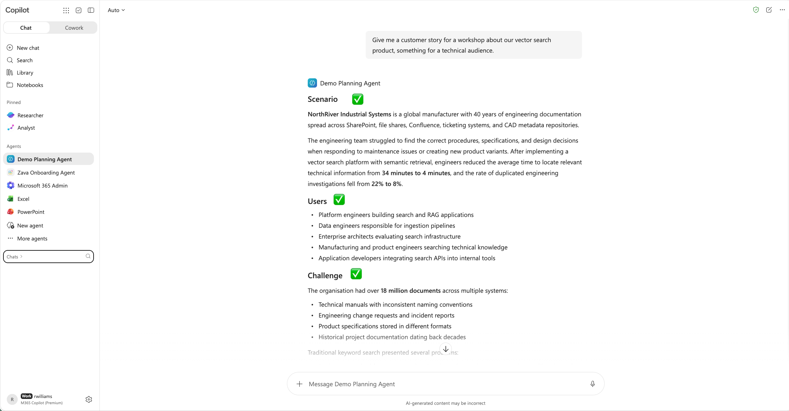

# Lab E12 - Build Agent with Skill using Agent Builder


<div class="lab-intro-video">
	<div style="flex: 1; min-width: 0;">
		<iframe src="//www.youtube.com/embed/JKeNgEYv63k?si=C766yHTi0bGSGfd3>" frameborder="0" allowfullscreen style="width: 100%; aspect-ratio: 16/9;">
		</iframe>
		<div>Deep dive on Skills from the product team behind the feature</div>
	</div>
</div>


<div data-widget="hero"
	data-badge="Standalone · Lab E12"
	data-badge-color="green"
	data-icon="🧩"
	data-subtitle="Add a reusable skill to a Declarative Agent without writing application code"
	data-time="20 min"
	data-requires="Microsoft 365 Copilot + Frontier Program access"
	></div>

In this lab, you'll create a generic **Demo Planning Agent** in Agent Builder and extend it with a reusable skill. The skill generates realistic business scenarios for demos, workshops, hackathons, presentations, and customer conversations.

## Why skills in an agent?

A skill is a focused capability that the agent loads when the user's task matches its description. This **progressive disclosure** keeps specialized guidance out of the agent's standing context until it is relevant.

Skills provide several benefits:

- **Smaller always-on instructions:** Keep the agent's core role, tone, and safety guidance concise instead of loading every task-specific procedure on every turn.
- **Focused behavior:** Give each specialized task its own instructions and supporting resources without crowding the agent's general instructions.
- **Predictable activation:** Use the skill description to define which requests should load the capability and which requests the agent should handle normally.
- **Easier maintenance and reuse:** Update a focused skill independently and reuse the same package across agents.

Use agent-level instructions for behavior that applies to nearly every interaction. Use a skill for specialized guidance or knowledge needed only for matching tasks.

## Scenario

Compelling demos begin with a business challenge, not a list of technology features. You need a repeatable way to turn topics such as Microsoft 365 Copilot, Declarative Agents, Model Context Protocol (MCP), Microsoft Graph, Teams applications, and Power Platform into stories that an audience can understand and evaluate.

The **Demo Planning Agent** will handle general planning requests. When a user asks for a demo idea, business scenario, use case, customer story, or workshop example, its **Demo Scenario Generator** skill will identify the requested topic, create a realistic business problem, describe the users and solution, and define measurable outcomes.

## Lab objectives

By the end of this lab, you'll be able to:

- Create and package a custom `SKILL.md` file
- Create a Declarative Agent in Agent Builder
- Keep the agent's core instructions generic
- Upload a custom skill package and add suggested prompts
- Publish the agent and validate selective skill invocation

## Prerequisites

- A plain-text editor, such as Notepad on Windows, TextEdit on macOS, or Visual Studio Code
- A Microsoft 365 account with a qualifying Microsoft 365 Copilot license or pay-as-you-go access
- An organization enrolled in the Microsoft Frontier Program
- Permission to create agents in your tenant

> **Tip:** Custom skills in Declarative Agents are currently available in preview through the Microsoft Frontier Program, with general availability planned soon. Agent Builder supports up to eight skills per agent, and each compressed skill package can be up to 50 MB.

---

## Exercise 1: Create the skill package

In this exercise, you'll create the **Demo Scenario Generator** skill and package it as a ZIP file that Agent Builder can upload.

### Step 1: Create the skill file

1. Create a folder named `demo-scenario-generator` in a location you can easily find.
2. Create a new **plain-text** document using the instructions for your operating system:

	- **Windows with Notepad:** Open Notepad and create a new document.
	- **macOS with TextEdit:** Open TextEdit and create a new document. Before entering or pasting any content, select **Format** > **Make Plain Text**, or press **Shift+Command+T**. Open the **Format** menu again and confirm that it now shows **Make Rich Text**. This confirms that the current document is in plain-text mode.
	- **Another editor:** Create a new plain-text document. Do not use a rich-text or word-processing document.

	> **Important for TextEdit:** TextEdit creates rich-text documents by default. Renaming a rich-text document to `SKILL.md` does not convert it to Markdown. You must select **Make Plain Text** before pasting the skill content.

3. Paste the following content into the plain-text document:

	```markdown
	---
	name: demo-scenario-generator
	description: |
		Creates realistic business scenarios for demos, workshops, hackathons, and
		presentations. Use when users ask for demo ideas, business scenarios, use
		cases, customer stories, workshop examples, or sample projects.
	---

	When activated:

	1. Identify the technology or topic.
	2. Pick the "after" metric first - the specific number or outcome the solution
		 produces (e.g. "cart abandonment drops from 47% to 28%") - then build the
		 business problem backward from it, so the "before" state is exactly what
		 would produce that number. This is what makes a scenario survive a
		 follow-up question instead of collapsing into "improves efficiency."
	3. Create a realistic business problem consistent with that number.
	4. Describe who the users are.
	5. Explain how the solution helps.
	6. Include measurable outcomes, stated as the same concrete numbers from step 2.

	Return results using the following format:

	## Scenario

	## Users

	## Challenge

	## Solution

	## Success Criteria
	```

4. Save the document inside the `demo-scenario-generator` folder:

	- **Windows with Notepad:** Select **File** > **Save As**. Enter `"SKILL.md"` in **File name**, select **All files** for **Save as type**, select **UTF-8** for **Encoding**, and then select **Save**. Quotation marks prevent Notepad from adding `.txt` to the file name.
	- **macOS with TextEdit:** Select **File** > **Save**, enter `SKILL.md`, choose the `demo-scenario-generator` folder, and then select **Save**. If TextEdit asks whether to use `.md` or `.txt`, select **Use .md**.
	- **Another editor:** Save the document as a UTF-8 plain-text file named exactly `SKILL.md`. Do not save it as rich text or as `SKILL.md.txt`.

5. Reopen `SKILL.md` in your editor and confirm:

	- The first line is `---`.
	- The content appears exactly as shown, without formatting codes.
	- The file does not begin with `{\rtf1`. If it does, it is still a rich-text file. Create a new document, convert it to plain text, and paste the skill content again.
	- The file name is exactly `SKILL.md`, not `SKILL.md.txt`.

The YAML frontmatter controls skill discovery. The `name` identifies the skill, and the `description` tells Copilot which requests should activate it.

<cc-end-step lab="E12" exercise="1" step="1" />

### Step 2: Create the ZIP package

Follow the instructions for your operating system.

#### macOS

1. In Finder, open the `demo-scenario-generator` folder.
2. Control-click `SKILL.md`, and then select **Compress "SKILL.md"**.
3. Rename the resulting archive from `SKILL.md.zip` to `demo-scenario-generator.zip`.
4. Move `demo-scenario-generator.zip` beside the `demo-scenario-generator` folder so it is easy to locate for upload.

#### Windows

1. In File Explorer, open the `demo-scenario-generator` folder.
2. Right-click `SKILL.md`, select **Compress to ZIP file**, and name the archive `demo-scenario-generator.zip`.
3. If **Compress to ZIP file** isn't available, select **Send to** > **Compressed (zipped) folder**, and then rename the archive to `demo-scenario-generator.zip`.
4. Move `demo-scenario-generator.zip` beside the `demo-scenario-generator` folder so it is easy to locate for upload.

The archive must contain `SKILL.md` at its root, not inside an additional folder.

<cc-end-step lab="E12" exercise="1" step="2" />

### Step 3: Verify the package

1. Open `demo-scenario-generator.zip` with the archive viewer for your operating system.
2. Confirm that `SKILL.md` is visible at the root of the archive.
3. Confirm that the archive does not contain a nested `demo-scenario-generator` folder.

Agent Builder requires the complete ZIP package. Do not upload the Markdown file by itself.

<cc-end-step lab="E12" exercise="1" step="3" />

---

## Exercise 2: Build the agent in Agent Builder

In this exercise, you'll configure the agent's general behavior, upload the skill, and add suggested prompts.

### Step 1: Start a new agent

1. Open [Microsoft 365 Copilot Chat](https://m365.cloud.microsoft/chat){target=_blank} and sign in.
2. In the left navigation, under **Agents**, select the **+ New agent** icon.
3. Select **Skip** to bypass the conversational builder experience and open the configuration experience for a new agent.

<cc-end-step lab="E12" exercise="2" step="1" />

### Step 2: Configure the agent

1. Enter `Demo Planning Agent` for the name.
2. Enter the following description:

```text
Helps users plan professional demos, workshops, hackathons, presentations, and customer conversations.
```

3. Add the following instructions:

```markdown
# Demo Planning Agent

## Role

Help users plan professional demos, workshops, hackathons, presentations,
and customer conversations.

## Skill routing

- Review the available skills for every request.
- Use a skill when its description matches the user's intent.
- Follow the selected skill's instructions and output format.
- Do not apply a skill's specialized format to unrelated requests.
- If no skill matches, respond using the general instructions or ask a concise
	clarifying question.

## General behavior

- Be concise, credible, and practical.
- Do not invent product capabilities.
- State important assumptions.
```

These instructions define behavior that applies to the whole agent. Keep the scenario-generation workflow and output format in `SKILL.md` so they are loaded only for matching requests.

<cc-end-step lab="E12" exercise="2" step="2" />

### Step 3: Upload the skill package

1. In the configuration experience, expand **Skills** and select **Add**.
2. Upload `demo-scenario-generator.zip`.
3. Review the skill details and confirm that the name is **demo-scenario-generator**.
4. Confirm that the description mentions demo ideas, business scenarios, use cases, customer stories, workshop examples, and sample projects.

If Agent Builder reports a package error, reopen the ZIP and verify that `SKILL.md` is at its root and includes valid YAML frontmatter.

<cc-end-step lab="E12" exercise="2" step="3" />

### Step 4: Add suggested prompts and create the agent

Add the following suggested prompts:

| Title | Prompt |
|---|---|
| Declarative Agent demo | Create a demo scenario for Declarative Agents. |
| Copilot workshop | Give me a workshop scenario for Microsoft 365 Copilot. |
| MCP customer story | Create a customer story for an MCP-enabled agent. |
| Plan a rehearsal | Help me plan the rehearsal schedule and presenter handoffs for a customer demo next week. |

Review the configuration, and then select **Create**.

<cc-end-step lab="E12" exercise="2" step="4" />

---

## Exercise 3: Publish and test the skill

In this exercise, you'll publish the agent and verify both positive and negative skill matching.

### Step 1: Publish the agent

1. When agent creation is complete, select **Publish**.
2. Review the agent details and confirm the publish action.
3. Wait for publishing to finish, and then open **Demo Planning Agent** in Microsoft 365 Copilot.

Publishing and sharing options can vary by tenant policy. Use the audience permitted by your organization for this lab.

<cc-end-step lab="E12" exercise="3" step="1" />

### Step 2: Test skill activation

Start a new conversation for each prompt:

```text
Give me a customer story for a workshop about our vector search product, something for a technical audience.
```

```text
Create a demo scenario for Declarative Agents.
```

```text
Give me a workshop scenario for Microsoft 365 Copilot.
```

```text
Create a customer story for an MCP-enabled agent.
```

For each response, confirm that the agent uses the five headings ✅ from `SKILL.md`, creates a scenario relevant to the requested topic, and uses consistent concrete numbers in the challenge and success criteria.



<cc-end-step lab="E12" exercise="3" step="2" />

### Step 3: Test the skill boundary

Send this request:

```text
Help me plan the rehearsal schedule and presenter handoffs for a customer demo next week.
```

Confirm that the agent provides practical rehearsal or handoff guidance without using the scenario skill's five-section format. The request is in the agent's general scope, but it does not ask for a demo idea, business scenario, use case, customer story, workshop example, or sample project.

This boundary test demonstrates that the skill is loaded only when its description matches the request.

<cc-end-step lab="E12" exercise="3" step="3" />

### Step 4: Compare the result with the expected structure

A response to `Create a demo scenario for Declarative Agents.` should use this structure:

```text
## Scenario

## Users

## Challenge

## Solution

## Success Criteria
```

The wording can vary. Validate the structure, business relevance, intended users, solution value, and measurable outcomes rather than expecting an exact response.

<cc-end-step lab="E12" exercise="3" step="4" />

## Congratulations

You created a generic Declarative Agent in Agent Builder, added a packaged custom skill, and verified both positive and negative skill matching.

<div data-widget="labnav"
	data-prev="../standalone-labs/"
	data-prev-label="Explore More Standalone Labs"></div>


<!-- No completion badge is assigned to this lab yet.
<cc-award badgeId="TBD" badgeName="TBD" />
-->