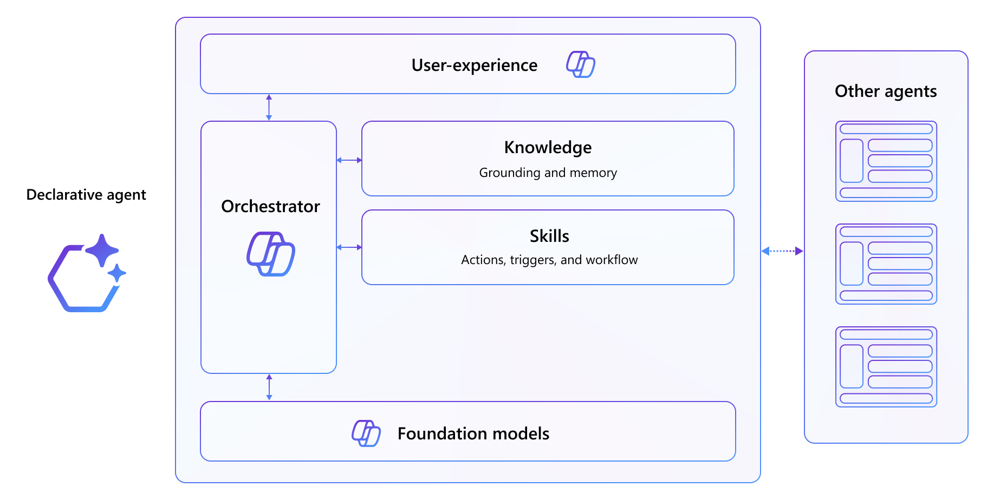

# Extend Microsoft 365 Copilot

**Declarative agents** are a type of agents for Microsoft 365. You can build one by extending Microsoft 365 Copilot. You define custom knowledge and custom actions to create agents tailored to a specific scenario.

Declarative agents use the same infrastructure, orchestrator, foundation model, and security controls as Microsoft 365 Copilot, which ensures a consistent and familiar user experience.

## What you're going to do

During Extend Path of the Copilot Developer Camp, you will construct a customized assistant tailored for a Human Resources department. The process will begin with understanding the fundamentals on creating a declarative agent, the creation of a basic declarative agent, and progress towards developing fully skilled assistant.
This advanced assistant will be equipped with security features, including authentication mechanism linked to the Microsoft 365 tenant to get organizational data.

| Section                            | Purpose                                                 |
| ---------------------------------- | ------------------------------------------------------- |
| **Setup**                          | Gets you ready with prerequisites.                    |
| **Declarative Agent Fundamentals** | Focuses on declarative agent concepts, start with a base template and explore more. |
| **Build and Integrate API**        | Covers API creation and connecting API to agents. Upgrade the user interface with Adaptive cards.         |
| **Authentication**                 | Contains all auth-related labs as sub-items.            |
| **Integration**                    | Expands capability with Copilot connectors, etc.                |

## [Start here](./00-prerequisites) with Lab E0, where you'll set up development your environment

