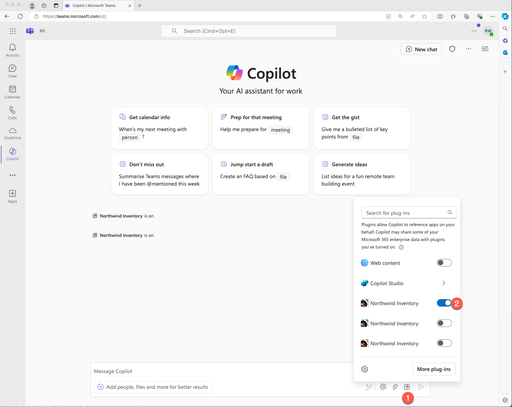
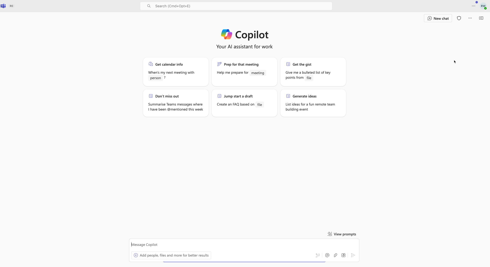
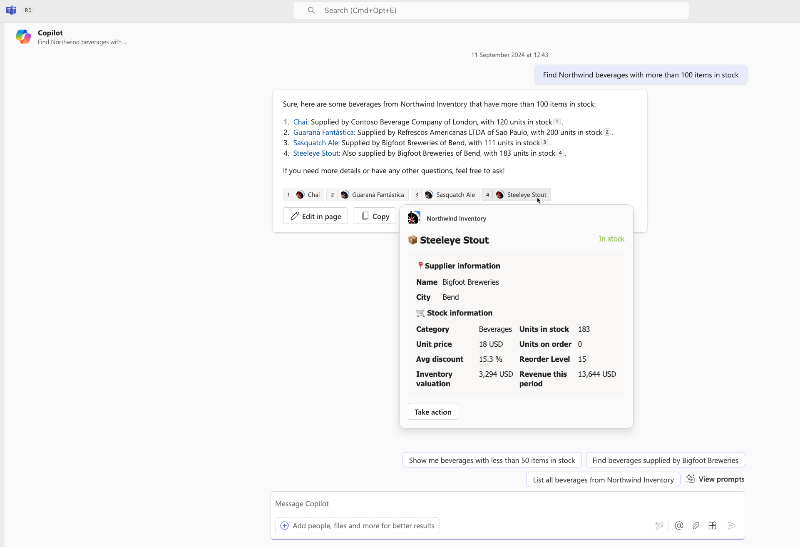

# Lab M2 - Run app in Microsoft Copilot for Microsoft 365
In this lab, you’ll run the Northwind app as a plugin in Microsoft Copilot for Microsoft 365. 

???+ "Navigating the Extend Teams Message Extension labs (Extend Path)"
    - [Lab M0 - Prerequisites](/copilot-camp/pages/extend-message-ext/00-prerequisites) 
    - [Lab M1 - Get to know Northwind message extension](/copilot-camp/pages/extend-message-ext/01-nw-teams-app) 
    - [Lab M2 - Run app in Microsoft Copilot for Microsoft 365](/copilot-camp/pages/extend-message-ext/02-nw-plugin) (📍You are here)
    - [Lab M3 - Enhance plugin with new search command](/copilot-camp/pages/extend-message-ext/03-enhance-nw-plugin)
    - [Lab M4 - Add authentication](/copilot-camp/pages/extend-message-ext/04-add-authentication) 
    - [Lab M5 - Enhance plugin with an action command](/copilot-camp/pages/extend-message-ext/05-add-action) 

!!! note "NOTE"
    The completed exercise with all of the code changes can be downloaded [from here](https://github.com/microsoft/copilot-camp/tree/main/src/extend-message-ext/Lab01-Run-NW-Teams/Northwind/). This can be useful for troubleshooting purposes.
    If you ever need to reset your edits, you can clone again the repository and start over.

In this lab you will:

- Run the message extension you ran on Microsoft Teams on Microsoft Copilot 
- You will learn how to use natural language prompts to search and find items in the Northwind database 

## Exercise 1 - Run the sample as a Copilot plugin

If you are coming from previous lab, you can keep the debugger running and skip Step 1 and go to Step 2 or if it had stopped, go to Step 1. 

### Step 1 : Run the app locally

Restart by clicking F5 to start debugging, or click the start button 1️⃣. You will have an opportunity to select a debugging profile; select Debug in Teams (Edge) 2️⃣ or choose another profile.

The debugging will open teams in a browser window. Make sure you login using the same credentials you signed into Teams Toolkit.
Once you're in, Microsoft Teams should open up and display a dialog offering to open your application. 

Once opened it immediately ask you where you want to open the app in. By default it's personal chat. You could also select it in a channel or group chat as shown. Select "Open".

Now you are in a personal chat with the app.

## Step 2 - Test in Microsoft Copilot for Microsoft 365 (single parameter)
!!! tip inline "Reminder"
    To perform the following exercise, your account must have a valid license for Copilot for Microsoft 365.
Go to Teams in browser [https://teams.microsoft.com/v2/](https://teams.microsoft.com/v2/) logged into your developer tenant.
If you have a Copilot for Microsoft 365, the new app will be automatically pinned above your chats. Just open Teams, select “chats” and you’ll see Copilot.

Once in the Copilot app experience, Check the lower left of the chat user interface, below the compose box. You should see a plugin icon 1️⃣ . Click this and enable the Northwind Inventory plugin 2️⃣ .

For best results, start a new chat by typing "New chat" or by clicking on the **New chat** icon at the top right before each prompt or set of related prompts.

Here are some prompts to try that use only a single parameter of the message extension:

* *Find information about Chai in Northwind Inventory*

* *Find discounted seafood in Northwind. Show a table with the products, supplier names, average discount rate, and revenue per period.*

Let's try the first one.  *Find information about Chai in Northwind Inventory*

Try using these adaptive cards to take action on the products. If there's a single item returned back, Copilot may show the whole card as above. For multiple response  Copilot may show a small number next to each. You can hover over these numbers to display the adaptive card. References will also be listed below the response.

Here is an example of multiple items returned with references.

Next, try  *Find discounted seafood in Northwind. Show a table with the products, supplier names, average discount rate, and revenue per period.*

As you're testing, watch the log messages within your application.
- Go to Visual Studio Code where you project is runnning.
- Find the terminal that has the "Start application" task running.

You should be able to see when Copilot calls your plugin. For example, after the previous prompt you should see below log

## Step 3 - Test in Microsoft Copilot for Microsoft 365 (multiple parameters)

In this exercise, you'll try some prompts that exercise the multi-parameter feature in the sample plugin. These prompts will request data that can be retrieved by name, category, inventory status, supplier city, and stock level, as defined in [the manifest](https://github.com/microsoft/copilot-camp/tree/main/src/extend-message-ext/Lab01-Run-NW-Teams/Northwind/appPackage/manifest.json).

For example, try prompting **Find Northwind beverages with more than 100 items in stock**. To respond, Copilot must identify products:

* where the category is **beverages**
* where inventory status is **in stock**
* where the stock level is **more than 100**

The plugin code applies all three filters, providing a result set.

If you look at the log messages in your terminal in VS Code, you can see that Copilot was able to understand this requirement and fill in 3 of the parameters in the first message extension command.

By using this prompt, Copilot might look also in your OneDrive files to find the payment terms with each supplier's contract. In this case, you will notice that some of the references won't have the Northwind Inventory icon, but the Word one.

Here is an example:

Here are some more prompts to try:

- *Find Northwind dairy products that are low on stock. Show me a table with the product, supplier, units in stock and on order.*

- *We’ve been receiving partial orders for Tofu. Find the supplier in Northwind and draft an email summarizing our inventory and reminding them they should stop sending partial orders per our MOQ policy.*

- *Northwind will have a booth at Microsoft Community Days  in London. Find products with local suppliers and write a LinkedIn post to promote the booth and products.*

- *What beverage is high in demand due to social media that is low stock in Northwind in London. Reference the product details to update stock.*

Which prompts work best for you? Try making up your own prompts and observe your log messages to see how Copilot accesses your plugin.

<cc-next />

## Congratulations

You’ve done an excellent job testing the plugin in Microsoft Copilot for Microsoft 365. Now, proceed to the next lab to add code for another search criterion. Select **Next**.

