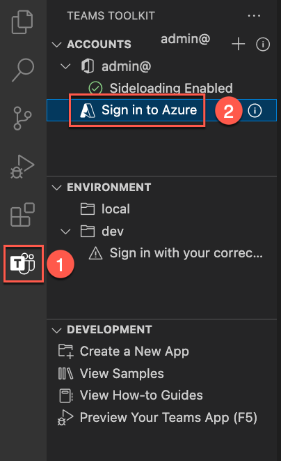
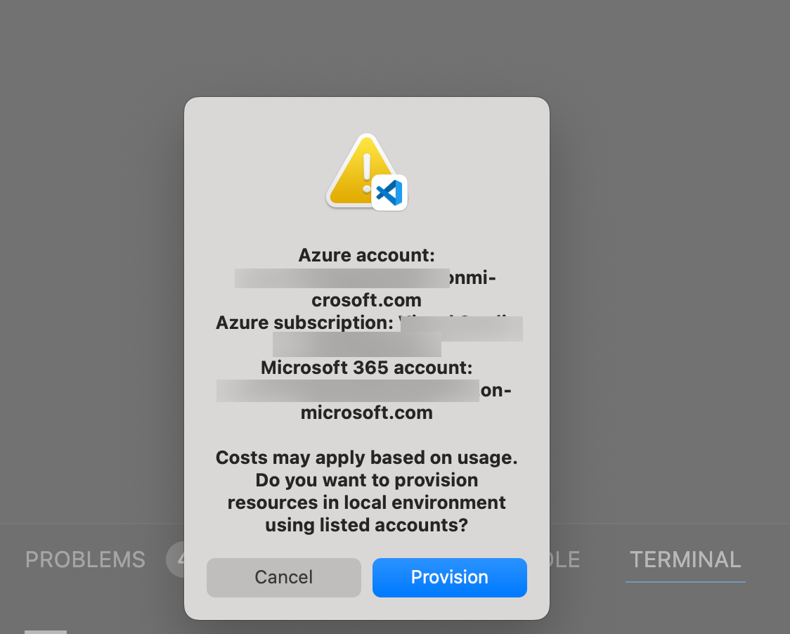

# Lab M4 - Add authentication
In this lab you will secure your Northwind plugin from the previous lab with authentication using Entra ID SSO (single sign-on) to search and find your own contacts like suppliers information from Outlook.  

???+ "Navigating the Extend Teams Message Extension labs (Extend Path)"
    - [Lab M0 - Prerequisites](/copilot-camp/pages/extend-message-ext/00-prerequisites) 
    - [Lab M1 - Get to know Northwind message extension](/copilot-camp/pages/extend-message-ext/01-nw-teams-app) 
    - [Lab M2 - Run app in Microsoft Copilot for Microsoft 365](/copilot-camp/pages/extend-message-ext/02-nw-plugin) 
    - [Lab M3 - Enhance plugin with new search command](/copilot-camp/pages/extend-message-ext/03-enhance-nw-plugin)
    - [Lab M4 - Add authentication](/copilot-camp/pages/extend-message-ext/04-add-authentication) (📍You are here)
    - [Lab M5 - Enhance plugin with an action command](/copilot-camp/pages/extend-message-ext/05-add-action) 

!!! warning   "Attention"
    This lab requires you to have an Azure Subscripton to provision bot services.

!!! tip "NOTE"
    The completed exercise with all of the code changes can be downloaded [from here](https://github.com/microsoft/copilot-camp/tree/main/src/extend-message-ext/Lab04-SSO-Auth/Northwind/). This can be useful for troubleshooting purposes.
    If you ever need to reset your edits, you can clone again the repository and start over.

In this lab you will learn to:

- how to add Entra ID single sign-on (SSO) to your plugin so users can seamlessly log into your app with the same account they use in Microsoft Teams

- Access the Microsoft Graph API to access user data in Microsoft 365. Your app will act on behalf of the logged-in user so they can securely access their own content within your application like contacts from Outlook in this lab.

## Introduction : Tasks involved to implement SSO (brief)

Implementing SSO for your plugin (Message extension app) involves several steps. Here is a high level over view of the process:

### Register Your App in Microsoft Entra ID & Configure Your Bot in Azure Bot Service
- Create a new app registration in the Azure portal.
- Configure the app with necessary permissions and scopes.
- Generate a client secret for your app.
- Create a bot in the Azure Bot Service.
- Add the Microsoft 365 channel to your bot.
- Set up OAuth connection settings in the Azure portal.
### Enable SSO in Your Teams App
- Update your message extension's bot code to handle authentication and token exchange.
- Use the Bot Framework SDK to integrate SSO capabilities.
- Implement the OAuth flow to obtain access tokens for the user.
### Configure Authentication in Teams
- Add the necessary permissions in the Teams app manifest.

## Exercise 1: Register Your App in Microsoft Entra ID and Configure Your Bot in Azure Bot Service

Luckily for you, we’ve streamlined everything so that it’s ready to go as soon as you hit **F5**. However, let’s go over the specific changes you’ll need to make in the project for registering and configuring these resources. 

### Step 1: Copy files and folders

Create a new folder called **entra** inside folder **infra** in your root folder. 

Create two new files in the **entra** folder called **entra.bot.manifest.json** and **entra.graph.manifest.json** 

Copy code from this [file](https://raw.githubusercontent.com/microsoft/copilot-camp/main/src/extend-message-ext/Lab04-SSO-Auth/Northwind/infra/entra/entra.bot.manifest.json){target=_blank} into **entra.bot.manifest.json** and same for **entra.graph.manifest.json** from this [file](https://raw.githubusercontent.com/microsoft/copilot-camp/main/src/extend-message-ext/Lab04-SSO-Auth/Northwind/infra/entra/entra.graph.manifest.json){target=_blank}.

These files are needed to provision the Entra ID app registrations (previously know as Azure Active Directory app registrations) needed for the bot as well as the one for graph for token exchange between them. 

Next in the **infra** folder create files **azure.local.bicep** and copy code from this [file](https://raw.githubusercontent.com/microsoft/copilot-camp/main/src/extend-message-ext/Lab04-SSO-Auth/Northwind/infra/azure.local.bicep){target=_blank} and create file **azure.parameters.local.json** in the same folder **infra** and copy code from this [file](https://raw.githubusercontent.com/microsoft/copilot-camp/main/src/extend-message-ext/Lab04-SSO-Auth/Northwind/infra/azure.parameters.local.json){target=_blank}

These file help with the bot registration. This will ensure the bot service is provisioned in Azure even when you run app locally. This is required for this authentication flow.

!!! note "What is happening with these files?"
    When Teams Toolkit runs the app locally, it will provision a new Azure AI Bot Service into the resource group which uses the F0 SKU which grants unlimited messages to be sent to standard channels, this includes Microsoft Teams and Microsoft 365 channel (Outlook and Copilot) and does not incur a cost.

### Step 2: Update existing code

Next, open file **azurebot.bicep** under **botRegistration** folder which is under **infra** folder and add below code snippet after declaration of "param botAppDomain"

```bicep
param graphAadAppClientId string
@secure()
param graphAadAppClientSecret string

param connectionName string
```

Next add below snippet to provision bot service into the same file at end of line.

```bicep
resource botServicesMicrosoftGraphConnection 'Microsoft.BotService/botServices/connections@2022-09-15' = {
  parent: botService
  name: connectionName
  location: 'global'
  properties: {
    serviceProviderDisplayName: 'Azure Active Directory v2'
    serviceProviderId: '30dd229c-58e3-4a48-bdfd-91ec48eb906c'
    clientId: graphAadAppClientId
    clientSecret: graphAadAppClientSecret
    scopes: 'email offline_access openid profile Contacts.Read'
    parameters: [
      {
        key: 'tenantID'
        value: 'common'
      }
      {
        key: 'tokenExchangeUrl'
        value: 'api://${botAppDomain}/botid-${botAadAppClientId}'
      }
    ]
  }
}

```

This will create a new OAUTH connection for token exchange between bot service and the graph entra ID app.

!!! Tip "Changes to infrastructure for plugin"
    We require a different infrastructure to run this setup compared to the non-authenticated plugins we've previously built in this path and hence we need to rewire. Next steps will help you with this. 

Next, open the **teamsapp.local.yml** file and replace its content with the code snippet below. This will rewire parts of the infrastructure, including deploying a bot service in Azure for our lab. 

```yaml
# yaml-language-server: $schema=https://aka.ms/teams-toolkit/1.0.0/yaml.schema.json
# Visit https://aka.ms/teamsfx-v5.0-guide for details on this file
# Visit https://aka.ms/teamsfx-actions for details on actions
version: 1.0.0

provision:

  - uses: script
    name: Ensure database
    with:
      run: node db-setup.js
      workingDirectory: scripts

  # Creates a Teams app
  - uses: teamsApp/create
    with:
      # Teams app name
      name: NorthwindProducts-${{TEAMSFX_ENV}}
    # Write the information of created resources into environment file for
    # the specified environment variable(s).
    writeToEnvironmentFile:
      teamsAppId: TEAMS_APP_ID

  - uses: aadApp/create
    with:
      name: ${{APP_INTERNAL_NAME}}-bot-${{TEAMSFX_ENV}}
      generateClientSecret: true
      signInAudience: AzureADMultipleOrgs
    writeToEnvironmentFile:
      clientId: BOT_ID
      clientSecret: SECRET_BOT_PASSWORD
      objectId: BOT_AAD_APP_OBJECT_ID
      tenantId: BOT_AAD_APP_TENANT_ID
      authority: BOT_AAD_APP_OAUTH_AUTHORITY
      authorityHost: BOT_AAD_APP_OAUTH_AUTHORITY_HOST

  - uses: aadApp/update
    with:
      manifestPath: "./infra/entra/entra.bot.manifest.json"
      outputFilePath : "./build/entra.bot.manifest.${{TEAMSFX_ENV}}.json"
  - uses: aadApp/create
    with:
      name: ${{APP_INTERNAL_NAME}}-graph-${{TEAMSFX_ENV}}
      generateClientSecret: true
      signInAudience: AzureADMultipleOrgs
    writeToEnvironmentFile:
      clientId: GRAPH_AAD_APP_ID
      clientSecret: SECRET_GRAPH_AAD_APP_CLIENT_SECRET
      objectId: GRAPH_AAD_APP_OBJECT_ID
      tenantId: GRAPH_AAD_APP_TENANT_ID
      authority: GRAPH_AAD_APP_OAUTH_AUTHORITY
      authorityHost: GRAPH_AAD_APP_OAUTH_AUTHORITY_HOST

  - uses: aadApp/update
    with:
      manifestPath: "./infra/entra/entra.graph.manifest.json"
      outputFilePath : "./build/entra.graph.manifest.${{TEAMSFX_ENV}}.json"

  - uses: arm/deploy
    with:
      subscriptionId: ${{AZURE_SUBSCRIPTION_ID}}
      resourceGroupName: ${{AZURE_RESOURCE_GROUP_NAME}}
      templates:
        - path: ./infra/azure.local.bicep
          parameters: ./infra/azure.parameters.local.json
          deploymentName: Create-resources-for-${{APP_INTERNAL_NAME}}-${{TEAMSFX_ENV}}
      bicepCliVersion: v0.9.1

  # Validate using manifest schema
  - uses: teamsApp/validateManifest
    with:
      # Path to manifest template
      manifestPath: ./appPackage/manifest.json

  # Build Teams app package with latest env value
  - uses: teamsApp/zipAppPackage
    with:
      # Path to manifest template
      manifestPath: ./appPackage/manifest.json
      outputZipPath: ./appPackage/build/appPackage.${{TEAMSFX_ENV}}.zip
      outputJsonPath: ./appPackage/build/manifest.${{TEAMSFX_ENV}}.json
  # Validate app package using validation rules
  - uses: teamsApp/validateAppPackage
    with:
      # Relative path to this file. This is the path for built zip file.
      appPackagePath: ./appPackage/build/appPackage.${{TEAMSFX_ENV}}.zip

  # Apply the Teams app manifest to an existing Teams app in
  # Teams Developer Portal.
  # Will use the app id in manifest file to determine which Teams app to update.
  - uses: teamsApp/update
    with:
      # Relative path to this file. This is the path for built zip file.
      appPackagePath: ./appPackage/build/appPackage.${{TEAMSFX_ENV}}.zip

  # Extend your Teams app to Outlook and the Microsoft 365 app
  - uses: teamsApp/extendToM365
    with:
      # Relative path to the build app package.
      appPackagePath: ./appPackage/build/appPackage.${{TEAMSFX_ENV}}.zip
    # Write the information of created resources into environment file for
    # the specified environment variable(s).
    writeToEnvironmentFile:
      titleId: M365_TITLE_ID
      appId: M365_APP_ID

deploy:
# Run npm command
  - uses: cli/runNpmCommand
    name: install dependencies
    with:
      args: install --no-audit

  # Generate runtime environment variables
  - uses: file/createOrUpdateEnvironmentFile
    with:
      target: ./.localConfigs
      envs:
        BOT_ID: ${{BOT_ID}}
        BOT_PASSWORD: ${{SECRET_BOT_PASSWORD}}
        STORAGE_ACCOUNT_CONNECTION_STRING: ${{SECRET_STORAGE_ACCOUNT_CONNECTION_STRING}}
        CONNECTION_NAME: ${{CONNECTION_NAME}}

```

Open **.env.local** file under **env** folder and completely remove all variable and add below for a fresh start. 

```
APP_INTERNAL_NAME=Northwind
APP_DISPLAY_NAME=Northwind
CONNECTION_NAME=MicrosoftGraph

```
Open **.env.local.user** file under **env** folder and completely remove all variable and add below for a fresh start. 
```
SECRET_BOT_PASSWORD=
SECRET_GRAPH_AAD_APP_CLIENT_SECRET=
SECRET_STORAGE_ACCOUNT_CONNECTION_STRING=UseDevelopmentStorage=true
```


## Exercise 2: New search command for Contacts 

### Step 1: Add a command to search contacts (suppliers)

To start, add a new command for searching contacts. We’ll eventually retrieve contact details from Microsoft Graph, but for now, we’ll use mock data to ensure the message extension command functions correctly.
Go to **src** folder > **messageExtensions** and add an new file **supplierContactSearchCommand.ts** in it.

Copy the content from below into the new file.

```JavaScript
import {
    CardFactory,
    TurnContext
} from "botbuilder";


const COMMAND_ID = "supplierContactSearch";

let queryCount = 0;
async function handleTeamsMessagingExtensionQuery(context: TurnContext, query: any): Promise<any> {

    let name = '';
    if (query.parameters.length === 1 && query.parameters[0]?.name === "name") {
        [name] = (query.parameters[0]?.value.split(','));
    } else {
        name = cleanupParam(query.parameters.find((element) => element.name === "name")?.value);
    }
    console.log(`🍽️ Query #${++queryCount}:\name of contact=${name}`);
    const filteredProfile = [];
    const attachments = [];

    const allContacts = [
    {
        displayName: "John Doe",
        emailAddresses: [
        { address: "john.doe@example.com" }
        ]
    },
    {
        displayName: "Jane Smith",
        emailAddresses: [
        { address: "jane.smith@example.com" }
        ]
    },
    {
        displayName: "Alice Johnson",
        emailAddresses: [
        { address: "alice.johnson@example.com" }
        ]
    }
];

    allContacts.forEach((contact) => {
        if (contact.displayName.toLowerCase().includes(name.toLowerCase()) || contact.emailAddresses[0]?.address.toLowerCase().includes(name.toLowerCase())) {
            filteredProfile.push(contact);
        }
    });

    filteredProfile.forEach((prof) => {
        const preview = CardFactory.heroCard(prof.displayName,
            `with email ${prof.emailAddresses[0]?.address}`);

        const resultCard = CardFactory.heroCard(prof.displayName,
            `with email ${prof.emailAddresses[0]?.address}`);
        const attachment = { ...resultCard, preview };
        attachments.push(attachment);
    });
    return {
        composeExtension: {
            type: "result",
            attachmentLayout: "list",
            attachments: attachments,
        },
    };

}
function cleanupParam(value: string): string {

    if (!value) {
        return "";
    } else {
        let result = value.trim();
        result = result.split(',')[0];          // Remove extra data
        result = result.replace("*", "");       // Remove wildcard characters from Copilot
        return result;
    }
}

export default { COMMAND_ID, handleTeamsMessagingExtensionQuery }
```


Go to **src** folder > **searchApp.ts** file and import the newly created command.

```JavaScript
import supplierContactSearchCommand from "./messageExtensions/supplierContactSearchCommand";
```

And add another case in the **handleTeamsMessagingExtensionQuery** for the newly added command after *case customerSearchCommand.COMMAND_ID:*

```JavaScript
  case supplierContactSearchCommand.COMMAND_ID: {
        return supplierContactSearchCommand.handleTeamsMessagingExtensionQuery(context, query);
      } 
```
Now to go **appPackage** > **manifest.json** and add the command inside the *commands* array under the node *composeExtensions*.

```JSON
 {
                    "id": "supplierContactSearch",
                    "context": [
                        "compose",
                        "commandBox"
                    ],
                    "description": "Search for a contact in the user's Outlook contacts list for Northwind",
                    "title": "Contact search",
                    "type": "query",
                    "parameters": [
                        {
                            "name": "name",
                            "title": "Contact search",
                            "description": "Type name of the contact or company which forms the domain for email address of the contact, to search my Outlook contacts list",
                            "inputType": "text"
                        }
                    ] 
         } 
```
So you have now added a new non authenticated command to search contacts from a mock list. 

### Step 2: Sign in to Azure in Teams Toolkit

Teams Toolkit requires you to sign in to an Azure account and have a subscription before you can provision the resource instances. You'll then use these resources to deploy your app to host it in Azure.

On the Activity Bar of your project editor, select the Microsoft Teams icon 1️⃣. This will open the Teams Toolkit extension panel.

On the Teams Toolkit panel, under Accounts, select "Sign in to Azure" 2️⃣.



In the dialog that appears, select "Sign in".


### Step 3: Run the application in Teams to test new command


To test the new command you need to run the app locally.

Click F5 to start debugging, or click the start button 1️⃣. You will have an opportunity to select a debugging profile; select Debug in Teams (Edge) 2️⃣ or choose another profile.


!!! tip "F5 in this lab"
       When you press F5 to run the application, it will also provision all the necessary resources for the authenticated flow, as we configured everything using the Team Toolkit's actions in Exercise 1. 

Since you cleared the environments variable, you will install all Entra ID apps and bot services in Azure. During the first run, you'll need to select a resource group in your Azure subscription, which you logged into via the Teams toolkit, for provisioning resources.


Choose **+ New resource group** to keep things tidy.And choose the default name teams toolkit has suggested and select Enter.

Next, choose a Location. For this lab just choose **Central US**


Next Teams Toolkit will go ahead and provision the resources but will also ask you a confirmation before doing so.



Select **Provision**.

Once it's provisioned all the resources, you will get the Northwind app install dialog in a browser, select **Add**.


Once installed, you will be given another dialog to open the app. This will open the app as a message extension in a personal chat. Select **Open**.


Since we only need to test if the command works or not, we will only test the app in Teams chat.
In the personal chat with the app, select the **Contacrt search** and type *a*. 


If it lists the contacts as shown above, the command is working, but with mock data. We will fix this in the next exercise.

## Exercise 3 : Enable authentication for new command

In the previous step, you have laid the foundation for the new command. Next you will add authentication on top of the command, replace the mock contact list and replace it with actual contact list from the logged in user's Outlook contacts.

You will first install some npm packages needed for the plugin. Create a new terminal window in the project.

Run below script in the terminal :

```CLI
npm i @microsoft/microsoft-graph-client @microsoft/microsoft-graph-types
```
Locate **config.ts** file in the **src** folder. Add a "," after `storageAccountConnectionString: process.env.STORAGE_ACCOUNT_CONNECTION_STRING` and add the new property and value for `connectionName` as below.

<pre>
 const config = {
  botId: process.env.BOT_ID,
  botPassword: process.env.BOT_PASSWORD,
  storageAccountConnectionString: process.env.STORAGE_ACCOUNT_CONNECTION_STRING<b>,
  connectionName: process.env.CONNECTION_NAME</b>
};
</pre>

Now create a folder called **services** under **src** folder of your base project.
Create two files **AuthService.ts** and **GraphService.ts** in the **services** folder. 

- **AuthService** : contains a class that provides authentication services. It includes a method **getSignInLink** which asynchronously retrieves a sign-in URL from a client using specific connection details and returns this URL.

- **GraphService** : defines a class that interacts with the Microsoft Graph API. It initializes a Graph client using an authentication token and provides a method getContacts to fetch the user's contacts, selecting specific fields (displayName and emailAddresses).

Next, copy paste below code into **AuthService.ts**

```JavaScript
import {
  AdaptiveCardInvokeResponse,
  CloudAdapter,
  MessagingExtensionQuery,
  MessagingExtensionResponse,
  TurnContext,
} from 'botbuilder';
import { UserTokenClient } from 'botframework-connector';
import { Activity } from 'botframework-schema';
import config from '../config';

export class AuthService {
  private client: UserTokenClient;
  private activity: Activity;
  private connectionName: string;

  constructor(context: TurnContext) {
    const adapter = context.adapter as CloudAdapter;
    this.client = context.turnState.get<UserTokenClient>(
      adapter.UserTokenClientKey
    );
    this.activity = context.activity;
    this.connectionName = config.connectionName;
  }

  async getUserToken(
    query?: MessagingExtensionQuery
  ): Promise<string | undefined> {
    const magicCode =
      query?.state && Number.isInteger(Number(query.state)) ? query.state : '';

    const tokenResponse = await this.client.getUserToken(
      this.activity.from.id,
      this.connectionName,
      this.activity.channelId,
      magicCode
    );

    return tokenResponse?.token;
  }

  async getSignInComposeExtension(): Promise<MessagingExtensionResponse> {
    const signInLink = await this.getSignInLink();

    return {
      composeExtension: {
        type: 'auth',
        suggestedActions: {
          actions: [
            {
              type: 'openUrl',
              value: signInLink,
              title: 'SignIn',
            },
          ],
        },
      },
    };
  }

  async getSignInAdaptiveCardInvokeResponse(): Promise<AdaptiveCardInvokeResponse> {
    const signInLink = await this.getSignInLink();

    return {
      statusCode: 401,
      type: 'application/vnd.microsoft.card.signin',

      value: {
        signinurl: signInLink,
      },
    };
  }

  async getSignInLink(): Promise<string> {
    const { signInLink } = await this.client.getSignInResource(
      this.connectionName,
      this.activity,
      ''
    );

    return signInLink;
  }
}

```

Next, copy paste below code into **GraphService.ts**

```JavaScript
import { Client } from '@microsoft/microsoft-graph-client';


export class GraphService {
  private _token: string;
  private graphClient: Client;

  constructor(token: string) {
    if (!token || !token.trim()) {
      throw new Error('SimpleGraphClient: Invalid token received.');
    }
    this._token = token;

    this.graphClient = Client.init({
      authProvider: done => {
        done(null, this._token);
      },
    });
  }
  async getContacts(): Promise<any> {
    const response = await this.graphClient
      .api(`me/contacts`)
      .select('displayName,emailAddresses')
      .get();

    return response.value;
  }
}

```


Now, go back to the **supplierContactSearchCommand.ts** file and import these two services we just added.

```JavaScript
import { AuthService } from "../services/AuthService";
import { GraphService } from "../services/GraphService";
```
Next, add the code that initializes authentication, retrieves a user token, checks its validity, and then sets up a service to interact with the Microsoft Graph API if the token is valid. If the token is invalid, it prompts the user to sign in.

Copy below code into the *handleTeamsMessagingExtensionQuery* function above the mock definition of **allContacts** constant.

```JavaScript
  const credentials = new AuthService(context);
  const token = await credentials.getUserToken(query);
  if (!token) {
    return credentials.getSignInComposeExtension();
  }
  const graphService = new GraphService(token);
```

Next, replace the mock definition of **allContacts** constant with below code:

```JavaScript
const allContacts = await graphService.getContacts();
```

Next go to **appPackage/manifest.json** file and update the node *validDomains* as below

```JSON
"validDomains": [
        "token.botframework.com",
        "${{BOT_DOMAIN}}"
    ]
```

Also add comma "," after `validDomains` array and add a node for *webApplicationInfo* and update it with below value

```JSON
    "webApplicationInfo": {
        "id": "${{BOT_ID}}",
        "resource": "api://${{BOT_DOMAIN}}/botid-${{BOT_ID}}"
    },
```
Next, upgrade the manifest version from "1.0.10" to "1.0.11" so the changes are reflected. 

These manifest changes will make sure the sign-in url is correctly formed and sent to the user for consent.

## Exercise 4:  Test authentication

### Step 1: Run app locally 
Stop the local debugger if it is kept running. Since you have updated the manifest with a new command, you will want to re install the app with the new package. 

Restart debugger by clicking F5, or click the start button 1️⃣. You will have an opportunity to select a debugging profile; select Debug in Teams (Edge) 2️⃣ or choose another profile.


!!! pied-piper "Provision"
    Here you will again get a dialog confirming if you want to provision the resources. Select "Provision". This is not actually provisioning new resources just overwriting existing resources. 

The debugging will open teams in a browser window. Make sure you login using the same credentials you signed into Teams Toolkit.
Once you're in, Microsoft Teams should open up and display a dialog offering to open your application. 


Once opened it immediately ask you where you want to open the app in. By default it's personal chat. You could also select it in a channel or group chat as shown. Select "Open".


Now you are in a personal chat with the app. But we are testing in Copilt so follow next instruction. 


In Teams click on **Chat** and then **Copilot**. Copilot should be the top-most option.
Click on the **Plugin icon** and select **Northwind Inventory** to enable the plugin.


### Step 2 : Enter test data
Before we test the plugin to bring actual contacts, we'll need to add some contact information.
So let us first ensure we have some contacts in Microsoft 365.

1️⃣ From Microsoft Teams, click the "waffle" menu

2️⃣ Select Microsoft Outlook


1️⃣ Within Outlook, click the "Contacts" button

2️⃣ Enter some new contacts

The app is simple, and will only display the person or company name and email address. If you want to play along with the business scenario, make them sound like suppliers.


### Step 2: Test in Copilot

Ask Copilot for contacts by using this prompt- **Find my conacts with name {first name} in Northwind** (Replace {first name} with what name you have given for your contacts in Exercise 4, Step 1)

You will get a sign-in button to authenticate (one time only) as shown in the screen. 


This is the indication that you have an some sort of an authentication set in place to call this feature of the plugin. Select **Sign in to Northwind Inventory**

You will now get a dialog to interact and provide consent as show in the GIF below. Once consented you should be able to get back results form Copilot for Microsoft 365.


## Congratulations
This was a hard one, but you ACED it!
Thanks for doing the Message Extension agent track!

<cc-next url="/" label="Home" />

