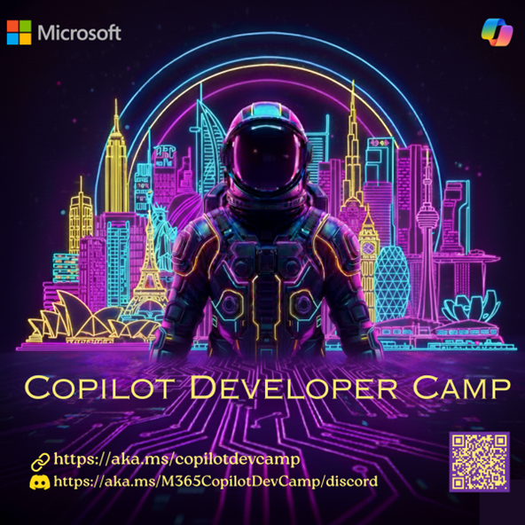

# Copilot Developer Camp – Europe (April 2026)

## 🌍 Overview

Copilot Developer Camp is a full-day, hands-on experience designed to bring together developers, architects, partners, and AI enthusiasts to build real-world solutions using Microsoft 365 Copilot.

Participants will explore how to design and develop intelligent agents, extend Copilot experiences, and leverage the latest AI tools and frameworks to solve practical business challenges.

## 🚀 What You’ll Learn

* Build and extend Microsoft 365 Copilot experiences
* Design and implement intelligent agent workflows
* Integrate enterprise data using APIs and Microsoft Graph
* Apply modern AI development patterns and tools
* Develop real-world, business-focused solutions

## 📅 Event Schedule (April 2026)

* April 21 – Munich (Microsoft Munich Office) | 10:00-17:00
* April 22 – Paris (Microsoft Paris Office) | 10:00-17:00
* April 23 – Amsterdam (Microsoft Schipol Office) | 09:00-16:00
* April 24 – Rome (Microsoft Rome Office) | 10:00-17:00
* April 27 – Brussels (Microsoft Brussels Office) | 10:00-17:00
* April 29 – Milan (Microsoft Milan Office) | 10:00-17:00

## 👥 Who Should Attend

* Developers and Engineers
* Solution Architects
* Microsoft Partners (ISVs & SIs)
* Enterprise Teams and Customers
* AI Enthusiasts and Innovators

## 💡 Why Attend

* Hands-on learning with real-world scenarios
* Build production-ready Copilot solutions
* Collaborate with peers and industry experts
* Explore the future of AI-driven development

## 🔗 Registration

Secure your spot today:
👉 [https://aka.ms/M365CopilotDevCampRegistration](https://aka.ms/M365CopilotDevCampRegistration)

## 🔥 Key Takeaway

In the era of AI, developers are no longer just building applications—they are designing intelligent, context-aware systems that integrate seamlessly into the flow of work.

Materials used in this day are based on the online version of the Microsoft 365 Copilot Dev Camp. You can get more details on that from https://aka.ms/copilotdevcamp.

---

## 🇮🇹 Rome Agenda – April 24, 2026

📍 **Location:** Viale Avignone, 10, 00144 Rome, Latium, Italy

[🔗 Register for Rome](https://aka.ms/M365CopilotDevCampRegistration){ .md-button .md-button--primary }

| Time | Duration | Type | Session | Abstract | Speaker | Path | Laptop Required |
|---|---|---|---|---|---|---|---|
| 10:00 AM – 10:30 AM | 30 mins | Keynote | Keynote | Keynote | Dona Sarkar | Keynote 🟩 | No |
| 10:30 AM – 10:50 AM | 20 mins | Break | Break | Break | – | – | |
| 10:50 AM – 11:30 AM | 40 mins | Session & Demo | Unleashing the Power of Custom Agents with Copilot Studio | In the Maker Path, learn to create custom agents to automate tasks, enhance productivity, and deliver a seamless Microsoft 365 experience. | Knut & Martin | Maker Path 🟦 | Yes |
| 11:30 AM – 12:10 PM | 40 mins | Session & Demo | From Protocol to Productivity: MCP and WorkIQ in Copilot Studio | Focusing on the MCP protocol and the integration of WorkIQ as a virtual assistant within Copilot Studio. | Marco | Maker Path 🟦 | |
| 12:10 PM – 12:40 PM | 30 mins | Session & Demo | Extend Microsoft 365 Copilot with Declarative Agents | In the Extend Path, build a secure, fully skilled declarative assistant for HR, starting from fundamentals to advanced capabilities, with Microsoft 365 authentication to access organizational data. | Kamal | Extend Path 🟧 | Yes |
| 12:40 PM – 1:20 PM | 40 mins | Session & Demo | Build Custom Engine Agents | In the Build Path, dive into creating custom engine agents for Microsoft 365 Copilot and Teams. | Matteo | Build Path 🟪 | |
| 1:20 PM – 2:00 PM | | – | Lunch/Networking | – | | – | |
| 2:00 PM – 3:30 PM | 1.5 hours | Hack | Hack Ideas into Agents: A Copilot Ideathon | Participants work in groups/pairs to identify challenges, brainstorm solutions, and rapidly prototype agents using Copilot Studio. | Proctors | Ideathon 🟫 | Yes |
| 3:30 PM – 4:30 PM | 1 hour | Demo | Demo/Presentation | Teams showcase their prototypes, highlighting creativity, innovation, and the power of Copilot. | Sponsors and Speakers | Ideathon 🟫 | Yes |
| 5:00 PM | – | – | Closing Remarks | Winner Announcement, Feedback & Photo/Video Session | – | – | |

---

