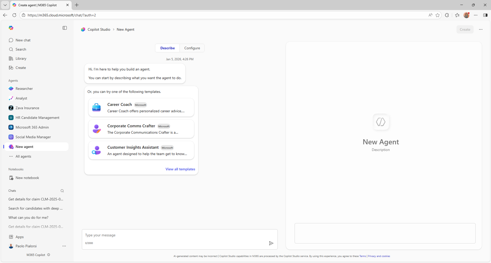

# Making agents with Copilot Studio agent builder

This is the easiest way of making a personal agent for Microsoft 365 Copilot. In fact, it is integrated with the native UI of Microsoft 365 Copilot Chat and Microsoft 365 Copilot. You can start from a set of Microsoft provided templates, or you can start from scratch. You can define the agent simply describing in natural language what you are looking for and relying on Copilot Studio agent builder capability to understand natural language. It will create an agent for you, based on your prompt. Or you can configure the agent using a configuration page. By default, the agent is for personal use only. However, you can share it with specific people in your organization, or even with all the users in your organization, if needed.

An agent built with Copilot Studio agent builder can use knowledge bases like:

- Generic web content
- Content of documents stored in SharePoint Online
- Microsoft Graph connectors

It can also generate images on the fly or convert natural language into code.

It is available in Microsoft 365 Copilot Chat and to any licensed user of Microsoft 365 Copilot. 
Depending on the target knowledge base and on your users' license, your organization might have to pay for metered services.

---8<--- "mab-labs-toc.md"

## <a href="./01-first-agent">Start here</a> with Lab MAB1, where you'll make your first agent with Copilot Studio agent builder.

