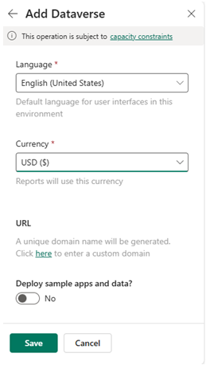
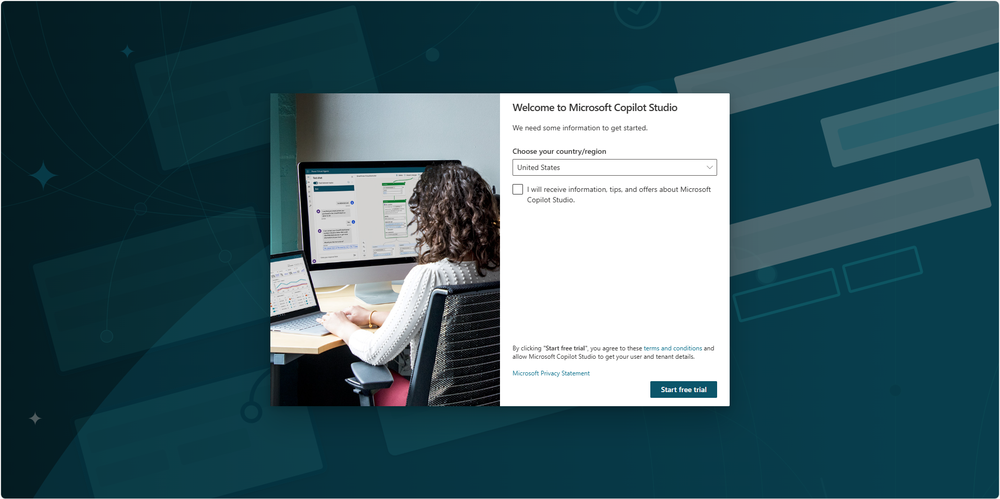
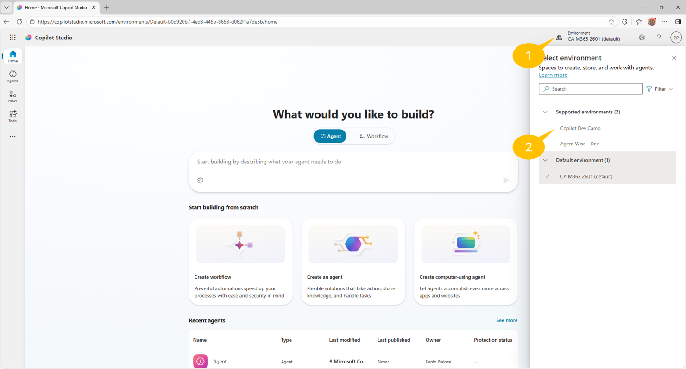

# Lab MCS0 - Setup

---8<--- "mcs-labs-prelude.md"

    <iframe src="//www.youtube.com/embed/RF9RBhPp6v8" frameborder="0" allowfullscreen></iframe>

In this lab, you'll setup and configure your Microsoft 365 tenant to start creating agents with Microsoft Copilot Studio.
Copilot Studio is part of the Microsoft Power Platform offering and requires dedicated licensing, accordingly to the [Microsoft Power Platform Licensing Guide](https://go.microsoft.com/fwlink/?linkid=2085130){target=_blank}.

!!! note "Set up your development environment for Microsoft 365 Copilot and Microsoft Copilot Studio"
    This lab currently assumes you already have a developer tenant to setup. You can reference off to the
    [page here](https://learn.microsoft.com/en-us/microsoft-365-copilot/extensibility/prerequisites){target=_blank} that explains the current way you can get a tenant. It also assumes that you have a user account that is a Power Platform administrator, in order to being able to create a new Power Platform environment.

In this lab you will learn:

- How to create a dedicated environment for your labs
- How to setup and configure Microsoft Copilot Studio

!!! pied-piper "Disclaimer"
    These samples and labs are intended for instructive and demonstration purposes and are not intended for use in production. Do not put them into production without upgrading them to production quality.

## Exercise 1 : Creating a Power Platform environment

With the Power Platform, you can create different environments and easily switch between them accordingly to your needs.
An environment stores apps, flows, data, agents, etc. and each environment is completely isolated from any other environment.
You can learn more about Power Platform environments reading this [overview document](https://learn.microsoft.com/en-us/power-platform/admin/environments-overview){target=_blank}.

!!! note "Power Platform administrative rights"
    In order to proceed with the steps illustrated in this Exercise, you need a user account that is a Power Platform administrator in your target tenant. If you don't have such an account, ask to a Power Plaform administrator to create the environment for you and to give you access to that new environment.

### Step 1: Creating a new Power Platform environment

To play with these labs you are going to create a new dedicated environment, so that at the end of this training path you can simply delete it and get rid of all the related resources and settings. Here follow the instructions to create an environment, step by step:

- Open a browser and, using the work account of your target Microsoft 365 tenant, go to [https://admin.powerplatform.com](https://admin.powerplatform.com){target=_blank}.

- Go to the 1️⃣ **Manage** section, select the 2️⃣ **Environments** panel and select 3️⃣ **+ New** to open the 4️⃣ **New environment** pane

- Specify a unique name for the environment. For example, you could use "Copilot Dev Camp".

- Leave the default value (off) for the **Make this a Managed Environment** setting.

- Choose a **Region** accordingly to your needs.

- Leave the default value (off) for the **Get new features early** setting.

- Choose **Developer** for the **Type** setting.

!!! note "Understanding the environment types"
    If you like, you can also choose **Trial** for the **Type** setting, so that you will have a fully functional environment that will last for 30 days and then will get automatically deleted. [Here](https://learn.microsoft.com/en-gb/microsoft-copilot-studio/environments-first-run-experience#trial-environments){target=_blank} you can find additional information about **Trial** environments. Moreover, [here](https://learn.microsoft.com/en-us/power-platform/admin/environments-overview#power-platform-environment-types){target=_blank} you can find a detailed explanation of all the available environment types.

- Leave all the other settings as they are.

- Select **Next**.

- Choose a **Language** and a **Currency**, or leave the default ones.

- Leave all the other settings as they are and select **Save** to create the actual environment.

The new environment will take a while to be ready, as you can notice from the list of environments in the Power Platform Admin center.

Once the new environment will be ready, the list of environments will show the information accordingly.

<cc-end-step lab="mcs0" exercise="1" step="1" />

## Exercise 2 : Microsoft Copilot Studio

In order to use Microsoft Copilot Studio you need to have a valid license and you need to activate it in the target tenant where you want to use it.

!!! note "Microsoft Copilot Studio licensing"
    There are multiple options to have a licensed access to Microsoft Copilot Studio. We suggest you to refer to the [Power Platform Licensing Guide](https://go.microsoft.com/fwlink/?LinkId=2085130){target=_blank}.

### Step 1: Activating Microsoft Copilot Studio

To activate Copilot Studio follow these steps:

- Open a browser and, using the work account of your target Microsoft 365 tenant, go to [https://copilotstudio.microsoft.com](https://copilotstudio.microsoft.com){target=_blank}.

- If this is the very first time you run Copilot Studio and if you don't have a license, you will see the following screen and you will be able to start a trial period.

!!! note "Copilot Studio free trial period"
    You can get additional information about the free trial license for Copilot Studio by reading
    [this document](https://learn.microsoft.com/en-us/microsoft-copilot-studio/sign-up-individual){target=_blank}.

- Select the 1️⃣ **Environment** section in the upper right corner of the screen and choose the environment 2️⃣ that you created in Exercise 1.

- Copilot Studio will reload and you will then be ready to start using it in the new environment.

<cc-end-step lab="mcs0" exercise="2" step="1" />

---8<--- "mcs-congratulations.md"

Now you are all set to create your first agent with Copilot Studio. 

<a href="../01-first-agent">Start here</a> with Lab MCS1, to create your first agent with Copilot Studio.
<cc-next />

