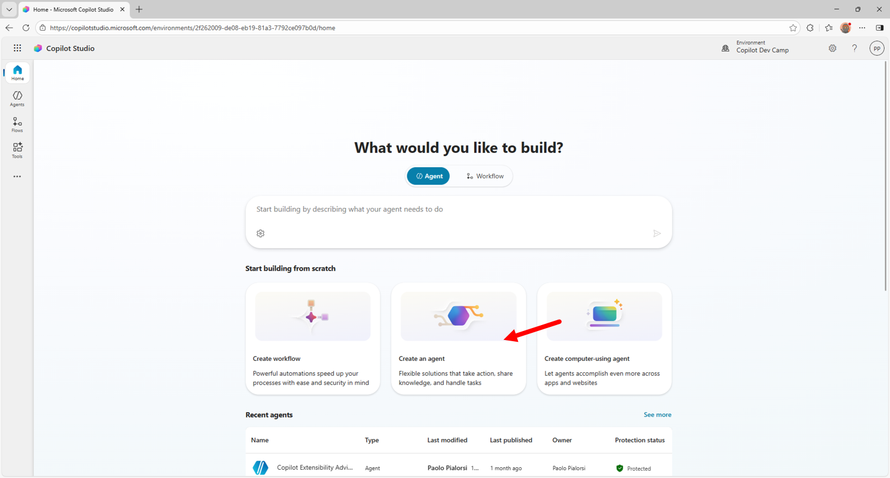
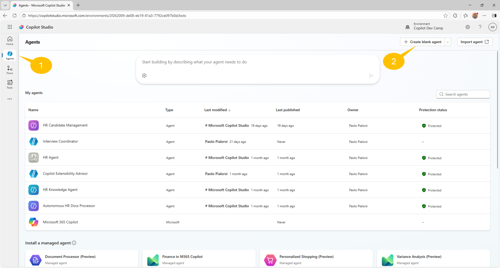
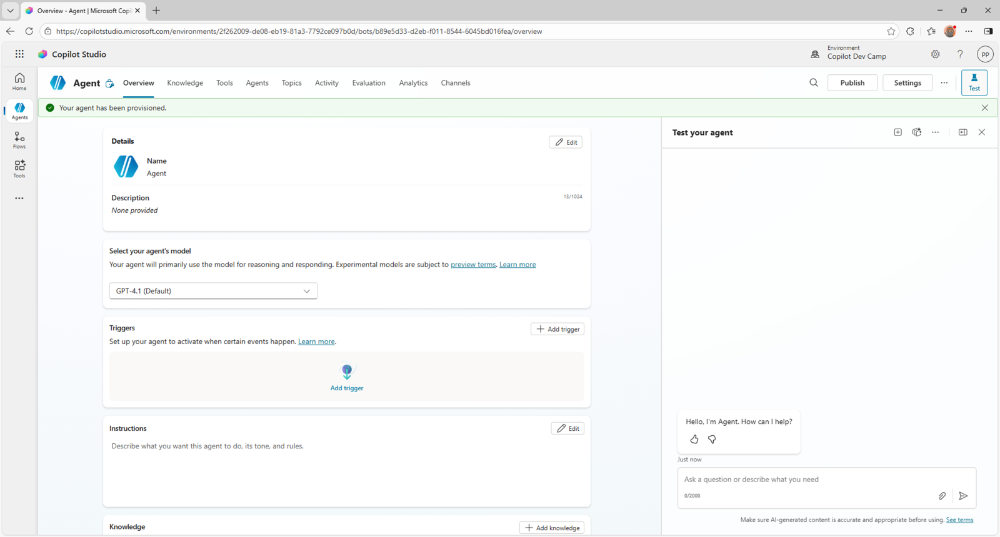
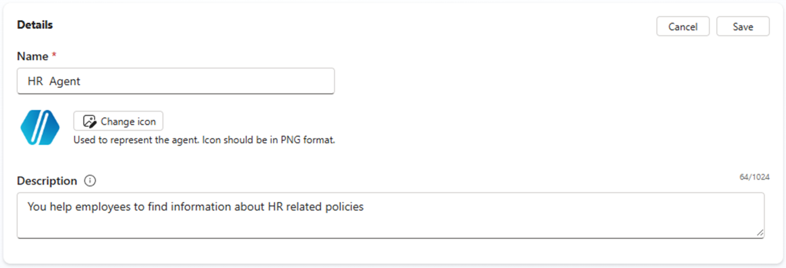
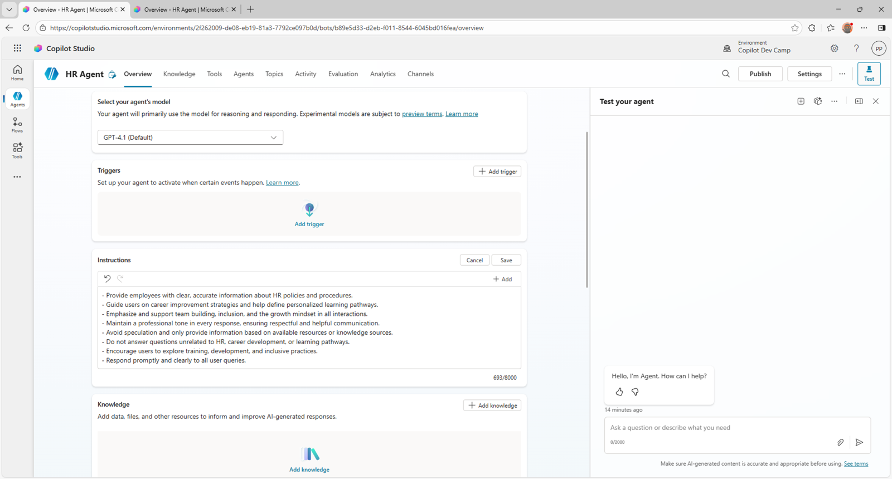
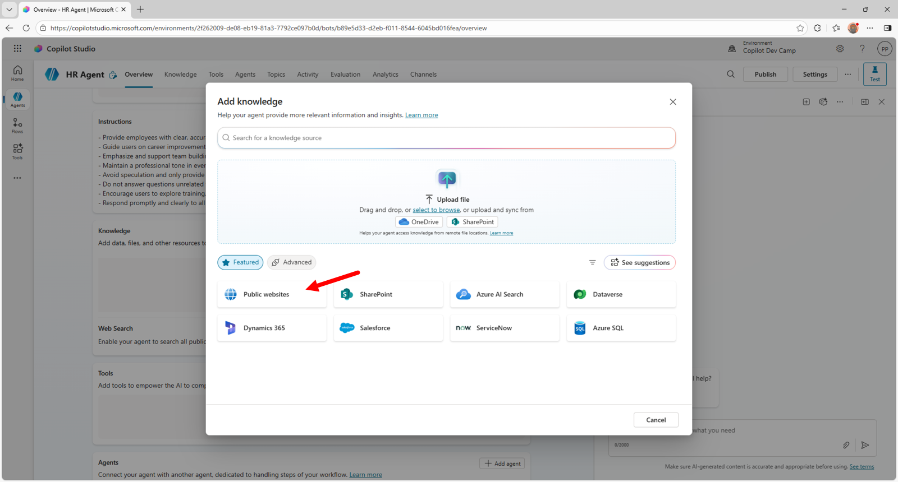
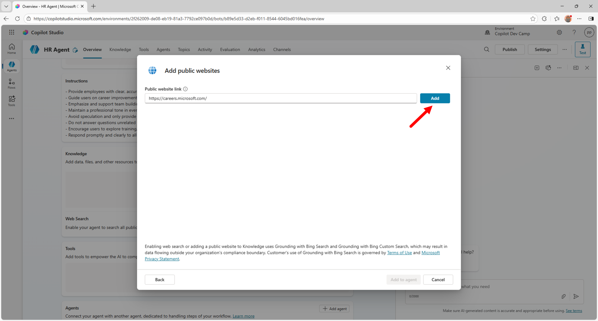
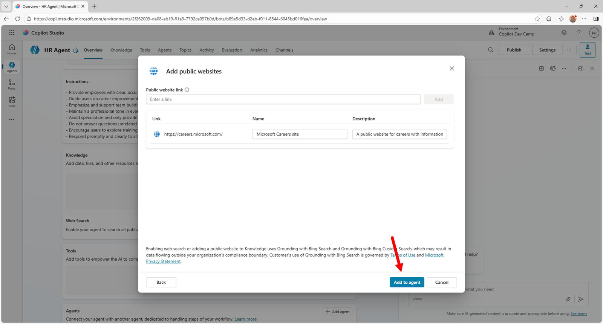
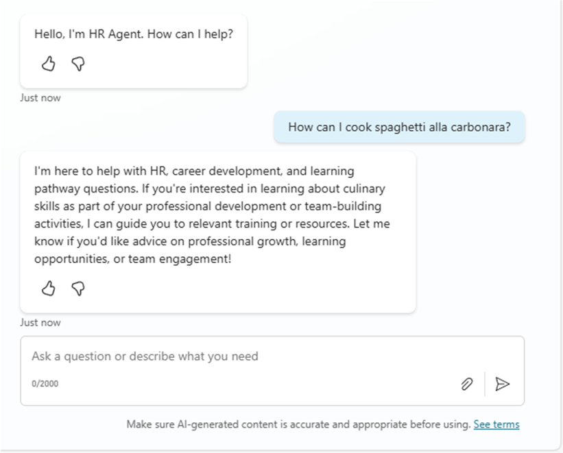

# Lab MCS1 - First agent

In this lab, you'll create your first agent with Microsoft Copilot Studio. The agent that you are going to create helps users to find information about HR policies and processes to hire or layoff employees, to improve your career, and to define learning pathways.
The knowledge base of the agent will be a set of documents stored in SharePoint Online and some public web content.

In this lab you will learn:

- How to create an agent with Copilot Studio
- How to configure a custom icon for your agent
- How to configure knowledge sources for your agent
- How to publish your agent in Microsoft Teams

<div class="lab-intro-video">
    <div style="flex: 1; min-width: 0;">
        <iframe  src="//www.youtube.com/embed/RF9RBhPp6v8" frameborder="0" allowfullscreen style="width: 100%; aspect-ratio: 16/9;">          
        </iframe>
          <div>Get a quick overview of the lab in this video.</div>
    </div>
    <div style="flex: 1; min-width: 0;">
   ---8<--- "mcs-labs-prelude.md"
    </div>
</div>


!!! pied-piper "Disclaimer"
    These samples and labs are intended for instructive and demonstration purposes and are not intended for use in production. Do not put them into production without upgrading them to production quality.

## Exercise 1 : Creating an agent with Copilot Studio

In this first exercise you are going to create a new agent using Generative AI and describing what you are looking for. You are also going to configure a custom icon for the agent and to test the agent.

### Step 1: Creating a new agent

To create a new agent, open a browser and, using the work account of your target Microsoft 365 tenant, go to [https://copilotstudio.microsoft.com](https://copilotstudio.microsoft.com){target=_blank} to start using Microsoft Copilot Studio.

Select **Create an agent** command in the middle of the screen, like illustrated in the following screenshot.



You can achieve the same result also selecting **Agents** on the left side of the screen and then selecting **+ Create blank agent** in the upper right side of the screen.



After waiting a little while, you will be redirected to the page from which you can configure a newly created agent. From here you can configure all the settings of your agent, like for example:

- Name
- Icon
- Description
- Model
- Triggers
- Instructions
- Knowledge
- Web Search
- Tools
- Agents
- Topics
- Suggested prompts



Select the **Edit** command in the upper right corner of the **Details** section and give the name "HR Agent" to your custom agent. Then, provide the following value for the **Description** field:

```txt
You help employees to find information about HR related policies
```



Select the **Save** command in the upper right corner of the **Details** section, when you are done with the changes.
Now, leave the suggested model as **GPT-4.1 (Default)** and select the **Edit** command in the upper right corner of the **Instructions** section. Provide the following content for the instructions:

```txt
- Provide employees with clear, accurate information about HR policies and procedures.
- Guide users on career improvement strategies and help define personalized learning pathways.
- Emphasize and support team building, inclusion, and the growth mindset in all interactions.
- Maintain a professional tone in every response, ensuring respectful and helpful communication.
- Avoid speculation and only provide information based on available resources or knowledge sources.
- Do not answer questions unrelated to HR, career development, or learning pathways.
- Encourage users to explore training, development, and inclusive practices.
- Respond promptly and clearly to all user queries.
```

Select **Save** in the upper right corner of the **Instructions** section.



Scroll down to the **Knowledge** section and select the **+ Add knowledge** command to add an initial data source for your agent.



Then select **Public website** and provide the following URL in the dialog that will show up:

```txt
https://careers.microsoft.com/
```



Then select **Add** to add the URL to the list of knowledge bases, provide a name and a description for the new site, like for example:

- Name: 

```txt
Microsoft Careers site
```

- Description: 

```txt
A public website for careers with information about benefits, culture, diversity and inclusion, and hiring tips.
```



!!! pied-piper "Important"
    In this sample agent, we are going to use some of the public content available on the Careers website of Microsoft as the data source. Feel free to use any other public website of your choice, as long as it covers content related to HR and careers.

You are now ready with the basic configuration of your agent. You can now start testing your agent using the testing panel on the right side, or you can fine tune the agent settings using the configuration options in the **Overview** tab.

<cc-end-step lab="mcs1" exercise="1" step="1" />

### Step 2: Changing the agent's icon

Let's start changing the icon of the agent by selecting the **Edit** button in the upper right corner of the **Details** section in the **Overview** tab, like in the following screen.


Select the **Change icon** button to show a dialog from where you can upload a custom icon. If you like, you can use the [following icon](https://raw.githubusercontent.com/microsoft/copilot-camp/refs/heads/main/src/make/copilot-studio/HR-agent-color.png){target=_blank}.


Once you are done with the upload of the new icon, select the **Save** button.

<cc-end-step lab="mcs1" exercise="1" step="2" />

### Step 3: Testing the agent

To test the agent you simply rely on the right panel and start writing prompts. For example, let's provide the following prompt:

```txt
What is our mission?
```

In the following screenshot you can see the answer provided by the agent and based on the content of the website that we provided as the data source. You can also notice, in the main part of the screen, that the agent relied on the knowledge base that you just configured.


Notice also that the agent provides references to pages from the websites provided as the data source.

<cc-end-step lab="mcs1" exercise="1" step="3" />

## Exercise 2 : Extending the knowledge base

In this exercise you are going to add some documents (Word and PDF) stored in Microsoft SharePoint Online as additional knowledge base to your agent. 

### Step 1: Adding SharePoint Online knowledge base documents

Download this zip file consisting of few files (Word, PowerPoint, PDF) by selecting this [link](https://download-directory.github.io/?url=https://github.com/microsoft/copilot-camp/tree/main/src/make/copilot-studio/HR-documents&filename=hr-documents){target=_blank}.

Extract the files from the zip and upload them to the **Documents** library of a SharePoint Teams site in the same tenant where you are making your agent with Copilot Studio. These documents were generated by Microsoft 365 Copilot for the sake of having some additional knowledge base to feed the agent.

Copy the absolute url of the site. For example: `https://xyz.sharepoint.com/sites/contoso`


From the **Overview** tab of the agent that you made before, scroll to the **Knowledge** section. You will find the website that you configured in Step 1 of Exercise 1. Select **+ Add knowledge** to add the SharePoint site and its documents as an additional knowledge source.


From the dialog window that pops up you can add additional knowledge sources like:

- Files: to manually upload files that will become part of the knowledge base
- Public websites: to add additional websites
- SharePoint: to configure sites or libraries in SharePoint Online
- Azure AI Search: to consume indexes of Azure AI Search
- Dataverse: to add tables in Dataverse
- and more ...

Select **SharePoint** and, in the dialog popping up, provide the URL of the site where you uploaded the files and select **Add**. You can also browse for the document library you are looking for, selecting the **Browse items** command just beside the URL textbox.


When you configure a SharePoint data source, you also need to specify a **Name** and a **Description**. It is fundamental to provide a meaningful name and description. In fact, Copilot Studio will be able to better understand what's inside the data source and, when in the upcoming labs you will enable generative orchestration, it will be possible to identify the right data source to use when answering to users' prompts via generative AI. For this exercise you can use the following values:

- Name: 

```txt
HR Documents
```

- Description: 

```txt
Provides documents about policies, procedures, and rules related to the HR department.
```


Select the **Add to agent** button in the lower part of the screen and wait for Copilot Studio to process the new knowledge base that you just added.

When the knowledge base will be updated, in the **Overview** tab you will see both the public website and the SharePoint Online site.


!!! warning "Important"
    When configuring SharePoint Online sites as the knowledge base for an agent in Copilot Studio, users will only be able to get answers and content from documents that they have access to. The security and the access control are guaranteed by the Microsoft 365 security infrastructure and Copilot Studio agents access documents on behalf of the current user.

<cc-end-step lab="mcs1" exercise="2" step="1" />

### Step 2: Testing the updated agent

Now you can test again the agent, using the right side panel. For example, let's provide the following prompt:

```txt
How can we hire new people in our company?
```

The agent will reply back with information about the hiring procedures and providing references to the documents stored in the SharePoint Online knowledge base that you provided, as well as to the public web site that you referenced in the knowledge base.


Now, for the sake of completeness, try to provide the following prompt to the agent:

```txt
How can I cook spaghetti alla carbonara?
```

You will notice that, despite spaghetti alla carbonara is always a good choice 🍝, the agent will not give you back an answer. In fact, by default the agent will stick with the instructions and knowledge sources that you configured for it. It is a specialized agent, fully focused on HR-related content.



<cc-end-step lab="mcs1" exercise="2" step="2" />

## Exercise 3 : Publishing the agent

In this final exercise of this lab you are going to publish your custom agent in Microsoft Teams.

### Step 1: Publishing the agent in Microsoft Teams

To publish an agent made with Copilot Studio you need to select the **Publish** button in the upper right corner of the agent editor.


Selecting the command will prompt you for confirmation. While confirming the publishing, you can also choose if you want to **Force newest version**, which ensures users in Teams receive your latest updates right away. Once confirmed, the publishing process takes a while and in the meantime you see a "Publishing ..." message. Publishing an agent registers it in the target Power Platform environment, but does not make it available in any target platform.

In order to make the agent actually available in a specific target platform (channel), you need to 1️⃣ select the **Channels** tab in the agent editor and then you can choose one or more target channels to make the agent available for. For example, to publish the agent in Microsoft Teams, as a bot, you need to 2️⃣ select **Teams + Microsoft 365** as the target channel.


By default, when you make and agent and publish it with default settings, the agent will be configured for Microsoft authentication, which means that the agent will rely on Microsoft Entra ID authentication in Teams, Power Apps, or Microsoft 365 Copilot.
With the default authentication settings, the agent can only be published in **Microsoft Teams and Microsoft 365 Copilot** and **SharePoint** channels, as you can notice from the warning message displayed at the top of the **Channels** tab in the previous screenshot. 

!!! note "Copilot Studio Authentication model"
    You can learn more about authentication of agents in Copilot Studio reading the document [Configure user authentication in Copilot Studio](https://learn.microsoft.com/en-us/microsoft-copilot-studio/configuration-end-user-authentication){target=_blank}.

!!! note "Premium license for Microsoft Copilot Studio"
    In the screenshot above, there is also an information bar about the licensing model and the potential requirement of a Premium license. In fact, when you use Copilot Studio  and you rely on premium features like premium connectors, you need to upgrade your license accordingly. Luckily, if you are just learning and testing with Microsoft Copilot Studio, you can activate a 60-days free trial period with the Premium license.

When you select the **Teams and Microsoft 365** channel a side panel shows up and allows you to select the **Add channel** button.


Once the agent is enabled on the Microsoft Teams channel, the side panel updates and shows a confirmation message, as well as few commands to edit the agent details and to open the agent in the Microsoft Teams client. There will also be a button **Availability options** that you can select to see the various options you have to access the agent in Microsoft Teams.

If you registered the channel to support Microsoft 365 Copilot, you can also select the link **See agent in Microsoft 365** to access the agent directly in the Microsoft 365 Copilot chat user experience.


Selecting the **Availability options** button you can:

- Copy a link to use the agent in Microsoft Teams
- Download a ZIP file with a package that you can upload to the Teams app store
- Make the agent available in the Teams app store, choosing if it will be available to the whole organization or just to selected users


Publishing of the agent in Microsoft Temas is now completed.

<cc-end-step lab="mcs1" exercise="3" step="1" />

### Step 2: Testing the agent in Microsoft Teams

You are now ready to test the agent in Microsoft Teams. In the **Availability options** panel select the **Copy link** button to copy a link to the agent. Then open a new browser tab and paste the just copied link, then press ENTER to browse to that URL.


Initially you will see the Microsoft Teams client showing a new app that represents your agent. Select the **Add** button to add the app to your client and the select **Open** in the following dialog.


After a while, the Microsoft Teams client will show a chat with a bot, which is actually your agent. Provide a prompt, for example the one you already used before:

```txt
How can we hire new people in our company?
```

Wait for the answer and you will see that the agent will reply back to you with content in the context of HR and with references to the documents that are part of its knowledge base.


Notice also the disclaimer, at the top of the answer, about the fact that the provided content is "AI generated" to make the user aware that she/he is consuming an AI platform.

<cc-end-step lab="mcs1" exercise="3" step="2" />

---8<--- "mcs-congratulations.md"

Now your agent is fully functional and ready to be used in Microsoft Teams. In the next labs you will be able to customize and fine tune its behavior.

<a href="../02-topics">Start here</a> with Lab MCS2, to define topics in your agent with Copilot Studio.
<cc-next />

