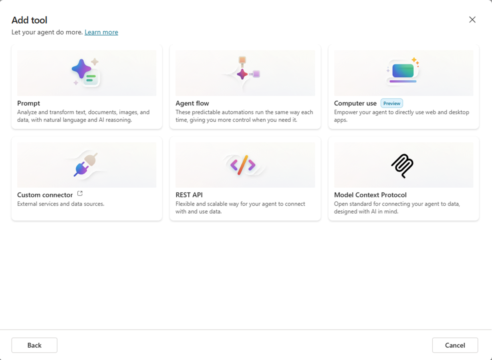
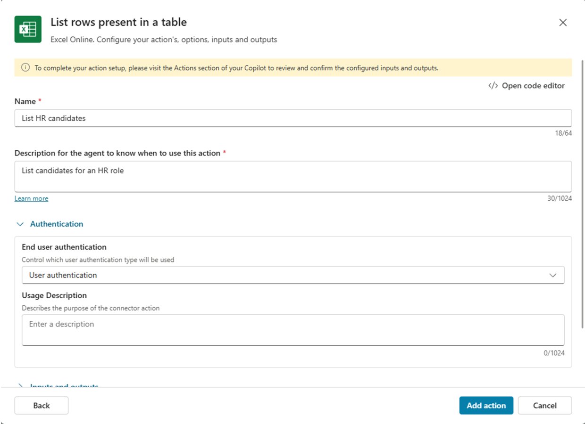
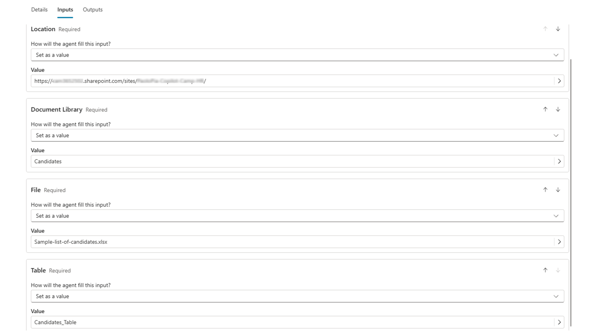
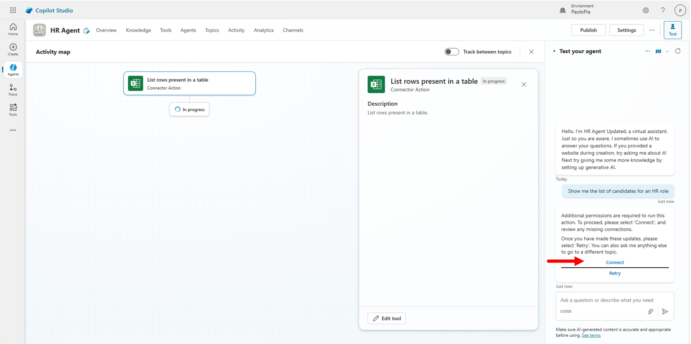
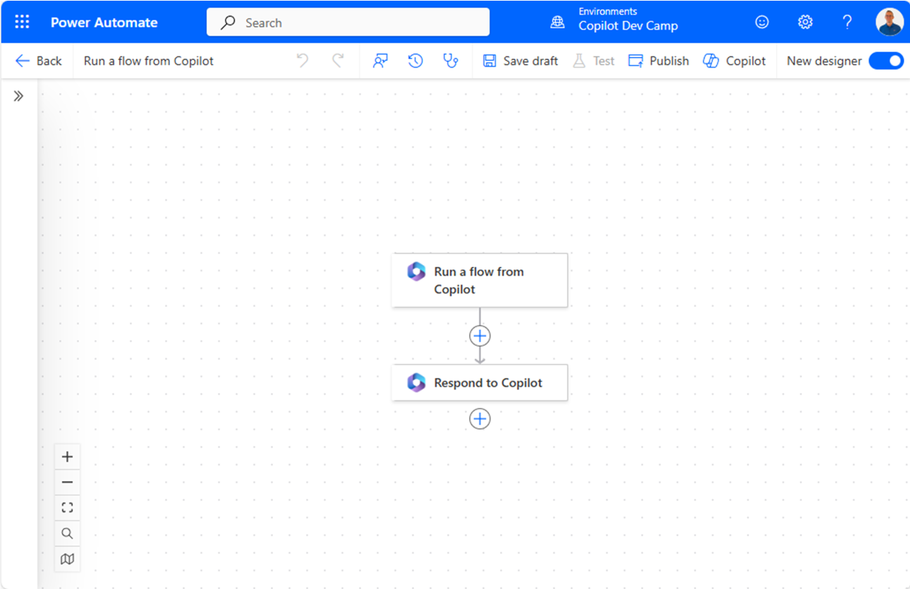
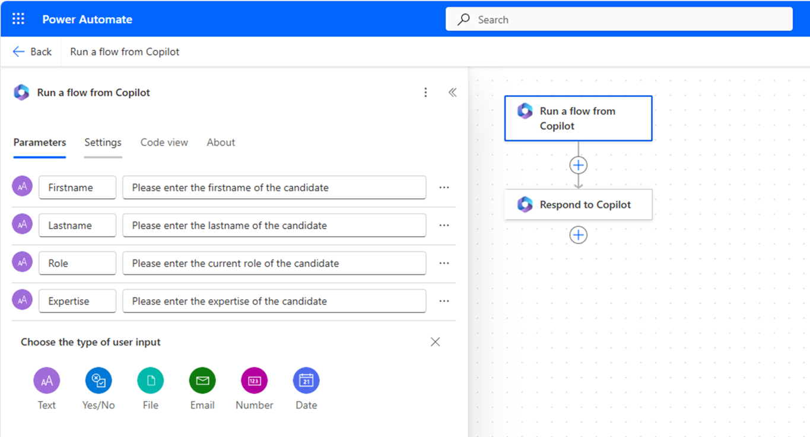
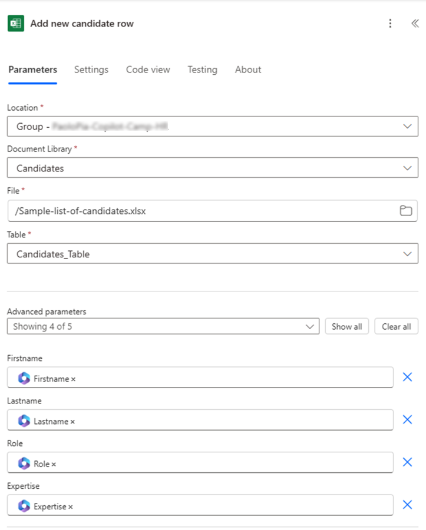
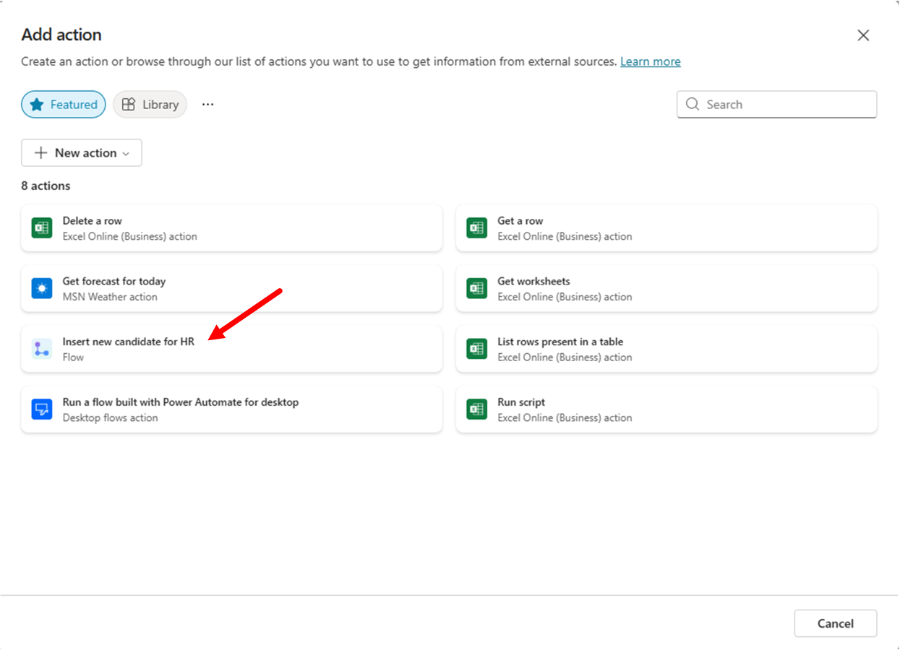
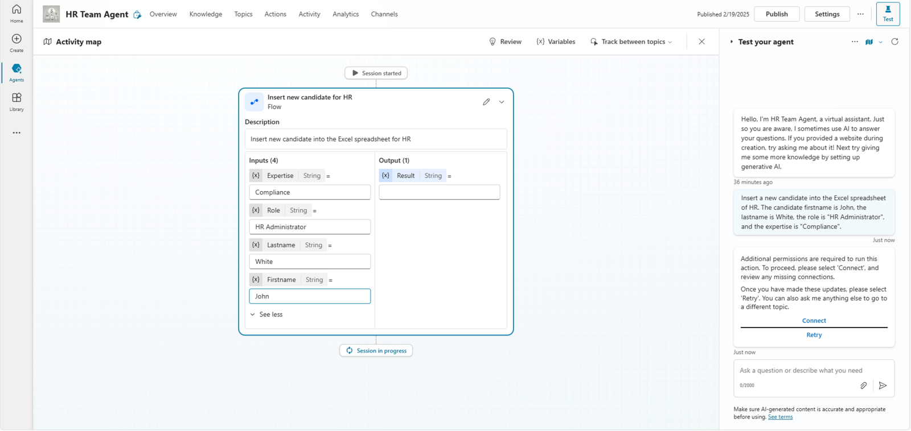
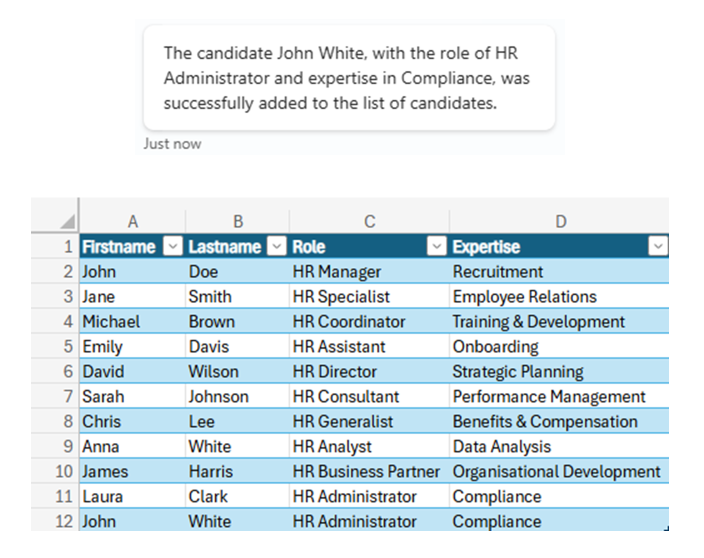

# Lab MCS3 - Defining Actions

---8<--- "mcs-labs-prelude.md"

In this lab, you'll learn how to create Actions in Microsoft Copilot Studio. Actions are another core building block of an agent. With actions you can extend the capabilities of your agent by adding support for external Power Platform connectors (native or custom), external REST APIs, Power Automate flows, etc.

!!! note
    This lab builds on the previous one, [Lab MCS2](../02-topics){target=_blank}. You should be able to continue working on the same agent, improving its functionalities with new capabilities.

Actions can be created with a graphical designer. Once you have created a new Action, you can also edit its definition with a low level code editor, in case you need to apply detailed fine tuning.

In this lab you will learn:

- How to create an action to invoke a Power Platform connector
- How to create an action to invoke a Power Automate flow
- How to invoke actions from topics

## Exercise 1 : Creating actions in Microsoft Copilot Studio

In this exercise you are going to enhance the agent that you created in [Lab MCS2](../02-topics){target=_blank} to use Excel Online to retrieve a hypotethical list of candidates from an Excel spreadsheet stored in a SharePoint Online document library. Then you will add an action to consume a Power Automate flow that can add new candidates to the same spreadsheet.

### Step 1: Consuming a Power Platform connector

To create a new action, in the upper side of the screen select the 1️⃣ **Actions** tab, then select 2️⃣ **+ Add an action** to start creating a new action.


A dialog window pops up allowing you to choose what kind of action to create. By default, there are some **Featured** actions like those that allow you to interact with Excel Online content or other common services. You can also create a new action from scratch, selecting the **+ New action** command and choosing between the following options:

- New prompt: allows consuming an AI action built using a prompt written in natural language.
- New Power Automate flow: allows consuming a Power Automate flow (see [Step 2](#step-2-consuming-a-power-automate-flow)).
- New custom connector: allows consuming a Power Platform custom connector.
- Upload a skill: allows supporting skills built with Bot Framework SDK. You can find additional details [here](https://learn.microsoft.com/en-us/microsoft-copilot-studio/configuration-add-skills){target=_blank}.
- New REST API: allows consuming an external REST API. You can find additional details [here](https://learn.microsoft.com/en-us/microsoft-copilot-studio/agent-extend-action-rest-api){target=_blank}.



If you don't find the option you are looking for in the list of featured items, simply switch to the **Library** group and search by text what you are looking for.

To complete the current step, choose the featured action to **List rows present in a table** in the family of **Excel Online (Business)** actions. First of all, you will need to connect to the external connector simply selecting the **Next** button and proceeding with the process.


Next, you get a dialog to configure the actual action. You need to provide:

- Name: simply a descriptive name for the action.
- Description: a description in natural language that will be used by generative orchestration to determine when to use your action. 
- Authentication settings: the settings to define how the action will rely on authentication.
- Inputs and outpus: to define the input and output arguments for the action, if any.
- Response settings: defines how the action handles the request and response to the user.

Before configuring the action, you need to prepare the Excel spreadsheet with the list of candidates.
Download a sample Excel file by selecting this [link](https://github.com/microsoft/copilot-camp/blob/main/src/make/copilot-studio/Candidates/Sample-list-of-candidates.xlsx?raw=true){target=_blank}.

Upload the file to the **Documents** library of a SharePoint Teams site in the same tenant where you are making your agent with Copilot Studio. The document was generated by Microsoft 365 Copilot for the sake of having a hypothetical list of candidates.

- Copy the absolute url of the site. For example: `https://xyz.sharepoint.com/sites/contoso/`.
- Copy the name of the document library. For example : `Shared documents`
- Copy also the name of the file. For example: `Sample-list-of-candidates.xlsx`

Now go back to Microsoft Copilot Studio and resume finalize the action configuration.



Use the following settings:

- Name: List HR candidates
- Description: List candidates for an HR role
- Authentication: User authentication

Select the **Add action** button to save the new action. You will get the list of actions in Copilot Studio. Click on the action that you just created to edit its settings.


In the dialog for editing the action, update the **Action name** to give it a more descriptive and informative name. Then select the **Inputs** tab and start configuring the input arguments.
By default, all the mandatory input arguments have been configured so that their value will be exctracted by the `User's entire response` as you can notice in the **Identify as** property of each input argument.


Select the **How will the agent fill this input?** setting for each of the input arguments and switch to `Set as a value` in order to provide static values for all of the input arguments. Confirm that you want to change the setting and proceed configuring a manual value for each of the input arguments.


Use the following static values:

- Location: use the URL of the SharePoint Online site collection where you stored the Excel spreadsheet. For example: `https://xyz.sharepoint.com/sites/contoso/`.
- Document Library: use the name of the document library where you stored the Excel spreadsheet. For example: `Shared Documents`.
- File: provide the name of the Excel file. For example: `Sample-list-of-candidates.xlsx`.
- Table: `Candidates_Table`



Now select the **Save** button in the upper right corner of the screen to save the updated action.

<cc-end-step lab="mcs3" exercise="1" step="1" />

### Step 2: Testing the new action

You are now ready to publish the updated agent and to play with it in the integrated test panel or in Microsoft Teams.

Since in [Lab MCS2](../02-topics){target=_blank} you enabled generative orchestration, it is really easy to invoke the just created action simply providing to the agent a prompt like the following one:

```txt
Show me the list of candidates for an HR role
```

Something really nice of Copilot Studio when using the generative orchestration and invoking prompts within the test panel is that by default you get an Activity map to investigate how the orchestrator works. In the following screenshot you can see the Activity map for the prompt suggested before. The orchestrator indentifies the user's intent, based on the prompt, and triggers the action that you created in Step 1. You can also validate the manually defined input arguments.

Since the Power Platform connector requires a valid connection in place, the agent prompts the user to **Connect** before being able to consume the external data source.



Select the **Connect** button and proceed to activate the connection. You will see, in a new browser tab, the list of active connections for your current session, including the connection to `Excel Online (Business)`. Select the **Connect** link to activate the connection through a dedicated dialog with title **Create or pick a connection**. Once the connection is ready and connected, go back to the agent and select the **Retry** command to execute the action against the target connection. In the test panel you get the list of candidates retrieved from the Excel spreadsheet.


Well done, so far! You can now move to the next step.

<cc-end-step lab="mcs3" exercise="1" step="2" />

### Step 3: Consuming a Power Automate flow

In this step you are going to create an action to consume a Power Automate flow. Let's say that you want to add new candidates to the Excel spreadsheet, based on the user's input. You can simply create an action that invokes an external Power Automate flow, which adds a new row to the table in the Excel spreadsheet.

To create such an action, in the upper side of the screen select the **Actions** tab, then select **+ Add an action** to start creating a new action. This time, select the **+ New action** button and then **New Power Automate flow**. A new browser tab will be opened, navigating to a the Power Automate flow designer and rendering a new flow.



The flow has an initial triggering action with name `Run a flow from Copilot` and a final action with name `Respond to Copilot`. The overall idea is that you can define your own business process between these two flow actions and the Copilot Studio action will trigger the business process for you, eventually providing one or more input arguments and providing a response back to the agent. Select the first action to edit its properties. You can configure a set of input arguments for the flow, so that Copilot Studio will be able to feed the flow through the action upon activation.



For the sake of being able to add new candidates, configure four input parameters with the following settings:

- Firstname: text
- Lastname: text
- Role: text
- Expertise: text

Now add, between the two pre-created actions, a new action of type **Add a new row into a table** from the **Excel Online** connector.
Configure the new action in order to target the Excel spreadsheet with the list of candidates. Map the column fields of the row to the actual input parameters defined in the triggering action invoked by Copilot. Rename the action into `Add new candidate row`. In the following screenshot you can see how the action is configured.



Now select the final action `Respond to Copilot`, edit its properties and add an output parameter of type `Text` with name `Result`. Set the value of the output paremeter to a formula that renders a message like the one illustrated in the following screenshot.


Now give the flow a name, like for example `Insert new candidate for HR`, save and publish it, and go back to the browser tab where you were editing the action. The dialog window to create a new action will prompt you to refresh the list of available actions. Please, do so. The new flow that you just created should be available in the list of **Featured** actions. If not, try searching for its name.



Select the new action, configure its settings as like as you did in Step 1, and play with it. For example, use the following settings:

- Name: Insert new candidate for HR
- Description: Insert new candidate into the Excel spreadsheet for HR

Select the **Add action** button, edit the new action, and configure its inputs accordingly to your needs.
Now let's trigger the action with a prompt like the following one:

```txt
Insert a new candidate into the Excel spreadsheet of HR. The candidate firstname is John, 
the lastname is White, the role is "HR Administrator", and the expertise is "Compliance".
```

As like as it was with the previous Step, the first time you use the action you need to connect to Excel Online in order to consume the connector. Select the **Connect** button and once you will be connected, select the **Retry** button to execute the actual action.



After the execution of the action, you will see the agent replying back to you with the response message that you defined in the Power Automate flow. Moreover, the new candidate will be added to the table in the Excel spreadsheet.



<cc-end-step lab="mcs3" exercise="1" step="3" />

## Exercise 2 : Invoking actions from within a topic

In this exercise you are going to consume the action that you just defined from within a topic.

### Step 1: Invoking an action from a topic

First of all, create a new topic from blank, give it name `Add a new candidate to Excel`, and follow the same steps defined in [Exercise 4 of Lab MCS2](../02-topics#exercise-4--using-adaptive-cards){target=_blank}.

The triggering description can be something like the following:

```txt
This topic helps users to insert new candidates in the Excel spreadsheet of HR.
Triggering sentences can be: add a new a new row to the persistence storage.
```

For the sake of simplicy, we are not going to cover all of the steps here. However, you can simply refer to Lab MCS2 for additional details. 

Here follows the JSON of the adaptive card that you can use to collect the input arguments about the candidate through an action of type **Ask with adaptive card**.

```json
{
    "type": "AdaptiveCard",
    "body": [
        {
            "type": "TextBlock",
            "size": "Medium",
            "weight": "Bolder",
            "text": "New HR Candidate Information"
        },
        {
            "type": "Input.Text",
            "id": "firstname",
            "placeholder": "First Name"
        },
        {
            "type": "Input.Text",
            "id": "lastname",
            "placeholder": "Last Name"
        },
        {
            "type": "Input.Text",
            "id": "current_role",
            "placeholder": "Current Role"
        },
        {
            "type": "Input.Text",
            "id": "expertise",
            "placeholder": "Expertise"
        }
    ],
    "actions": [
        {
            "type": "Action.Submit",
            "title": "Submit"
        }
    ],
    "$schema": "http://adaptivecards.io/schemas/adaptive-card.json",
    "version": "1.5"
}
```

Then add a new action from the group **Add an action**, select the tab **Agent (preview)**, and select the action that you just created in [Exercise 1 - Step 3](#step-3-consuming-a-power-automate-flow).
Map the input arguments of the action with the variables collected by the user via the adaptive card.


Now, disable any other topic that you created in Lab MCS2 and invoke the new topic to insert a new candidate row into the Excel spreadsheet using the following prompt:

```txt
Add a new a new row to the persistence storage
```

Fill the adaptive card and submit the request. The action will be triggered via the topic and you will have yet another new candidate in the Excel spreadsheet.


<cc-end-step lab="mcs3" exercise="2" step="1" />

---8<--- "m-congratulations.md"

Now your agent supports actions. In the next lab you will learn how to use Copilot Studio to create agents for Microsoft 365 Copilot Chat.

<a href="#"><button class="github-button">Coming soon ...</button></a>
<!-- <a href="../04-extending-m365-copilot">Start here</a> with Lab MCS4, to learn how to use Copilot Studio to create agents for Microsoft 365 Copilot Chat. -->


