# Lab MCS4 - Extending Microsoft 365 Copilot

In this lab, you are going to learn how to extend Microsoft 365 Copilot Chat with a Declarative Agent made using Microsoft Copilot Studio. In fact, so far you have seen how to create agents in Copilot Studio and how to consume them in Microsoft Teams. You have also seen that agents created in Microsoft Copilot Studio can target both Microsoft Teams and Microsoft 365 Copilot Chat through the specific options available in the **Teams and Microsoft 365 Copilot** channel. Now, with this lab, you are moving to Declarative Agents for Microsoft 365 Copilot Chat.

In this lab you will learn:

- How to create a declarative agent for Microsoft 365 Copilot Chat
- How to configure a custom icon for your agent
- How to configure knowledge sources for your agent
- How to publish the agent in Microsoft 365 Copilot Chat
- How to create a tool for Microsoft 365 Copilot Chat

<div class="lab-intro-video">
    <div style="flex: 1; min-width: 0;">
        <iframe  src="//www.youtube.com/embed/JUctt1s5oj0" frameborder="0" allowfullscreen style="width: 100%; aspect-ratio: 16/9;">          
        </iframe>
          <div>Get a quick overview of the lab in this video.</div>
    </div>
    <div style="flex: 1; min-width: 0;">
   ---8<--- "mcs-labs-prelude.md"
    </div>
</div>

## Exercise 1 : Creating an agent for Microsoft 365 Copilot Chat

In this excercise you are going to create a declarative agent with Microsoft Copilot Studio and hosting it in Microsoft 365 Copilot Chat.

### Step 1: Creating an agent for Copilot Chat

To create a declarative agent for Microsoft 365 Copilot Chat you need to 1️⃣ browse the list of agents in Copilot Studio and 2️⃣ select the agent with name **Microsoft 365 Copilot**.


A new section of Microsoft Copilot Studio will open. From there, you can select the **+ Add** command to create a new agent for Microsoft 365 Copilot Chat.

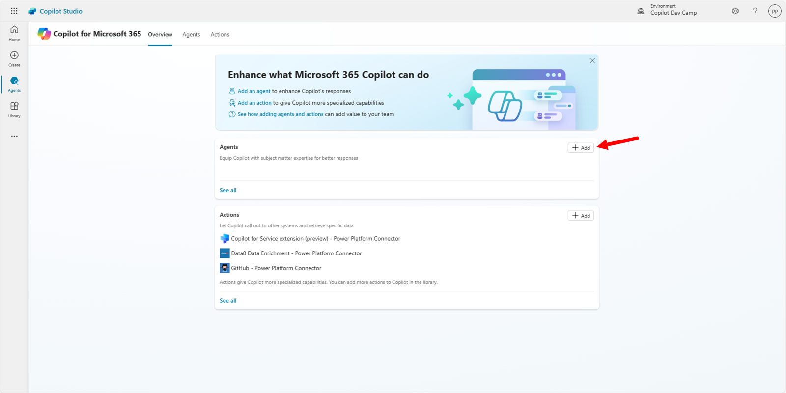

Copilot Studio asks you to describe in natural language what the purpose of the agent is. As like as you did in [Lab MCS1](../01-first-agent){target=_blank} you can define your agent requirements in natural language, using for example the following prompts.

```txt
You are an agent helping employees to find information about HR policies and procedures,
about how to improve their career, and about how to define learning pathways.
```

When requested by Copilot Studio, give the name "Agentic HR" to your custom agent. Then, instruct Copilot Studio to have specific tasks or goals with the following instruction:

```txt
Emphasize everything that helps team building, inclusion, and the growth mindset
```

Then, define a professional tone for your agent, providing the following input:

```txt
It should have a professional tone
```

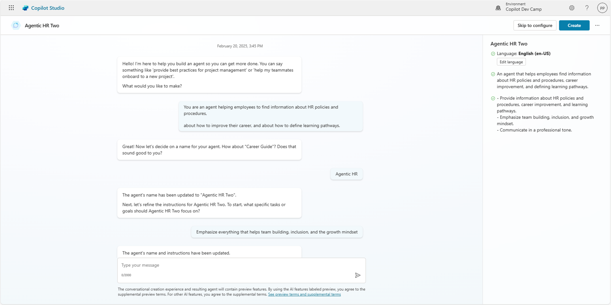

Once you are done describing your agent, select the **Create** command to create the actual agent. Alternatively, you can select the **Skip to configure** command and move to the classic configuration user interface.

Once the agent has been created, you will see its configuration page, where you can define:

- Details: with generic information about the agent like name, icon, description, and instructions (system prompt).
- Knowledge: to define the various knowledge bases for the agent.
- Tools: to define custom tools for the agent.
- Additional settings: to configure whether the agent will rely on public web content or not.
- Suggested prompts: to configure up to 6 suggested prompts that will be shown in the Copilot Chat when starting a new chat.
- Publish details: to get information about how to consume the agent, once it will be published.

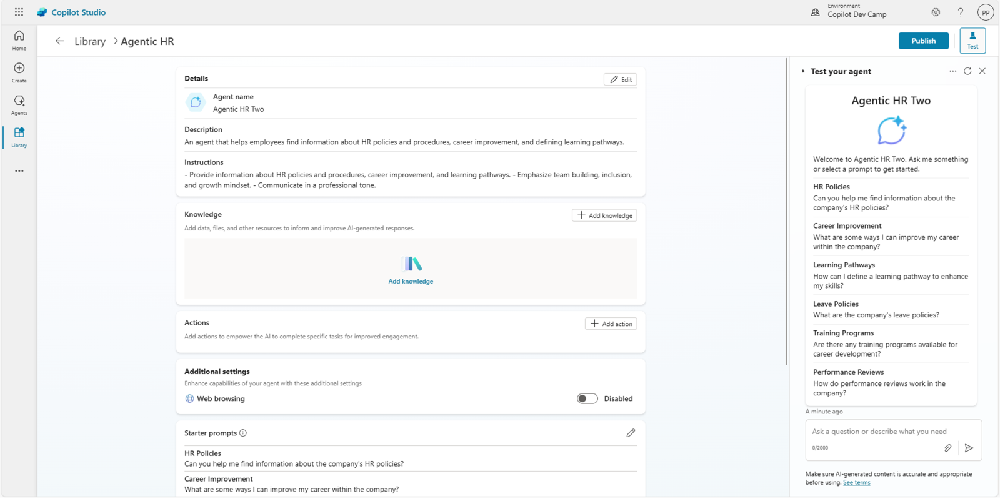

On the right side of the screen, you can already see a preview of the agent that you can use to test its behaviour.
The initial setup of the agent is now ready. Move to the next steps to fine tune its settings.

<cc-end-step lab="mcs4" exercise="1" step="1" />

### Step 2: Updating the agent's icon

Now, you can edit the details selecting the **Edit** command in the upper right corner of the **Details** section.
Once in edit mode, select the **Change icon** command to upload a custom icon and to select a background color for the icon itself.
If you like, you can use the icon available at [this link](https://github.com/microsoft/copilot-camp/blob/main/src/make/copilot-studio/HR-agent-color.png?raw=true){target=_blank}. In case you want to use the suggested icon, the background color could be #B9BAB5.


Select the **Save** command to save the new icon and background color, then select the **Save** button again to save the updated details for the agent.

<cc-end-step lab="mcs4" exercise="1" step="2" />

### Step 3: Adding a knowledge base to the agent

Like you did in [Lab MCS1](../01-first-agent){target=_blank}, download this zip file consisting of few files (Word, PowerPoint, PDF) by selecting this [link](https://download-directory.github.io/?url=https://github.com/microsoft/copilot-camp/tree/main/src/make/copilot-studio/HR-documents&filename=hr-documents){target=_blank}.

Extract the files from the zip and upload them to the **Documents** library of a SharePoint Teams site in the same tenant where you are making your agent with Copilot Studio. These documents were generated by Microsoft 365 Copilot for the sake of having some additional knowledge base to feed the agent.

Copy the absolute url of the site. For example: `https://xyz.sharepoint.com/sites/contoso`

To add a knowledge source to the agent, select the **+ Add knowledge** command in the upper right corner of the **Knowledge** section. A dialog window pops up and allows you to select a data source. At the moment of this writing you can select a **SharePoint** data source. Select the **SharePoint** command and browse for a site that you want to use as the data source.

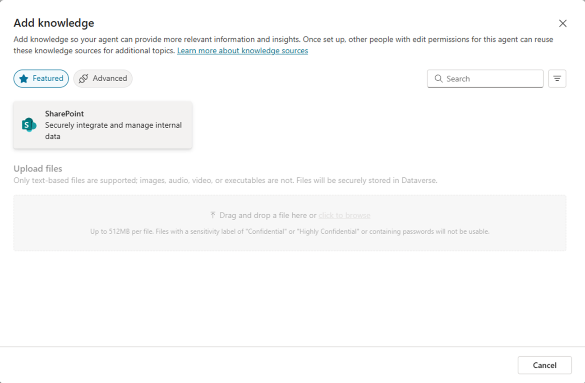

Paste the URL of the SharePoint Online site where you stored the documents into the dialog or select the **Browse files** command to search for data sources browsing the SharePoint Online sites. Once you have provided a URL or selected a data source, you need to provide a name and a meaningful description for the new knowledge base. The description will be used by Copilot to target the data source based on the user's intent defined by the user's prompt.


Select the **Add** button to add the new data source to the knowledge base of the agent.

!!! warning "Important"
    When configuring SharePoint Online sites as the knowledge base for an agent in Copilot Studio, users will only be able to get answers and content from documents that they have access to. The security and the access control are guaranteed by the Microsoft 365 security infrastructure and Copilot Studio agents access documents on behalf of the current user.
    
<cc-end-step lab="mcs4" exercise="1" step="3" />

### Step 4: Publishing the agent in Microsoft 365 Copilot Chat

Now you can publish and test the agent in Microsoft 365 Copilot Chat. 1️⃣ Select the **Publish** command in the upper right corner of the page to make the agent available in Copilot Chat. Then 2️⃣ fill in the details for the agent. Lastly 3️⃣ select the **Publish** command in the lower part of the publishing dialog.


The details for the agent are those required by a Microsoft 365 application manifest:

- Short description: short description of the agent (up to 30 characters).
- Long description: long description of the agent (up to 100 characters).
- Developer name: name of the developer (up to 32 characters).
- Website: URL of the developer's website (up to 2048 characters).
- Privacy statement: URL of the privacy statement (up to 2048 characters).
- Terms of use: URL of the terms of use (up to 2048 characters).

Initial publishing takes quite some time, between 30 and 60 seconds. Once the agent is published, you will see a dialog with a recap of all the availability options.


Specifically, you can select:

- **Copy** command to copy a URL with a direct link to the app registered for the new agent.
- **Show to my teammates and shared users** to share the agent with selected groups or individuals in your organization.
- **Show to everyone in my org** to share the agent with the whole organization.
- **Download .zip file** to download a zip package of the app that you can then upload to the Microsoft 365 store.

!!! note "Show to everyone in my org"
    When you choose to show the agent to the whole organization, ensure your agent is ready for release and in compliance with company standards, rules, and policies. Coordinate with your teammates. Once the agent is submitted, it can't be resubmitted by others until an admin approves or rejects it. You can find additional details about publishing an app to the whole organization reading [Show to the organization](https://learn.microsoft.com/en-us/microsoft-copilot-studio/publication-add-bot-to-microsoft-teams#show-to-the-organization){target=_blank}.

Select the **Copy** command, open a new browser tab, and paste the URL with the direct link to the agent.
The company app store will show in the browser and a dialog will allow you to select the **Add** button, to add the agent to Microsoft 365 Copilot.

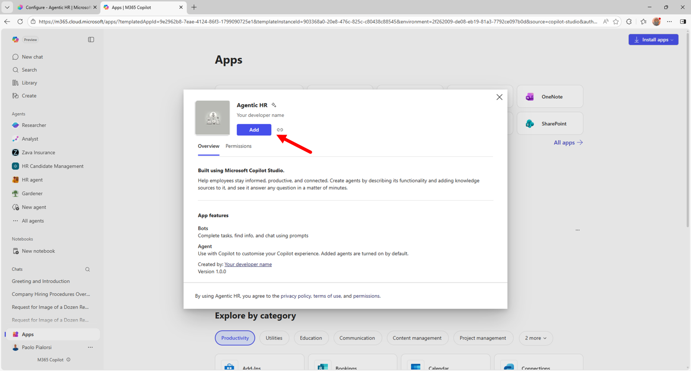

Once you have added the agent to Microsoft 365 Copilot Chat, you will find it in the list of agents in the right side of the Copilot chat, like illustrated in the following screenshot.

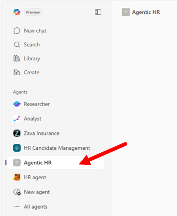

Select the agent and start interacting with it. For example, you can provide the following prompt:

```txt
How can we hire new people in our company?
```

The agent will provide you detailed information about the hiring procedures, based on the content retrieved from the documents defined in the knowledge base. For example, the main data source for the response will be the document `Hiring Procedures.docx` that you uploaded to SharePoint Online.

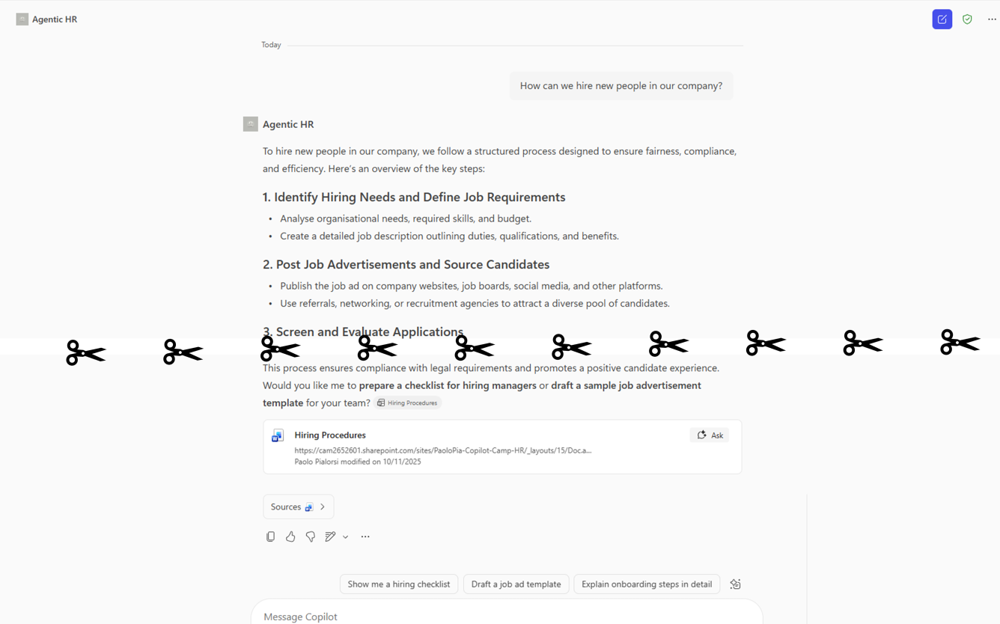

<cc-end-step lab="mcs4" exercise="1" step="4" />

## Exercise 2 : Adding a tool to the agent

In this excercise you are going to add a custom tool to the agent that you made in the previous exercise. In Microsoft Copilot Studio, when making agents for Microsoft 365 Copilot Chat (Declarative Agents), you can add four different types of tools:

- Prompt: allows consuming an AI tool built using a prompt written in natural language.
- Custom connector: allows consuming a Power Platform custom connector.
- REST API: allows consuming an external REST API. You can find additional details [here](https://learn.microsoft.com/en-us/microsoft-copilot-studio/agent-extend-action-rest-api){target=_blank}.

!!! information "Tools for agents"
    You can find additional information about adding tools to agents in Copilot Studio reading the article [Add tools to custom agents](https://learn.microsoft.com/en-us/microsoft-copilot-studio/advanced-plugin-actions){target=_blank}.

In this lab you are going to add a tool of type `Custom connector` in order to retrieve a list of candidates from an Excel spreadsheet stored in SharePoint Online.

### Step 1: Adding a tool to an agent for Microsoft 365 Copilot

To add a new tool, select the **+ Add tool** command in the **Tools** section of the agent's configuration panel.

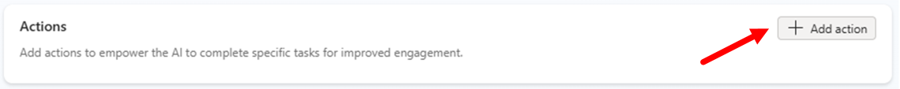

A dialog window pops up allowing you to choose what kind of tool to create. By default, there are some **Featured** tools like those that allow you to interact with Excel Online content or other common services. You can also create a new tool from scratch, selecting the **+ New tool** command and choosing between the options highlighted in the previous paragraphs.

If you don't find the option you are looking for in the list of featured items, simply switch to the **All** group and search by text what you are looking for.

To complete the current step, choose the featured tool **Excel Online (Business)** and then select **List rows present in a table**. First of all, you will need to connect to the external connector simply selecting the **Connection** and then **Create new connection** and proceeding with the process.

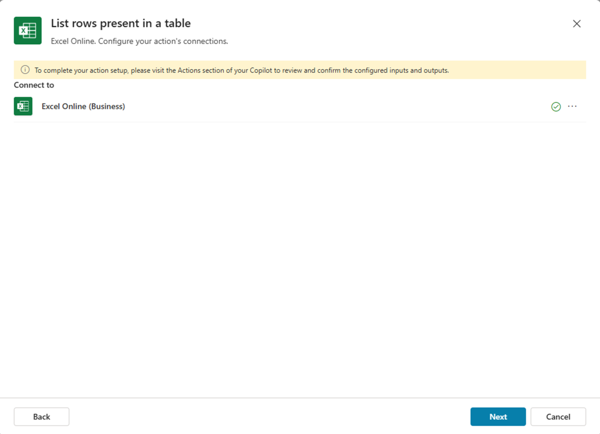

You will need to login with your account and to allow access to Excel Online (Business). Once the connection is configured, you will see a dialog with a command to **Add and configure** the tool.

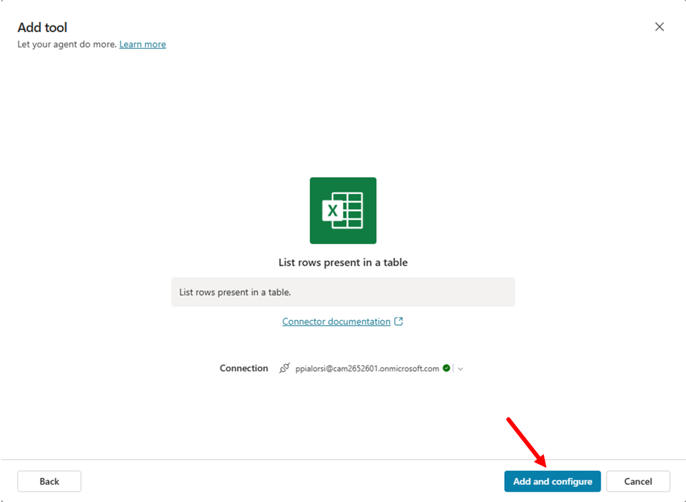

After adding the tool, you will get the list of tools in Copilot Studio. Click on the tool that you just created to edit its settings. In the configuration panel you need to provide:

- Name: a display name for the tool.
- Description: a description in natural language that will be used by generative orchestration to determine when to use your tool. 
- Inputs and outputs: to define the input and output arguments for the action, if any.
- Additional details: defines how the action handles the request and response to the user.
- Completion: to specify what the agent does when it finishes using the tool.

Before configuring the tool, you need to prepare the Excel spreadsheet with the list of candidates.
Download a sample Excel file by selecting this [link](https://github.com/microsoft/copilot-camp/blob/main/src/make/copilot-studio/Candidates/Sample-list-of-candidates.xlsx?raw=true){target=_blank}.

Upload the file to the **Documents** library of a SharePoint Teams site in the same tenant where you are making your agent with Copilot Studio. The document was generated by Microsoft 365 Copilot for the sake of having a hypothetical list of candidates.

- Copy the absolute url of the site. For example: `https://xyz.sharepoint.com/sites/contoso/`.
- Copy the name of the document library. For example : `Shared documents`
- Copy also the name of the file. For example: `Sample-list-of-candidates.xlsx`

Now go back to Microsoft Copilot Studio and finalize the tool configuration.
In the dialog for editing the tool, update the **Name** and **Description** to give it more descriptive and informative settings. Use the following settings:

- Name: 

```txt
List HR candidates
```

- Description: 

```txt
List candidates for an HR role
```

Now, select the **Inputs** section and start configuring the input arguments. By default, all the mandatory input arguments have been configured so that their value will be exctracted by the User's entire response as you can notice in the **Fill using** property of each input argument, which is configured with value `Dynamically fill with AI`.

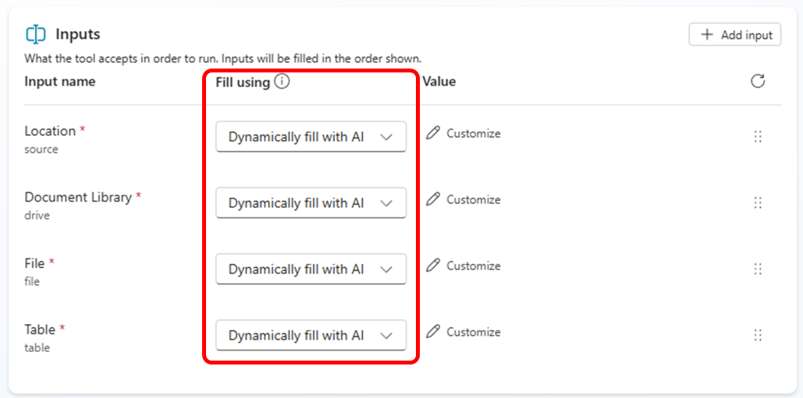

For each input argument, you will configure an explicit value. Select the **Fill using** field of the **Location** input argument, switch its value to `Custom value`, then using the dropdown list select the site collection where you stored the Excel spreadsheet with the list of candidates.

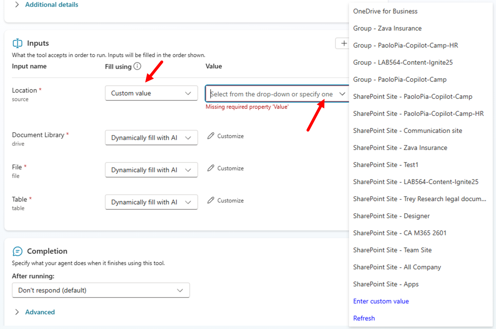

Now configure the **Document Library** input argument to `Custom value` and select the library where you stored the Excel file. Configure the **File** input argument to `Custom value` and browse for the Excel file. Lastly, configure **Table** to `Custom value` and select the table with name `Candidates_Table`. Once you are done with the settings, the input arguments should look like in the following screenshot.

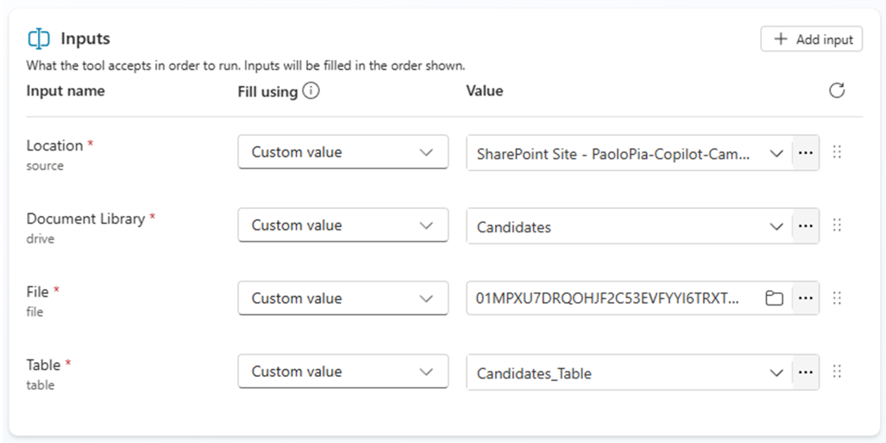

Now select the **Save** button in the upper right corner of the screen to save the updated tool.

<cc-end-step lab="mcs4" exercise="2" step="1" />

### Step 2: Testing the new tool

You are now ready to publish the updated agent and to play with it in the integrated test panel or in Microsoft Teams.
Select the **Publish** button again, to update the publishing of the agent. Wait for the publishing to complete and then open again the direct link to the agent's app. You will see an **Update now** command instead of the **Add** that you saw in Exercise 1 - Step 4. Select the **Update now** command and wait. Once ready, go to Microsoft 365 Copilot Chat, refresh the page and start interacting with the updated agent.

It is really easy to invoke the just created tool simply providing to the agent a prompt like the following one:

```txt
Show me the list of candidates for HR with role "HR Director" or "HR Manager"
```

Microsoft 365 Copilot Chat will ask you the permission to consume an external API (Excel Online) and you will have to select the option to **Always allow** or **Allow once**. For the sake of testing purposes, choose **Allow once** so that you will be able to test the authorization process again in the future.

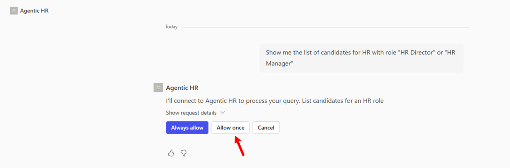

Since the Power Platform connector requires a valid connection in place, the agent prompts the user to **Sign in to Agentic HR** before being able to consume the external data source. 

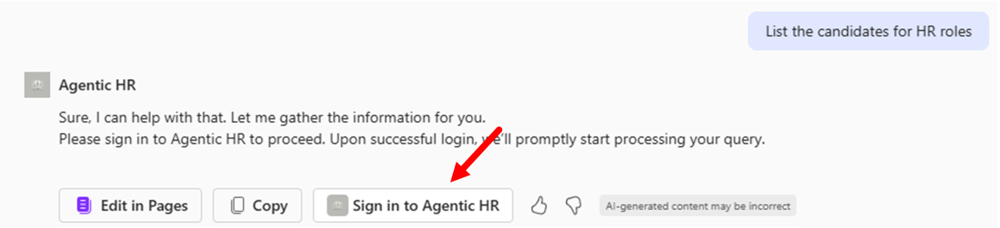

Connect to the external connector and run again the prompt. The agent will reply back providing the list of candidates retrieved from the Excel spreadsheet and matching the criteria that you provided in the prompt.


Well done! You were able to consume an external connector from a Copilot Studio agent made for Microsoft 365 Copilot!

<cc-end-step lab="mcs4" exercise="2" step="2" />

---8<--- "mcs-congratulations.md"

<a href="../05-connectors">Start here</a> with Lab MCS5, to learn how to use custom connectors in Copilot Studio.
<cc-next />


