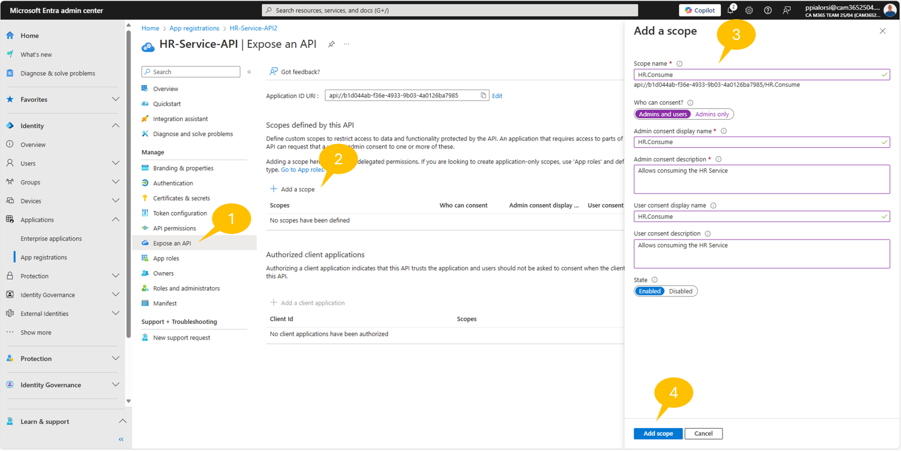
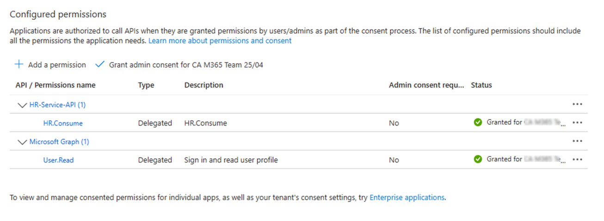
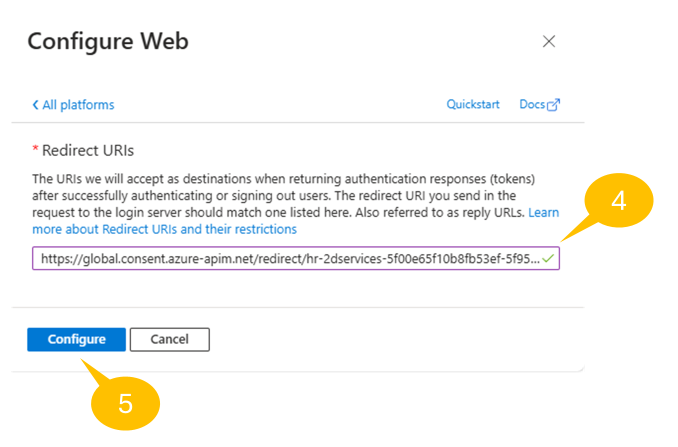
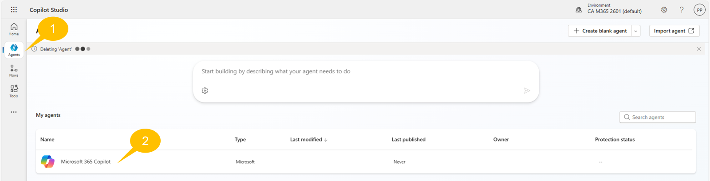
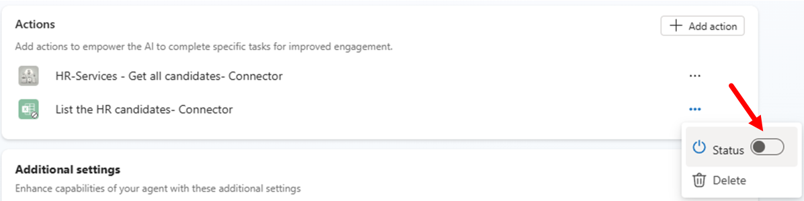
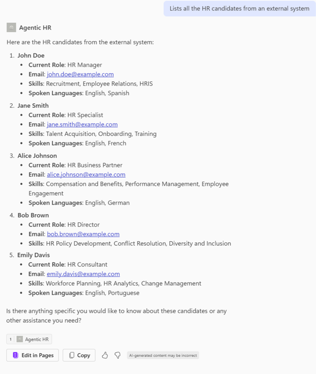

# Lab MCS5 - Power Platform custom connector

In this lab, you are going to understand how to extend an agent made with Microsoft Copilot Studio using a Power Platform custom connector. Specifically, you are going to consume a custom REST API to manage a hypotethical list of candidates for a job role. The API offers functionalities to:

- List candidates
- Get a specific candidate
- Add a new candidate
- Remove a candidate

<div class="lab-intro-video">
    <div style="flex: 1; min-width: 0;">
        <iframe  src="//www.youtube.com/embed/f_HrMbg6kOU" frameborder="0" allowfullscreen style="width: 100%; aspect-ratio: 16/9;">          
        </iframe>
          <div>Get a quick overview of the lab in this video.</div>
    </div>
    <div style="flex: 1; min-width: 0;">
   ---8<--- "mcs-labs-prelude.md"
    </div>
</div>


In Microsoft 365 Copilot, within Copilot Studio you will be able to rely on these functionalities and enhance the potential of the custom agent that you created in the previous [Lab MCS4](../04-extending-m365-copilot){target=_blank}.

!!! note
    This lab builds on the previous one, [Lab MCS4](../04-extending-m365-copilot){target=_blank}. You should be able to continue working on the same agent, improving its functionalities with new capabilities.

In this lab you will learn:

- How to expose a REST API through a Power Platform custom connector
- How to secure communication to an external REST API in the Power Platform
- How to consume a custom connector from an agent

Before starting, make sure you have:

- [Visual Studio Code](https://code.visualstudio.com/){target=_blank}
- [REST Client extension for Visual Studio Code](https://marketplace.visualstudio.com/items?itemName=humao.rest-client){target=_blank}
- [Node.js v.22 or higher](https://nodejs.org/en){target=_blank}

## Exercise 1 : Creating the REST API

For the sake of simplicity in this Lab you are going to use a pre-built REST API. In this exercise you are going to download and configure it, so that you can run it locally.

### Step 1: Downloading and testing the REST API

The sample REST API is an Azure Function built with TypeScript and Node.js, named `HR Service` and you can download its source code [from here](https://download-directory.github.io/?url=https://github.com/microsoft/copilot-camp/tree/main/src/make/copilot-studio/path-m-lab-mcs5-connectors/hr-service&filename=hr-service){target=_blank}.

Extract the files from the zip and open the target folder with Visual Studio Code. In the following screenshot you can have an overview of the project structure.


The main elements of the project outline are:

- `http`: in this folder you can find a couple of .http files useful for testing the REST API in Visual Studio Code.
- `src/data/candidates.json`: a JSON file with an hypothetical list of candidates, used as the initial data source for the service.
- `src/functions/candidatesFunction.ts`: the actual implementation of the Azure Function.
- `src/openapi.json`: the Open API specification file for the Azure Function, stored in JSON format.
- `src/openapi.yaml`: the Open API specification file for the Azure Function, stored in Yaml format.
- `askCandidateData.json`: the JSON of an adaptive card to collect data for a new candidate.
- `dev-tunnel-steps.md`: brief set of instructions to build a Dev Tunnel to have a reverse proxy for the REST API running locally.
- `local.settings.json.sample`: a sample configuration file that will be used later in this lab.

Rename the file `local.settings.json.sample` into `local.settings.json` and press F5 to start the project.
In Visual Studio Code, open the file `http/ht-service.http` and trigger a new request to get the list of candidates by selecting the **Send request** command near the GET request for `http://localhost:7071/api/candidates`.
On the right side of the screen you will see the output of the request, providing you with few response headers and the JSON list of candidates.


Notice that in the **Terminal** window, in the lower part of the screen, there is the tracing of the API call that you just triggered and a message stating that `OAuth is disabled. Skipping token validation`. In fact, right now the API is accessible anonymously.

<cc-end-step lab="mcs5" exercise="1" step="1" />

### Step 2: Registering the API in Entra ID

Let's now secure access to the API. First of all, you need to open a browser and, using the work account of your target Microsoft 365 tenant, go to [https://entra.microsoft.com](https://entra.microsoft.com){target=_blank} to access the Microsoft Entra admin center. Sign in to the admin center, if asked for authentication. Then 1️⃣ select **App registrations** in the menu bar on the left, and then 2️⃣ select the **+ New registration** command to register a new application in the target tenant.


The `Register an application` page will show up. Provide a name for the application, for example `HR-Service-API`. Choose to support authentication only in your target tenant, and select the **Register** button in the lower part of the screen.


Microsoft Entra will register the application for you and show the **Overview** page with information about the newly registered application. Copy the value of Client ID and Tenant ID, because you will need them soon.

Select the 1️⃣ **Expose an API** menu item on the left menu, then 2️⃣ select **+ Add a scope** to add a new permission scope for consuming the custom API. The very first time you add a new scope, you have to configure an **Application ID URI**. By default, the value will be `api://<Client-Id>`. Select **Save and continue** to save the unique URI for the application. Then, 3️⃣ configure the scope settings using the panel that appears on the righ and 4️⃣ select **Add scope** to confirm the operation.

Creating a scope allows you to define a custom delegated permission scope for you API. Consumers of your API will need to provide OAuth 2.0 tokens with that permission scope in order to being able to consume your API.



Here you can see some suggested values for the permission scope configuration:

- Scope name: the actual name of the scope. For example: `HR.Consume`.
- Who can consent?: defines whether the scope can be consented by admins only, or both by admins and regular users. Choose `Admins and users`.
- Admin consent display name: the short display name of the scope for admin consent. For example: `HR.Consume`.
- Admin consent description: the description of the scope for admin consent. For example:  `Allows consuming the HR Service`.
- User consent display name: the short display name of the scope for user consent. For example: `HR.Consume`.
- User consent description: the description of the scope for user consent. For example: `Allows consuming the HR Service`.
- State: defines whether the scope is **Enabled** or **Disabled**. Let's keep it enabled.

Once the permission scope is configured, you will see the new scope in the list of scopes defined for the application.


Now, 1️⃣ select the **Manifest** menu item on the left menu, 2️⃣ edit the content of the manifest file using the **Microsoft Graph App Manifest (new)**, and 3️⃣ update the `requestedAccessTokenVersion` property to the value `2`. This specifies that the API expects a JWT token of type v2.0.

!!! note
    You can find additional information about the Microsoft Graph App Manifest and the token v2.0 in the article [Understand the app manifest (Microsoft Graph format)](https://learn.microsoft.com/en-us/entra/identity-platform/reference-microsoft-graph-app-manifest){target=_blank}.


Now you can go back to Visual Studio Code and configure the `local.settings.json` file accordingly to the settings of the just registered application. Replace the `<Client-ID>` and the `<Tenant-ID>` placeholders with the actual values and turn the `UseOAuth` property to `true`.

```JSON
{
  "IsEncrypted": false,
  "Values": {
    "AzureWebJobsStorage": "UseDevelopmentStorage=true",
    "FUNCTIONS_WORKER_RUNTIME": "node",
    "AAD_APP_CLIENT_ID": "<Client-ID>",
    "AAD_APP_TENANT_ID": "<Tenant-ID>",
    "AAD_APP_OAUTH_AUTHORITY": "https://login.microsoftonline.com/<Tenant-ID>",
    "UseOAuth": false
  }
}
```

Restart the REST API project and now the API will be secured and will be looking for an OAuth 2.0 token in the Authorization header. If the token will not be provided, or if an invalid token will be provided, the API will respond with a HTTP status 401 (Unauthorized).

<cc-end-step lab="mcs5" exercise="1" step="2" />

### Step 3: Configure the dev tunnel

Now, you need to expose the REST API with a public URL. Since you are running the API project locally on your development machine, you need to rely on a reverse proxy tool to expose your `localhost` via a public URL. For the sake of simplicity, you can use the dev tunnel tool provided by Microsoft, following these steps:

- Install dev tunnel on your environment following [these instructions](https://learn.microsoft.com/en-us/azure/developer/dev-tunnels/get-started){target=_blank}
- Login with dev tunnel, executing the following command:

```console
devtunnel user login
```

- Host your dev tunnel, executing the following commands:

```console
devtunnel create hr-service -a --host-header unchanged
devtunnel port create hr-service -p 7071
devtunnel host hr-service
```

The command line will display the connection information, such as:


Copy the "Connect via browser" URL and save it in a safe place.

Be sure to leave the devtunnel command running as you do the exercises in this lab. If you need to restart it, just repeat the last command `devtunnel host hr-service`.

<cc-end-step lab="mcs5" exercise="1" step="3" />

### Step 4: Registering the Consumer in Entra ID

In order to consume the API from the Power Platform using a custom connector, you also need to register a consumer application in Microsoft Entra ID. Go back to the [Microsoft Entra admin center](https://entra.microsoft.com){target=_blank} and select again **App registrations** in the menu bar on the left, and then select the **+ New registration** command to register a new application in the target tenant. This time, name the new application as `HR-Service-Consumer`. As like as in Step 1, configure the new application for single tenant authentication and register it.

Microsoft Entra will register the application for you and show the **Overview** page with information about the newly registered application. Copy the value of Client ID and Tenant ID, because you will need them soon.


Select the 1️⃣ **Certificates & Secrets** menu item on the left menu, then 2️⃣ select **+ New secret** to add a new client secret. Then, 3️⃣ configure a name and a duration for the secret and 4️⃣ select the **Add** command to create the new secret. Copy the value of the new secret in a safe place, together with the Client ID and Tenant ID that you copied before.

Switch to the permissions page, 1️⃣ select the **API permissions** menu item on the left menu, then 2️⃣ select **+ Add a permission**. In the panel that shows up on the right side, 3️⃣ select **APIs my organization uses**, search and 4️⃣ select `HR-Service-API`.


Once you select the targe API, the side panel updates and allows you to select the delegated permission of type `HR.Consume` that you configured before. Once you picked the permission, select the **Add permission** command to add it to the consumer application.
When the permission has been added, select the **Grand admin consent for ...** command to grant the permission to the application.


At the end of this process, the consumer application will be configured with the permissions highlighted in the following screenshot.



Keep the consumer application tab open, because you will need to update its configuration in the upcoming steps.

<cc-end-step lab="mcs5" exercise="1" step="4" />

## Exercise 2 : Creating the custom connector

In this excercise you are going to create the Power Platform custom connector to consume the HR Service API.

### Step 1: Creating the custom connector

To create a new custom connector, open a browser and, using the work account of your target Microsoft 365 tenant, go to [https://make.powerautomate.com](https://make.powerautomate.com){target=_blank} to access Power Automate. On the left-side menu panel, select **More**, then **Discover all**, then look for **Custom connectors**. You can eventually pin the menu item if you plan to use it frequently. The page with the list of custom connectors will appear. Select the command **+ New custom connector** and choose **Import an OpenAPI file**.


Provide a name for the connector and browse for the OpenAPI JSON file of the `HR-Service`. You can also find the file [here](https://github.com/microsoft/copilot-camp/blob/main/src/make/copilot-studio/path-m-lab-mcs5-connectors/hr-service/src/openapi.json?raw=true){target=_blank}. Once you have provided a name and the Open API specification file, select the **Continue** button to complete the connector creation.


You will see a multi-step/multi-tab registration process showing up. The first tab is the **General** one, where you can configure a custom icon, color, and description for the connector. In the **General** tab you also need to configure the **Host** value, which has to be the host name of the dev tunnel URL that you copied in Exercise 1 - Step 3. Last but not least, you need to configure the **Base URL**, where you can leave the default value `/`.


Select the **Security** command at the bottom of the page to switch to the security settings for the connector. In the **Security** tab select `OAuth 2.0` as the authentication type. Then choose `Azure Active Directory` as the flavor of OAuth 2.0 protocol to support.


Once you have selected `OAuth 2.0` as the authentication type and `Azure Active Directory`, the tab will prompt you to provide all the needed settings to properly configure security for the custom connector. Specifically, you need to provide:

- Client ID: the `<Client-Id>` of the consumer application that you registered in Exercise 1 - Step 4.
- Client secret: the `<Client-Secret>` of the consumer application that you registered in Exercise 1 - Step 4.
- Authorization URL: the Entra ID authorization URL. Should always be the default one, unless you are using GCC tenants.
- Tenant ID: the `<Tenant-Id>` of the consumer application that you registered in Exercise 1 - Step 4.
- Resource URL: The `<Application-ID-URI>` that you registered in Exercise 1 - Step 2 for the `HR-Service-API` application. Should be something like `api://<Client-Id>`, where this time the `<Client-Id>` is the one of the `HR-Service-API` application.
- Enable on-behalf-of login: Keep it with value `False`.
- Scope: the scope that you configured for the `HR-Service-API` application in Exercise 1 - Step 2. It should be `HR.Consume`.
- Redirect URL: this is a read-only field that you will use soon.


Now save the connector settings by selecting the **Create connector** command in the upper right corner of the tab. Once the connector will be saved, the **Security** tab reloads and you will be able to see an actual value for the **Redirect URL** field. Copy that value and go back to Microsoft Entra ID admin center. Go to the consumer application that you registered in Exercise 1 - Step 4 and 1️⃣ select the **Authentication** menu item on the left menu, then 2️⃣ select **+ Add a platform**. In the panel that shows up on the right side, 3️⃣ select **Web**, and the 4️⃣ paste the **Redirect URL** that you just copied from the custom connector interface and 5️⃣ select **Configure** to confirm the new settings.


You have just configured the consumer application to support the Power Platform as a redirect URL when completing the authentication flow.



Now you can go back to the custom connector definition and you can move to the **Definition** tab. There you will find all the operations exposed by the REST API. Their definition was retrieved by the OpenAPI specification file. You don't need to do anything here. You can simply switch to the **Test** tab, if you like, in order to test that the REST API is working as expected.

<cc-end-step lab="mcs5" exercise="2" step="1" />

### Step 2: Testing the custom connector

In he **Test** tab you can see the list of operations on the left side. Choose one operation, like for example **getCandidates**, then connect to the target connector selecting the **+ New connection** command and following the prompts of Power Platform to authenticate. Once the connection is ready, you can test the selected operation by selecting the **Test operation** command and looking for the output in the lower part of the screen.


<cc-end-step lab="mcs5" exercise="2" step="2" />

## Exercise 3 : Consuming the custom connector

In this excercise you are going to consume the custom connector that you created in Exercise 2.

### Step 1: Consuming the custom connector from the agent

In this step you are going to consume the custom connector from the agent for Microsoft 365 Copilot Chat that you created in [Lab MCS4](../04-extending-m365-copilot){target=_blank}.

Open a browser and, using the work account of your target Microsoft 365 tenant, go to [https://copilotstudio.microsoft.com](https://copilotstudio.microsoft.com){target=_blank} to start using Microsoft Copilot Studio.

Then 1️⃣ browse the list of agents in Copilot Studio and 2️⃣ select the agent with name **Microsoft 365 Copilot**.



Now, edit the `Agentic HR` agent, go to the **Actions** section and select **+ Add action**. Follow the instructions that you have already seen in Lab MCS4 - Exercise 2 - Step 1. However, this time select the **Custom connector** group of actions and search for `HR-Services`. You will see the actions defined in the `HR-Services` connector that you created in Exercise 2 - Step 1.

Select the `Get all candidates` action and confirm to connect to the target custom connector.
Configure the action as follows:

- Name: `Get all candidates`.
- Description: `Lists all the HR candidates from an external system`.
- Authentication: `User authentication`.

Add the action by selecting the **Add action** command. Once you have created the new action, disable the old action that you created in Lab MCS4 - Exercise 2 - Step 1. To disable an action, click on the three dots (...) beside the action and toggle the **Status** to `Off`.



Publish the updated agent and once it is ready and updated, test the new action providing the following prompt in the Microsoft 365 Copilot Chat:

```text
Lists all the HR candidates from an external system
```

Microsoft 365 Copilot Chat will ask you to allow consuming the external REST API. Select the command **Allow once** if you want to test the whole process multiple times, or **Always allow** if you want to consent consuming the REST API for any further request.


Then Microsoft 365 Copilot Chat will then ask you to sign-in to securely access the external REST API, providing you a message like the following one.


Select **Sign in to Agentic HR** to authenticate and connect to the target custom connector. Once the connection is established, go back to the Microsoft 365 Copilot Chat and run one more time the same prompt as before. You will see the list of candidates as they are defined in the HR Service project and, in the lower part of the response, you can notice there is the icon informing you that the response came from the external service.



For the sake of completeness, go to Visual Studio Code and notice that in the **Terminal** area, in the lower part of the screen, there is tracing of to the REST request processed by the API. Notice also the message `Token is valid for user <username>` highlighted in the following screenshot and showing that the request was authenticated for the user consuming the API from within Microsoft 365 Copilot.


Wonderful! You were able to configure a custom connector and consume it within Microsoft 365 Copilot Chat!

<cc-end-step lab="mcs5" exercise="3" step="1" />

---8<--- "mcs-congratulations.md"

You have completed Lab MCS5 - Power Platform custom connector!

<a href="../06-mcp">Start here</a> with Lab MCS6, to learn how to consume an MCP server in Copilot Studio.
<cc-next /> 


