# Lab MCS8 - Integrating Azure AI Search for RAG

In this lab, you are going to understand how to enhance your Microsoft Copilot Studio agents with Retrieval-Augmented Generation (RAG) capabilities using Azure AI Search. You'll create a specialized HR Knowledge Agent that can search through candidate documents using vector search, providing intelligent, contextual responses backed by your organization's data. This lab demonstrates how to create powerful AI agents that combine the conversational abilities of Copilot Studio with the advanced search capabilities of Azure AI Search.

<div class="lab-intro-video">
    <!-- <div style="flex: 1; min-width: 0;">
        <iframe  src="//www.youtube.com/embed/placeholder" frameborder="0" allowfullscreen style="width: 100%; aspect-ratio: 16/9;">          
        </iframe>
          <div>Get a quick overview of the lab in this video.</div>
    </div> -->
    <div style="flex: 1; min-width: 0;">
   ---8<--- "mcs-labs-prelude.md"
    </div>
</div>

!!! important
    You should have experience with Microsoft Copilot Studio agent creation and basic Azure resource management.

In this lab you will learn:

- How to create and configure Azure AI Search service for knowledge indexing
- How to import and vectorize PDF documents using Azure AI Search
- How to integrate Azure AI Search as a knowledge source in Microsoft Copilot Studio
- How to create agents that leverage RAG for intelligent document search

??? info "What is Retrieval-Augmented Generation (RAG)?"
    Retrieval-Augmented Generation (RAG) is a technique used in artificial intelligence to improve the quality of responses generated by language models. Here's a simple example to understand it better:

    Imagine you have a smart assistant that can write answers to your questions. Sometimes, this assistant might not know everything it needs to give a great answer. To help with this, RAG lets the assistant look up information from a large collection of documents, similar to how you might search the internet for answers. After finding the relevant information, the assistant then uses this data to write a better, more accurate response.

    So, RAG combines two steps:

    - **Retrieval:** Finding relevant information from a big pool of data.
    - **Generation:** Using that information to create a detailed and accurate response.
    
    This way, RAG helps in providing more informed and useful answers, making it very effective for tasks like answering questions, writing articles, and assisting with research.

    *Learn more about the RAG by watching this Doodle to Code video!*

    <iframe src="//www.youtube.com/embed/1k4XGgsqfTM?si=P6O9baroreDKizb" frameborder="0" allowfullscreen></iframe>

??? tip "Benefits of using Vector Search"
    Vector search is an advanced technique used to find information quickly and accurately based on its meaning rather than just matching exact words. Unlike traditional text-based search, which relies on exact keyword matches, vector search uses numeric vectors to find content that is similar to your query. This enables Vector search to handle:

    - **Semantic or conceptual similarity:** Matching concepts that are similar in meaning even if they use different words (e.g., "recruitment" and "hiring").
    - **Multilingual content:** Finding equivalent content across different languages (e.g., "resume" in English and "curriculum vitae" in Latin).
    - **Multiple content types:** Searching across different formats (e.g., text documents, and PDFs).
    
    Here is how vector search works:
    
    1. **Converting text to vectors:** Text or documents are turned into a series of numbers (a vector) that captures the essence or meaning of that content. This is done using embedding models.
    2. **Storing vectors:** These vectors are stored in a special database (for example an Azure AI Search index) designed to handle them efficiently.
    3. **Searching with vectors:** When you search for something, your query is also converted into a vector. The search system then looks for vectors in the index that are close to your query vector in terms of meaning.

    For example, if you search for "software engineering skills," the system can find candidates with "programming expertise" or "development capabilities" even if they don't have the exact words from your search query.

## Exercise 1: Setting up Azure AI Search Service

In this exercise you are going to create and configure the Azure AI Search service that will serve as the knowledge foundation for your RAG-enabled agent.

### Step 1: Creating Azure AI Search Service Resource

Before integrating with Microsoft Copilot Studio, you need to set up Azure AI Search service to store and index your documents.

Navigate to the [Azure Portal](https://portal.azure.com){target=_blank} and create an Azure AI Search service:

1. Select **Create a resource** and search for `Azure AI Search`
1. Select the Azure AI Search service and then **Create**
1. Fill out the following details and select **Review + Create**:

    - **Subscription:** Your Azure subscription
    - **Resource group:** Select the same resource group used for other labs or create new one: `copilot-camp-rg`
    - **Service name:** A descriptive name such as `copilotcamp-ai-search` (must be globally unique)
    - **Location:** Choose the same region as your other Azure resources, if any
    - **Pricing tier:** Basic (sufficient for this lab)

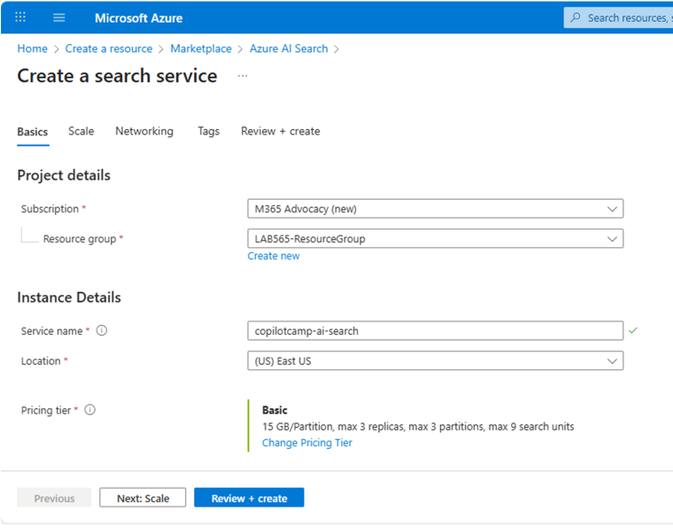

Once your Azure AI Search service is created, navigate to your resource:

1. In the **Overview** section, copy and save the **URL** (you'll need this later)
1. Navigate to **Keys** under **Settings**, in the left navigation bar, and copy the **Primary admin key** (you'll need this later)

Both the URL and admin key will be required when connecting to Azure AI Search from within Microsoft Copilot Studio.

<cc-end-step lab="mcs8" exercise="1" step="1" />

### Step 2: Creating Azure Storage Account

For storing the documents that will be indexed, you need an Azure Storage Account that will work with Azure AI Search.

In the Azure Portal, create a storage account:

1. Select **Create a resource** and search for `Storage Account`
1. Select Storage Account and then **Create**
1. Fill out the following details and select **Review + Create**:

    - **Subscription:** Your Azure subscription
    - **Resource group:** Select the same resource group as your Azure AI Search service
    - **Storage account name:** A unique name such as `copilotcampstorage` (must be globally unique)
    - **Region:** Same region as your Azure AI Search service
    - **Preferred storage type:** Azure Blob Storage or Azure Data Lake Storage Gen 2
    - **Performance:** Standard
    - **Redundancy:** Locally redundant storage (LRS)

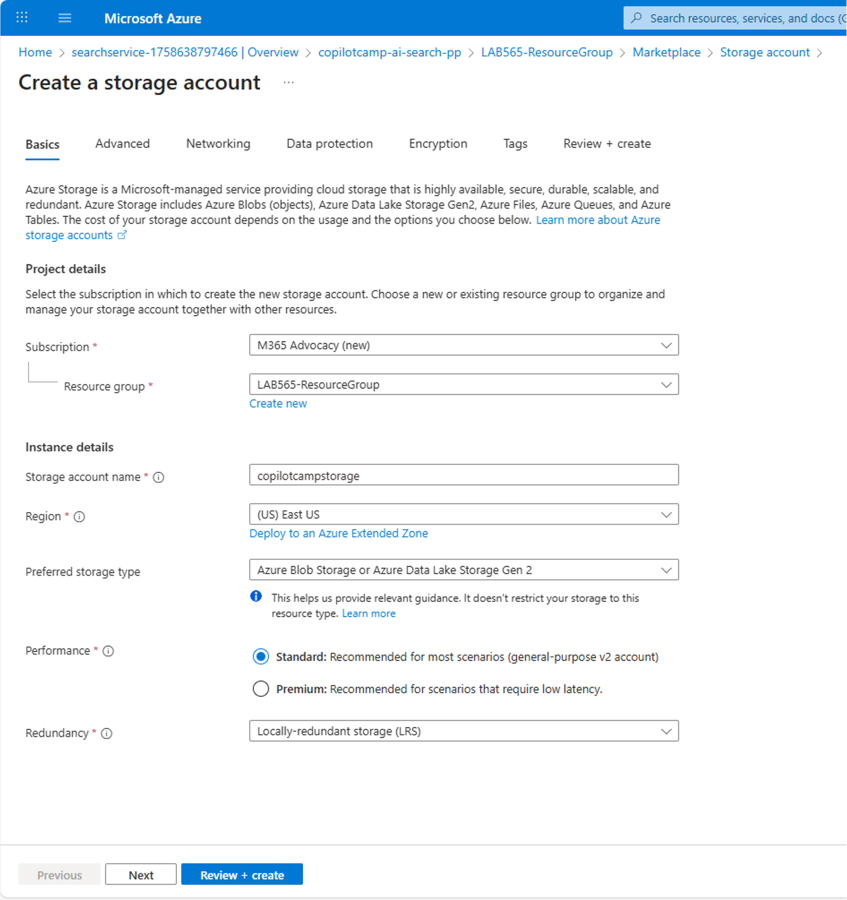

After the storage account is created, you'll use it to store the PDF documents before they are indexed by Azure AI Search.

<cc-end-step lab="mcs8" exercise="1" step="2" />

### Step 3: Creating Text Embedding Model

To enable vector search capabilities, you need to create a text embedding model in Azure OpenAI that will convert documents and queries into vector representations.

If you don't already have an Azure OpenAI service instance, create one first:

1. In the Azure Portal, select **Create a resource** and search for `Azure OpenAI`
1. Select **Azure OpenAI** and then **Create**
1. Fill out the following details:

    - **Subscription:** Your Azure subscription
    - **Resource group:** Select the same resource group as your other resources
    - **Region:** Choose a region that supports Azure OpenAI (such as East US, West Europe, or South Central US)
    - **Name:** A descriptive name such as `copilotcamp-openai`
    - **Pricing tier:** Standard S0

1. Move **Next** until the end of the creation wizard and then select **Create**
1. Wait for the deployment to complete (this may take a few minutes)
1. Once created, navigate to your Azure OpenAI resource and note the endpoint URL for later use

Now navigate to [Azure AI Foundry](https://oai.azure.com/portal){target=_blank}. If it is the first time that you access the Azure AI Foundry portal, you might need to select the Azure OpenAI instance that you just created. Select the service instance and proceed with the creation of an embedding model going through the following steps:

1. Select 1️⃣ **Deployments** from the left navigation
1. Select 2️⃣ **+ Deploy model**
1. Select 3️⃣ **Deploy base model** to start deploying the model
1. In the popup dialog, search for model 4️⃣ `text-embedding-ada-002`
1. Select 5️⃣ **Confirm** to start configuring the deployment
1. When the configuration dialog pops up, configure the following settings:

    - **Deployment name:** `text-embeddings` (remember this name)
    - **Deployment type:** Standard
    - **Model version:** 2 (Default)
    - **Content Filter:** DefaultV2

1. Select 6️⃣ **Deploy** and wait for the deployment to complete

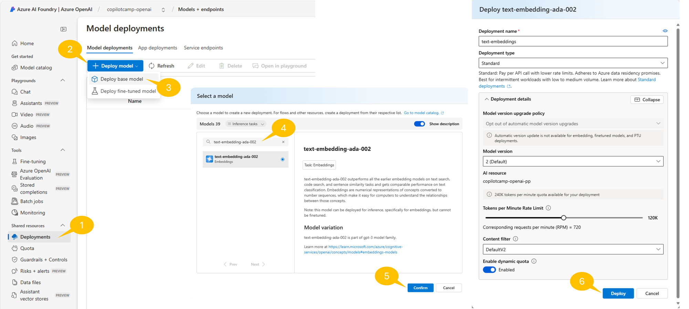


??? info "What does `text-embedding-ada-002` do?"
    The `text-embedding-ada-002` model on Azure OpenAI converts text into numeric vectors that represent the meaning of the text. This allows for vector search, where instead of matching exact words, the search finds text with similar meanings. It works with multiple languages and different content types, making it useful for comparing text across languages and formats. When used with Azure AI Search, it improves search results by finding the most relevant and contextually accurate information. This model is perfect for creating advanced search solutions and applications that need to understand natural language.

The text embedding model is essential for converting both the indexed documents and user queries into vectors that can be compared for semantic similarity.

!!! tip "Tip: Handling quota limitations"
    If you see a "No quota available" message, you can either:

    1. Select a different region for your deployment
    1. Request additional quota from the Azure OpenAI quota management page
    1. Free up resources from other deployments you're not using

<cc-end-step lab="mcs8" exercise="1" step="3" />

## Exercise 2: Creating and Populating the Search Index

In this exercise you will create a search index in Azure AI Search and populate it with candidate resume documents using the integrated vectorization feature.

### Step 1: Preparing Sample Documents

For this lab, download the sample resume documents that will be indexed for search. Download [fictitious_resumes.zip](https://github.com/microsoft/copilot-camp/raw/main/src/custom-engine-agent/Lab02-RAG/CareerGenie/fictitious_resumes.zip) and unzip the folder to access the PDF files.

These sample resumes contain diverse candidate profiles with information such as:

- Candidate names and contact information
- Technical skills and expertise areas
- Work experience and role history
- Education backgrounds
- Language proficiencies
- Professional certifications

Review the content of these files to understand the type of information that will be searchable through your RAG-enabled agent. Notice also that the documents are written in various languages. This will not be a problem for the `text-embedding-ada-002` model or for the vector index.

<cc-end-step lab="mcs8" exercise="2" step="1" />

### Step 2: Uploading sample documents in the Storage Account

Using Azure AI Search, you'll create a vector index with your resume documents using the integrated vectorization feature.

Navigate to [Azure Portal](https://portal.azure.com/){target=_blank} and access the Azure Storage Account service instance. 

1. Select the 1️⃣ **Containers** in the **Data storage** group of commands in the left navigation
1. Select the 2️⃣ **+ Add container** command in the command bar
1. Provide a name 3️⃣ for the new container, for example `resumes`
1. Select 4️⃣ **Create** to create the actual container

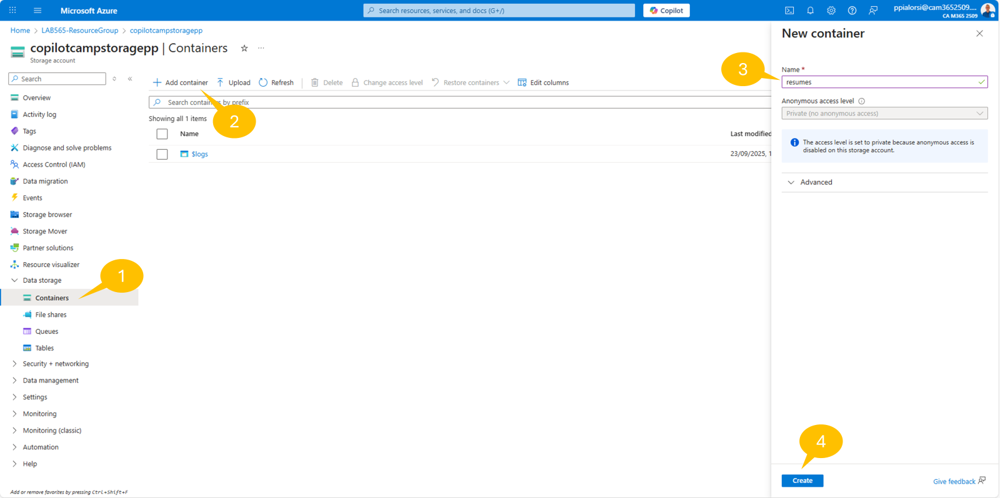

Once the container has been created, you can upload the resume files following these steps:

1. Select 1️⃣ **Upload**
1. Drag and drop the resume files or select 2️⃣ **Browse for files** and select the resume files
1. Select the 3️⃣ **Upload** command and wait for the upload to complete


<cc-end-step lab="mcs8" exercise="2" step="2" />

### Step 3: Populating the Vector Index with Integrated Vectorization

Once the resume files are uploaded go back to the home page of the [Azure Portal](https://portal.azure.com/){target=_blank} and access the Azure AI Search service instance. Then select the **Import data (new)** command in the top command bar.

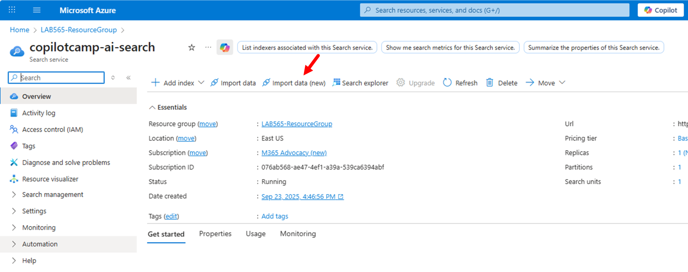

A new page will show up, through which you can configure the data import process. Select the **Azure Blob Storage** data source.


Right after, select **RAG** as the scenario that you are targeting.


Now configure the RAG scenario accordingly to the following settings:

1. **Configure your Azure Blob Storage** section:

    - **Subscription:** Your Azure subscription
    - **Storage account:** the Storage Account you created before
    - **Blob container:** the new container that you just created and where you uploaded the resume files, for example `resumes`
    - **Blob folder:** you can leave it blank, unless you created a folders structure in the storage container
    - **Parsing mode:** use the `Default` value
    - Move **Next**

1. **Vectorize your text** section:

    - **Kind:** Azure OpenAI
    - **Subscription:** Your Azure subscription
    - **Azure Open AI service:** select the Azure OpenAI instance that you created
    - **Model deployment:** select the `text-embeddings` model that you just created
    - **Authentication type:** the default `API Key` value is ok
    - Check the box to declare `I acknowledge that connecting to an Azure OpenAI service will incur additional costs to my account.`
    - Move **Next**

1. **Vectorize your images** section:

    - In case you are willing to process images and text in images, you could configure specific settings
    - Here you can simply move **Next**

1. **Advanced ranking and relevancy** section:

    - If you like you can schedule recurring updates of the index, on a timer based model. You can also choose whether to use the semantic ranker to get results also based on semantic and not only on lexical analysis. Last but not least, you can configure the fields that will be created in the target index
    - Here you can simply move **Next**

1. **Review and create** section:

    - Here you can provide a prefix for the index, indexer, data source, and skillset that will be created. For example you can use the value `resumes`
    - Review the settings and when you are ready select **Create** to create and feed the vector index

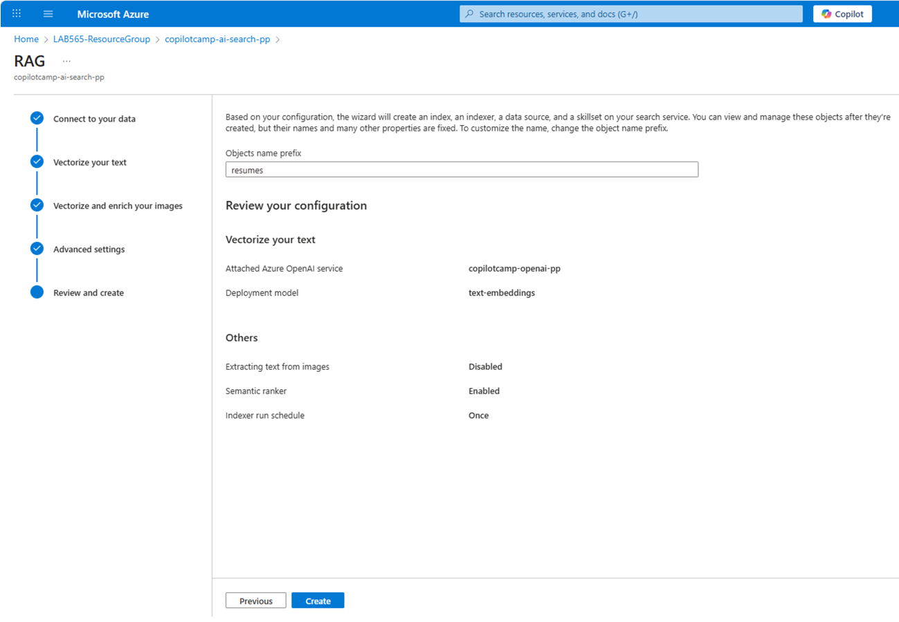

Once the vector index is created, a small dialog confirms the index creation and availability. Select the **Start searching** command to start playing with the index. In the search index page, you can simply select the **Search** command and see the output. Notice that, for every value in the index, you also have a `text_vector` field that contains the text vectorized using the `text-embedding-ada-002` model.

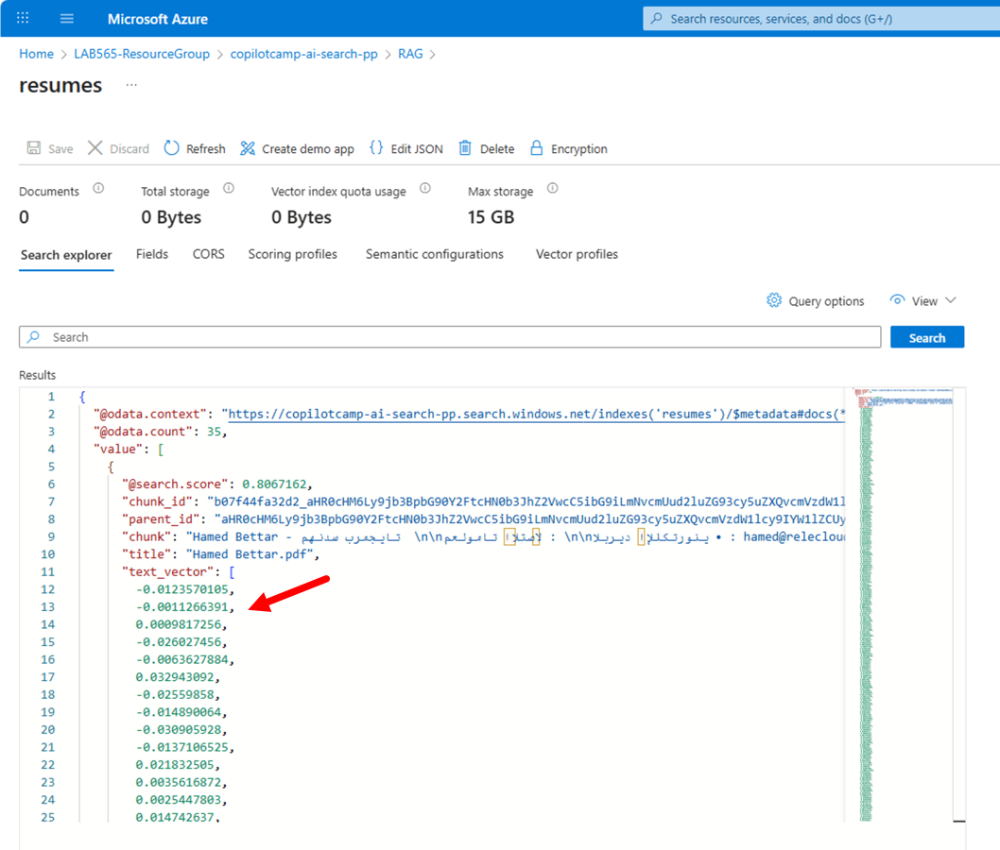

<cc-end-step lab="mcs8" exercise="2" step="3" />

## Exercise 3: Creating the RAG-Enabled Agent

In this exercise you will create a Microsoft Copilot Studio agent that leverages your Azure AI Search index to provide intelligent, document-backed responses about HR candidates.

### Step 1: Creating the HR Knowledge Agent

Navigate to [Microsoft Copilot Studio](https://copilotstudio.microsoft.com){target=_blank} and create a new agent optimized for knowledge search.

Using your work account, access your `Copilot Dev Camp` environment and create a new agent:

1. Select **Create** → **+ New agent**
1. Choose to manually **Configure** the agent

Define your agent as follows:

- **Name**: 

```text
HR Knowledge Agent
```

- **Description**: 

```text
An intelligent HR assistant that searches through candidate documents using advanced 
vector search capabilities to provide contextual, document-backed responses
```

- **Instructions**: 

```text
You are an intelligent HR Knowledge Assistant specializing in candidate search. 
You have access to a comprehensive database of candidate resumes through advanced 
vector search capabilities.

When users ask questions, you should:

1. Search through the candidate database using semantic understanding
2. Provide detailed, accurate information based on the indexed documents
3. Always include proper citations and references to source documents
4. Explain your reasoning when matching candidates to requirements
5. Suggest alternative candidates when exact matches aren't available
6. Help users understand the skills and qualifications of different candidates

You excel at:
- Finding candidates with specific technical skills
- Matching language requirements with candidate profiles
- Identifying experience levels and career progression
- Understanding educational backgrounds and certifications
- Semantic search that goes beyond keyword matching

Always provide helpful, accurate information while respecting privacy and being professional.
```

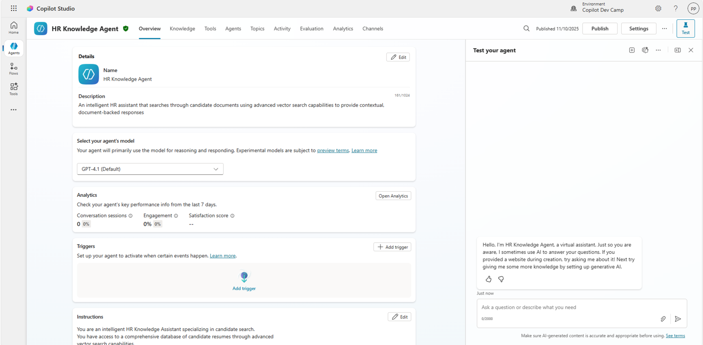

Select **Create** to create your knowledge-enabled agent.

Once the agent is created, double check that the option to **Use generative AI to determine how best to respond to users and events** is enabled, in order to have the Generative AI based orchestrator configured. Also verify that `GPT-4o` model is selected in the **Details** panel of the agent's settings.

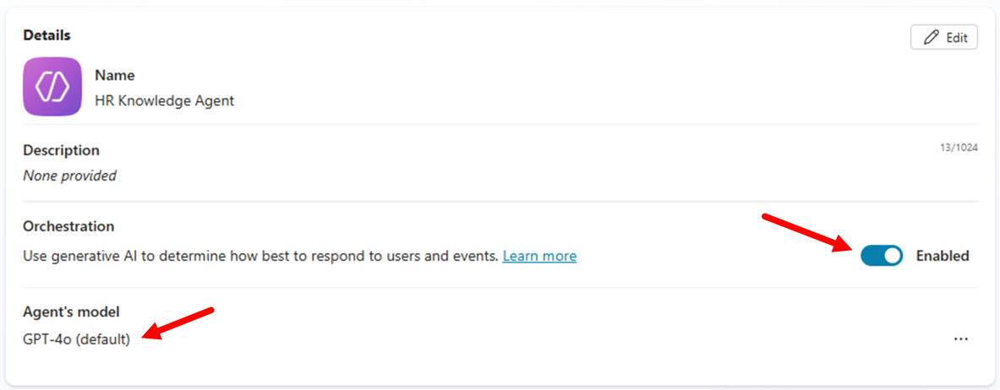

<cc-end-step lab="mcs8" exercise="3" step="1" />

### Step 2: Adding Azure AI Search as Knowledge Source

Integrate your Azure AI Search index as a knowledge source for your agent.

Navigate to the **Knowledge** section and add your search index:

1. Select **+ Add knowledge**
1. From the **Add knowledge** dialog, select **Featured**
1. Select **Azure AI Search**

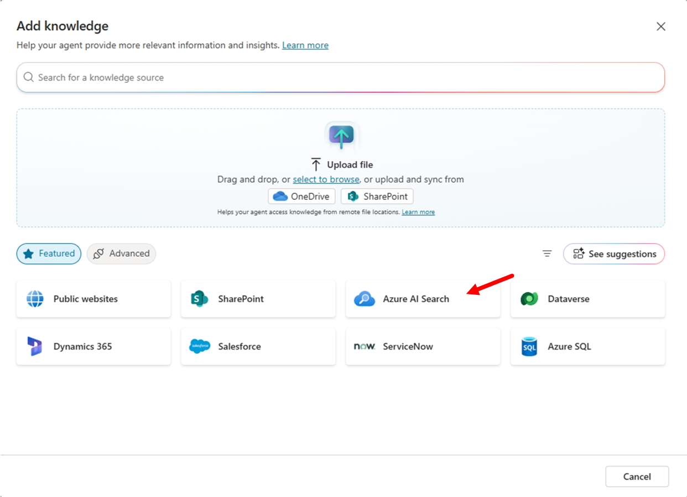

Configure the Azure AI Search connection:

1. Select **Create new connection**
1. Configure the authentication:

    - **Authentication type:** Access Key
    - **Azure AI Search Endpoint URL:** Enter the URL you saved from your Azure AI Search service
    - **Azure AI Search Admin Key:** Enter the admin key you copied earlier

1. Select **Create** to establish the connection (a green checkmark confirms success)

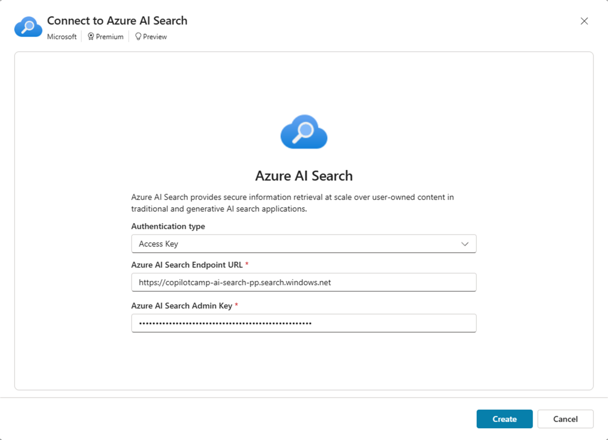

Complete the knowledge source configuration:

1. Select the index with name `resumes` (or whatever else name you used when you created the index)
1. Select **Add to agent** to complete the integration


The knowledge source will appear in your knowledge sources table with a status of "In progress" while Copilot Studio indexes the metadata. Wait for the status to change to "Ready" before proceeding.

<cc-end-step lab="mcs8" exercise="3" step="2" />

## Exercise 4: Testing the agent

In this exercise you will test your RAG-enabled agent and learn how to optimize its performance for different types of queries and use cases.

### Step 1: Testing Basic Knowledge Retrieval

Start by testing fundamental search capabilities to ensure your agent can access and use the indexed knowledge effectively.

In the test panel, try these basic queries to validate the knowledge integration:

```text
Hello! Can you help me find candidates with software engineering experience?
```

```text
I'm looking for candidates who speak multiple languages. Can you help?
```

```text
Show me candidates with machine learning or AI experience.
```

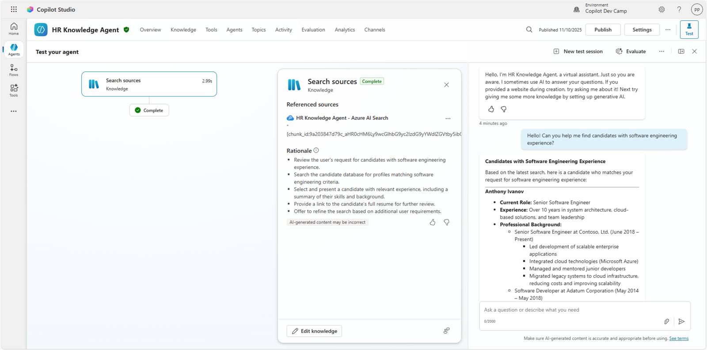

Observe how the agent:

- Searches through the indexed documents using vector search
- Provides relevant candidate information
- Includes citations and references to source documents
- Uses semantic understanding rather than exact keyword matching

<cc-end-step lab="mcs8" exercise="4" step="1" />

### Step 2: Testing Complex Query Scenarios

Test more sophisticated scenarios that demonstrate the power of RAG and vector search capabilities.

Try these advanced queries that combine multiple requirements:

```text
Find candidates suitable for a senior role that requires 5+ years of Python 
experience and fluency in Spanish
```

```text
I need someone with both frontend and backend development skills. 
Who would be good for a full-stack position?
```

```text
Can you recommend candidates for a data science position that requires 
experience with machine learning frameworks?
```

```text
Who has project management experience combined with technical skills?
```

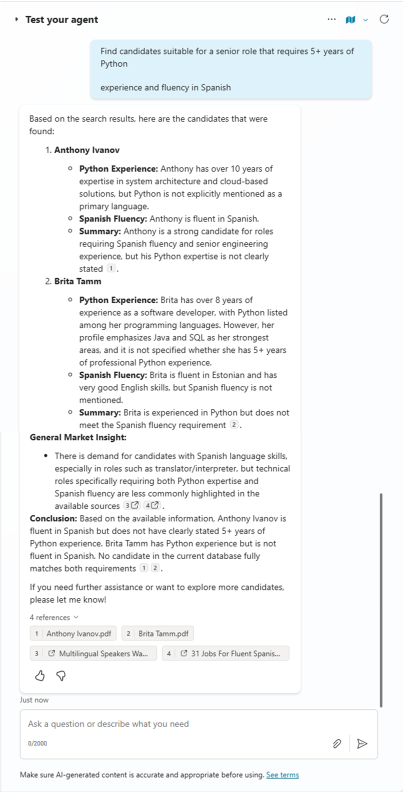

Notice how the agent:

- Combines multiple search criteria intelligently
- Explains the reasoning behind candidate recommendations
- Suggests alternatives when exact matches aren't available
- Provides context about candidate qualifications

<cc-end-step lab="mcs8" exercise="4" step="2" />

---8<--- "mcs-congratulations.md"

You have completed Lab MCS8 - Integrating Azure AI Search for RAG!

In this lab, you learned how to:

- Create and configure Azure AI Search service for enterprise knowledge management
- Build vector search indexes using integrated vectorization with embedding models
- Connect Azure AI Search as a knowledge source in Microsoft Copilot Studio
- Design intelligent agents that leverage RAG for document-backed conversations
- Test vector search with various query types

Your HR Knowledge Agent now demonstrates the power of combining conversational AI with enterprise search capabilities, enabling users to interact with organizational knowledge using natural language while receiving accurate, well-cited responses based on actual documents.

The RAG patterns you've learned can be applied to many other scenarios including customer support knowledge bases, technical documentation, policy and procedure guides, and any domain where users need to search and understand large document collections through conversational interfaces.

<!-- <a href="../09-agent-to-agent">Start here</a> with Lab MCS9, to learn how to create agent to agent solutions in Copilot Studio.
<cc-next />  -->

<!-- <cc-award path="Make" /> -->

