# Lab MCS10 - Consuming an MCP server with OAuth 2.0

In this lab, you are going to consume an MCP (Model Context Protocol) server with OAuth 2.0 authorization from an agent made with Microsoft Copilot Studio. This lab builds upon the concepts introduced in [Lab MCS6 - Consuming an MCP server](../06-mcp){target=_blank}, where you worked with the HR MCP server without authentication. Now, you will configure the same HR MCP server with OAuth 2.0 Authorization Code Flow to ensure secure access to the HR candidate management tools.

<div class="lab-intro-video">
    <div style="flex: 1; min-width: 0;">
        <!-- <iframe  src="//www.youtube.com/embed/VIDEO_ID" frameborder="0" allowfullscreen style="width: 100%; aspect-ratio: 16/9;">          
        </iframe>
          <div>Get a quick overview of the lab in this video.</div> -->
    </div>
    <div style="flex: 1; min-width: 0;">
   ---8<--- "mcs-labs-prelude.md"
    </div>
</div>

!!! note
    This lab builds on the concepts from [Lab MCS6 - Consuming an MCP server](../06-mcp){target=_blank}. While you don't need to complete Lab MCS6 first, familiarity with MCP concepts and Copilot Studio agent creation will be helpful.

!!! tip "Learn about OAuth 2.0"
    OAuth 2.0 Authorization Code Flow is the industry standard for secure delegated access. It enables applications to obtain tokens on behalf of users without exposing credentials. You can learn more about OAuth 2.0 reading the [Microsoft identity platform and OAuth 2.0 authorization code flow](https://learn.microsoft.com/en-us/entra/identity-platform/v2-oauth2-auth-code-flow){target=_blank} documentation.

In this lab you will learn:

- How to configure an MCP server with OAuth 2.0 authentication
- How to register Microsoft Entra ID applications for secure API access
- How to configure OAuth 2.0 Authorization Code Flow in Copilot Studio
- How to consume secured MCP tools from a Copilot Studio agent

## Exercise 1 : Setting up the Secured MCP Server

In this exercise you are going to setup a pre-built MCP server that provides HR candidates management functionality with OAuth 2.0 security. The server is based on Microsoft .NET and includes JWT token validation to ensure only authenticated users can access the HR tools.

### Step 1: Understanding the Secured MCP Server and prerequisites

The secured HR MCP server is an enhanced version of the server used in [Lab MCS6](../06-mcp){target=_blank}. It provides the same tools:

- **list_candidates**: Provides the whole list of candidates
- **search_candidates**: Searches for candidates by name, email, skills, or current role
- **add_candidate**: Adds a new candidate to the list
- **update_candidate**: Updates an existing candidate by email
- **remove_candidate**: Removes a candidate by email

The key difference is that this version requires a valid OAuth 2.0 access token in the Authorization header for all requests. The server validates the JWT token against your Microsoft Entra ID tenant to ensure secure access.

Before starting, make sure you have:

- [.NET 10.0 SDK](https://dotnet.microsoft.com/download/dotnet/10.0){target=_blank}
- [Visual Studio Code](https://code.visualstudio.com/){target=_blank}
- [Node.js v.22 or higher](https://nodejs.org/en){target=_blank}
- [Dev tunnel](https://learn.microsoft.com/en-us/azure/developer/dev-tunnels/get-started){target=_blank}
- Access to [Microsoft Entra admin center](https://entra.microsoft.com){target=_blank} to register applications

<cc-end-step lab="mcs10" exercise="1" step="1" />

### Step 2: Downloading and reviewing the Secured MCP Server

For this lab, you will use a pre-built secured HR MCP server. Download the server files [from here](https://download-directory.github.io/?url=https://github.com/microsoft/copilot-camp/tree/main/src/make/copilot-studio/path-m-lab-mcs10-mcp-oauth/hr-mcp-server-secured&filename=hr-mcp-server){target=_blank}.

Extract the files from the zip and open the target folder with Visual Studio Code. The server is already implemented with OAuth 2.0 security and ready to configure.

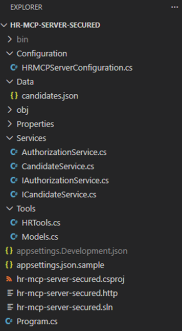

The main elements of the project outline are:

- `Configuration`: folder with the `HRMCPServerConfiguration.cs` file defining the configuration settings for the MCP server, including OAuth settings.
- `Data`: folder with the `candidates.json` file providing the list of candidates.
- `Services`: folder with the `ICandidateService.cs` and `IAuthorizationService.cs` interfaces and the actual `CandidateService.cs` and `AuthorizationService.cs` implementations of a services to load and manage the list of candidates and to handle security and authorization respectively. 
- `Tools`: folder with the `HRTools.cs` file defining the MCP tools and the `Models.cs` file defining the data models used by the tools.
- `appsettings.json.sample`: sample configuration file to start from when configuring your Entra ID settings.
- `Program.cs`: the main entry point of the project, where the MCP server gets initialized with JWT authentication.

!!! info
    The secured MCP server includes JWT bearer token authentication middleware that validates incoming tokens against your Microsoft Entra ID tenant. This ensures that only authenticated users with valid tokens can access the HR tools.

<cc-end-step lab="mcs10" exercise="1" step="2" />

### Step 3: Understanding OAuth 2.0 Authorization Code Flow

Before configuring the applications, let's understand how OAuth 2.0 Authorization Code Flow works in this scenario:

1. **User Authentication**: When a user interacts with your Copilot Studio agent and triggers an MCP tool, they are requested to connect to your target MCP server relying on Microsoft Entra ID for authentication.

2. **Authorization Code Issued**: After successful login, Microsoft Entra ID sends an authorization code to Copilot Studio via the redirect URI.

3. **Token Exchange**: Copilot Studio exchanges the authorization code (plus client credentials) for an access token.

4. **API Access**: Copilot Studio includes the access token in requests to your MCP server, which validates the token before processing the request.

This flow ensures that:

- User credentials are never exposed to the MCP server
- Access tokens have limited lifetimes and scopes
- The MCP server can verify the user's identity and permissions

<cc-end-step lab="mcs10" exercise="1" step="3" />

## Exercise 2 : Configuring Microsoft Entra ID Applications

In this exercise you are going to register two Microsoft Entra ID applications: one for the HR MCP Server (backend) and one for the Copilot Studio client (frontend).

### Step 1: Registering the HR MCP Server Application (Backend)

Open a browser and navigate to [https://entra.microsoft.com](https://entra.microsoft.com){target=_blank} using your work account.

In the left navigation, select 1️⃣ **App registrations** → 2️⃣ **+ New registration**.


Then configure the new application with these settings:

- **Name**: 

```text
HR MCP Server
```

- **Supported account types**: Select **Accounts in this organizational directory only**

- **Redirect URI**: Leave blank for now (we'll configure this later if needed)

Select **Register** to create the application.

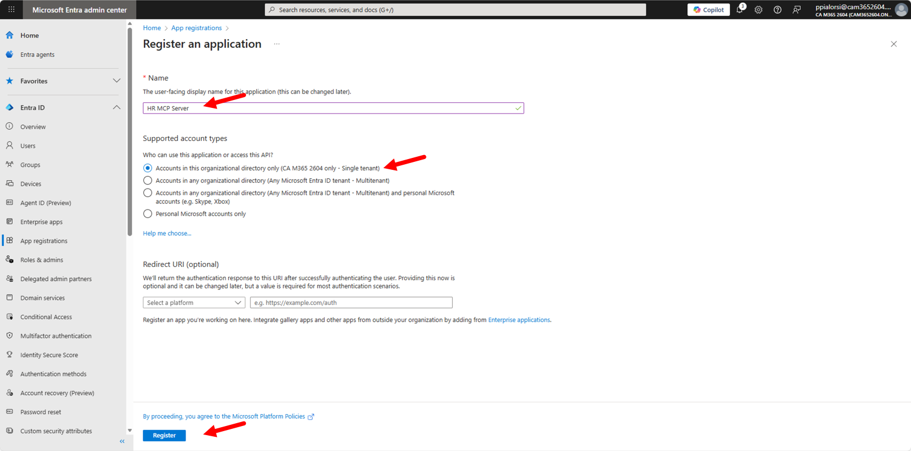

<cc-end-step lab="mcs10" exercise="2" step="1" />

### Step 2: Configuring the HR MCP Server Application

After the application is registered, you need to configure it to expose an API that the client application can access.

#### Configure Expose an API settings

1. In your **HR MCP Server** application, select **Expose an API** from the left menu
2. Next to **Application ID URI**, select **Add**
3. So far, accept the default value (format: `api://<client-id>`)
4. Select **Save**

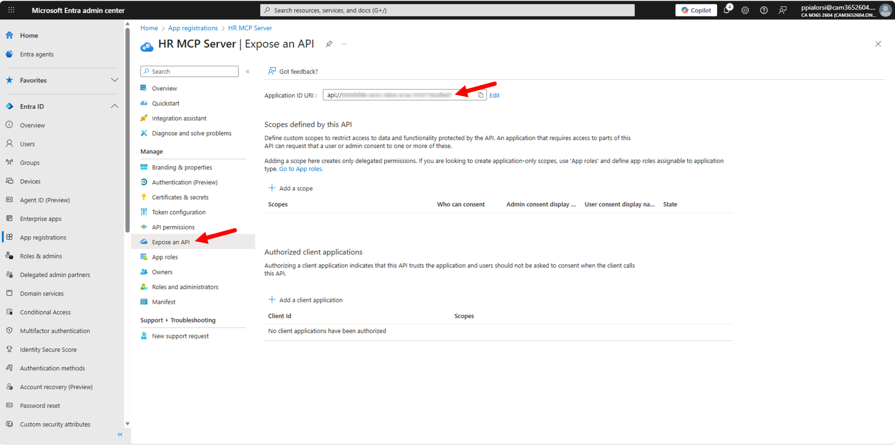

#### Add a Scope

1. In the **Scopes defined by this API** section, select **+ Add a scope**
2. Configure the scope with these settings:

- **Scope name**: 

```text
HR.Manage
```

- **Who can consent?**: **Admins and users**

- **Admin consent display name**: 

```text
Manage HR Data
```

- **Admin consent description**: 

```text
Allows managing HR data as an Admin
```

- **User consent display name**: 

```text
Manage HR Data
```

- **User consent description**: 

```text
Allows managing HR data as a user
```

- **State**: **Enabled**

3. Select **Add scope**

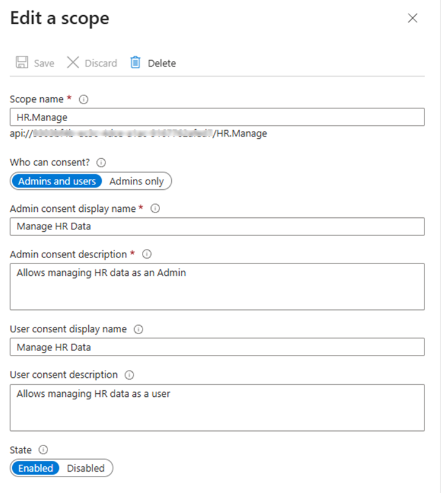

#### Record Important Values

Navigate to the **Overview** page and record the following values - you will need them later:

- **Application (client) ID**: Copy and save this value
- **Directory (tenant) ID**: Copy and save this value

<cc-end-step lab="mcs10" exercise="2" step="2" />

### Step 3: Registering the Copilot Studio Client Application

Now you need to create a second application that represents Copilot Studio as a client consuming the HR MCP Server.

As like as you just did in the previous steps, browse to the Microsoft Entra admin center, go to **Applications** → **App registrations** and select **+ New registration**.

Configure the new application with these settings:

- **Name**: 

```text
HR MCP Consumer
```

- **Supported account types**: Select **Accounts in this organizational directory only**

- **Redirect URI**: Leave blank for now (Copilot Studio will provide this URL later)

Select **Register** to create the application.

<cc-end-step lab="mcs10" exercise="2" step="3" />

### Step 4: Configuring the Copilot Studio Client Application

After registration, configure the client application with the necessary permissions and credentials.

#### Create a Client Secret

1. In your **HR MCP Consumer** application, select **Certificates & secrets** from the left menu
2. Select **+ New client secret**
3. Configure the secret:

- **Description**: 

```text
ClientSecret
```

- **Expires**: Select an appropriate expiration period (e.g., 12 months)

4. Select **Add**

**Important**: Copy the **Value** of the secret immediately and save it securely. This value will not be shown again!

#### Configure API Permissions

1. Select **API permissions** from the left menu
2. Select **+ Add a permission**
3. Select the **APIs my organization uses** tab
4. Type **HR MCP Server**
5. Select **HR MCP Server** from the list

    

6. Select 1️⃣ **Delegated permissions**
7. Check the 2️⃣ **HR.Manage** permission
8. Select 3️⃣ **Add permissions**

    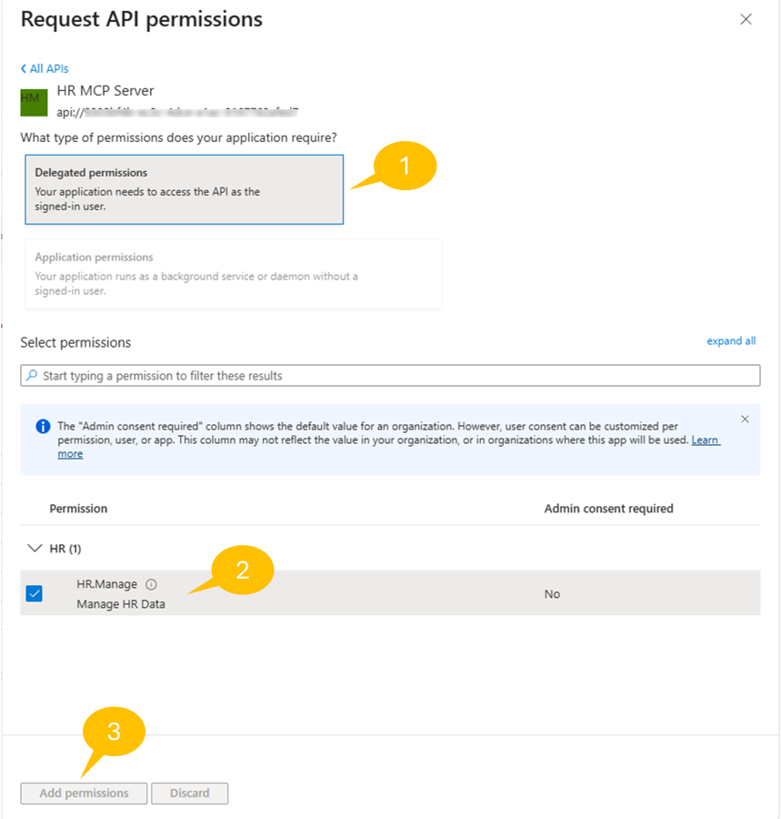

9. Additionally, add Microsoft Graph permissions. Select **+ Add a permission** → **Microsoft Graph** → **Delegated permissions**
10. Select the following permissions:

    - **email**
    - **openid**
    - **profile**
    - **User.Read**

11. Select **Add permissions** again

#### Grant Admin Consent

1. In the API permissions list, select **Grant admin consent for [Your Tenant]**
2. Confirm by selecting **Yes**

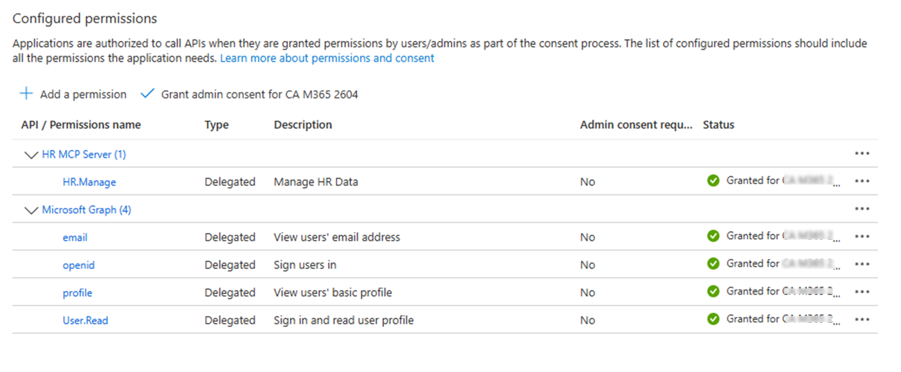

#### Record Important Values

From the **Overview** page of your client application, record:

- **Application (client) ID**: Copy and save this value
- **Client Secret Value**: You should have saved this earlier

<cc-end-step lab="mcs10" exercise="2" step="4" />

### Step 5: Configuring and Running the MCP Server

Now configure the MCP server with your Entra ID settings.

Copy the `appsettings.json.sample` file into a new file with name `appsettings.json`. Now edit the new file and update the `AzureAd` section with your values:

```json
{
  "AzureAd": {
    "Instance": "https://login.microsoftonline.com/",
    "TenantId": "[YOUR_TENANT_ID]",
    "ClientId": "[YOUR_HR_MCP_SERVER_CLIENT_ID]",
    "Audience": "[YOUR_HR_MCP_SERVER_CLIENT_ID]",
    "Scopes": "[YOUR_APPLICATION_ID_URI]/HR.Manage"
  }
}
```

Replace the placeholders:

- `[YOUR_TENANT_ID]`: The Directory (tenant) ID from your HR MCP Server app registration
- `[YOUR_HR_MCP_SERVER_CLIENT_ID]`: The Application (client) ID from your HR MCP Server app registration
- `[YOUR_APPLICATION_ID_URI]`: The Application ID URI from your HR MCP Server app (e.g., `api://xxxxxxxx-xxxx-xxxx-xxxx-xxxxxxxxxxxx`)

Save the file and run the MCP server:

```console
dotnet run
```

The server should start and listen for requests. Note that now any requests without a valid access token will be rejected with a 401 Unauthorized response.

<cc-end-step lab="mcs10" exercise="2" step="5" />

### Step 6: Configuring the Dev Tunnel

Expose the MCP server with a public URL using dev tunnel. If you haven't already installed dev tunnel, follow [these instructions](https://learn.microsoft.com/en-us/azure/developer/dev-tunnels/get-started){target=_blank}.

Login with dev tunnel:

```console
devtunnel user login
```

Host your dev tunnel:

!!! important
    Replace the `hr-mcp-secured` name suggested below with a unique name for your dev tunnel. For example, if your name is Alex you can use `hr-mcp-secured-alex` as the name for your tunnel.

```console
devtunnel create hr-mcp-secured -a --host-header unchanged
devtunnel port create hr-mcp-secured -p 47002
devtunnel host hr-mcp-secured
```

Copy the "Connect via browser" URL and save it. You will need this URL when configuring the MCP tool in Copilot Studio as well as to update the **HR MCP Consumer** application in Entra ID.

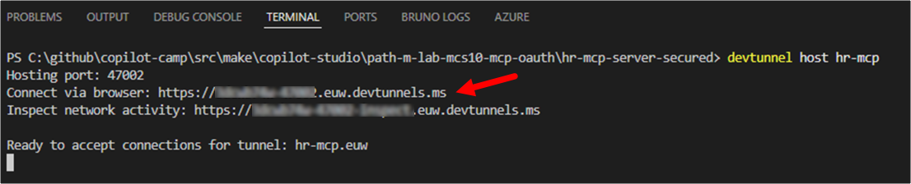

!!! tip
    Keep both the MCP server and dev tunnel running throughout this lab. If you need to restart, run `dotnet run` for the server and `devtunnel host hr-mcp-secured` for the tunnel.

<cc-end-step lab="mcs10" exercise="2" step="6" />

### Step 7: Updating the Application ID URI and Configuration

Now that you have the dev tunnel URL, you need to update the **HR MCP Server** application in Microsoft Entra ID to use this URL as the Application ID URI instead of the default `api://<guid>` format.

#### Update the Application ID URI in Entra ID

1. Go to the [Microsoft Entra admin center](https://entra.microsoft.com){target=_blank}
2. Navigate to **Applications** → **App registrations**
3. Select your **HR MCP Server** application
4. Select **Expose an API** from the left menu
5. Next to **Application ID URI**, select **Edit**
6. Replace the current value (`api://<guid>`) with your dev tunnel URL (the "Connect via browser" URL you saved earlier)
   - For example: `https://hr-mcp-secured.devtunnels.ms`
7. Select **Save**

!!! warning "URL Format"
    Make sure to use the dev tunnel URL without a trailing slash. The URL should look like `https://your-tunnel-name.devtunnels.ms`.

#### Update the appsettings.json Configuration

Now update your `appsettings.json` file to use the dev tunnel URL in the `Scopes` properties:

```json
{
  "AzureAd": {
    "Instance": "https://login.microsoftonline.com/",
    "TenantId": "[YOUR_TENANT_ID]",
    "ClientId": "[YOUR_HR_MCP_SERVER_CLIENT_ID]",
    "Audience": "[YOUR_HR_MCP_SERVER_CLIENT_ID]",
    "Scopes": "[YOUR_DEVTUNNEL_URL]/HR.Manage"
  }
}
```

Replace `[YOUR_DEVTUNNEL_URL]` with the same dev tunnel URL you configured in Entra ID (e.g., `https://hr-mcp-secured.devtunnels.ms`).

Your final configuration should look similar to:

```json
{
  "AzureAd": {
    "Instance": "https://login.microsoftonline.com/",
    "TenantId": "xxxxxxxx-xxxx-xxxx-xxxx-xxxxxxxxxxxx",
    "ClientId": "xxxxxxxx-xxxx-xxxx-xxxx-xxxxxxxxxxxx",
    "Audience": "xxxxxxxx-xxxx-xxxx-xxxx-xxxxxxxxxxxx",
    "Scopes": "https://hr-mcp-secured.devtunnels.ms/HR.Manage"
  }
}
```

#### Restart the MCP Server

After updating the configuration, save the `appsettings.json` file and restart the MCP server:

1. Stop the currently running server (press `Ctrl+C` in the terminal)
2. Start the server again:

```console
dotnet run
```

The server will now validate tokens using the dev tunnel URL matching the Application ID URI configured in Entra ID.

<cc-end-step lab="mcs10" exercise="2" step="7" />

## Exercise 3 : Creating an Agent in Copilot Studio

In this exercise you are going to create a new agent in Microsoft Copilot Studio that will consume the secured MCP server.

### Step 1: Creating the HR Agent

Open a browser and navigate to [https://copilotstudio.microsoft.com](https://copilotstudio.microsoft.com){target=_blank} using your work account.

Select the `Copilot Dev Camp` environment that you created in previous labs, and then select **Create an agent** to create a new agent.

Configure the new agent. Select **Edit** in the **Details** section and configure:

- **Name**: 

```text
HR Candidate Management (Secured)
```

- **Description**: 

```text
An AI assistant that helps manage HR candidates using a secured MCP server 
with OAuth 2.0 authentication for enterprise-grade security
```

Select **Save** to save your agent configuration.
Now, select **Edit** in the **Instructions** section and configure the following instructions

```text
You are a helpful HR assistant that specializes in secure candidate management. You can help users 
search for candidates, check their availability, get detailed candidate information, and add new 
candidates to the system. 

All operations require user authentication through OAuth 2.0 to ensure data security and compliance 
with enterprise policies.

Always provide clear and helpful information about candidates, including their skills, experience, 
contact details, and availability status.
```

Select **Save** to save your agent configuration.

Now update the **Agent's Model** to use **GPT-5 Chat**.

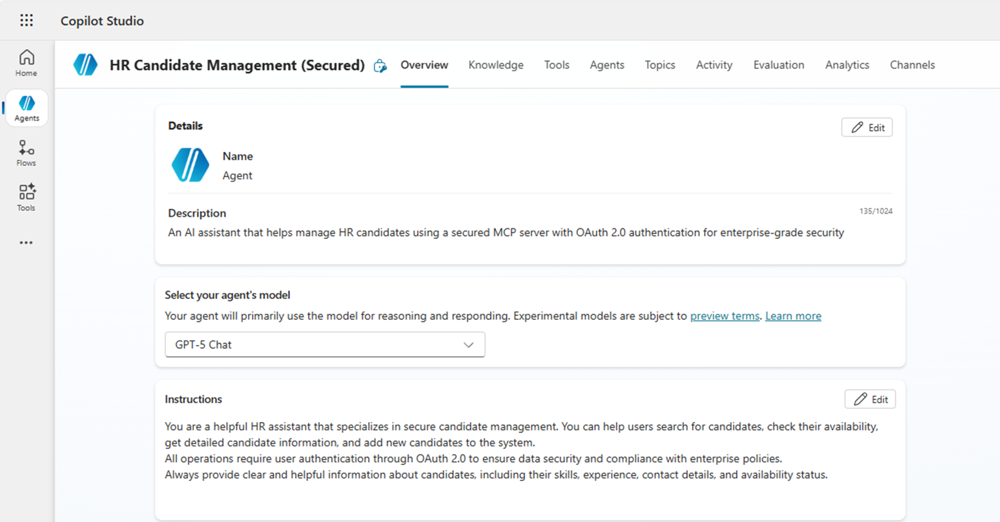

<cc-end-step lab="mcs10" exercise="3" step="1" />

### Step 2: Configuring Agent Settings

Configure the agent's knowledge settings for optimal performance.

Select the **Settings** command in the upper right corner and configure:

In the **Knowledge** section:

- **Use general knowledge**: off
- **Use information from the web**: off

Select **Save** to confirm the configuration.

<cc-end-step lab="mcs10" exercise="3" step="2" />

### Step 3: Configuring Conversation Starters

In the **Overview** page, configure the **Suggested prompts** section with helpful prompts:

1. Title: `List all candidates` - Prompt: `Show me all candidates in the HR system`
2. Title: `Search candidates` - Prompt: `Search for candidates with skills in [SKILL]`
3. Title: `Add new candidate` - Prompt: `Add a new candidate with firstname [FIRSTNAME], lastname [LASTNAME], email [EMAIL], role [ROLE], languages [LANGUAGES], and skills [SKILLS]`

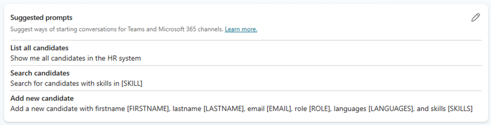

Select **Save** to confirm your changes.

<cc-end-step lab="mcs10" exercise="3" step="3" />

## Exercise 4 : Registering the MCP Tool with OAuth 2.0

In this exercise you are going to configure the secured MCP server as a tool in your Copilot Studio agent with OAuth 2.0 authentication.

### Step 1: Adding the MCP Server Tool

In your agent, navigate to the 1️⃣ **Tools** section and select 2️⃣ **+ Add a tool**.

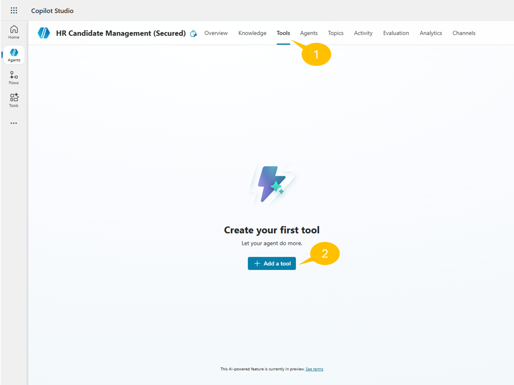

In the 1️⃣ **Create new** section, choose 2️⃣ **Model Context Protocol** to add a new MCP server.


<cc-end-step lab="mcs10" exercise="4" step="1" />

### Step 2: Configuring OAuth 2.0 Authentication

Configure the MCP server connection with OAuth 2.0 settings:

**Basic Settings:**

- **Server name**: 

```text
HR MCP Server Secured
```

- **Server description**: 

```text
Securely manages HR candidates with OAuth 2.0 authentication for enterprise compliance
```

- **URL**: Enter the dev tunnel URL you saved earlier (the "Connect via browser" URL)

**Authentication Settings:**

Select **OAuth 2.0** as the authentication method and then **Manual** to manually configure the authentication settings.

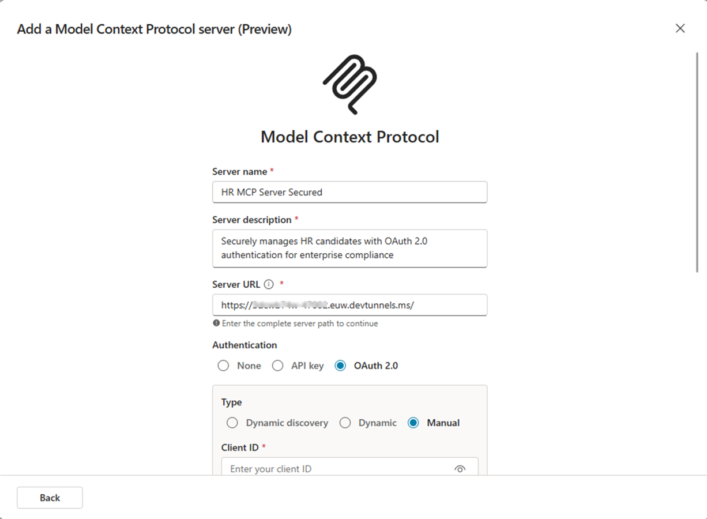

Configure the OAuth 2.0 settings:

- **Client ID**: Enter the Application (client) ID from your **HR MCP Client - Copilot Studio** app registration

- **Client secret**: Enter the client secret value you saved earlier

- **Authorization URL template**: 

```text
https://login.microsoftonline.com/[YOUR_TENANT_ID]/oauth2/v2.0/authorize
```

- **Token URL template**: 

```text
https://login.microsoftonline.com/[YOUR_TENANT_ID]/oauth2/v2.0/token
```

- **Refresh URL template**: 

```text
https://login.microsoftonline.com/[YOUR_TENANT_ID]/oauth2/v2.0/token
```

- **Scopes**: Enter the scopes separated by spaces:

```text
openid profile email
```

!!! important
    The provided scopes are temporary and you will replace them later with the actual scope required by the secured HR MCP Server.

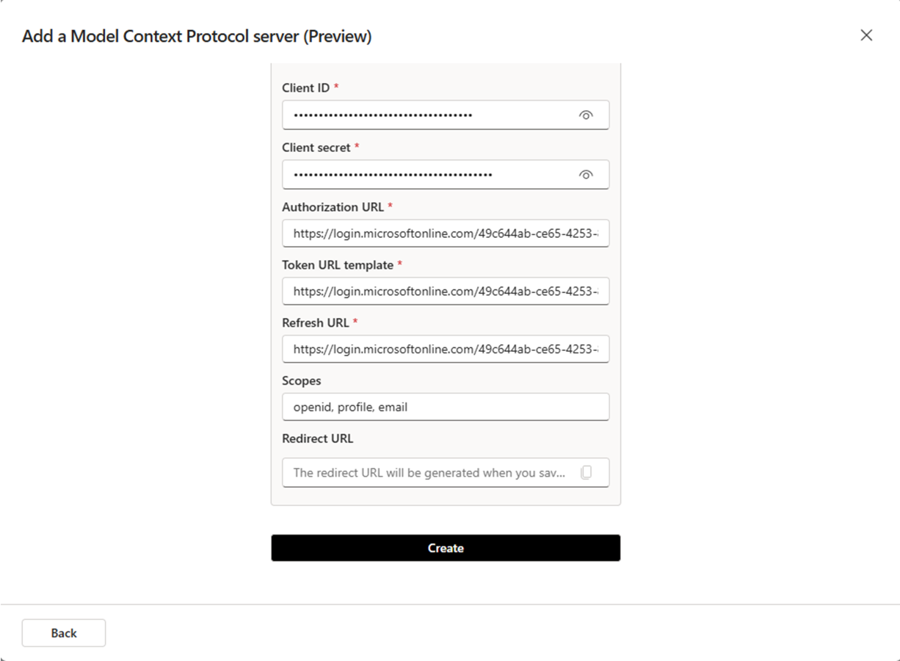

Select **Create** to create the MCP server configuration.

<cc-end-step lab="mcs10" exercise="4" step="2" />

### Step 3: Configuring the Redirect URI in Entra ID

After creating the MCP tool, Copilot Studio generates a **Redirect URL** that you need to configure in your Entra ID **HR MCP Consumer** application.

1. Copy the Redirect URL provided by Copilot Studio

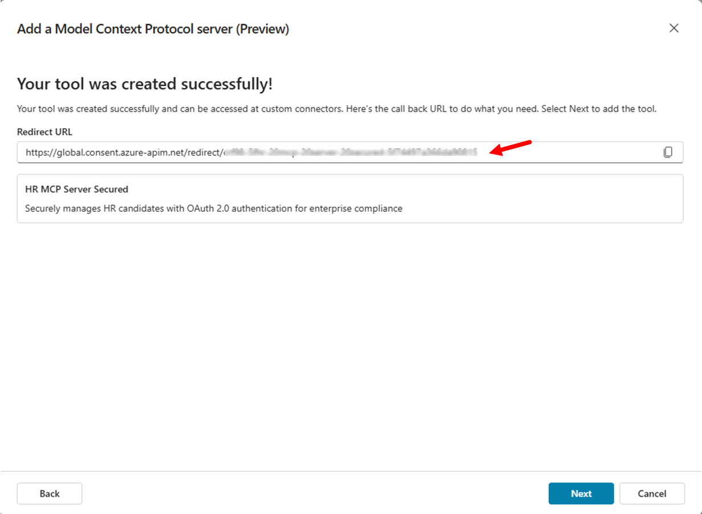

2. Go to the [Microsoft Entra admin center](https://entra.microsoft.com){target=_blank}
3. Navigate to **Applications** → **App registrations**
4. Select your **HR MCP Consumer** application
5. Select **Authentication** from the left menu
6. Select **+ Add Redirect URI** and then select **Web**
7. Paste the Redirect URL copied from Copilot Studio into the **Redirect URI** field
8. Select **Configure**

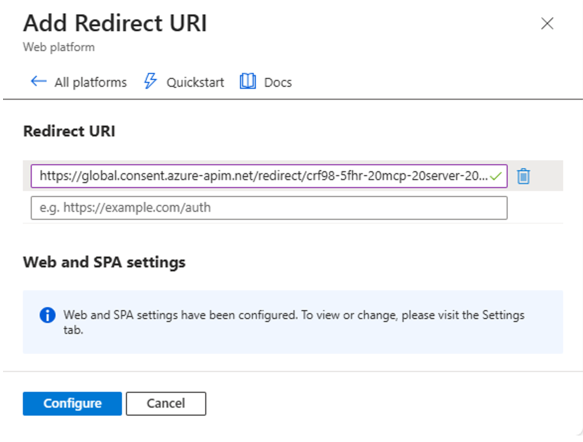

<cc-end-step lab="mcs10" exercise="4" step="3" />

Return to Copilot Studio and complete the tool configuration. Select **Next** to proceed with the MCP server configuration. A new dialog will prompt you to connect to the target MCP server. Don't connect now, keep it on hold and proceed with the following Step 4.

### Step 4: Configuring the Power Apps Connector (Optional)

!!! info
    This step may be required depending on your environment configuration. The MCP connector created in Copilot Studio is also registered in Power Apps, where you might need to configure additional settings.

If you need to modify the connector settings:

1. Navigate to [https://make.powerautomate.com](https://make.powerautomate.com){target=_blank}
2. Select the `Copilot Dev Camp` environment from the environment picker in the top right corner
3. Select **More** → **Discover all** → **Custom connectors**
4. Find the connector for your secured MCP server. The name should be the same that you selected for the MCP tool, so it should be **HR MCP Server Secured**
5. Select the pencil to **Edit** the connector

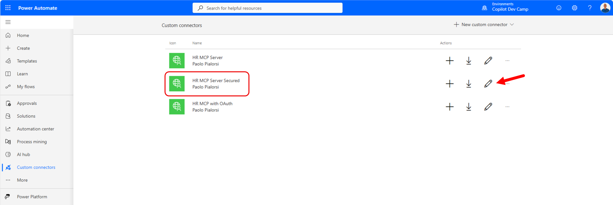

6. Navigate to the **Security** tab
7. Then select **Edit** to update the OAuth 2.0 settings


8. Configure the **Client Secret** with the value you copied before from Entra ID in the **HR MCP Consumer** application
9. In the **Resource URL** field, enter your Application ID URI that should be the [YOUR_DEVTUNNEL_URL] that you copied from the dev tunnel (e.g., `https://hr-mcp-secured.devtunnels.ms`)
10. In the **Scope** field, enter the name of the custom scope **HR.Manage** that you registered before
11. Select **Update connector** in the upper side of the screen


<cc-end-step lab="mcs10" exercise="4" step="4" />

### Step 5: Complete MCP tool configuration

Now go back to Copilot Studio to complete the MCP tool configuration and create the connection.

1. In the MCP tool configuration dialog, you should see the **Connection** section showing **Not connected**
2. Select **Not connected** to open the connection options
3. Select **Create new connection**

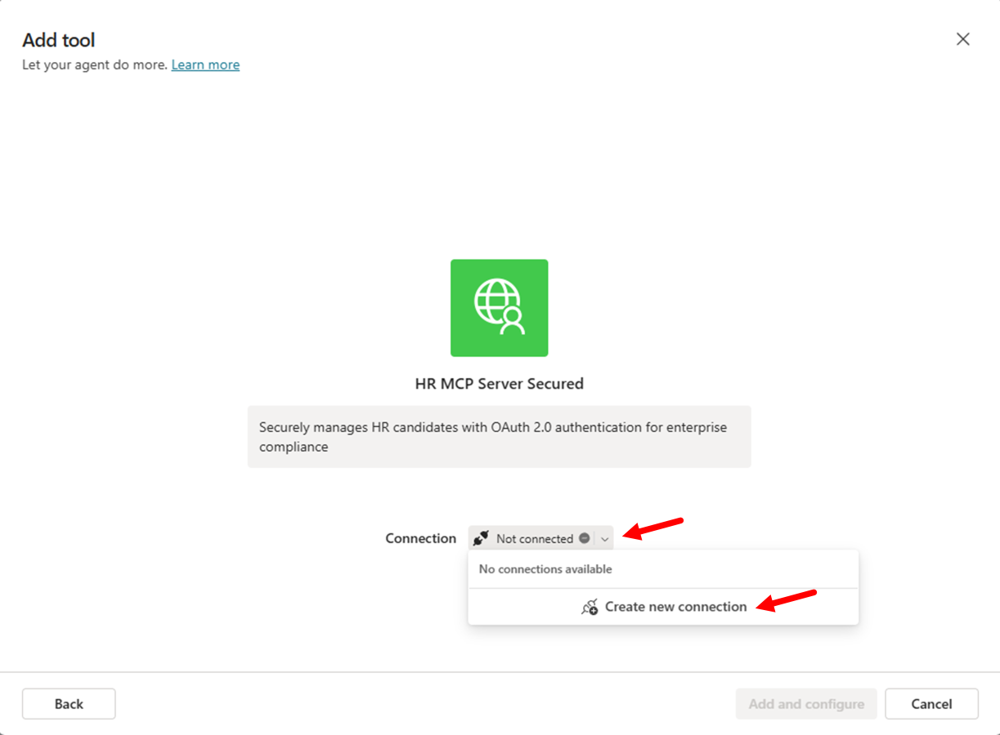

4. In the dialog that appears, select **Create** to start creating the connection
5. Copilot Studio will prompt you to authenticate with Microsoft Entra ID
6. Select a valid user account or provide credentials for a valid user in your tenant
7. If prompted, grant permission for the application to access the HR MCP Server

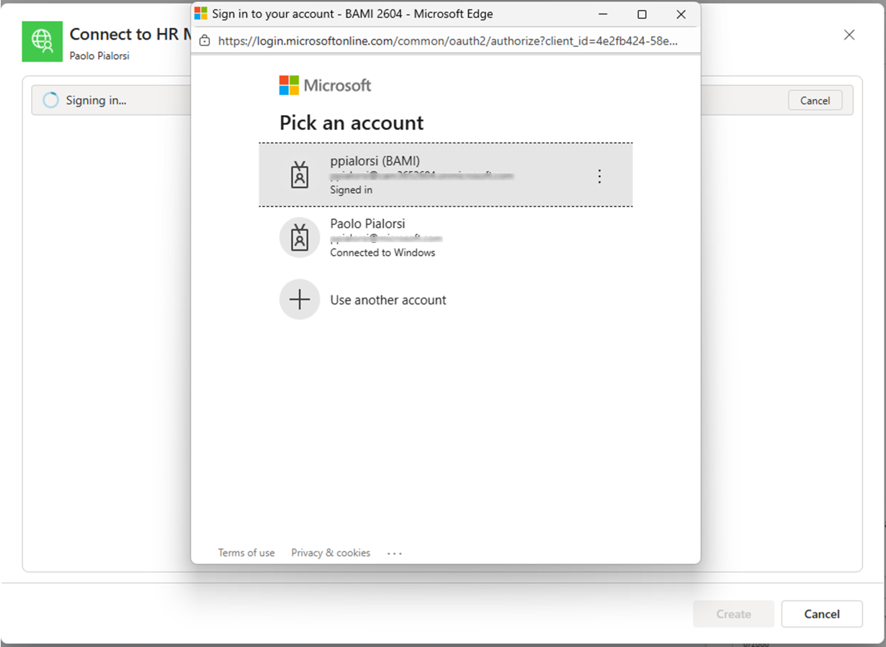

8. Once authentication is successful, the connection will be configured and you will see a green checkmark indicating the connection is established
9. Select **Add and configure** to add the MCP tool to your agent


You will now see the MCP server configuration page with all available tools listed:

- list_candidates
- search_candidates
- add_candidate
- update_candidate
- remove_candidate


The secured MCP server is now configured and ready for testing.

<cc-end-step lab="mcs10" exercise="4" step="5" />

## Exercise 5 : Testing the Agent

In this exercise you will test the agent and verify that OAuth 2.0 authentication is working correctly.

### Step 1: Publishing the Agent

Before testing, publish your agent:

1. Select **Publish** in the top right corner of Copilot Studio
2. Wait for the publishing process to complete

<cc-end-step lab="mcs10" exercise="5" step="1" />

### Step 2: Testing Authentication Flow

Open the test panel in Copilot Studio and try a prompt:

```text
List all candidates
```

Since this is the first time using the secured MCP server, Copilot Studio will prompt you to **Allow** the agent using your credentials to access the external MCP server. Select the **Allow** command to proceed.

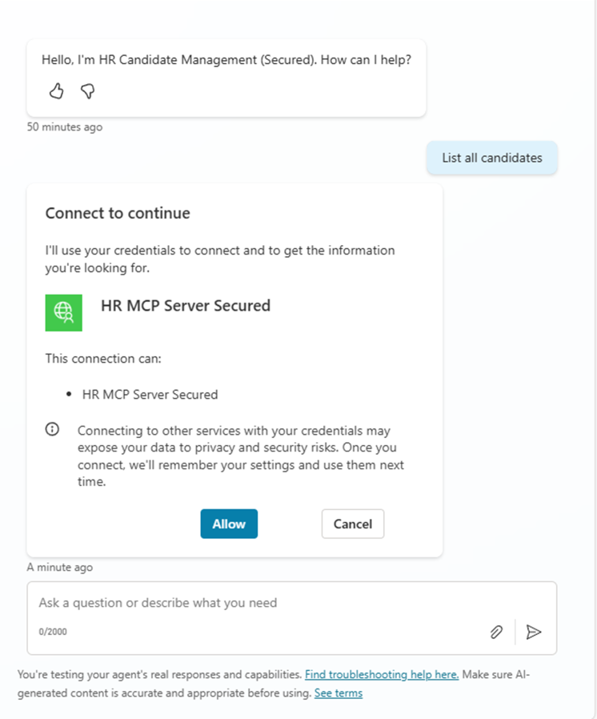

In case you are not connected to the target MCP server or if the connection token is expired, you will be prompted to connect the connection in **Open connection manager**. If that is the case, follow these steps:

1. Select **Open connection manager**
2. A new tab will open in the browser to connect to the target MCP server
3. Select **Connect**
4. Sign in with your work account
5. If prompted, grant consent for the application to access the HR MCP Server
6. After successful authentication, the connection will be marked as **Connected**

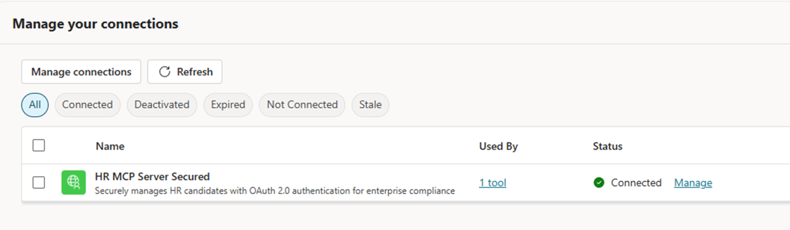

<cc-end-step lab="mcs10" exercise="5" step="2" />

### Step 3: Testing MCP Tools

Once authenticated your prompt will be processed. If not, provide the prompt again:

```text
List all candidates
```

The agent should now successfully call the secured MCP server and return the list of candidates.

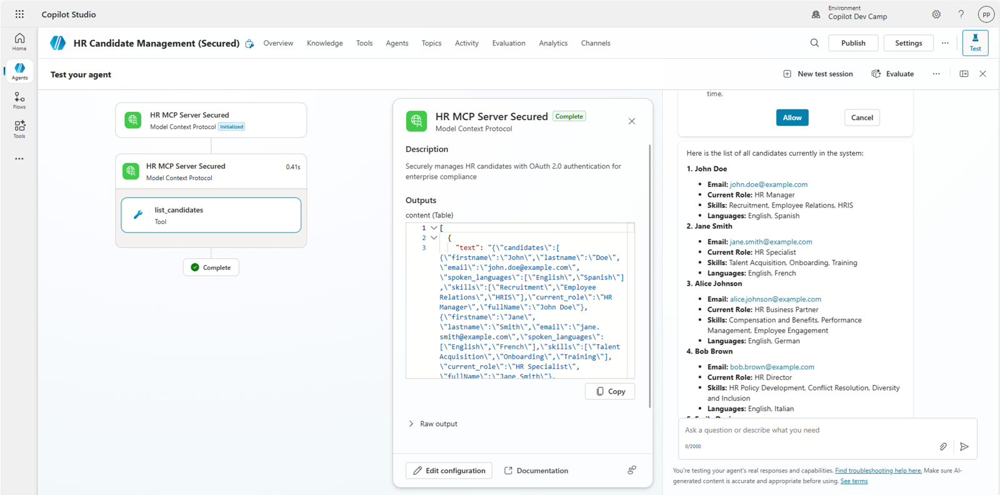


!!! tip "Token Caching"
    After the initial authentication, your access token is cached for a period of time. You won't need to re-authenticate for every request unless the token expires or is revoked.

Try additional prompts to test other tools:

**Search for candidates:**
```text
Search for candidates with Training skills
```

**Get a specific candidate:**
```text
Get candidate with email bob.brown@example.com
```

!!! info "Monitoring MCP Server Activity"
    While consuming the MCP server from your agent in Copilot Studio, the .NET application hosting the MCP server continues to run and logs all activity in the terminal window. You can observe each tool method call being invoked in real-time, along with evidence of the OAuth bearer token provided in the request headers. This is useful for debugging and verifying that authentication is working correctly. Look for log entries showing the incoming requests with the `Authorization: Bearer` header containing the JWT access token.

    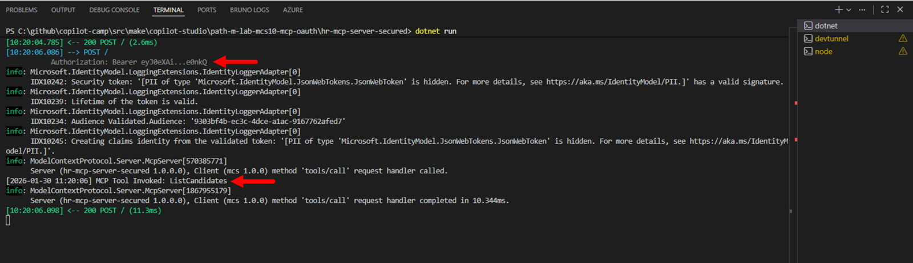

<cc-end-step lab="mcs10" exercise="5" step="4" />

---8<--- "mcs-congratulations.md"

You have completed Lab MCS10 - Consuming an MCP server with OAuth 2.0!

In this lab, you learned how to:

- Configure an MCP server with OAuth 2.0 JWT token validation
- Register Microsoft Entra ID applications for secure API access (backend and client)
- Configure the OAuth 2.0 Authorization Code Flow in Copilot Studio
- Consume secured MCP tools with enterprise-grade authentication

By implementing OAuth 2.0 authentication, you have ensured that your HR candidate management system is protected with industry-standard security practices. This approach is essential for production environments where data security and user authentication are critical requirements.

<!-- <cc-next />  -->


