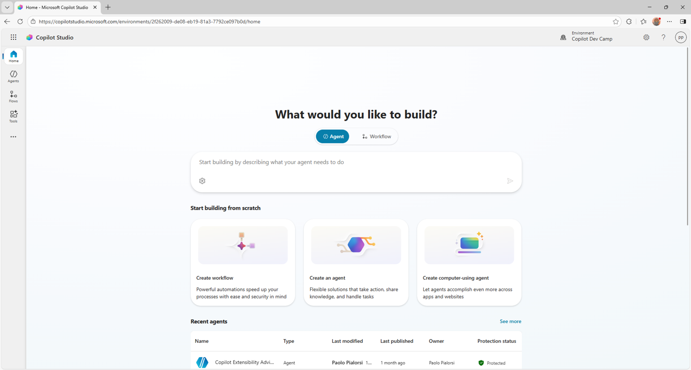

# Understanding Microsoft Copilot Studio

With Microsoft Copilot Studio you have the maximum potential for making custom agents. You can use it to create agents that you can host in multiple different channels like Microsoft Teams, custom web sites, Skype, Slack, etc. You can also host your agents in Microsoft 365 Copilot chat.
The knowledge base can be:

- SharePoint Online
- OneDrive for Business
- Public web sites
- Microsoft Dataverse tables
- Power Platform connectors
- etc.

Every agent can have custom actions to interact with Power Automate flows, Power Platform connectors, external REST APIs, etc.
Generally speaking, with Copilot Studio you can create really powerful agents without the need to write any line of code.

In order to use Copilot Studio, you need a user license (also known as _per user license_) for each user creating or maintaining an agent. Moreover, you need an organization level license for Copilot Studio (also known as _tenant license_). Starting December 1, 2024, Pay-As-You-Go is supported for Copilot Studio messages, which allows customers flexibility to only pay for the message capacity they consume.

---8<--- "mcs-labs-toc.md"

## <a href="./00-prerequisites">Start here</a> with Lab MCS0, where you'll set up your environment for Copilot Studio.

