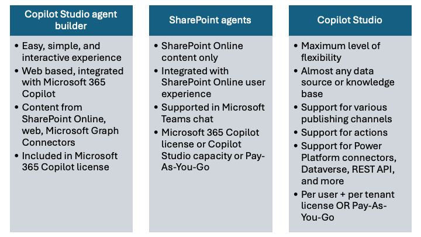

# Welcome to Copilot Camp's Make Path: Make agents for Microsoft 365 Copilot

During the Make Path of the Copilot Camp, learners will construct a customized assistant tailored for a Human Resource department. The process will begin with the creation of a basic agent using either the Copilot Studio agent builder, or the SharPoint agent capability in SharePoint Online, or Copilot Studio.

In order to better understand the available options and when you should use what, here you can find a helpful diagram followed by brief explanation of each of the options.

## Copilot Studio agent builder

This is the easiest way of creating a personal agent for Microsoft 365 Copilot. In fact, it is integrated with the native UI of Microsoft 365 Copilot chat and it is available to any licensed user of Microsoft 365 Copilot. You can start from a set of Microsoft provided templates, or you can start from scratch. You can define the agent simply describing in natural language what you are looking for and relying on Copilot Studio agent builder capability to understand natural language. It will create an agent for you based on your prompt. Or you can configure the agent using a configuration page. By default, the agent is for personal use only. However, you can share it with specific people in your organization, or even with all the users in your organization, if needed.

An agent built with Copilot Studio agent builder can use knowledge bases like:

- Generic web content indexed by Microsoft Bing
- Content of documents stored in SharePoint Online
- Microsoft Graph connectors

It can also generate images on the fly or convert natural language into code.

In order to use the Copilot Studio agent builder you only need the Microsoft 365 Copilot license.

## <a href="./agent-builder/01-first-agent">Start here</a> with Lab MAB1, where you'll make your first agent with Copilot Studio agent builder.

## SharePoint agents

A SharePoint agent is the easiest way to create an agent specialized on content stored in SharePoint Online targeting specific sites (one or more sites are supported), libraries, or documents. A SharePoint agent can be used from within the SharePoint Online user experience, but can also be shared in Microsoft Teams to enhance the user experience in chats (one to one or group chats).

If you are assigned with a Microsoft 365 Copilot license, or your organization has the Pay-As-You-Go billing set up, you can use SharePoint agents.

## <a href="./sharepoint-agents/01-first-agent">Start here</a> with Lab MSA1, where you'll make your first SharePoint agent.

## Copilot Studio

With Copilot Studio you have the maximum potential for making custom agents. You can use it to create agents that you can host in multiple different channels like Microsoft Teams, custom web sites, Skype, Slack, etc. You can also host your agents in Microsoft 365 Copilot chat.
The knowledge base can be:

- SharePoint Online
- OneDrive for Business
- Public web sites
- Microsoft Dataverse tables
- Power Platform connectors
- etc.

Every agent can have custom actions to interact with Power Automate flows, Power Platform connectors, external REST APIs, etc.
Generally speaking, with Copilot Studio you can create really powerful agents without the need to write any line of code.

In order to use Copilot Studio, you need a user license (also known as _per user license_) for each user creating or maintaining an agent. Moreover, you need an organization level license for Copilot Studio (also known as _tenant license_). Starting December 1, 2024, Pay-As-You-Go is supported for Copilot Studio messages, wichi allows customers flexibility to only pay for the message capacity they consume.

## <a href="./copilot-studio/00-prerequisites">Start here</a> with Lab MCS0, where you'll set up your environment for Copilot Studio.

