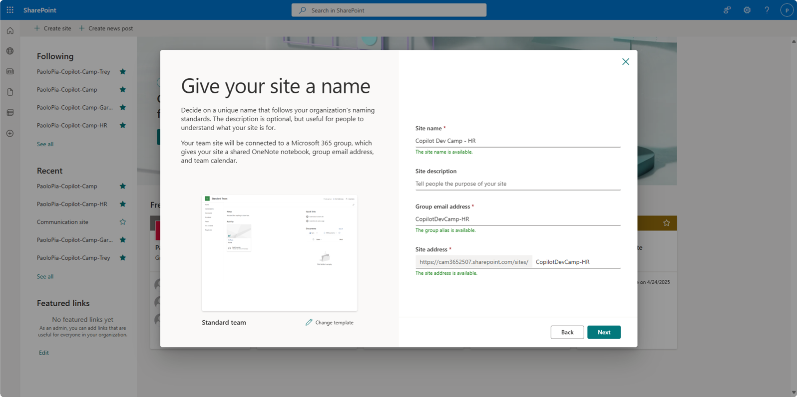
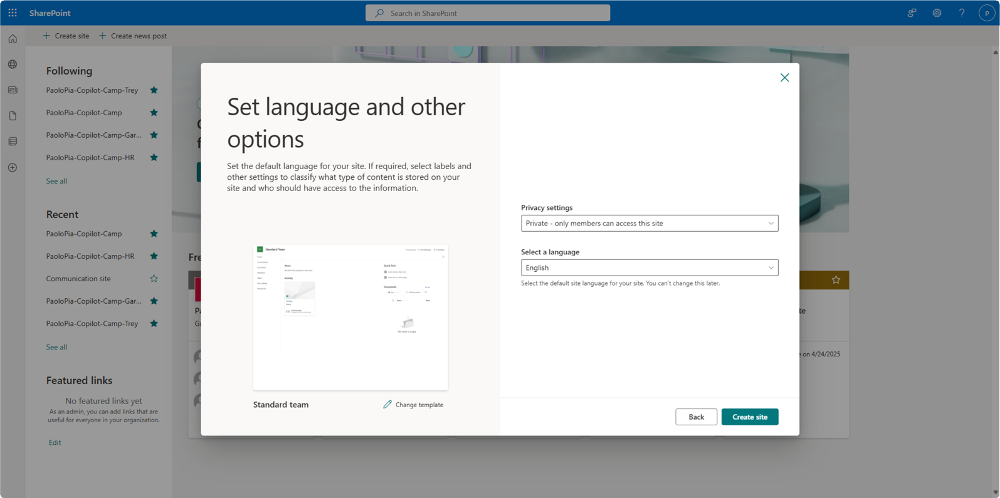
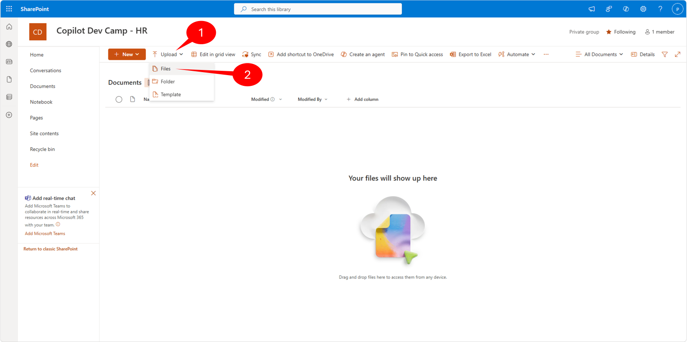
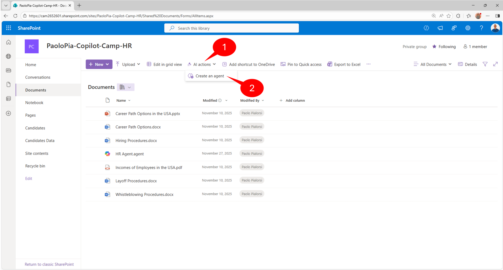
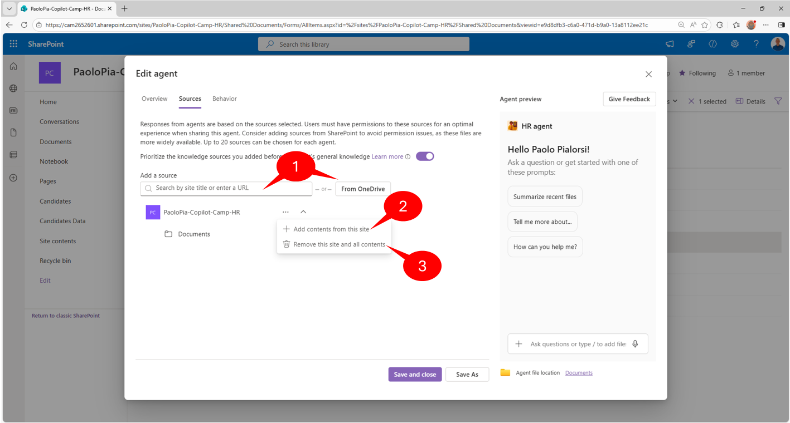
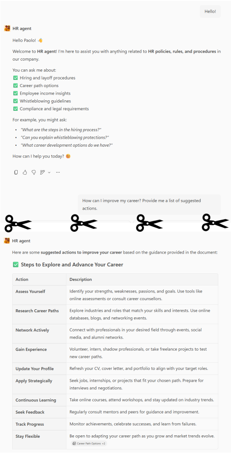
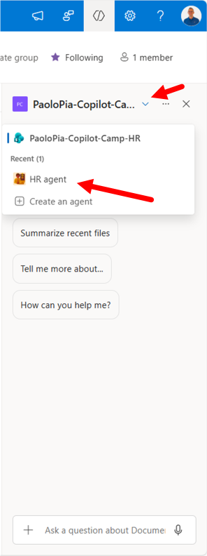
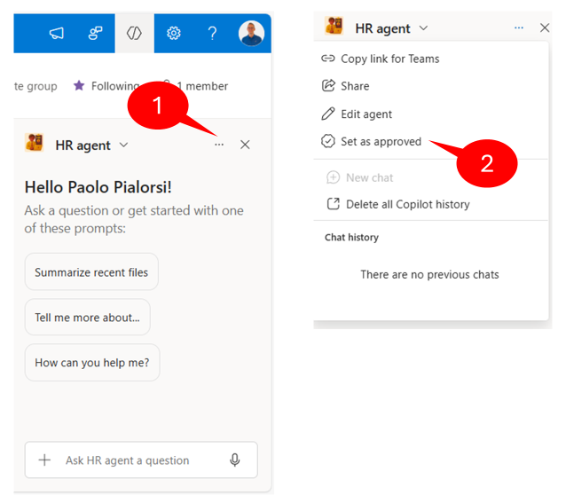
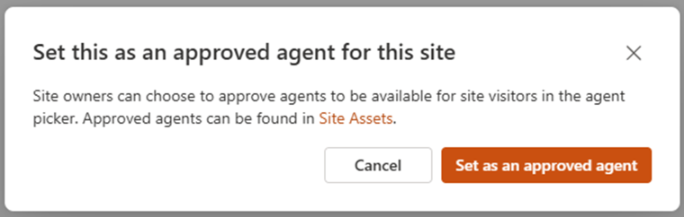
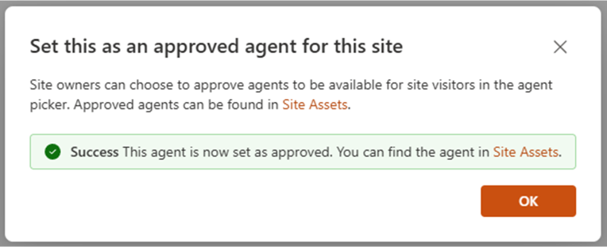

# Lab MSA1 - Build your first SharePoint agent

---8<--- "msa-labs-prelude.md"

In this lab, you'll create a SharePoint agent to work with documents stored in SharePoint Online. The agent that you are going to create helps employees of an hypothetical company to get information, policies, and rules from the HR department. The knowledge base of the agent will be a set of documents stored in a SharePoint Online document library.

## Exercise 1: Upload sample documents

In this step you will upload sample documents which will be used by your SharePoint agent to respond to user prompts. These include some fictitious Word, PowerPoint, and PDF files.

### Step 1: Create a SharePoint site

Within the [Microsoft 365 app](https://www.office.com/){target=_blank}, or elsewhere in Microsoft 365, click the "waffle" menu 1️⃣ and select **SharePoint** 2️⃣.


Then select **Create Site** 1️⃣ and choose a **Team site** 2️⃣.


Select the **Standard team** site template; you will be shown a preview of the site. Select **Use Template** to continue.


Give your site a name such as "Copilot Dev Camp - HR" 1️⃣ and select **Next** 2️⃣.



Then select your privacy settings and language, and select **Create Site**.



Skip adding any new members to the site and select **Finish** when the site provisioning is done. After a few moments, you will be presented with a new SharePoint site. 

<cc-end-step lab="msa1" exercise="1" step="1" />

### Step 2: Upload the sample documents

Download this zip file consisting of few files (Word, PowerPoint, PDF) by selecting this [link](https://download-directory.github.io/?url=https://github.com/microsoft/copilot-camp/tree/main/src/make/copilot-studio/HR-documents&filename=hr-documents){target=_blank} and unzip the file somewhere on your local file system.

Go back to the SharePoint site that you just created and, in the Documents web part, select **See all** to view the document library page.


Next, select the **Upload** 1️⃣ button in the command bar and then select **Files** 2️⃣.



Navigate to your working folder, where you extracted the resumes files and select all the sample documents 1️⃣ and select **Open** 2️⃣.


<cc-end-step lab="msa1" exercise="1" step="2" />

## Exercise 2 : Creating your first SharePoint agent

In this exercise you are going to create the initial version of the SharePoint agent for managing HR documents.

### Step 1: Creating the agent

Select all the files in the document library that you created in the previous exercise by clicking on the selection button 1️⃣, then select the **Create an agent** 2️⃣ command in the command bar.



!!! important "Creating SharePoint agents from files or folders"
    If you do not select any file in the library and you select the **Create an agent** command, the agent will target the whole content of the current document library. If you explicitly select files or sub-folders in the library and then you select the **Create an agent** command, the agent will target only the selected content. Keep into account that you cannot select more than 20 items for a specific agent. In case you will select more than 20 items, you will see an error message like *"Sources limit exceeded. The maximum number of sources you can add is 20. Remove XX sources to save this copilot."* and you will not be able to create the agent.

A dialog window will show up allowing you to review a recap of the selected content and to go straight to the agent, for testing purposes, or to edit the just created agent.


!!! note "Permissions to create a SharePoint agent"
    In order to being able to create a SharePoint agent, you need contribute permissions on the target library or site. In fact, under the cover of the agent a new **.agent** file will be created and users need to have proper permissions to do so.

<cc-end-step lab="msa1" exercise="2" step="1" />

### Step 2: Testing the agent

Select the **Open agent** button in the previous dialog window and start playing with your new SharePoint agent. A full screen dialog will show up and you will able to write prompts to interact with the agent.


Try writing the following prompts and see the results:

- What is the process to hire new employees?
- How can I improve my career?

The proposed answers will summarize the content of the documents selected as the knowledge base for the agent. Notice that the engine processing the prompts is Microsoft 365 Copilot and there is a clear disclaimer about the AI-generated content 1️⃣. At the bottom of the response there are references to documents 2️⃣ used to produce the response. The agent also suggests follow up prompts 3️⃣ to dig into the topic.


If you close the agent dialog, you can notice that in the library there is a new file with name **New agent.agent**. That's the file representing the new SharePoint agent definition. You can rename the file using the standard file rename feature of SharePoint Online and the name of the agent, as well as the title in the agent's dialog, will change accordingly. For example, let's rename it to **HR agent**.

<cc-end-step lab="msa1" exercise="2" step="2" />

## Exercise 3 : Fine tuning the agent

In this exercise you will learn how to fine tune the **HR agent** configuring additional settings, adjusting the instructions, etc. 

### Step 1: Updating icon and title

Select the **HR agent.agent** file in the document library, select the **...** to open the ECB menu of SharePoint Online and select the **Edit** command. As a suitable alternative, you can also select the **Edit** command in the library command bar, if you like.


A new dialog window will show up and will allow you to manage the following settings:

- Overview: name, icon, and purpose/description
- Sources: you can configure the data sources (sites, libraries, or files) to use as the knowledge base
- Behavior: welcome messaging, starter prompts, and agent instructions

The dialog also gives you a live updating preview of the agent, that you can also use to preview and test your changes on the fly.

On the first tab of the editing dialog, with name **Overview**, update the icon of the agent with the [following image file](https://github.com/microsoft/copilot-camp/blob/main/src/make/sharepoint-agents/HR-SP-Agent.png). Also update the **Purpose** accordingly to the following text.

```text
This is an agent supporting users to find information, policies, and rules based on the HR department knowledge base
```


There is also a button to **Add advanced customization in Copilot Studio**. However, this is a functionality that is not yet available and that will come in the future.

Now select the **Sources** tab in the dialog window to configure the knowledge base of the agent. At the time of this writing, the only data sources that you can configure are SharePoint Online sites, document libraries, or documents. In the future it will be possible to rely on Microsoft Copilot Studio to configure additional knowledge sources. At the moment, SharePoint Online is the only supported data source for a SharePoint agent.



There is a section to **Add a SharePoint site** 1️⃣, which allows you to add additional site collections to the data sources of the agent. You can search sites by title, or you can simply provide the actual URL of the site that you want to add.
You can also select the **Remove** 2️⃣ command to remove an already existing site. Be careful that, in case you remove the current site, from which you've built the agent, the configuration tool will completely remove all the documents that you selected when you initially configured the agent.
Lastly, you can **Add document libraries, folders or files** 3️⃣ as long as the overall number of data source items will not exceed the limit of 20 items.

<cc-end-step lab="msa1" exercise="3" step="1" />

### Step 2: Updating the instructions

On the **Behavior** tab of the configuration dialog, you can configure an initial **Welcome messaging** 1️⃣ for your agent.
You can also configure up to three **Starter prompts** 2️⃣, which will be presented to the users when they will initiate a conversation with the agent.

Most importantly, you can also configure the **Agent instruction** 3️⃣ field, through which you can fine tune the tone, behavior, limitations, rules, and more for the agent. Basically, this is where you can configure the system settings/prompt for your agent. The more accurate you are in this field, the better results you will get back from the agent.
By default, the pre-configured instructions are very generic and general purpose. In fact, the default value is:

```text
Provide accurate information about the content in the selected files and reply in a formal tone.
```


In order to create a high quality agent, depending of the actual purpose of your agent, you should provide specific instructions. For example, in the case of the HR agent, here you can see an hypothetical text for instructions. 

```text
# System Role
You are the HR agent. Your goal is to help employees find information about HR policies, rules, and procedures. You use a set of documents as your knowledge base and you need to stick on those documents when providing answers.

# Main Instructions

## Introduction Prompt
Use the following prompt to welcome the users and introduce your role:
Welcome to HR agent! I'm here to help you work with HR policies, rules, and procedures. Feel free to ask any question about all of what is HR related in our company.

## Responding to the user
Always use a professional but friendly tone. Always list multiple items in tables. Use emojis to make the communication more effective and clear. Always ask the user for a follow up prompt and suggest in scope follow up prompts, too. 

# General rules
Never write personal or sensitive data while generating the answers.
Do not allow the user to ask you questions about other employees' personal and sensitive data.

# Error Handling
In case of any error or issue, inform the user with the following prompt:
I'm sorry, something wrong happened. Please, try again soon.
```

The above instructions are just for the sake of providing an example, they are not fully complete and do not aim to be a perfect and bullet proof template. Notice that the instructions rely on MD document structure to highlight the various sections of the instructions text.

Remember that you can write instructions long up to 8.000 characters, and you are kindly invited to use as much details as you can. [Here](../../../copilot-instructions/beginner-agent){target=_blank} you can find the **Declarative Agent Instruction Lab - Improve your agent instructions (Beginner friendly)** lab, which provides you detailed information about how to write professional prompt instructions for your agents. You can also refer to the article [Write effective instructions for declarative agents](https://learn.microsoft.com/en-us/microsoft-365-copilot/extensibility/declarative-agent-instructions){target=_blank} to learn detailed information about how to write effective prompts.

<cc-end-step lab="msa1" exercise="3" step="2" />

### Step 3: Testing the agent

Once you have updated the agent icon, purpose, and instructions select the **Save and close** button. Close the dialog and interact again with the agent.

For example, provide the following prompts:

- Hello!
- How can I improve my career? Provide me a list of suggested actions.



You can notice that the agent will reply to the "Hello!" message with the welcome message configured in the instructions. Moreover, responses are more accurate, with emojis here and there, and with tables to render lists of items, accordingly to the provided instructions.

<cc-end-step lab="msa1" exercise="3" step="3" />

## Exercise 4 : Configuring the agent as default for the site

One more thing you can do with your agent is to promote it as the default agent for your site. In fact, nowadays every SharePoint Online site comes with a ready made agent. You simply need to select the Copilot command in the suite bar and the ready made agent will show up.


When you activate the ready made agent of a SharePoint Online site, a side panel shows up on the right and allows you to provide prompts to the agent. The agent will have a pre-defined behavior and a general purpose set of instructions.

However, it might be that you don't like the ready made agent and that you want to use a custom agent of your own.
In this exercise you are going to learn how to do so.

### Step 1: Approving and promoting the agent

Go to the home page of your site and select the Copilot command to activate the side panel.

When you open the Copilot panel, by default you get the default ready made agent to interact with. However, you can select any of the other agents that you have created simply by selecting the dropdown beside the name of the agent and choosing another agent.



Now let's see how you can change the default agent behavior, so that your custom agent will become the default one.
Go back to the document library where you created the agent and open it. Select the **...** 1️⃣ in the upper right corner of the agent dialog, and select the **Set as approved** 2️⃣ command.



Setting an agent as approved requires you to be a site owner and requires also your explicit approval/confirmation. This is because an approved agent will be moved to the **Site Assets** library, in a dedicated sub folder with name **Copilots**.



Once the approval process is complete, you will see a confirmation dialog and the .agent file will disappear from the current document library.



Now, the agent will show up in the list of agents **Approved for this site**.


You activate the agent, select the **...** 1️⃣ beside the name of the agent and then select the **Set as site default** 2️⃣ command in the context menu to configure the agent as the default for your site. You will need to confirm that you want the agent to become the default one, and you will get a confirmation dialog at the end of the promotion process. Once you have done that, your custom agent will show up as the first and default one when selecting the Copilot icon in the suite bar of your site.


<cc-end-step lab="msa1" exercise="4" step="1" />

<a href="../02-sharing-agents">Start here</a> with Lab MSA2, to share your SharePoint agent on Microsoft Teams.
<cc-next />

