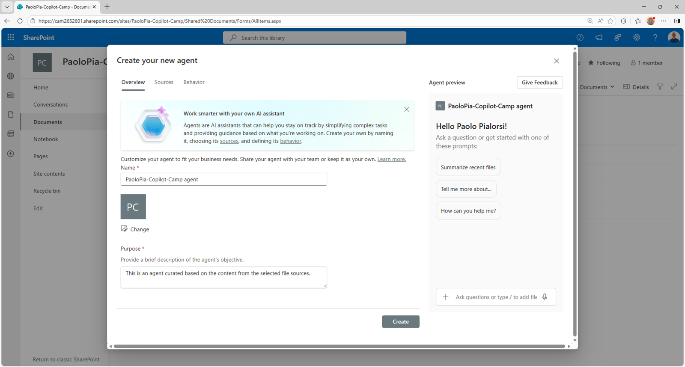

# Understanding SharePoint agents

A SharePoint agent is the easiest way to create an agent specialized on content stored in SharePoint Online. 
The SharePoint agents can target:

- sites
- libraries
- documents

A SharePoint agent can be used from within the SharePoint Online user experience either in the library where it was created or at site level. A user needs to have *contribute* permissions on the target library to create a SharePoint agent. A site *owner* can promote SharePoint agents at site-level, too.

A SharePoint agent can also be shared in Microsoft Teams to enhance the user experience in chats (one to one or group chats).

If you are assigned with a Microsoft 365 Copilot license, or a Copilot Studio capacity, or your organization has the Pay-As-You-Go billing set up, you can use SharePoint agents.

<!-- ---8<--- "msa-labs-toc.md" -->

<!-- ## <a href="./01-first-agent">Start here</a> with Lab MSA1, where you'll make your first agent with Copilot Studio agent builder. -->

## <a href="./01-first-agent">Start here</a> with Lab MSA1, where you'll create your first SharePoint agent.
<cc-next url="./01-first-agent" />

