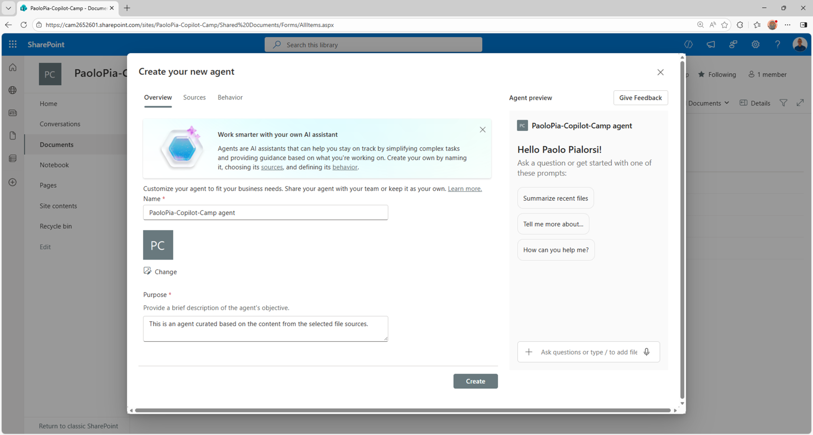

# Lab MSA - Understanding Custom SharePoint agents

A **Custom SharePoint agent** is the easiest way to create an agent specialized on content stored in SharePoint Online. 
Custom SharePoint agents use the same infrastructure, orchestrator, foundation model, and security controls as Microsoft 365 Copilot, which ensures a consistent and familiar user experience.

The Custom SharePoint agents can target:

- sites
- libraries
- documents

A Custom SharePoint agent can be used from within the SharePoint Online user experience either in the library where it was created or at site level. A user needs to have *contribute* permissions on the target library to create a Custom SharePoint agent. A site *owner* can promote Custom SharePoint agents at site-level, too.

A Custom SharePoint agent can also be shared in Microsoft Teams to enhance the user experience in chats (one to one or group chats).

Last but not least, a Custom SharePoint agent automatically becomes available in the Microsoft 365 Copilot Chat as a custom agent.

If you are assigned with a Microsoft 365 Copilot license, or a Copilot Studio capacity, or your organization has the Pay-As-You-Go billing set up, you can use Custom SharePoint agents.

<!-- ---8<--- "msa-labs-toc.md" -->

<!-- ## <a href="./01-first-agent">Start here</a> with Lab MSA1, where you'll make your first agent with Agent Builder. -->

## <a href="./01-first-agent">Start here</a> with Lab MSA1, where you'll create your first Custom SharePoint agent.
<cc-next url="./01-first-agent" />

