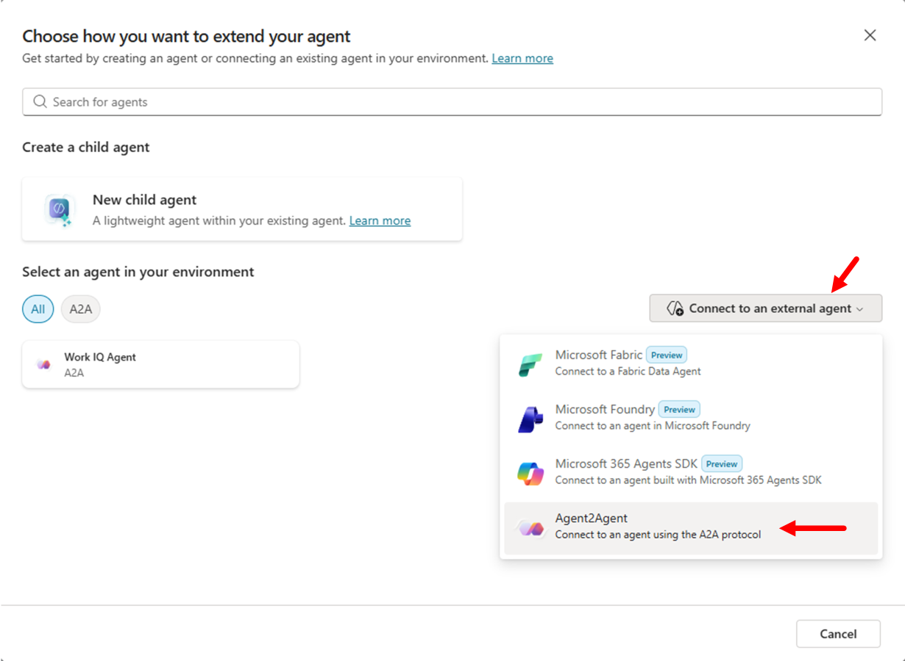
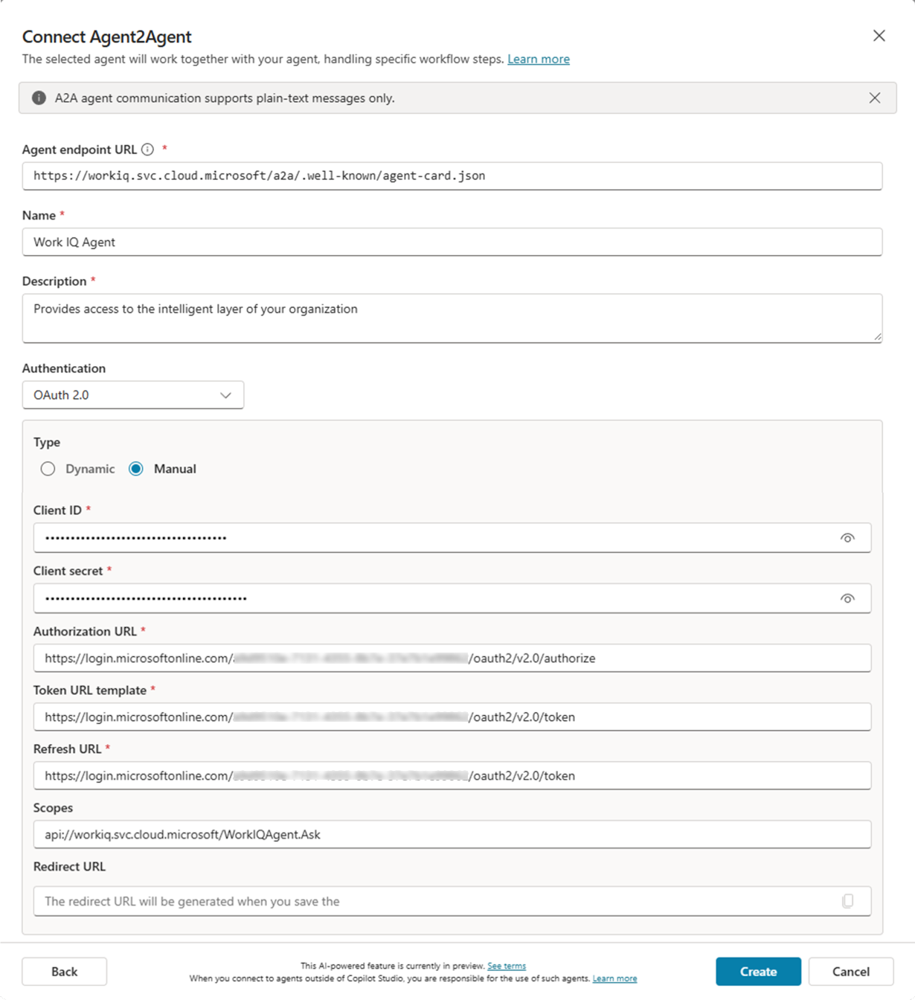
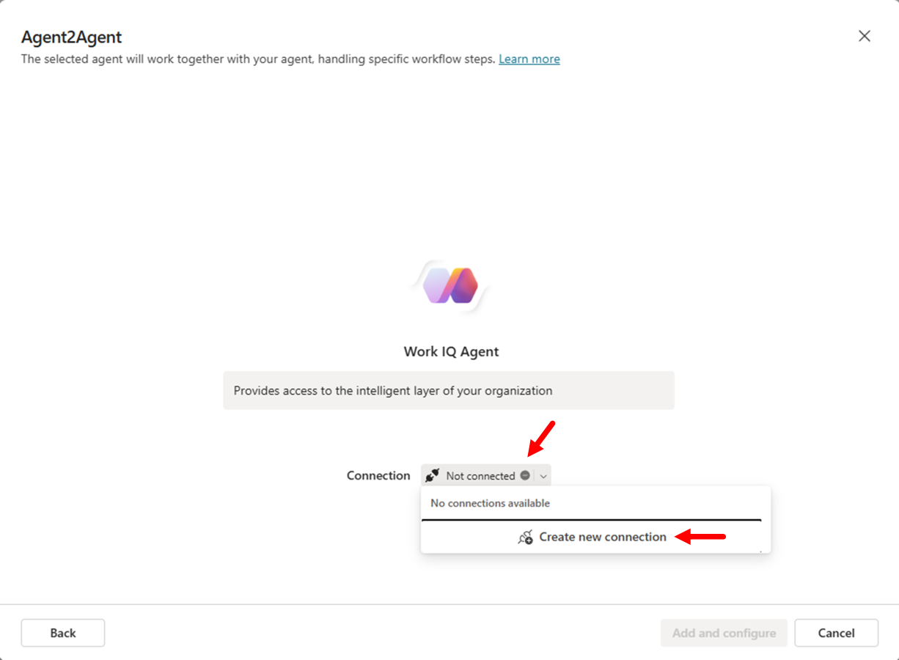
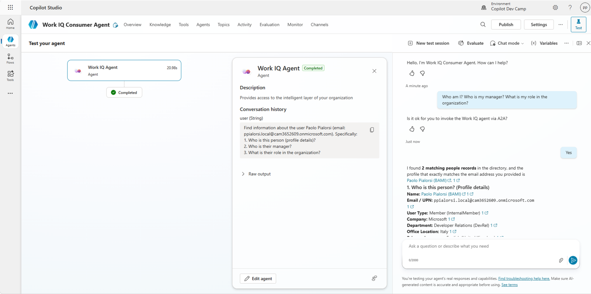

# Lab WIQ02 - Work IQ A2A Protocol

<!--
<div class="lab-intro-video">
    <div style="flex: 1; min-width: 0;">
        <iframe src="//www.youtube.com/embed/<VIDEO_ID>" frameborder="0" allowfullscreen style="width: 100%; aspect-ratio: 16/9;">
        </iframe>
        <div>Get a quick overview of the lab in this video.</div>
    </div>
</div>
-->

## Scenario

Your organization is building multi-agent systems where agents need to collaborate seamlessly. You've registered a Work IQ agent in Microsoft Entra ID (from **WIQ01**), and now you need to enable another agent to consume Work IQ's capabilities using the Agent-to-Agent (A2A) protocol.

The A2A protocol is an open standard that allows AI agents to communicate and collaborate with Work IQ without complex integrations. You'll learn how to:

- Discover Work IQ's capabilities through its agent card
- Authenticate securely using Entra ID tokens
- Send both simple and complex prompts over A2A
- Inspect the protocol traffic to understand how agents exchange information
- Consume Work IQ A2A from Copilot Studio

## Lab objectives

After completing this lab, you'll be able to:

- Explain the A2A protocol and how it differs from traditional tool-based integration
- Use the a2a-consumer tool to connect to Work IQ and inspect agent cards
- Make basic queries to Work IQ (e.g., "Who am I?", "Who is my manager?")
- Craft complex, multi-step prompts 
- Inspect A2A protocol traffic and understand message flow, streaming, and task lifecycle
- Build agents that can delegate tasks to Work IQ over A2A

## Exercise 1: Understanding the A2A Protocol

### Step 1: Learn the A2A fundamentals

The **Agent-to-Agent (A2A) protocol** is an open standard that enables AI agents to communicate and collaborate seamlessly. Unlike traditional tool-based integration (where agents are wrapped as stateless tools), A2A allows agents to interact as first-class citizens—they can negotiate, delegate tasks, and maintain context across multi-turn conversations.

**Key differences from MCP:**

- **MCP (Model Context Protocol):** Connects an LLM to tools and data. Tools are stateless and perform specific functions.
- **A2A:** Enables agent-to-agent collaboration. Agents remain autonomous, can maintain state, and exchange rich structured messages.

**Why A2A matters for Work IQ:**

- Work IQ is an agent that understands Microsoft 365 data (emails, meetings, files, Teams messages, people, etc.).
- Other agents can delegate work to Work IQ without wrapping it as a tool.
- Supports long-running operations, streaming, and complex multi-turn interactions.

<cc-end-step lab="WIQ02" exercise="1" step="1" />

### Step 2: Understand the A2A request lifecycle

Every A2A interaction follows this lifecycle:

1. **Agent Discovery:** Client discovers the remote agent by fetching its agent card at `/.well-known/agent-card.json`
2. **Authentication:** Client obtains an access token (via Entra ID) with permission to call the remote agent
3. **SendMessage API:** Client sends a JSON-RPC request with the user's message
4. **SendMessageStream API:** Client opens a streaming channel for real-time task updates and artifacts

**Work IQ A2A endpoints:**

- Default agent: `https://workiq.svc.cloud.microsoft/a2a/.well-known/agent-card.json`
- Specific agent: `https://workiq.svc.cloud.microsoft/a2a/{agent-id}/.well-known/agent-card.json`
- Message endpoint: `POST https://workiq.svc.cloud.microsoft/a2a/`

**A2A version:** Work IQ supports both A2A v1.0 and v0.3. Use the `A2A-Version: 1.0` header for v1.0 features like `SendMessage`.

<cc-end-step lab="WIQ02" exercise="1" step="2" />

### Step 3: Understand authentication and permissions

A2A communication with Work IQ requires:

- **Delegated authentication via Entra ID:** Requests run in the context of the signed-in user (not app-only).
- **Access tokens:** Pass the token in the `Authorization: Bearer {access-token}` header.
- **Permission trimming:** Work IQ automatically respects the user's Microsoft 365 permissions and compliance policies.
- **On-behalf-of (OBO) flows:** Supported for scenarios where your agent acts on behalf of another agent or service.

For this lab, you'll use the **a2a-consumer** tool, which handles Entra ID authentication and token exchange internally.

<cc-end-step lab="WIQ02" exercise="1" step="3" />

## Exercise 2: Connecting to Work IQ over A2A

### Step 1: Set up the a2a-consumer tool

The **a2a-consumer** is a testing and inspection tool that allows you to:

- Discover agents and inspect their agent cards
- Send messages synchronously and asynchronously
- Monitor streaming responses in real time
- Inspect JSON-RPC request/response traffic

Clone or download the [a2a-consumer repository](https://github.com/PaoloPia/a2a-consumer){target=_blank}:

```bash
git clone https://github.com/PaoloPia/a2a-consumer
cd a2a-consumer
npm install
npm run dev
```

This will start a local web server for A2A testing.
Once the application is running, open the URL (should be [http://localhost:5173/](http://localhost:5173/){target=_blank}) in your browser.

<cc-end-step lab="WIQ02" exercise="2" step="1" />

### Step 2: Configure authentication

To communicate with Work IQ, you need an Entra ID app registration with:

- **Tenant ID**, **Application ID**, and **Client Secret** from lab WIQ01
- **Redirect URI**: `http://localhost:5173/oauth/callback` (or whatever is the URL of **a2a-consumer** on your environment)
- **Permission scopes:** `api://workiq.svc.cloud.microsoft/WorkIQAgent.Ask` (the scope configured in WIQ01)

In the a2a-consumer interface:

1. Configure the **Connection** with the following URL: `https://workiq.svc.cloud.microsoft/a2a/.well-known/agent-card.json`
1. In the **Authentication** panel configure the following settings:
    - **OAuth Flow**
    - **Client Secret** (dev proxy)
    - **Tenant Id**: the **Tenant Id** value you saved from lab WIQ01
    - **Client Id**: the **Application Id** value you saved from lab WIQ01
    - **Redirect URI**: the URL `http://localhost:5173/oauth/callback` (needs to be configured as a web callback URL in the Entra ID application that you configured in lab WIQ01)
    - **Client Secret**: the **Client Secret** value you saved from lab WIQ01
1. Select the command **Authorize & Get Token** and follow the authentication flow. Once the token will be acquired you will see a message like `Token acquired (expires ...)`

The tool just acquired an access token on your behalf and it will include it in all A2A requests.

<cc-end-step lab="WIQ02" exercise="2" step="2" />

### Step 3: Fetch the Work IQ agent card

The **agent card** is a JSON document that describes Work IQ's capabilities, authentication requirements, and endpoints.

In the a2a-consumer interface:

1. Select the **Connect** button to connect to Work IQ via A2A. You should see the **Status** as **Connected**
1. Review the **Agent Card** panel in the **Summary & Validation** section with:
   - Name: `Microsoft Copilot`
   - Version: `1.0.0`
   - URL: `https://workiq.svc.cloud.microsoft/a2a`

You can select the **Raw JSON** command to inspect the raw JSON content of the agent's card.
You can also select the **Settings Table** command to see a well formatted representation of the agent's card content.

**Example agent card structure:**

```json
{
  "name": "Microsoft Copilot",
  "description": "An AI-powered assistant that helps users with business-related tasks such as managing emails, scheduling meetings, and organizing documents.",
  "url": "https://workiq.svc.cloud.microsoft/a2a",
  "iconUrl": "https://copilot.microsoft.com",
  "provider": {
    "organization": "Microsoft",
    "url": "https://www.microsoft.com"
  },
  "version": "1.0.0",
  "protocolVersion": "0.3.0",
  "capabilities": {
    "streaming": true,
    "pushNotifications": false,
    "stateTransitionHistory": false,
    "extensions": []
  },
  "defaultInputModes": [
    "text"
  ],
  "defaultOutputModes": [
    "text"
  ],
  "skills": [],
  "supportsAuthenticatedExtendedCard": false,
  "additionalInterfaces": [],
  "preferredTransport": "JSONRPC",
  "supportedInterfaces": [
    {
      "url": "https://workiq.svc.cloud.microsoft/a2a",
      "protocolBinding": "JSONRPC",
      "protocolVersion": "1.0"
    }
  ]
}
```

<cc-end-step lab="WIQ02" exercise="2" step="3" />

### Step 4: Inspect the agent card response

Look at the key fields in the agent card, when showing the **Raw JSON** information:

- **supportedInterfaces:** Tells you the endpoint URL and protocol binding (JSONRPC).
- **capabilities.streaming:** `true` means Work IQ supports real-time streaming responses.
- **securitySchemes:** Details the Entra ID authorization URL and token endpoint.
- **defaultInputModes / defaultOutputModes:** Both are `["text"]`, so Work IQ communicates via text messages.

This card tells consumer agents (like your test client) how to authenticate, where to send requests, and what capabilities to expect.

<cc-end-step lab="WIQ02" exercise="2" step="4" />

## Exercise 3: Making a Basic Prompt

### Step 1: Craft a simple JSON-RPC message

In the a2a-consumer interface, move to the **A2A Messaging & Operations** panel and in the **Chat** section type the following prompt:

```text
Who am I?
```

Keep the **Stream** option checked and select the **Send** command to send the prompt to Work IQ. After a while the Work IQ A2A server will reply back to you with the answer in the **Chat** area.

<cc-end-step lab="WIQ02" exercise="3" step="1" />

### Step 2: Inspect the response

Scroll down the interface of the a2a-consumer application and expand the **Responses** panel. In the **Streaming Events** section, you should be able to see the messages returned by Work IQ over A2A and defined as `SendStreamingMessage`. You will be able to see all the chunks of the response that rendered in the **Chat** interface.

Now expand the **On-Wire Commmunication** panel to see the actual requests sent on the wire from the a2a-consumer to the Work IQ A2A server. You can see there are at least 3 requests:

- **GetAgentCardDocument**: it is the initial request to retrieve the agent's card
- **SendStreamingMessage**: it is the request to submit the prompt to the A2A server
- **SubscribeToTask**: the request to subscribe to the task updates

Now select **Hide Wire Inspector** and **Hide Responses** to go back to the **Chat** area.

<cc-end-step lab="WIQ02" exercise="3" step="2" />

### Step 3: Send a follow-up question with context

Now ask about your manager using the same context. Simply provide the following prompt in the chat textarea.

```text
Who is my manager?
```

**Important:** You can inspect the second `SendStreamingMessage` and see that tge `contextId` value is the same from the previous response. This tells Work IQ to maintain conversation continuity.

The response will reflect awareness of your previous message. Work IQ understood you in the context of "Who am I?" and can answer "Who is my manager?" with relevant details.

**Multi-turn benefit:** You can ask follow-up questions, clarifications, or related queries without resending your identity information. The `contextId` preserves state.

<cc-end-step lab="WIQ02" exercise="3" step="3" />

### Step 4: Craft a complex prompt

A2A shines when you ask Work IQ to create structured output. Let's request a list with your upcoming meetings. 

```text
Create a list of all my upcoming meetings in the next 10 days. Include meeting title, attendees, time, and a brief description. For each meeting, suggest me topics that I should dig into, to be more effective. Format it professionally.
```

Work IQ can reason over your calendar, fetch meetings, and generate the structured output for you.

In the response from Work IQ you should be able to see a link to the generated Work document, stored on your OneDrive for Business.

<cc-end-step lab="WIQ02" exercise="3" step="4" />

## Exercise 4: Use Work IQ over A2A from a Copilot Studio agent

### Step 1: Create a new agent in Microsoft Copilot Studio

Open [Copilot Studio](https://copilotstudio.microsoft.com){target=_blank}. Select a target environment and create a new agent using the Copilot Studio user interface.

!!! note
    If you don't have a target environment, you can either use the default environment, or you can create a new one. The best option is to create a new one and you can find instructions about how to do so in the [Agent Academy](https://aka.ms/agentacademy){target=_blank} site. Specifically, you can follow instructions in [Recruit - Course Setup](https://microsoft.github.io/agent-academy/recruit/00-course-setup/#trial-environment-setup-steps-14){target=_blank} from Step 1 to Step 3 of the **Trial Environment Setup** section.

1. Select **Agents** and the **+ Create blank agent**.
1. Provide a name like `WorkIQ Consumer Agent`
1. Provide instructions like `Process all the user's requests relying on the Work IQ Agent and then give to the user the received answer`
1. Save the agent basic settings

You now have a Copilot Studio agent ready to orchestrate calls to external systems.

<cc-end-step lab="WIQ02" exercise="4" step="1" />

### Step 2: Add an authenticated connection to Work IQ over A2A

In the Copilot Studio UI connect the agent to Work IQ following these steps:

1. Select the **Agents** tab
1. Select **+ Add an agent** to add a new connected agent
1. A popup dialog shows up, select **Connect to an external agent** and choose **Agent2Agent** option

1. The **Connect Agent2Agent** dialog shows up and you need to configure:
    - **Agent endpoint URL**: `https://workiq.svc.cloud.microsoft/a2a/.well-known/agent-card.json`
    - **Name**: `Work IQ Agent`
    - **Description**: `Provides access to the intelligent layer of your organization`
    - **Authentication**: `OAuth 2.0`
        - **Type**: `Manual`
        - **Client ID**: The Client ID of the application that you registered in Entra ID during lab WIQ01
        - **Client Secret**: The Client Secret of the application that you registered in Entra ID during lab WIQ01
        - **Authorization URL**: The Authorization URL of the application that you registered in Entra ID during lab WIQ01
        - **Token URL template**: The Token URL of the application that you registered in Entra ID during lab WIQ01
        - **Refresh URL**: The Token URL of the application that you registered in Entra ID during lab WIQ01
        - **Scopes**: `api://workiq.svc.cloud.microsoft/WorkIQAgent.Ask`
        - **Redirect URL**: this will be provided to you by Copilot Studio when you save the agent connection

1. Select **Create** to create the agent connection
1. Copilot Studio will create the connection and give you back the **Redirect URL** to use
1. Copy the value of the **Redirect URL** and configure it in the Entra ID application as a web **Redirect URI** and wait few seconds for the application settings to save
1. Go back to Copilot Studio, select **Next** and connected to Work IQ using the Copilot Studio authentication process



Work IQ is now connected to Copilot Studio over A2A. 

<cc-end-step lab="WIQ02" exercise="4" step="2" />

### Step 3: Testing the agent with a simple prompt

You can now test the agent connected to Work IQ. Open the **Test your agent** panel and write the following prompt:

```text
Who am I? Who is my manager? What is my role in the organization?
```



You will need to confirm that you want to invoke Work IQ over A2A, for security reasons. First time you will use Work IQ over A2A you will also need to connect your account in the test chat.

<cc-end-step lab="WIQ02" exercise="4" step="3" />

### Step 4: Testing the agent with a complex prompt

Now test the agent providing a more complex prompt, which requests Work IQ to create structured data and to provide a Word document (.DOCX) as the output. Use the following prompt:

```text
Create a list of all my upcoming meetings in the next 10 days. Include meeting title, attendees, time, and a brief description. For each meeting, suggest me topics that I should dig into, to be more effective. Format it professionally. Create a Word document as the output.
```

You can see that the response includes a link to a Word document that was generated on the fly by Work IQ.

<cc-end-step lab="WIQ02" exercise="4" step="4" />

## Completion

Congratulations! You've successfully completed the **Work IQ A2A Protocol** lab. You've learned:

✅ **A2A fundamentals:** How agents communicate over the A2A protocol and why it's better than wrapping agents as tools.

✅ **Agent discovery:** How to fetch and inspect agent cards to understand capabilities and authentication.

✅ **Basic prompts:** How to send simple queries (Who am I? Who is my manager?) and maintain multi-turn context.

✅ **Complex prompts:** How to request artifact generation (Word documents) and use streaming for long-running tasks.

✅ **Protocol inspection:** How to monitor raw A2A traffic, understand the request/response flow, and debug A2A interactions.

✅ **Multi-agent architecture:** How to consume Work IQ via A2A with Microsoft Copilot Studio in a multi-agent architecture.

## <a href="../03-work-iq-mcp">Start here</a> with Lab WIQ03, to learn how to expose Work IQ as a Model Context Protocol (MCP) server and integrate it into your AI coding assistants and developer tools.

<cc-next />

<cc-award badgeId="WorkIQ-Expert" badgeName="Work IQ Expert" />

