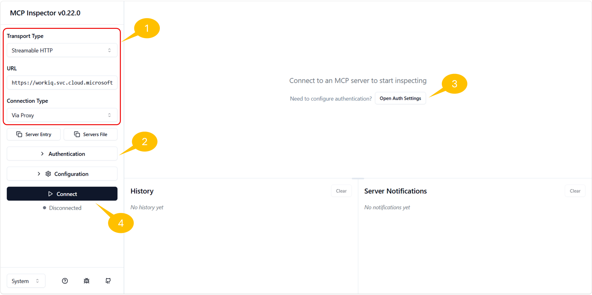
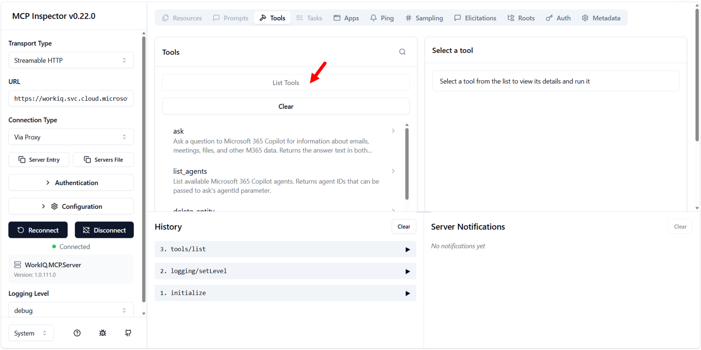

# Lab WIQ03 - Work IQ MCP Protocol

The Work IQ Model Context Protocol (MCP) server exposes Microsoft 365 intelligence capabilities to AI agents through a unified set of generic tools. Instead of requiring separate integrations for each Microsoft 365 API, agents connect once to Work IQ and gain access to mail, calendar, files, people, chat, and sites—all through a consistent set of tools that operate on resource paths.

In this lab, you'll learn how to use the Work IQ MCP server through the MCP Inspector to query and manage Microsoft 365 data, discover schemas at runtime, and understand the design principles that make the Work IQ MCP model powerful and extensible.

## Prerequisites

Before beginning this lab, ensure:

- You have completed [Lab 01: Work IQ Setup and Consumption via CLI](01-work-iq-setup-and-cli.md)
- You have registered an Entra ID application for programmatic access (Exercise 4 of Lab 01)
- You have the following credentials from your app registration:
    - **TENANT_ID** (Directory ID)
    - **CLIENT_ID** (Application ID)
    - **CLIENT_SECRET** (Secret value)
- You have [MCP Inspector](https://modelcontextprotocol.io/docs/tools/inspector){target=_blank} installed locally
- You have a Microsoft 365 tenant with at least one email and calendar entry

## Scenario

You're an AI agent developer tasked with building intelligent agents that can work with Microsoft 365 data. Rather than hardcoding API calls for each Microsoft 365 resource, you need to understand how to use the Work IQ MCP server's unified tool set to dynamically discover schemas, fetch data, and create entities. This lab demonstrates the power of the MCP model: generic tools that work with resource paths, enabling agents to adapt without hardcoded assumptions about the underlying APIs.

## Lab objectives

After completing this lab, you'll be able to:

- Understand the design principles of the Work IQ MCP unified server
- Use the `ask` tool to query Microsoft 365 data through natural language
- Use the `getSchema` tool to discover the structure of Microsoft 365 entities at runtime
- Use the `fetch` tool to retrieve emails from your inbox
- Use the `create_entity` tool to create entities (like for example calendar events)
- Authenticate to Work IQ MCP using the Entra ID app registered in Lab WIQ01

## Exercise 1: Understanding the Work IQ MCP Model

The Work IQ MCP server collapses hundreds of Microsoft 365 operations into just 10 generic tools, organized into three categories: **Entity tools**, **Copilot tools**, and **Schema tools**. This unified design follows two key principles:

### Design Principles

**Fewer tools, more paths.** Rather than exposing a separate tool for every Microsoft 365 entity type (Messages, Events, Files, etc.), Work IQ MCP provides generic verbs (`fetch`, `create_entity`, `update_entity`, `delete_entity`, `do_action`, `call_function`) that work with **resource paths**. New workloads add paths, not tools—the tool surface never grows.

**Introspection over enumeration.** Agents ask for schemas at runtime using `getSchema` rather than loading thousands of type definitions into context upfront. This enables dynamic discovery and adaptation.

**Security by design.** Work IQ is built from the ground up to respect enterprise security requirements. Four broad OAuth permissions gate overall capability, while fine-grained access control is enforced per path, method, and tenant policy — with automatic permissions inheritance, data loss prevention, and regulatory compliance baked in at every layer.

### The Tool Categories

| Category | Tool | Description |
|---|---|---|
| **Entity Tools** | `fetch` | Read entities from Microsoft 365 resources |
| | `create_entity` | Create new entities in a collection |
| | `update_entity` | Modify existing entities |
| | `delete_entity` | Remove entities |
| | `do_action` | Perform side-effecting actions (send, copy, move) |
| | `call_function` | Compute derived data (schedules, deltas, search) |
| **Copilot Tools** | `ask` | Query Microsoft 365 Copilot with natural-language questions |
| | `list_agents` | Discover available Work IQ agents |
| **Schema Tools** | `get_schema` | Retrieve the OpenAPI schema for a given operation |
| | `search_paths` | Find available resource paths |

All tools work with **resource paths**, for example:

| Resource path | Purpose |
|---|---|
| `/me/messages` | Read emails |
| `/me/events` | Read calendar events |
| `/me/chats/{id}/messages` | Read Teams chat messages |
| `/me/sendMail` | Send an email (action) |

The power of this model is that the same `fetch` tool works with `/me/messages`, `/me/events`, `/users/{id}/files`, or any supported path. Agents don't need to know about specific APIs; they work with generic tools and paths.

<cc-end-step lab="WIQ03" exercise="1" step="1" />

## Exercise 2: Set Up MCP Inspector and Authentication

MCP Inspector is a web-based tool that allows you to test MCP servers and call their tools interactively. You'll use it to authenticate to Work IQ MCP and execute all subsequent exercises.

### Step 1: Open MCP Inspector

!!! note "Prerequisite"
    MCP Inspector requires **Node.js v22.7.5 or higher**. Verify your version with `node --version` before proceeding.

1. Open a terminal window and run the following command:
   ```bash
   npx @modelcontextprotocol/inspector
   ```
2. The command will download and launch MCP Inspector. Once started, open the URL shown in the terminal output (typically [http://localhost:6274](http://localhost:6274){target=_blank}) in your browser.
3. You should see a web interface with connection and authentication settings on the left.

<cc-end-step lab="WIQ03" exercise="2" step="1" />

### Step 2: Configure the Work IQ MCP Server Connection and OAuth 2.0 Authentication

In this step you are going to configure the connection and the OAuth 2.0 authentication settings to consume Work IQ MCP with the MCP Inspector.



1. In MCP Inspector, look for the connection settings configuration panel, on the left side 1️⃣
1. Set the following parameters:
   - **Transport Type**: `Streamable HTTP`
   - **URL**: `https://workiq.svc.cloud.microsoft/mcp`
1. Select the **Authentication** 2️⃣ command to expand authentication settings
1. Configure **OAuth 2.0 Flow** with the following values:
   - **Client ID**: `<your CLIENT_ID from Lab WIQ01>`
   - **Client Secret**: `<your CLIENT_SECRET from Lab WIQ01>`
   - **Scope**: `api://workiq.svc.cloud.microsoft/WorkIQAgent.Ask`
1. Collapse the **Authentication** settings
1. Select **Open Auth Settings** 3️⃣ and select **Quick OAuth Flow**
1. A browser pop-up will appear prompting you to sign in with your Microsoft 365 account
1. Sign in with your organizational credentials (the same account used in Lab WIQ01)
1. After successful authentication, you should see a confirmation message: **Authentication completed successfully** ✓
1. Select the **Connect** 4️⃣ command to create the actual connection with the Work IQ MCP server
1. You should see successful connection result, with tabs like **Resources**, **Prompts**, **Tools**, **Apps**, etc.
1. Select the **Tools** tab and click on the **List tools** command to retrieve the list of tools provided by the Work IQ MCP server
1. You will see the list of tools described in the previous exercise



<cc-end-step lab="WIQ03" exercise="2" step="2" />

## Exercise 3: Consuming the `ask` Tool

The `ask` tool is one of the most powerful tools in Work IQ MCP. It allows agents to query Microsoft 365 Copilot for natural-language questions about organizational data. The tool abstracts the complexity of multiple Microsoft 365 APIs into a single conversational interface.

### Step 1: Discover the `ask` Tool

1. In MCP Inspector, click on the **Tools** tab
2. Search for the `ask` tool and click on it to view its schema
3. You should see the tool accepts:
   - **question** (required): A natural-language question
   - **agentId** (optional): To route to a specific agent
   - **fileUrls** (optional): OneDrive or SharePoint file URLs for context
   - **conversationId** (optional): For multi-turn conversations
   - **timeZone** (optional): IANA time zone identifier

<cc-end-step lab="WIQ03" exercise="3" step="1" />

### Step 2: Ask a Natural-Language Question

1. Click the `ask` tool to prepare a tool call
2. In the **question** field, enter:
   ```
   Who am I? What is my role in the company?
   ```
3. Leave all other fields empty for now
4. Click **Run Tool**

<cc-end-step lab="WIQ03" exercise="3" step="2" />

### Step 3: Observe the Response

After executing the tool call, observe both response types:

- **Structured Content**: A JSON object containing:
  - `answer`: The formatted response
  - `conversationId`: A conversation ID for multi-turn interactions
- **Unstructured Content**: A plain-text response with your identity and role information

<cc-end-step lab="WIQ03" exercise="3" step="3" />

### Step 4: Ask a Follow-Up Question (Multi-Turn)

The `conversationId` from the previous response enables multi-turn conversations. Try asking a follow-up question:

1. Click the `ask` tool again
2. Enter the following question:
   ```
   Who is my manager?
   ```
3. In the **conversationId** field, paste the conversation ID from the previous response
4. Click **Run Tool**

Work IQ maintains context across turns, so your follow-up question is understood within the context of the previous exchange.

<cc-end-step lab="WIQ03" exercise="3" step="4" />

## Exercise 4: Discovering Schemas with `getSchema`

The `getSchema` tool enables agents to discover the structure and requirements of Work IQ operations at runtime. Rather than relying on hardcoded knowledge, agents can query `getSchema` to understand what fields are available, which are required, and what data types they expect. This makes Work IQ self-describing.

### Step 1: Understand the `getSchema` Tool

1. In MCP Inspector, locate and click on the `getSchema` tool
2. Review the tool's parameters:
   - **path** (optional): The API path to get the schema for (e.g., `/me/messages`)
   - **operationType** (required): The operation type (`fetch`, `create`, or `update`)
   - **format** (optional): Output format (`jsonschema` or `typescript`)
   - **agentId** (optional): Reserved for future use

<cc-end-step lab="WIQ03" exercise="4" step="1" />

### Step 2: Get the Schema for Email Messages

1. Click the `getSchema` tool to prepare a tool call
2. Enter the following parameters:
   - **path**: `/me/messages`
   - **operationType**: `fetch`
   - **format**: `jsonschema`
3. Click **Run Tool**

<cc-end-step lab="WIQ03" exercise="4" step="2" />

### Step 3: Analyze the Email Message Schema

After running the tool, you should receive a detailed OpenAPI schema. Review the structure:

```json
{
  "$schema": "https://json-schema.org/draft/2020-12/schema",
  "title": "microsoft.graph.messageCollectionResponse",
  "type": "object",
  "properties": {
    "value": {
      "type": "array",
      "items": {
        "$ref": "#/$defs/microsoft.graph.message"
      }
    }
  },
  // Message object types schemas
}
```

Within the message object, you'll find properties such as:

- **Core identity**: `id`, `subject`, `conversationId`, `internetMessageId`
- **Recipients and senders**: `from`, `sender`, `toRecipients`, `ccRecipients`, `bccRecipients`, `replyTo`
- **Content**: `body` (with `content` and `contentType`), `bodyPreview`, `uniqueBody`
- **Timestamps**: `receivedDateTime`, `sentDateTime`, `createdDateTime`, `lastModifiedDateTime`
- **Status flags**: `isRead`, `isDraft`, `hasAttachments`, `isDeliveryReceiptRequested`, `isReadReceiptRequested`
- **Message properties**: `importance`, `inferenceClassification`, `categories`
- **Advanced features**: `flag`, `internetMessageHeaders`, `webLink`, `parentFolderId`

<cc-end-step lab="WIQ03" exercise="4" step="3" />

### Step 4: Get the Schema for Calendar Events

Now retrieve the schema for creating a calendar event:

1. Click the `getSchema` tool again
2. Enter the following parameters:
   - **path**: `/me/events`
   - **operationType**: `create`
   - **format**: `jsonschema`
3. Click **Run Tool**

Study the response to understand the required and optional fields for creating a calendar event (you'll use this in Exercise 6).

<cc-end-step lab="WIQ03" exercise="4" step="4" />

## Exercise 5: Fetching Email Messages with `fetch`

The `fetch` tool reads one or more entities by resource path. It supports Microsoft Graph query parameters like `$top`, `$select`, and `$filter` to control what data is returned.

### Step 1: Discover the `fetch` Tool

1. In MCP Inspector, locate and click on the `fetch` tool
2. Review the tool's parameters:
   - **entityUrls** (required): An array of relative resource paths to fetch
   - **agentId** (optional): Reserved for future use

<cc-end-step lab="WIQ03" exercise="5" step="1" />

### Step 2: Fetch Recent Emails from Your Inbox

1. Click the `fetch` tool to prepare a tool call
1. In the **entityUrls** field, select the **Add Item** command and an array item like the following one:
```
/me/messages?$top=5&$select=id,subject,from,receivedDateTime,isRead
```
1. Click **Run Tool**
   
This query:
- Retrieves the **top 5** messages from your inbox
- Selects only the fields: `id`, `subject`, `from`, `receivedDateTime`, `isRead`
- Reduces response size by not fetching unnecessary fields

If you like, you can also **Switch to JSON** and define the **entityUrls** field at low level, with a syntax like the following:

```json
["/me/messages?$top=5&$select=id,subject,from,receivedDateTime,isRead"]
```

<cc-end-step lab="WIQ03" exercise="5" step="2" />

### Step 3: Analyze the Response

The response should contain a `results` array with one object per `entityUrl`:

```json
{
  "results": [
    {
      "data": {
        "value": [
          {
            "id": "AAMkADk0...",
            "subject": "Your weekly PIM digest for Contoso",
            "from": {
              "emailAddress": {
                "name": "Microsoft Security",
                "address": "MSSecurity-noreply@microsoft.com"
              }
            },
            "receivedDateTime": "2026-05-31T15:40:44Z",
            "isRead": false
          },
          // ... more messages
        ]
      },
      "statusCode": 200
    }
  ]
}
```

Each message object contains the fields you selected, allowing your agent to understand your email context.

<cc-end-step lab="WIQ03" exercise="5" step="3" />

### Step 4: Experiment with Different Queries

Try fetching different data:

1. **Get only unread emails**:
   ```
   /me/messages?$top=10&$select=id,subject,from&$filter=isRead eq false
   ```
1. **Get emails from a specific sender**:
   ```
   /me/messages?$top=5&$select=id,subject,from,receivedDateTime&$filter=from/emailAddress/address eq 'user@example.com'
   ```
1. **Fetch multiple paths at once** (array with multiple items):
   ```json
   [
     "/me/messages?$top=3&$select=id,subject",
     "/me/events?$top=3&$select=id,subject,start,end"
   ]
   ```

The `fetch` tool supports parallel fetching of multiple paths in a single call, making it efficient for agents that need to gather data from multiple sources.

<cc-end-step lab="WIQ03" exercise="5" step="4" />

## Exercise 6: Creating Calendar Events with `create_entity`

The `create_entity` tool creates a new entity in a collection. This exercise demonstrates creating a calendar event using the schema you discovered in Exercise 4.

### Step 1: Discover the `create_entity` Tool

1. In MCP Inspector, locate and click on the `create_entity` tool
2. Review the tool's parameters:
   - **parentUrl** (required): The relative resource path for the collection (e.g., `/me/events`)
   - **jsonBody** (required): The entity data as a JSON-encoded string (not a JSON object)
   - **agentId** (optional): Reserved for future use

Note: The `jsonBody` parameter must be a **JSON-encoded string**, not a JSON object. This means you stringify the JSON before passing it.

<cc-end-step lab="WIQ03" exercise="6" step="1" />

### Step 2: Prepare Your Event Data

Based on the schema you discovered in Exercise 4, prepare a calendar event:

Required fields for a calendar event:
- `subject`: Event title
- `start`: Start date/time with timezone
- `end`: End date/time with timezone
- `attendees` (optional): List of attendees

Example event structure:

```json
{
  "subject": "Team Standup - Work IQ MCP Lab",
  "start": {
    "dateTime": "2026-08-04T14:00:00",
    "timeZone": "UTC"
  },
  "end": {
    "dateTime": "2026-08-04T14:30:00",
    "timeZone": "UTC"
  },
  "isReminderOn": true,
  "reminderMinutesBeforeStart": 15,
  "categories": ["Work", "Lab"]
}
```

<cc-end-step lab="WIQ03" exercise="6" step="2" />

### Step 3: Create the Calendar Event

1. Click the `create_entity` tool to prepare a tool call
2. Enter the following parameters:
    - **parentUrl**: `/me/events`
    - **jsonBody**: Copy and paste the JSON of the event defined in the previous step
3. Click **Run Tool**

<cc-end-step lab="WIQ03" exercise="6" step="3" />

### Step 4: Verify the Event Creation

After running the tool, you should see a `201 Created` response with the created event object:

```json
{
  "statusCode": 201,
  "data": {
    "id": "AAMkADk0...",
    "subject": "Team Standup - Work IQ MCP Lab",
    "start": {
      "dateTime": "2026-08-04T14:00:00.0000000",
      "timeZone": "UTC"
    },
    "end": {
      "dateTime": "2026-08-04T14:30:00.0000000",
      "timeZone": "UTC"
    },
    // ... other fields
  }
}
```

The event is now created in your calendar. You can verify it by checking your Microsoft 365 calendar or by fetching the event using the `fetch` tool with the returned event ID.

<cc-end-step lab="WIQ03" exercise="6" step="4" />

### Step 5: Try Creating Another Event with Attendees

Now, create another event with attendees using the following JSON structure:

```json
{
    "subject": "Project Planning Meeting",
    "start": {
    "dateTime": "2026-08-05T10:00:00",
    "timeZone": "UTC"
    },
    "end": {
    "dateTime": "2026-08-05T11:00:00",
    "timeZone": "UTC"
    },
    "attendees": [
    {
        "emailAddress": {
        "address": "colleague@contoso.com",
        "name": "Colleague Name"
        },
        "type": "required"
    }
    ],
    "isReminderOn": true,
    "reminderMinutesBeforeStart": 30
}
```

Still use `create_entity` with the same parameters as Step 3, replacing the `jsonBody` with this new event.

This demonstrates how Work IQ MCP enables agents to not only read data but also create and manage Microsoft 365 resources.

<cc-end-step lab="WIQ03" exercise="6" step="5" />

## Exercise 7: Understanding the MCP Model's Power

Now that you've worked with the core Work IQ MCP tools, let's reflect on why this design is so powerful.

### The Unified Tool Model

Rather than exposing separate tools for:
- `read_messages`, `create_message`, `update_message`
- `read_events`, `create_event`, `update_event`
- `read_files`, `create_file`, `update_file`
- ... and so on for every Microsoft 365 resource type

Work IQ MCP exposes just **6 entity tools** (`fetch`, `create_entity`, `update_entity`, `delete_entity`, `do_action`, `call_function`) that work with **resource paths**. This approach has several benefits:

1. **Scalability**: New Microsoft 365 workloads (Files, Teams, Sites, etc.) are added as new paths, not new tools. The tool surface never grows.
1. **Consistency**: Agents learn the patterns once (use `fetch` to read, `create_entity` to create, etc.) and apply them everywhere.
1. **Runtime Discovery**: With `getSchema` and `search_paths`, agents can discover available operations dynamically without loading all schema definitions upfront.
1. **Governance**: Administrators can control access at the path level, allowing fine-grained policy control beyond OAuth scopes.

### How Agents Benefit

An AI agent using Work IQ MCP can:

1. **Ask questions naturally** using the `ask` tool
1. **Discover what operations are available** using `search_paths`
1. **Understand the data structure** using `getSchema`
1. **Fetch, create, and modify** entities using generic tools
1. **Adapt to changes** in Microsoft 365 APIs without code updates

This is the power of a unified MCP interface! It's a single, consistent way to work with hundreds of Microsoft 365 operations.

<cc-end-step lab="WIQ03" exercise="7" step="1" />

## Completion

Congratulations! You've successfully mastered the Work IQ MCP Protocol:

✅ Understood the design principles of the Work IQ MCP unified server  
✅ Authenticated to Work IQ MCP using Entra ID credentials  
✅ Used the `ask` tool for natural-language queries  
✅ Used the `getSchema` tool for runtime schema discovery  
✅ Used the `fetch` tool to retrieve emails  
✅ Used the `create_entity` tool to create calendar events  
✅ Learned how the unified MCP model scales to hundreds of Microsoft 365 operations

## <a href="../04-work-iq-rest">Start here</a> with Lab WIQ04, to consume Work IQ via REST protocol.

<cc-next />

<cc-award badgeId="WorkIQ-Expert" badgeName="Work IQ Expert" />

