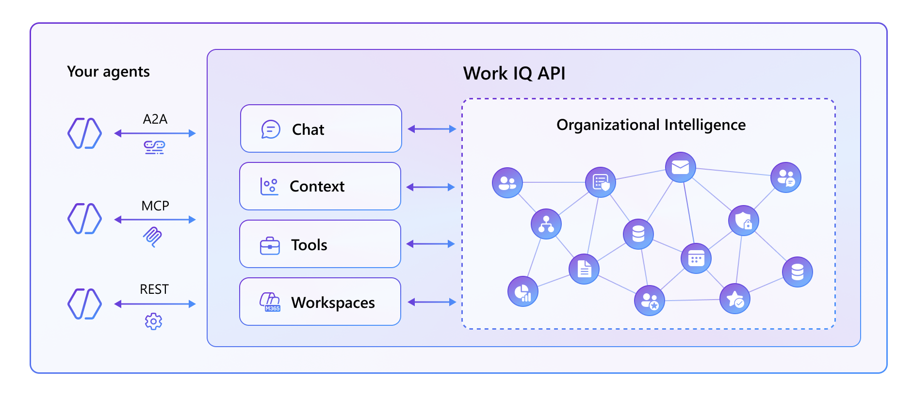

# Work IQ

Work IQ is the "brain" behind your organizational intelligence and understands context, relationships, and work patterns, so Copilot and agents can be faster, more accurate, and more secure. With Work IQ you can unlock your organization’s intelligence for every agent. In fact, Work IQ allows consuming your organization's intelligence from any agent and from any technology.

## Understanding Work IQ

From an architectural perspective, Work IQ is made of:

- **Chat** experience optimized for conversational intelligence.
- **Context** to understand your preferences, your working style, and how you want responses to be delivered.
- **Tools** to enable agents to provide more relevant answers and perform composable actions in ways that match your habits and expectations.
- **Workspaces** optimized for long-running agent workflows and to support reliable tasks progression.

Third party agents can consume Work IQ through different protocols, depending on their actual needs:

- **A2A**: for agent-to-agent patterns.
- **MCP**: for agent-to-tool patterns.
- **REST**: for human/device-to-agent patterns.

## Security, Privacy, and Compliance

Work IQ is designed from the ground up to respect enterprise security requirements:

- **Permission inheritance** - Respects existing user permissions, Security Group assignments, and sensitivity labels.
- **Data Loss Prevention** - Honors DLP policies across all Work IQ operations.
- **Regulatory compliance** - Compliant with GDPR, EU Data Boundary, and regional legal requirements.

## Benefits of Work IQ

- **Intelligence**: Work IQ goes beyond basic search. It blends semantic understanding, personal and org memory, structured file context, and domain tuning so agents reason with fresher, richer signals about people, roles, and collaboration.
- **Speed**: Work IQ is built for agent response times. It cuts network hops, lowers context access latency, and streamlines tool use into 10 MCP-driven primitives so agents can move from analysis to action faster.
- **Efficiency**: Work IQ reduces token spend by doing more processing in its runtime. Instead of dumping raw records, it returns compact, structured outputs that are easier for agents to consume, with extra trimming of noisy identifiers.
- **Scale**: Work IQ is engineered for continuous, high-volume agent workloads. It supports deeper, multi-step automation patterns and the throughput needed as large numbers of agents come online.
- **Security**: Work IQ keeps operations inside the Microsoft 365 trust boundary with inherited permissions, auditability, and governance-ready controls for enterprise agent development.

## Work IQ Labs

This section includes hands-on labs that cover Work IQ across key development patterns: setting up Work IQ and using it with CLI and GitHub Copilot CLI, Work IQ A2A, Work IQ MCP, and Work IQ REST. Together, these labs help you explore how to design, connect, and operationalize Work IQ capabilities for different integration models and agent architectures.

Additional labs will be added over time as the platform evolves. Upcoming topics will include broader Microsoft IQ integration scenarios, spanning Work IQ, Foundry IQ, Fabric IQ, and Web IQ, along with deeper implementation guidance for advanced enterprise use cases.

## <a href="./01-work-iq-setup-and-cli">Start here</a> with Lab WIQ01, to setup Work IQ on your tenant and to start working with it using Work IQ CLI and GitHub Copilot CLI.

