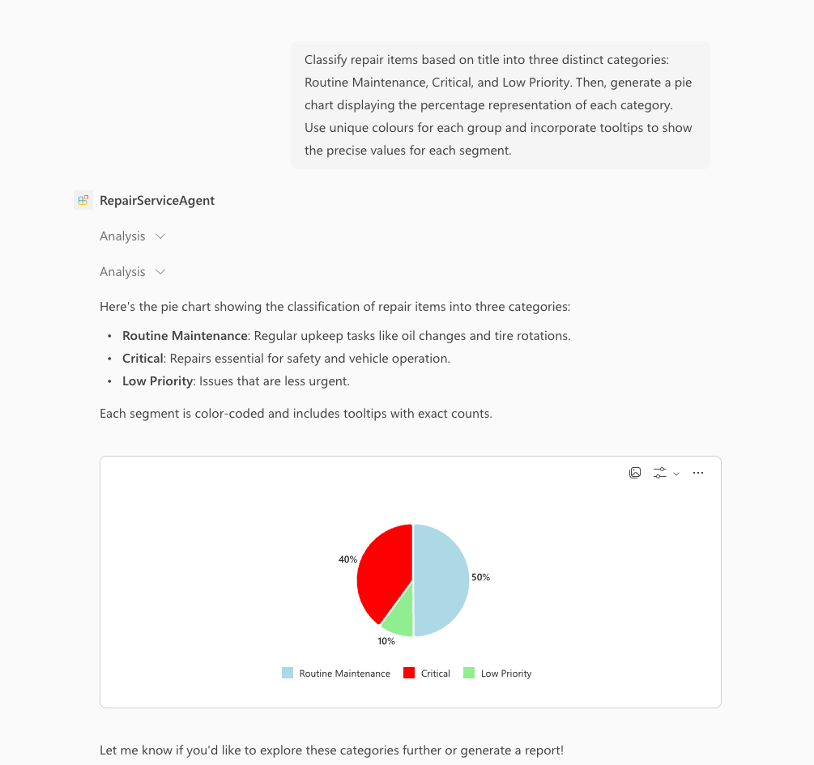

# Overview of the Declarative Agent with TypeSpec for Microsoft 365 template

With the declarative agent, you can build a custom version of Copilot that can be used for specific scenarios, such as for specialized knowledge, implementing specific processes, or simply to save time by reusing a set of AI prompts. For example, a grocery shopping Copilot declarative agent can be used to create a grocery list based on a meal plan that you send to Copilot.

## Get started with the template

> **Prerequisites**
>
> To run this app template in your local dev machine, you will need:
>
> - [Node.js](https://nodejs.org/), supported versions: 18, 20, 22
> - A [Microsoft 365 account for development](https://docs.microsoft.com/microsoftteams/platform/toolkit/accounts).
> - [Microsoft 365 Agents Toolkit Visual Studio Code Extension](https://aka.ms/teams-toolkit) version 5.0.0 and higher or [Microsoft 365 Agents Toolkit CLI](https://aka.ms/teamsfx-toolkit-cli)
> - [Microsoft 365 Copilot license](https://learn.microsoft.com/microsoft-365-copilot/extensibility/prerequisites#prerequisites)

1. First, select the Microsoft 365 Agents Toolkit icon on the left in the VS Code toolbar.
2. In the Account section, sign in with your [Microsoft 365 account](https://docs.microsoft.com/microsoftteams/platform/toolkit/accounts) if you haven't already.
3. Run `npm install` to install dependencies before working with TypeSpec files.
4. Update the [`main.tsp`](./main.tsp) to configure your agent and its plugins. This is the default entry point for TypeSpec files. 
5. Select `Preview Local in Copilot (Edge)` or `Preview Local in Copilot (Chrome)` from the launch configuration dropdown.
6. Select your declarative agent from the `Copilot` app.
7. Ask a question to your declarative agent and it should respond based on the instructions provided.

## What's included in the template

| Folder               | Contents                                                                                 |
| -------------------- | ---------------------------------------------------------------------------------------- |
| `.vscode`            | VSCode files for debugging                                                               |
| `appPackage`         | Templates for the application manifest, the manifest and the API specification           |
| `src/agent/actions`  | All action files representing API surfaces                                               |
| `env`                | Environment files                                                                        |
| `src/agent/prompts`  | All prompt files used for instructions                                                   |
| `scripts`            | Scripts helping with automation across the build process                                 |

The following files can be customized and demonstrate an example implementation to get you started.

| File                               | Contents                                                                     |
| ---------------------------------- | ---------------------------------------------------------------------------- |
| `appPackage/manifest.json`         | application manifest that defines metadata for your declarative agent. |

The following are Microsoft 365 Agents Toolkit specific project files. You can [visit a complete guide on Github](https://github.com/OfficeDev/TeamsFx/wiki/Teams-Toolkit-Visual-Studio-Code-v5-Guide#overview) to understand how Microsoft 365 Agents Toolkit works.

| File           | Contents                                                                                                                                  |
| -------------- | ----------------------------------------------------------------------------------------------------------------------------------------- |
| `m365agents.yml` | This is the main Microsoft 365 Agents Toolkit project file. The project file defines two primary things: Properties and configuration Stage definitions. |

The following are TypeSpec template files. You need to customize these files to configure your agent.

| File                      | Contents                                                                                    |
| ------------------------- | ------------------------------------------------------------------------------------------- |
| `src/agent/main.tsp`      | This is the root file of TSP files. Please manually update this file to add your own agent. |
| `src/agent/actions/*.tsp` | These are action files containing API endpoints to extend your declarative agent.           |
| `src/agent/prompts/*.tsp` | These are prompt files used for instructions inf your declarative agent.                    |
| `src/agent/env.tsp`       | This is the file containing all environment variables to be used in TypeSpec files.         |

## Extend the template

- [Add instructions](https://learn.microsoft.com/en-us/microsoft-365-copilot/extensibility/build-declarative-agents-typespec#add-instructions): Instructions change how an agent behaves. 
- [Add conversation starters](https://learn.microsoft.com/en-us/microsoft-365-copilot/extensibility/build-declarative-agents-typespec#add-conversation-starters): Conversation starters are hints that are displayed to the user to demonstrate how they can get started using the declarative agent.
- [Add web content](https://learn.microsoft.com/en-us/microsoft-365-copilot/extensibility/build-declarative-agents-typespec#add-web-content): The web search capability enables agents to use the search index in Bing to respond to user prompts.
- [Add OneDrive and SharePoint content](https://learn.microsoft.com/en-us/microsoft-365-copilot/extensibility/build-declarative-agents-typespec#add-onedrive-and-sharepoint-content) as grounding knowledge for the agent.
- [Add Teams messages](https://learn.microsoft.com/en-us/microsoft-365-copilot/extensibility/build-declarative-agents-typespec#add-teams-messages): The Teams messages capability allows the agent to use Teams channels, team, and meeting chat as knowledge.
- [Add people knowledge](https://learn.microsoft.com/en-us/microsoft-365-copilot/extensibility/build-declarative-agents-typespec#add-people-knowledge): The people capability allows you to scope your agent to answer questions about individuals in an organization.
- [Add email knowledge](https://learn.microsoft.com/en-us/microsoft-365-copilot/extensibility/build-declarative-agents-typespec#add-email-knowledge): The email capability allows you to scope your agent to use email from the user's mailbox or a shared mailbox as a knowledge source.
- [Add image generator](https://learn.microsoft.com/en-us/microsoft-365-copilot/extensibility/build-declarative-agents-typespec#add-image-generator): The image generator capability enables agents to generate images based on user prompts.
- [Add code interpreter](https://learn.microsoft.com/en-us/microsoft-365-copilot/extensibility/build-declarative-agents-typespec#add-code-interpreter): The code interpreter capability is an advanced tool designed to solve complex tasks via Python code.
- [Add Copilot Connectors content](https://learn.microsoft.com/en-us/microsoft-365-copilot/extensibility/build-declarative-agents-typespec#add-copilot-connectors-content): You can add items ingested by a Copilot connector to the available knowledge for the agent.
- [Add actions](https://learn.microsoft.com/en-us/microsoft-365-copilot/extensibility/build-api-plugins-typespec): API plugins are custom actions for declarative agents that connect a REST API with an OpenAPI specification to Microsoft 365 Copilot. 

## Addition information and references

- [Declarative agents for Microsoft 365](https://aka.ms/teams-toolkit-declarative-agent)
